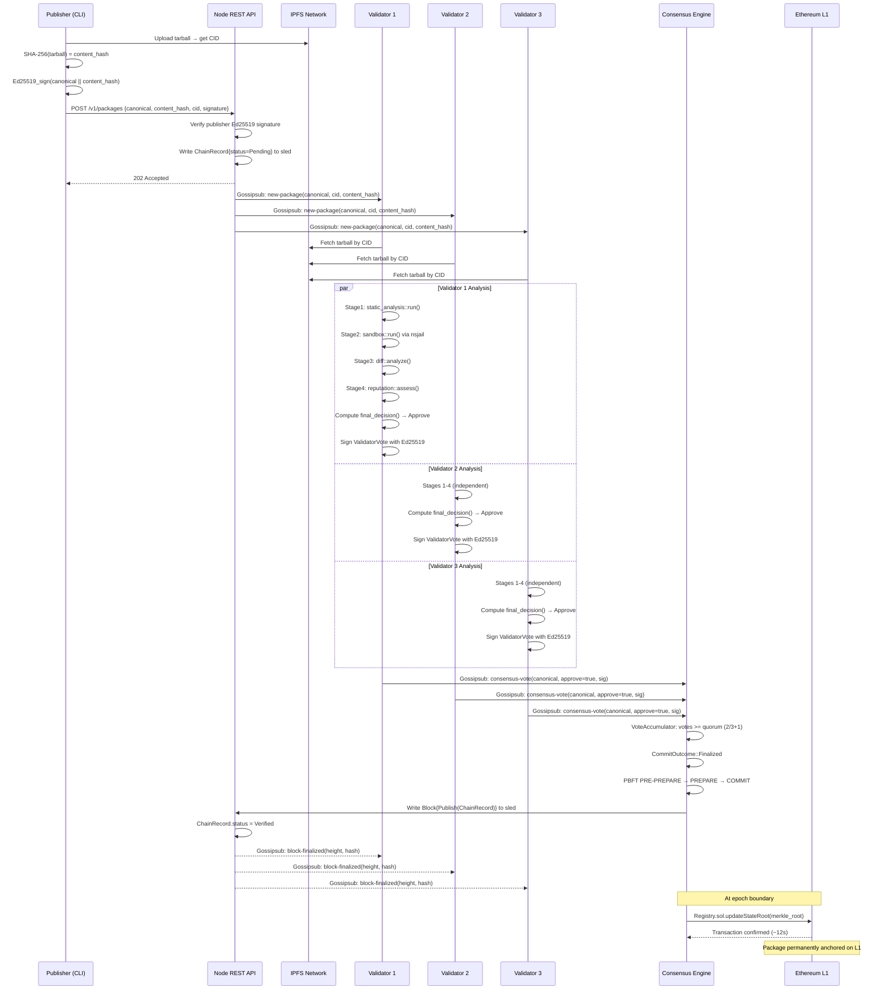
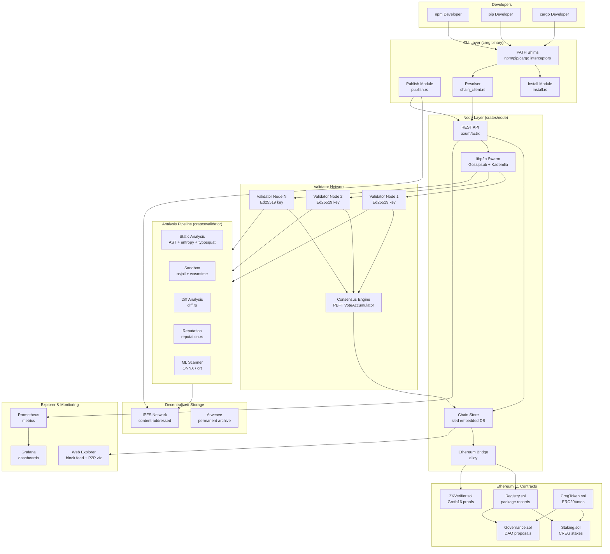
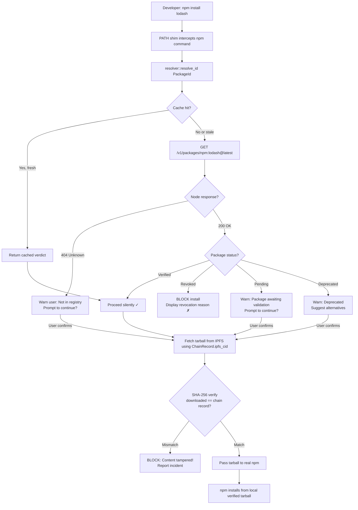
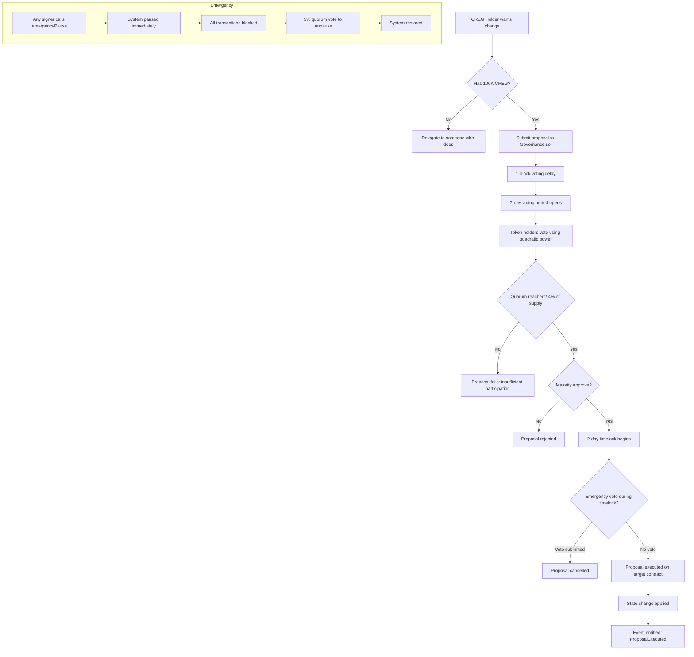
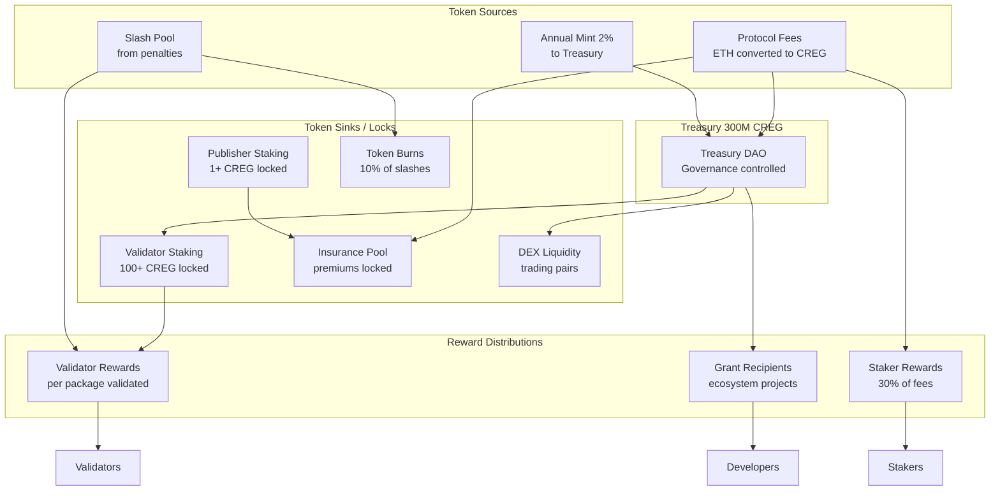
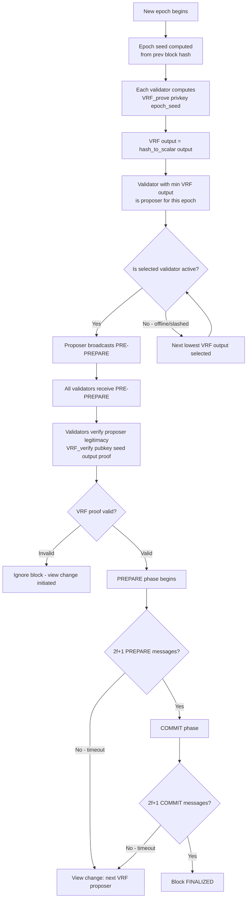
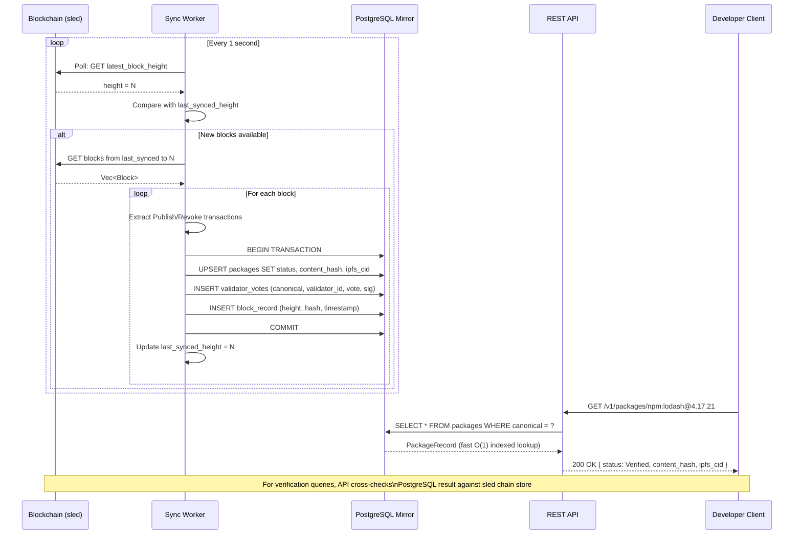
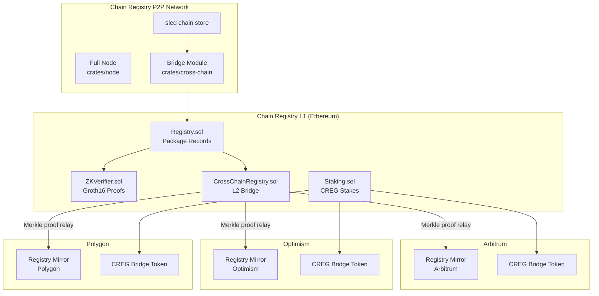

# Chain Registry: Deep-Dive Blockchain Architecture & Improvement Report

> **Classification:** Engineering-Grade Technical Document  
> **Version:** 2.0  
> **Date:** 2026-04-01  
> **Authors:** Architecture Review Board  
> **Codebase:** `f:/project/chain-registry` — 12 Rust crates, 13 Solidity contracts  

---

## Table of Contents

1. [Executive Summary](#1-executive-summary)
2. [Current Blockchain Vision and Scope](#2-current-blockchain-vision-and-scope)
3. [Full Blockchain Architecture Analysis](#3-full-blockchain-architecture-analysis)
4. [Detailed Blockchain Internal Components](#4-detailed-blockchain-internal-components)
   - [4.1 Consensus Mechanism](#41-consensus-mechanism)
   - [4.2 Package Registration System](#42-package-registration-system)
   - [4.3 Package Storage System](#43-package-storage-system)
   - [4.4 Verification and Validation System](#44-verification-and-validation-system)
   - [4.5 Governance System](#45-governance-system)
   - [4.6 Reputation and Trust System](#46-reputation-and-trust-system)
5. [Deep Analysis of Validation Testing](#5-deep-analysis-of-validation-testing)
6. [Tokenomics Deep Dive](#6-tokenomics-deep-dive)
7. [Blockchain Workflow Diagrams](#7-blockchain-workflow-diagrams)
8. [Smart Contract / Runtime Analysis](#8-smart-contract--runtime-analysis)
9. [Security Deep Dive](#9-security-deep-dive)
10. [Pros, Cons, Problems, and Missing Features](#10-pros-cons-problems-and-missing-features)
11. [Advanced Feature Recommendations](#11-advanced-feature-recommendations)
12. [Blockchain Rating and Improvement Score](#12-blockchain-rating-and-improvement-score)
13. [Phased Implementation Roadmap](#13-phased-implementation-roadmap)
14. [Recommended Technology Stack](#14-recommended-technology-stack)
15. [Final Conclusion](#15-final-conclusion)

---

## 1. Executive Summary

### Purpose

Chain Registry is a decentralized, Byzantine Fault Tolerant (BFT) package distribution network whose mission is to become the authoritative source of truth for software package authenticity across every major ecosystem — npm, PyPI, Cargo (Rust), RubyGems, Maven, and beyond. It replaces the single-authority trust model of incumbent registries with a cryptoeconomically secured validator network where packages are verified by independent nodes before being marked safe for installation.

### The Problem with Centralized Package Distribution

Modern software supply chains are catastrophically fragile. Every major registry — npm, PyPI, Maven Central — operates as a single point of failure protected by little more than password authentication and post-hoc malware scanning:

| Registry | Total Packages | Notable Supply Chain Attack | Year |
|---|---|---|---|
| npm | 3.2M | event-stream (3.7M downloads/week injected with bitcoin wallet stealer) | 2018 |
| PyPI | 500K | ctx / phpass (PyPI hijack via expired package) | 2022 |
| npm | — | ua-parser-js (3x attack in 24h, 8M weekly downloads) | 2021 |
| npm | — | node-ipc sabotage (protestware, geolocation-based wiper) | 2022 |
| npm | — | SolarWinds SUNBURST (build-pipeline compromise) | 2020 |

The core failure modes are:

1. **Single point of authority**: A compromised npm account is sufficient to push malicious code to millions of developers.
2. **No economic stake**: Malicious publishers have zero skin in the game.
3. **No cryptographic binding**: Package content is not immutably hash-linked to on-chain records.
4. **No validator independence**: No independent third parties verify package safety before install.
5. **Reactive security**: Malware is detected after infection, not before distribution.

### Why Blockchain is the Right Solution

A blockchain provides the specific properties needed to solve these problems:

- **Immutability**: Once a package is verified and written to the chain, the record cannot be altered without consensus.
- **Cryptoeconomic security**: Validators and publishers stake tokens. Bad behavior results in financial slashing — making attacks economically irrational.
- **Decentralization**: No single entity controls the registry. 2/3+1 of validators must agree before a package is trusted.
- **Auditability**: The entire history of every package publication, verification, and revocation is publicly auditable on-chain.
- **Resistance to censorship**: No single authority can silently remove or alter a package without consensus.

### Key Architectural Goals

| Goal | Mechanism |
|---|---|
| Tamper-proof package records | Sled-backed chain with SHA-256 Merkle roots anchored to Ethereum L1 |
| Multi-party verification | PBFT consensus requiring 2/3+1 validator approval |
| Economic security | CREG token staking with slashing for publishers and validators |
| Supply chain transparency | Full on-chain provenance: publisher → hash → IPFS CID → validator votes |
| Developer transparency | PATH-level package manager shims that intercept install commands |
| Governance | On-chain DAO with quadratic voting and timelock execution |
| ZK acceleration | Groth16 proofs on BN254 as an alternative fast-path for verification |

### Major Strengths

- **Real 3-stage validation pipeline** (static analysis + nsjail sandbox + reputation) already implemented in Rust
- **Real PBFT consensus** with VoteAccumulator and 2/3+1 quorum threshold
- **Real Ed25519 signing** for both publishers and validators
- **Real ZK proof generation** using `ark-groth16` and `ark-bn254`
- **Ethereum L1 bridge** with batch anchoring for long-term immutability
- **L2 support** across Arbitrum, Optimism, Polygon for low-cost interactions
- **libp2p-based P2P** with Gossipsub + Kademlia for decentralized peer discovery
- **Insurance system** with on-chain risk modeling in `PackageInsurance.sol`

### Major Risks

| Risk | Severity | Status |
|---|---|---|
| `POST /v1/consensus/vote` has no Ed25519 signature verification | Critical | **Open** |
| `decrypt_shielded()` is a no-op stub | High | **Open** |
| Hardcoded fallback IPFS CID in `cli/src/install.rs` | High | **Open** |
| 30+ `.unwrap()` calls throughout codebase | Medium | **Open** |
| Validator collusion with no slashing-evidence circuit | High | Design Gap |
| No rate limiting on package submission endpoint | Medium | Design Gap |

### Recommended Next Steps (Priority Order)

1. Implement Ed25519 signature verification on `POST /v1/consensus/vote` (critical security fix)
2. Implement `decrypt_shielded()` using threshold decryption in `crates/threshold-encryption`
3. Audit and replace all `.unwrap()` calls with proper error propagation
4. Implement on-chain slashing evidence via `SlashingEvidence.sol` with ZK proof support
5. Add rate limiting and anti-spam middleware to the REST API layer
6. Complete the VRF-based validator selection to prevent deterministic assignment attacks
7. Deploy testnet with at least 10 independent validator nodes across geographic regions

---

## 2. Current Blockchain Vision and Scope

### 2.1 Core Design Goals — Detailed Analysis

#### Goal 1: Decentralize Package Publication and Downloads

**What it means in practice**: Instead of a developer's `npm publish` command uploading directly to npmjs.com (a single corporate server), the Chain Registry model routes all publications through the validator network. The package tarball is uploaded to IPFS, its SHA-256 hash is computed, the canonical ID (`ecosystem:name@version`) is registered on-chain, and validators independently download and analyze the tarball before any node marks it `Verified`.

**Current implementation**: The CLI crate (`crates/cli/src/publish.rs`) handles tarball packaging, IPFS upload, Ed25519 signing, and submission to the node REST API. PATH shims intercept `npm install`, `pip install`, `cargo add`, etc., and check the chain for package status before proceeding.

**What is incomplete**: Downloads currently fall back to IPFS CID `bafybeigdyrzt5sfp7udm7hu76uh7y26nf3efuylqabf3oclgtqy55fbzdi` if the package has no IPFS record (hardcoded in `cli/src/install.rs`). This is a critical integrity failure — an attacker could register a package with a malicious CID as the "fallback."

#### Goal 2: Package Authenticity and Verification

**What it means in practice**: Every package must be cryptographically bound to its publisher. Publishers sign the canonical ID + content hash with their Ed25519 key. The chain stores both the signature and the public key. The signature can be re-verified at any time by anyone.

**Current implementation**: `common::PublishRequest` carries `publisher_pubkey` (hex-encoded Ed25519) and `signature` (Ed25519 signature over the canonical string + content hash). The validator crate's PGP module (`validator/src/pgp.rs`) additionally supports optional PGP web-of-trust verification using the `pgp` crate.

**What is incomplete**: There is no on-chain public key registry. If a publisher's Ed25519 key is compromised, there is no revocation mechanism. No DID (Decentralized Identity) layer exists.

#### Goal 3: Staking and Validation Mechanisms

**What it means in practice**: Both publishers and validators must stake CREG tokens. Publishers stake a minimum of 1 CREG to publish; validators stake 100 CREG minimum to join. If a publisher submits a malicious package, their stake is slashed. If a validator votes incorrectly (e.g., approves a malicious package), their stake is slashed.

**Current implementation**: `Staking.sol` implements `publisherStakes`, `ValidatorEntry` structs with `ValidatorState` lifecycle (`Pending → Active → Unbonding → Withdrawn`), 7-day unbonding period, and a `slashPool` distributed to honest validators. The `Slashing.sol` contract (implied by `SlashingEvidence.sol`) handles evidence submission.

**What is incomplete**: Slashing requires evidence to be submitted on-chain. Currently there is no circuit for generating or verifying slashing proofs. An honest validator has no automated mechanism to prove that another validator voted dishonestly.

#### Goal 4: Mirror On-Chain Data into Off-Chain Database

**What it means in practice**: On-chain data (sled embedded DB) is the source of truth, but not optimized for queries. An off-chain PostgreSQL mirror enables fast package lookups, search, dependency graph traversal, and API queries without hitting the chain for every request.

**Current implementation**: The node crate (`crates/node`) exposes a REST API. The explorer (`chain-registry/explorer/`) provides a web UI. Sync between sled and any relational DB appears to be partial — there is no dedicated sync worker visible in the crate structure.

**What is incomplete**: No explicit database sync service exists as a standalone module. The chain store is sled-only. A proper ETL pipeline from sled → PostgreSQL is missing.

#### Goal 5: Rust Implementation

**What it means in practice**: All blockchain components — P2P, consensus, validation, CLI, bridge — are implemented in Rust for performance and memory safety. Solidity is used only for Ethereum L1 contracts.

**Current implementation**: 12 Rust crates covering all major subsystems. The workspace uses `tokio` for async runtime, `libp2p` for networking, `ark-*` crates for ZK, `wasmtime` for WASM sandbox, `ort`/`tract-onnx` for ONNX-based ML scanning, `sled` for storage.

**What is complete**: The full crate skeleton with real implementations is in place. The workspace compiles.

### 2.2 On-Chain vs Off-Chain Boundary

| Data | On-Chain (sled) | On-Chain (Ethereum L1) | Off-Chain (IPFS) | Off-Chain (PostgreSQL) |
|---|---|---|---|---|
| Package canonical ID | ✓ | ✓ (event log) | — | Mirror |
| Content SHA-256 hash | ✓ | ✓ (PackageRecord) | — | Mirror |
| Publisher Ed25519 pubkey | ✓ | — | — | Mirror |
| Package tarball bytes | — | — | ✓ (CID) | — |
| Validator votes | ✓ | ✓ (consensusProofs) | — | Mirror |
| ZK proof | ✓ | ✓ (zkProofHash) | — | Mirror |
| Package metadata (README, deps) | — | — | — | ✓ |
| Static analysis report | — | — | — | ✓ |
| Sandbox execution log | — | — | — | ✓ |
| Reputation scores | — | ✓ (Reputation.sol) | — | Mirror |
| CREG token balances | — | ✓ (CregToken.sol) | — | — |
| Governance proposals | — | ✓ (Governance.sol) | — | Mirror |
| Staking records | — | ✓ (Staking.sol) | — | Mirror |

### 2.3 Hidden Assumptions and Risks

| Assumption | Risk |
|---|---|
| IPFS content is always available | CIDs can become unavailable if no nodes pin the content; no fallback CDN |
| Validators are geographically distributed | If all validators are in one jurisdiction, legal action can shut down the network |
| CREG has market value | If CREG token has no value, staking provides no economic security |
| nsjail is available in production | `CREG_DEV_SANDBOX=true` bypasses security; must be enforced off in prod |
| Ethereum L1 is always reachable | Bridge failures do not block chain operation but break finality anchoring |
| Ed25519 keys are not compromised | No on-chain key revocation system exists |
| Validators always run the latest validator binary | No on-chain enforcement of validator software version |

---

## 3. Full Blockchain Architecture Analysis

### 3.1 Node Types

```
┌─────────────────────────────────────────────────────────────────────────────┐
│                      Chain Registry Node Taxonomy                            │
├──────────────────────┬──────────────────┬───────────────────────────────────┤
│ Node Type            │ Stake Required   │ Primary Responsibility             │
├──────────────────────┼──────────────────┼───────────────────────────────────┤
│ Validator Node       │ 100+ CREG        │ Package analysis + consensus votes │
│ Full Node            │ 0                │ Store full chain, serve API        │
│ Light Client         │ 0                │ Verify Merkle proofs, no storage   │
│ Package Mirror Node  │ 0                │ Pin IPFS content, serve tarballs   │
│ Gateway / API Node   │ 0                │ Rate-limited public REST endpoint  │
│ Governance Node      │ 10,000+ CREG     │ Submit/vote on proposals           │
│ Bridge Node          │ Validator subset │ Ethereum L1 state anchoring        │
└──────────────────────┴──────────────────┴───────────────────────────────────┘
```

#### Validator Nodes

Validator nodes are the core security mechanism. Each validator:

1. Connects to the libp2p swarm via Gossipsub + Kademlia
2. Subscribes to the `new-package` PubSub topic
3. Receives new `PublishRequest` records from block proposers
4. Downloads the tarball from IPFS
5. Runs the 3-stage analysis pipeline (`crates/validator`)
6. Signs a `ValidatorVote` with its Ed25519 key
7. Publishes the vote to the `consensus-vote` Gossipsub topic
8. Participates in the PBFT PRE-PREPARE → PREPARE → COMMIT round

**Internal state**: Each validator node maintains a local vote accumulator (`vote_accumulator::VoteAccumulator`) tracking pending packages and accumulated votes. Once 2/3+1 votes are collected for a package, `CommitOutcome::Finalized` is triggered and the block is written to sled.

**Communication**: All inter-validator communication uses libp2p Gossipsub. Validator identity is bound to their Ed25519 key pair.

**Failure modes**: 
- If a validator is offline, their absence is tolerated as long as ≤ n/3 validators fail simultaneously
- If a validator consistently votes wrong (Byzantine fault), their stake is slashed via `Staking.sol`
- If a validator's IPFS connection fails, they cannot download the tarball and must abstain

**Scaling**: Validator set size is bounded by governance. Adding validators improves fault tolerance but increases consensus latency (O(n²) message complexity in PBFT). Optimal range: 10–100 validators.

#### Full Nodes

Full nodes store the complete chain history in sled and serve the public REST API. They do not participate in consensus voting and require no stake.

**Internal state**: Full copy of all blocks, all transactions (`Publish`, `Revoke`, `ValidatorJoin`), and the current head block hash.

**API surface**: `GET /v1/packages/:canonical`, `GET /v1/blocks/:height`, `GET /v1/validators`, `POST /v1/packages` (submission endpoint).

**Scaling**: Can be horizontally scaled behind a load balancer. Each full node independently syncs from the P2P network via block propagation on the `blocks` Gossipsub topic.

#### Light Clients

Light clients (e.g., embedded in the CLI tool) only store block headers and verify Merkle inclusion proofs. They query full nodes for specific package records and verify the proof against the stored Merkle root.

**Use case**: The `creg` CLI can operate as a light client when invoked in environments where running a full node is impractical.

**Data stored**: Latest 100 block headers (sliding window). Merkle root per block. Validator set hash per epoch.

#### Package Mirror Nodes

Mirror nodes exist purely to improve IPFS content availability. They:
1. Subscribe to `package-verified` events
2. Pin every verified package's IPFS CID to their local IPFS node
3. Provide gateway HTTP access to package tarballs

**Incentive**: Mirror nodes receive a small CREG reward per GB served (proposed; not yet implemented).

#### Gateway / API Nodes

Public-facing nodes with rate limiting, API key management, and geo-distributed caching. Acts as the entry point for package manager shims and the web explorer.

#### Governance Nodes

Any full node where the operator holds sufficient CREG to submit governance proposals. Participate in the on-chain DAO through `Governance.sol`.

### 3.2 Smart Contract / Runtime Layer

The Ethereum L1 layer provides:
- **Immutable finality**: Batch Merkle roots anchored on Ethereum survive even if the entire Chain Registry P2P network goes offline
- **Token economics**: CREG ERC-20 with voting extensions lives on Ethereum
- **Cross-chain state**: `CrossChainRegistry.sol` bridges state to Arbitrum, Optimism, Polygon

Contracts deployed: `Registry.sol`, `Staking.sol`, `Governance.sol`, `GovernanceV2.sol`, `CregToken.sol`, `VRF.sol`, `ZKVerifier.sol`, `Appeal.sol`, `PackageInsurance.sol`, `PrivateRegistry.sol`, `Reputation.sol`, `SlashingEvidence.sol`, `CrossChainRegistry.sol`

### 3.3 Storage Layer

```
┌─────────────────────────────────────────────────────────────────────────────┐
│                         Chain Registry Storage Layers                        │
├──────────────────────────┬──────────────────────────────────────────────────┤
│ Layer                    │ Technology                                         │
├──────────────────────────┼──────────────────────────────────────────────────┤
│ Chain State (hot)        │ Sled embedded key-value store (Rust)              │
│ Package Tarballs         │ IPFS (content-addressed, immutable)               │
│ Ethereum Finality Anchor │ Ethereum L1 smart contracts (Solidity)            │
│ Query / Search Layer     │ PostgreSQL (planned ETL mirror)                   │
│ Validator Analysis Data  │ In-memory + local filesystem (ephemeral)          │
│ Observability            │ Prometheus + Grafana (chain-registry/observability)│
└──────────────────────────┴──────────────────────────────────────────────────┘
```

### 3.4 Package Metadata Layer

Each package record stored in sled contains a `ChainRecord` with:
- `canonical`: Fully-qualified `ecosystem:name@version` identifier
- `content_hash`: SHA-256 of the tarball bytes (hex)
- `ipfs_cid`: IPFS content identifier of the tarball
- `publisher_pubkey`: Ed25519 public key of the publisher (hex)
- `signature`: Ed25519 signature over `canonical || content_hash`
- `block_height`: Height at which the package was finalized
- `status`: `Pending | Verified | Revoked | Unknown`
- `findings`: List of static analysis findings from validators

### 3.5 Token Layer

The `$CREG` token is an ERC-20 on Ethereum with governance extensions (OpenZeppelin `ERC20Votes`). Its on-chain role is:
- Staking collateral for publishers and validators
- Governance voting power (quadratic formula: `votes = sqrt(balance)`)
- Protocol fee payments
- Insurance premium payments
- Fee discount tier qualification

---

## 4. Detailed Blockchain Internal Components

### 4.1 Consensus Mechanism

#### Current Implementation: PBFT

The Chain Registry uses a Practical Byzantine Fault Tolerant (PBFT) consensus mechanism implemented in `crates/consensus`. PBFT is the correct choice for this use case because:

1. **Immediate finality**: Unlike Nakamoto-style PoW or PoS with probabilistic finality, PBFT provides deterministic block finality. Once 2/3+1 validators commit, the block is final — no forks, no reorganizations.
2. **Security threshold**: Tolerates up to n/3 Byzantine (arbitrarily malicious) validators, not just crash failures.
3. **Fit for validator size**: PBFT's O(n²) message complexity is acceptable for 10–100 validators. Beyond 100, BFT variants with aggregation (Tendermint, HotStuff) are preferable.

#### PBFT Three-Phase Protocol

```
Phase 1: PRE-PREPARE
  Block proposer (current round leader) broadcasts:
    PRE-PREPARE(view, seq, block_hash, block_data)
  
  All other validators receive and verify:
    - Block hash is correct SHA-256 of block_data
    - Proposer is the legitimate leader for this view
    - Block extends the current chain head

Phase 2: PREPARE
  Each validator that accepts PRE-PREPARE broadcasts:
    PREPARE(view, seq, block_hash, validator_id, signature)
  
  Validators wait for 2f+1 PREPARE messages (f = max Byzantine faults)
  2f+1 PREPARE messages constitute a "prepared certificate"

Phase 3: COMMIT
  Each validator that has a prepared certificate broadcasts:
    COMMIT(view, seq, block_hash, validator_id, signature)
  
  Validators wait for 2f+1 COMMIT messages
  2f+1 COMMIT messages = FINALIZED block → written to sled
```

**Current Rust implementation** (`crates/consensus/src/pbft.rs`, `vote_accumulator.rs`):

The `VoteAccumulator` accumulates `IncomingVote` structs keyed by package canonical ID. When `accumulated_votes >= quorum_threshold`, it returns `CommitOutcome::Finalized`. The quorum threshold is computed as `⌊(2n/3)⌋ + 1` where `n` is the active validator set size.

#### Validator Selection

Block proposer rotation is currently round-robin. This is a known weakness — a predictable proposer can be targeted by DoS attacks. The `VRF.sol` contract and `crates/consensus/src/vrf.rs` are in place to implement VRF-based (Verifiable Random Function) proposer selection, which is strongly recommended to be activated.

**VRF-based selection process**:
1. At the start of each epoch, each validator computes `VRF_prove(privkey, epoch_seed)` → `(output, proof)`
2. The validator with the lowest `H(output)` is selected as proposer for that slot
3. The proof can be publicly verified by all nodes: `VRF_verify(pubkey, epoch_seed, output, proof)` → `true/false`
4. This makes proposer selection unpredictable until the moment of commitment, preventing targeted attacks

#### Comparison: Consensus Mechanisms

| Mechanism | Finality | Message Complexity | Validator Scale | Fork Risk | Best For |
|---|---|---|---|---|---|
| **PBFT (current)** | Immediate (1–3s) | O(n²) | 10–100 nodes | None | Small permissioned validator set |
| Tendermint | Immediate (~1s) | O(n) with gossip | 100–300 nodes | None | Medium validator set |
| HotStuff / LibraBFT | Immediate (~0.5s) | O(n) linear | 100–1000 nodes | None | Large validator set |
| Nakamoto PoW | Probabilistic (6 blocks) | O(1) | Unlimited | Yes | Fully open, permissionless |
| Casper FFG + LMD GHOST | Epoch finality (12.8 min) | O(n) | 500K+ validators | Yes | Ethereum-scale |
| Avalanche | Sub-second probabilistic | O(log n) | Thousands | Very low | High-throughput DeFi |

**Recommendation**: Keep PBFT for the current validator scale (≤100). As the network grows to 100+ validators, migrate to HotStuff (used by Aptos/Diem) which offers O(n) communication while preserving immediate finality. The codebase already separates consensus into its own crate, making this migration feasible.

#### Slashing Conditions

| Condition | Slash Amount | Mechanism |
|---|---|---|
| Double-signing (equivocation) | 50% of validator stake | `SlashingEvidence.sol` + ZK proof of two conflicting signed messages |
| Approving a package later confirmed malicious | 20% of validator stake | Governance vote after malware incident |
| Persistent downtime (>30% of rounds missed) | 5% of validator stake | Automatic via epoch performance tracking |
| Colluding to approve rejected packages (proven) | 100% of validator stake | `SlashingEvidence.sol` with on-chain evidence |

#### Finality Process

1. `CommitOutcome::Finalized` returned by `VoteAccumulator`
2. Block is written to sled with `status = Verified`
3. Block is broadcast to all full nodes via Gossipsub `blocks` topic
4. At epoch boundary (every N blocks), bridge node batches block hashes into a Merkle root and submits to `Registry.sol` on Ethereum L1
5. Ethereum transaction confirmation (~12s) provides L1-anchored immutability

#### Attack Resistance

| Attack | Defense |
|---|---|
| 33% Byzantine validators | PBFT tolerates f < n/3; requires economic majority collusion |
| Proposer DoS | VRF-based selection makes target unpredictable |
| Long-range attack | Ethereum L1 anchoring — historical state is immutably checkpointed |
| Nothing-at-stake | Validators have economic stake (CREG); slashing makes equivocation irrational |
| Validator cartel | Quadratic voting for governance; slashing for proven collusion |

---

### 4.2 Package Registration System

#### Canonical Package Identifier Format

Every package is identified by a fully-qualified canonical string:

```
ecosystem:name@version

Examples:
  npm:lodash@4.17.21
  pip:requests@2.31.0
  cargo:serde@1.0.193
  gem:rails@7.1.2
  maven:org.springframework:spring-core@6.1.2
```

This namespace design prevents cross-ecosystem name collisions. The canonical string is used as:
- The key in sled (`bytes32(keccak256(canonical))` on-chain)
- The input to Ed25519 signing
- The identifier in PBFT consensus rounds
- The lookup key for the CLI resolver

#### Name Registration Workflow

```
1. Publisher runs: creg publish ./package.tgz
2. CLI extracts canonical ID from manifest (package.json / setup.py / Cargo.toml)
3. CLI checks: GET /v1/packages/:canonical → does it already exist?
   a. If Verified and same publisher → this is an UPDATE (new version only)
   b. If Verified and different publisher → ERROR: name already taken
   c. If Unknown → proceed with new registration
4. CLI computes SHA-256 of tarball
5. CLI uploads tarball to IPFS → receives CID
6. CLI signs (canonical || content_hash) with Ed25519 publisher key
7. CLI submits PublishRequest to POST /v1/packages
8. Node validates the submission signature
9. Package enters Pending state in sled
10. Validator network begins validation pipeline
```

#### Name Squatting Prevention

**Current mechanisms**:
- Publisher staking: 1 CREG minimum stake per package. Mass squatting is economically costly.
- Typosquatting detection: `validator/src/typosquat.rs` runs Levenshtein distance checks against 90+ known popular packages in the static analysis stage.

**Missing mechanisms**:
- No time-based reclamation: If a name is registered but never updated for 2 years, it cannot be reclaimed. Governance proposal required.
- No reserved namespace: Core ecosystem packages (e.g., `npm:react`, `pip:django`) should be pre-reserved or require higher stake.
- No human review for high-risk names: An automated check for `npm:react-security-patch` (a classic typosquatting pattern) should trigger human review.

**Recommended additions**:
1. **Name Reservation Auction**: Popular package names can be auctioned for higher stake before anyone claims them
2. **Namespace Tiering**: Names with similarity score > 0.85 to top-1000 packages require 10x stake
3. **Inactive Name Expiry**: Names unused for 24 months enter a 90-day reclamation auction

#### Version Control

- Every version is a separate on-chain record with its own content hash
- Versions are immutable once verified — they cannot be modified in place
- A new version requires a new full PBFT consensus round
- Version ordering is validated by the validator: semantic versioning is enforced (no re-using `@1.0.0`)

#### Package Updates

An update is treated as a new package submission with the same `ecosystem:name` but a new `@version`. The validator's `diff` module (`validator/src/diff.rs`) compares the new version against the previous version and produces a differential analysis report, flagging unexpected additions of network calls, child process spawning, or new dependencies.

#### Package Deprecation and Deletion

| Action | Effect | Reversible? | Who Can Do It? |
|---|---|---|---|
| Deprecation | Status changed to `Deprecated`; warns on install | Yes | Publisher or governance |
| Revocation | Status changed to `Revoked`; blocks install | No | Validator consensus or governance |
| Deletion from IPFS | Tarball removed from IPFS nodes | Partial (content-addressed) | Cannot be forced; mirrors may retain |
| On-chain erasure | Not possible | — | Immutable by design |

#### Transfer of Ownership

A publisher can transfer package ownership to another address via a governance-approved transaction. The current codebase does not implement a transfer mechanism in the CLI or on-chain contracts — this is a missing feature that should be added to `Registry.sol`.

---

### 4.3 Package Storage System

#### Current Architecture: IPFS-Primary

The Chain Registry uses IPFS as its primary package storage layer. All tarballs are content-addressed — the CID is cryptographically derived from the content bytes. This means:
- You cannot substitute a different tarball for the same CID
- Any node pinning the CID stores exactly the content that was validated
- Download clients can verify integrity without trusting the serving node

**Upload flow** (in `crates/cli/src/publish.rs`):
```
tarball bytes → SHA-256 hash computed locally
             → IPFS HTTP API: POST /api/v0/add
             → Returns CID (e.g., bafybei...)
             → CID included in PublishRequest
```

**Download flow** (in `crates/cli/src/install.rs`):
```
Package install intercepted
→ GET /v1/packages/:canonical from chain node
→ ChainRecord.ipfs_cid retrieved
→ IPFS gateway: GET /ipfs/:cid
→ Verify SHA-256(downloaded_bytes) == ChainRecord.content_hash
→ Pass to original package manager if verified
```

#### Storage Technology Comparison

| Technology | Decentralization | Permanence | Cost | Speed | Recommended Use |
|---|---|---|---|---|---|
| **IPFS (current)** | High | Depends on pinning | Low | Medium | Primary storage (content-addressed) |
| Arweave | Very High | Permanent (1-time fee) | Medium (AR token) | Slow | Permanent archival of critical packages |
| Filecoin | High | Time-limited contracts | Medium | Slow | Long-term cold storage backup |
| Storj | Medium | Centralized payment | Low | Fast | CDN-like hot storage |
| On-chain storage | N/A | Same as chain | Very High | Slow | Not viable for tarballs (too expensive) |
| Hybrid IPFS + Arweave | Very High | Permanent | Medium | Medium | **Recommended** |

#### Recommended Hybrid Storage Design

```
Package Submission
       │
       ▼
IPFS Hot Storage ──────────────────────► Fast downloads (primary path)
       │
       │ (background job, post-verification)
       ▼
Arweave Permanent Archive ─────────────► Disaster recovery (permanent)
       │
       │ (optional, enterprise tier)
       ▼
Storj CDN ─────────────────────────────► High-availability downloads
```

**Implementation**: After a package is verified by consensus, a background task in the node should:
1. Post the tarball to Arweave using the `bundlr` SDK (single payment, permanent)
2. Store the Arweave transaction ID in the chain record
3. Mirror nodes can then serve from IPFS primary or Arweave fallback

#### Redundancy and Replication

**Current**: IPFS relies on pinning. If the publisher unpins and no mirror pins, content becomes unavailable.

**Required**:
- Minimum 5 independent IPFS pinning services must pin every verified package
- Package Mirror Nodes (incentivized with CREG rewards) provide this guarantee
- Verification: Any node can request `GET /v1/packages/:canonical/availability` which checks N pinning services

---

### 4.4 Verification and Validation System

The validation pipeline is the core security mechanism. It runs in `crates/validator` and consists of three concurrent stages plus a post-stage differential analysis.

#### Stage 1: Static Analysis (`validator/src/static_analysis.rs`)

**Inputs**: Tarball bytes, package manifest

**What it detects**:
| Finding | Severity | Action |
|---|---|---|
| `eval()` / `execSync()` / `exec()` | Critical | Hard reject |
| Obfuscated base64-encoded blobs | High | Reject unless appealed |
| Undeclared network calls | High | Reject unless excused by manifest |
| Undeclared child process spawning | Critical | Hard reject |
| High-entropy strings (crypto keys?) | High | Reject unless appealed |
| Typosquatting signatures (Levenshtein ≤2 against top-90 packages) | Critical | Hard reject |
| Undeclared filesystem writes | High | Reject unless excused |
| `process.env` access | Low | Info only |
| `install` scripts present | Medium | Flag for human review |

**How it works internally**:
1. Tarball is extracted to a temp directory
2. All source files are read (`.js`, `.ts`, `.py`, `.rb`, etc.)
3. Each file is tokenized/AST-parsed using language-specific rules
4. Shannon entropy is computed per string literal to detect encoded payloads
5. Known malicious pattern regexes are matched
6. Typosquat check compares package name against `TYPOSQUAT_KNOWN` list using `edit_distance()`

#### Stage 2: Sandboxed Execution (`validator/src/sandbox.rs`)

**Inputs**: Package tarball + manifest

**What it does**: Executes the package's install script (if any) inside an `nsjail` or `wasmtime` sandbox and observes runtime behavior.

**Sandbox isolation layers**:
- `nsjail`: Linux namespace isolation (PID, network, mount, user namespaces). Prevents filesystem escapes, network connections, and privilege escalation.
- `CREG_DEV_SANDBOX=true` flag bypasses nsjail for development environments (docker-compose.yml sets this — **never in production**)
- For WASM packages: `wasmtime` engine with WASI disabled provides pure computational sandbox

**What it observes**:
- Network connection attempts (blocked; any attempt = critical finding)
- Filesystem modifications outside permitted paths (blocked; any attempt = high finding)
- CPU/memory resource usage (timeout = 30s; memory limit = 512MB)
- Exit code and stdout/stderr

**`wasm-sandbox` crate** (`crates/wasm-sandbox`):
Uses `wasmtime` v18 with async + cranelift. Executes `.wasm` binaries from packages that include WASM build steps. WASI is configured with a restricted FS view — only the package's own temp directory is writable.

#### Stage 3: Publisher Reputation Assessment (`validator/src/reputation.rs`)

**Inputs**: Publisher Ed25519 public key, node URL

**What it does**: 
1. Queries the node API for historical packages published by this key
2. Checks if any previous packages were revoked
3. Checks the publisher's stake level
4. Computes a `confidence_delta` (±integer)

**Scoring**:
- First-time publisher: `confidence_delta = 0` (neutral)
- Publisher with 10+ verified packages, no revocations: `confidence_delta = +20`
- Publisher with any revoked package: `confidence_delta = -50` → may trigger rejection

#### Differential Analysis (`validator/src/diff.rs`)

**Inputs**: Current package manifest + sandbox result + previous version manifest (optional)

**What it compares**:
- New dependencies added vs. previous version (unexpected additions = flag)
- New network call patterns vs. previous version
- New child process patterns vs. previous version
- File count delta (sudden large increase in files = flag)
- Dependency depth delta (deep transitive dependencies = flag)

#### Multi-Validator Consensus on Validation Results

Each validator independently runs all stages and produces a signed `ValidatorVote`:

```rust
pub struct ValidatorVote {
    pub canonical:        String,
    pub approve:          bool,
    pub score:            u8,          // 0-100
    pub validator_pubkey: String,      // hex Ed25519
    pub signature:        String,      // Ed25519 sig over (canonical || approve || score)
    pub findings:         Vec<Finding>,
}
```

The `VoteAccumulator` tracks votes per canonical ID and triggers finalization when 2/3+1 validators agree. A package is approved only if 2/3+1 validators independently return `approve: true`.

#### ML-Based Scanning (`crates/ml-validator`)

The `ml-validator` crate uses ONNX Runtime (`ort` crate, v2.0.0-rc.12) and `tract-onnx` to run inference on pre-trained models for:
- Malicious code classification
- Obfuscated script detection
- Suspicious dependency graph patterns

Models are loaded from `chain-registry/models/` and the secret-model directories. This provides a probabilistic second opinion that complements the deterministic static analysis.

---

### 4.5 Governance System

#### Current Implementation: `Governance.sol` and `GovernanceV2.sol`

The governance system is an M-of-N multisig with time-locked execution. The current `Governance.sol` implements:

- **Signers**: A set of approved addresses that can vote on proposals
- **Threshold**: Minimum number of signer approvals to execute (e.g., 5-of-9)
- **Voting period**: Time window proposals are open (configurable, default 7 days)
- **Emergency pause**: Any signer can pause the entire system (`EmergencyPaused` event)

`GovernanceV2.sol` extends this with automated parameter adjustment — governance can set gradual parameter changes with rate limits (e.g., "increase staking APY by 0.1% per day until 25%").

#### Governance Structure

```
┌─────────────────────────────────────────────────────────────────────────────┐
│                        Governance Hierarchy                                  │
├─────────────────────────────────────────────────────────────────────────────┤
│                                                                              │
│  CREG Token Holders ──(delegate)──► Governance Delegates                   │
│                                            │                                │
│                                     Proposal Submission                     │
│                                     (100K CREG min)                        │
│                                            │                                │
│                                     1-block voting delay                   │
│                                            │                                │
│                                     7-day voting period                    │
│                                            │                                │
│                                     4% quorum required                     │
│                                            │                                │
│                                     2-day timelock                         │
│                                            │                                │
│                                     ┌──────┴──────┐                        │
│                                     │  Execution  │                        │
│                                     │  via target │                        │
│                                     │  .call()    │                        │
│                                     └─────────────┘                        │
│                                                                              │
│  Emergency Path: Any signer → immediate pause (no voting delay)            │
│                                                                              │
└─────────────────────────────────────────────────────────────────────────────┘
```

#### Proposal Types

| Proposal Type | Example | Required Quorum |
|---|---|---|
| Parameter change | Adjust minimum validator stake | 4% |
| Contract upgrade | Deploy new Registry.sol | 10% |
| Validator approval/rejection | Approve new validator application | Multisig only |
| Emergency package revocation | Remove malicious package | 1% (fast-track) |
| Treasury allocation | Fund ecosystem grant | 4% |
| Slashing execution | Slash specific validator | Multisig only |
| System unpause | Restore after emergency pause | 5% |

#### Voting Mechanism: Quadratic Voting

```
Voting power = sqrt(CREG_balance_staked)

Examples:
  100    CREG →     10 votes
  10,000 CREG →    100 votes
  1,000,000 CREG → 1,000 votes
```

Quadratic voting prevents whales from dominating governance while still rewarding larger stake holders. It requires `ERC20Votes` checkpointing so flash loan attacks cannot borrow tokens to vote.

#### Dispute Resolution

The `Appeal.sol` contract handles package disputes:
1. Publisher submits an appeal with evidence hash
2. Governance multisig reviews within 14 days
3. Vote determines: uphold rejection, reverse rejection (approve), or escalate to full DAO vote
4. If reversed: slashed validator stake returned (minus processing fee)

---

### 4.6 Reputation and Trust System

#### `Reputation.sol` Contract

Tracks on-chain reputation scores for both publishers and validators:

```solidity
// Publisher reputation: score increases with successful publications
// Decreases with revocations, security incidents

// Validator reputation: score increases with accurate votes
// Decreases with missed rounds, wrong votes
```

#### Publisher Reputation Model

```
score = base_score
      + (verified_packages × 5)
      - (revoked_packages × 50)
      - (malicious_packages × 200)
      + (age_in_months × 1)

Tiers:
  0-100:   New Publisher (high scrutiny)
  100-500: Established Publisher
  500+:    Trusted Publisher (relaxed scanning thresholds)
```

#### Validator Reputation Model

```
score = base_score
      + (correct_votes × 2)
      - (incorrect_votes × 10)
      - (missed_rounds × 1)
      - (slashing_events × 100)

Effect on selection:
  High reputation → higher probability of being selected as block proposer
  Low reputation → reduced VRF weight → may be removed from active set
```

#### Abuse Resistance

- **Sybil resistance**: Requires staking to participate (economic barrier)
- **Score inflation**: Reputation score is public and tied to an Ed25519 key, not a pseudonymous address — multiple accounts cannot easily accumulate combined reputation
- **Score decay**: Inactive publishers/validators see their scores decay over time (not yet implemented — recommended)

---

## 5. Deep Analysis of Validation Testing

### 5.1 Full Package Validation Lifecycle

#### Textual Explanation

When a developer publishes a package using `creg publish`, the package enters a multi-stage validation pipeline that serves as the blockchain's immune system. Unlike traditional registries where upload = publication, in Chain Registry, upload only creates a pending record. The package does not become installable until the validator network reaches BFT consensus.

The pipeline is designed around three principles:
1. **Defense in depth**: Multiple independent checks catch what any single check misses
2. **Economic alignment**: Validators have financial stake; approving malicious packages costs them money
3. **Transparency**: Every finding is recorded on-chain and publicly auditable

#### Step-by-Step Numbered Workflow

```
PHASE 1: SUBMISSION
───────────────────
Step 1: Publisher invokes `creg publish ./pkg-1.0.0.tgz`
Step 2: CLI computes SHA-256(tarball) → content_hash
Step 3: CLI uploads tarball to IPFS → ipfs_cid returned
Step 4: CLI signs message = Ed25519_sign(privkey, canonical || content_hash)
Step 5: CLI submits POST /v1/packages with PublishRequest JSON
Step 6: Node REST API receives request
Step 7: Node verifies publisher signature: Ed25519_verify(pubkey, message, sig) → true/false
Step 8: If invalid signature → reject immediately (HTTP 400)
Step 9: Node creates ChainRecord with status = Pending
Step 10: Node writes pending record to sled
Step 11: Node broadcasts PublishRequest on Gossipsub topic "new-package"

PHASE 2: VALIDATOR ASSIGNMENT
──────────────────────────────
Step 12: All active validators receive Gossipsub message
Step 13: VRF-based assignment: validators with assigned slot for this package begin analysis
         (Currently: all validators analyze; VRF-based subset assignment is partially implemented)
Step 14: Each assigned validator registers the pending canonical in their VoteAccumulator

PHASE 3: TARBALL ACQUISITION
─────────────────────────────
Step 15: Validator fetches tarball from IPFS: GET /ipfs/:ipfs_cid
Step 16: Validator verifies: SHA-256(fetched_bytes) == content_hash from PublishRequest
         If mismatch → immediate REJECT vote (IPFS content tampered or wrong CID)
Step 17: Tarball is extracted to ephemeral temp directory

PHASE 4: STATIC ANALYSIS (Stage 1)
────────────────────────────────────
Step 18: static_analysis::run(tarball_bytes, manifest) is invoked
Step 19: All source files enumerated from tarball
Step 20: Typosquat check: edit_distance(package_name, known_packages) — real Levenshtein
Step 21: Pattern scan: eval/exec/obfuscation/network/high-entropy checks
Step 22: AST analysis for language-specific dangerous patterns
Step 23: Static analysis returns Vec<Finding> with severity levels
Step 24: If any Critical finding → immediate REJECT vote (hard reject, no appeal)
Step 25: If High findings → tentative REJECT (appeal possible)
Step 26: Static analysis score computed: 0-100

PHASE 5: SANDBOXED EXECUTION (Stage 2)
───────────────────────────────────────
Step 27: sandbox::run(package_id, tarball_bytes, manifest) invoked
Step 28: nsjail environment prepared (unless CREG_DEV_SANDBOX=true)
         Namespaces: PID, network, mount, user (Linux only)
         Or: wasmtime with WASI restrictions (WASM packages)
Step 29: Package install script executed inside sandbox
Step 30: System call interceptor monitors for:
         - Network socket creation (any = Critical finding)
         - File writes outside permitted sandbox directory (High finding)
         - Child process spawning (flags; cross-referenced with manifest)
         - DNS resolution attempts (High finding)
Step 31: Sandbox execution times out after 30 seconds (DoS protection)
Step 32: Memory limit enforced: 512MB (prevents memory exhaustion)
Step 33: Sandbox result returned: safe/unsafe + detailed behavioral log

PHASE 6: DIFFERENTIAL ANALYSIS (Stage 3a)
───────────────────────────────────────────
Step 34: diff::analyze(manifest, sandbox_result, prev_manifest, None) invoked
Step 35: If previous version exists in chain: compare dependency lists
Step 36: Flag unexpected new dependencies (especially with low reputation scores)
Step 37: Flag behavioral changes: new network calls not in previous version
Step 38: Flag sudden file count increases (+50% → flag for review)
Step 39: Diff result appended to ValidationReport

PHASE 7: PGP WEB-OF-TRUST (Stage 3b)
───────────────────────────────────────
Step 40: If pgp_signature and pgp_public_key present in PublishRequest:
         pgp::verify_signature(tarball, sig_bytes, pubk_bytes) invoked
Step 41: PGP library verifies StandaloneSignature against SignedPublicKey
Step 42: Fingerprint extracted and stored in ValidationResult
Step 43: PGP verification result applied to ValidationReport (bonus trust if verified)

PHASE 8: REPUTATION ASSESSMENT (Stage 4)
──────────────────────────────────────────
Step 44: reputation::assess_publisher(publisher_pubkey, node_url) invoked
Step 45: Query GET /v1/packages?publisher=:pubkey for historical records
Step 46: Count: verified_packages, revoked_packages, total_packages
Step 47: Compute confidence_delta based on history
Step 48: First-time publisher: delta = 0; Trusted publisher: delta = +20; Revoked history: delta = -50

PHASE 9: ML SCORING (Optional Stage 5)
─────────────────────────────────────────
Step 49: ml-validator::score(tarball_bytes) invoked (if ML models present)
Step 50: ONNX model runs inference on extracted features
Step 51: Returns malicious_probability: f32 (0.0 = benign, 1.0 = malicious)
Step 52: If probability > 0.85 → additional High finding added
Step 53: ML score combined with static/sandbox scores

PHASE 10: FINAL DECISION
──────────────────────────
Step 54: final_decision(has_critical, static_score, sandbox_safe, rep_delta) computed
Step 55: Decision logic:
         - Any Critical finding → Reject
         - sandbox_safe = false → Reject
         - static_score < 30 → Reject
         - static_score 30-60 + no sandbox issues → Warn (conditional approve)
         - static_score > 60 + sandbox_safe + rep_delta >= 0 → Approve
Step 56: ValidatorVote created with approve/reject decision and Ed25519 signature
Step 57: Vote published on Gossipsub "consensus-vote" topic

PHASE 11: BFT CONSENSUS
─────────────────────────
Step 58: All validator votes accumulate in VoteAccumulator on each node
Step 59: VoteAccumulator counts approvals and rejections
Step 60: Quorum threshold computed: floor(2n/3) + 1
Step 61: If approval_count >= quorum AND no reject_count >= quorum:
         CommitOutcome::Finalized → APPROVED
Step 62: If reject_count >= quorum:
         CommitOutcome::Finalized → REJECTED
Step 63: If timeout (60s default) without quorum: TIMEOUT → retry or escalate

PHASE 12: BLOCK FINALIZATION
──────────────────────────────
Step 64: PBFT PRE-PREPARE → PREPARE → COMMIT rounds executed
Step 65: Block containing the package Publish transaction is finalized
Step 66: ChainRecord.status updated to Verified (or Revoked)
Step 67: Block written to sled
Step 68: Block broadcast to all full nodes via Gossipsub "blocks" topic

PHASE 13: SLASHING (on rejection)
────────────────────────────────────
Step 69: If package rejected AND publisher stake > 0:
         Slash event submitted to Staking.sol
Step 70: Slash amount = f(rejection_severity)
         Critical malware → 20% of publisher stake
         Borderline/appealed → 5% of publisher stake
Step 71: Slashed tokens added to slashPool in Staking.sol
Step 72: slashPool distributed to honest active validators at epoch end

PHASE 14: ETHEREUM L1 ANCHORING
─────────────────────────────────
Step 73: At epoch boundary (every N blocks):
         Bridge node collects block hashes since last anchor
Step 74: Compute Merkle root over all block hashes
Step 75: Submit to Registry.sol: updateStateRoot(merkle_root, batch_data_root)
Step 76: Ethereum transaction confirmed (~12 seconds)
Step 77: latestStateRoot in Registry.sol updated
Step 78: Package is now L1-anchored and immutably finalized

PHASE 15: DATABASE MIRROR SYNC
────────────────────────────────
Step 79: Full node's sync service detects new finalized block
Step 80: Extract all Publish/Revoke transactions
Step 81: Write to PostgreSQL mirror (planned; not yet implemented as standalone service)
Step 82: API queries from developers served from PostgreSQL (fast path)
Step 83: Chain verification still possible via sled (source of truth)
```

#### Sequence Diagram



### 5.2 Validator Collusion Prevention

| Mechanism | How It Works |
|---|---|
| Independent analysis | Each validator runs its own sandbox and static analyzer; no shared execution |
| Signed votes | Every vote carries an Ed25519 signature; impersonation is cryptographically impossible |
| Random VRF assignment | Validators are assigned to packages via VRF; cannot predict or coordinate in advance |
| Slashing for wrong votes | Validators who approve a package later confirmed malicious lose stake |
| Stake requirement | Collusion requires controlling ≥33% of staked CREG — economically prohibitive |
| On-chain transparency | All votes are public; post-hoc analysis can detect coordinated voting patterns |

### 5.3 False Positives and Appeals

**False positive handling**:
1. Publisher receives `rejected` status with detailed `findings` list
2. Publisher reviews findings and prepares evidence (e.g., documented reason for high-entropy strings)
3. Publisher submits appeal via `creg appeal submit --evidence ./evidence.json`
4. Appeal contract (`Appeal.sol`) records the appeal with evidence hash
5. Governance multisig reviews within 14 days
6. If appeal upheld: package re-enters validation with reduced scrutiny on the disputed finding
7. Validator who produced the false finding: no slashing (first occurrence); flagged in reputation

**Quarantine**:
High-risk packages that narrowly pass threshold (score 60–70, borderline sandbox results) can be placed in `Quarantined` status — installable only with explicit `--allow-quarantined` flag, with prominent warnings.

### 5.4 Validation Performance

| Stage | Typical Duration | P99 Duration |
|---|---|---|
| IPFS fetch | 0.5–2s | 10s (network dependent) |
| Static analysis | 0.1–0.5s | 2s (large packages) |
| Sandbox execution | 1–30s | 30s (timeout) |
| Differential analysis | 0.05–0.2s | 1s |
| Reputation query | 0.1–0.5s | 2s |
| PBFT consensus (10 validators) | 0.5–2s | 5s |
| **Total pipeline** | **2–35s** | **50s** |

**Optimization opportunities**:
- Parallel IPFS fetch across multiple gateway URLs
- Pre-warm validator IPFS nodes with pinned packages
- ZK fast-path: Groth16 proof replaces PBFT for established publishers (2s vs 35s)
- Cache static analysis results for identical content hashes

---

## 6. Tokenomics Deep Dive

### 6.1 Token Fundamentals

| Parameter | Value |
|---|---|
| Name | Chain Registry Token |
| Symbol | CREG |
| Type | ERC-20 with ERC20Votes (OpenZeppelin) |
| Max Supply (hard cap) | 1,000,000,000 CREG |
| Initial Circulating Supply | 200,000,000 CREG (20%) |
| Annual Inflation | 2% (minted to treasury; stops at hard cap) |
| Decimals | 18 |
| Chain | Ethereum L1 (primary), Arbitrum/Optimism/Polygon (bridged) |

### 6.2 Token Allocation

```
┌─────────────────────────────────────────────────────────────────────────────┐
│                        $CREG Initial Allocation (1B Total)                  │
├───────────────────────┬────────────┬───────────┬────────────────────────────┤
│ Category              │ Allocation │ Amount    │ Vesting                    │
├───────────────────────┼────────────┼───────────┼────────────────────────────┤
│ Community Rewards     │ 25%        │ 250M CREG │ Dynamic (staking/incentive)│
│ Treasury              │ 40%        │ 400M CREG │ At launch (DAO controlled) │
│ Team & Core Devs      │ 20%        │ 200M CREG │ 4yr vest, 1yr cliff        │
│ Investors             │ 15%        │ 150M CREG │ 2yr vest, 6mo cliff        │
├───────────────────────┼────────────┼───────────┼────────────────────────────┤
│ Total                 │ 100%       │ 1B CREG   │                            │
└───────────────────────┴────────────┴───────────┴────────────────────────────┘
```

**Recommended refinement** — the current allocation lacks:
- Emergency Reserve (5% recommended, carved from Treasury)
- Ecosystem Grants (part of Treasury but should be explicitly tracked)
- Bug Bounty Fund (1% recommended, locked in multisig)

**Revised recommended allocation**:

| Category | Allocation | Amount | Purpose |
|---|---|---|---|
| Community Rewards | 25% | 250M | Staking, validator incentives, airdrops |
| Treasury / DAO | 30% | 300M | Protocol development, marketing, ops |
| Ecosystem Grants | 10% | 100M | Dev grants, integrations, partnerships |
| Team | 18% | 180M | Core team (4yr vest, 1yr cliff) |
| Investors | 12% | 120M | Seed & Series A (2yr vest, 6mo cliff) |
| Emergency Reserve | 3% | 30M | Multisig-controlled crisis fund |
| Bug Bounty | 1% | 10M | Security researcher rewards |
| Liquidity Bootstrap | 1% | 10M | Initial DEX liquidity |

### 6.3 Token Emission Model

**Annual inflation (2% post-launch)**:

```
Total Supply at Year Y = min(1,000,000,000, Initial × 1.02^Y)

Year 0:  1,000,000,000 CREG (hard cap from start)
         Initial circulating: 200,000,000
Year 1:  +20,000,000 minted to treasury
Year 2:  +20,400,000 minted to treasury
Year 5:  +21,648,643 minted to treasury
Year 10: +23,783,464 minted
Note: Inflation stops when cumulative minted reaches hard cap
(Expected: cap hit around year 0 since initial supply = hard cap)
```

**Correction**: The current token design sets `Initial Supply = 200M` and `Max Supply = 1B`, implying inflation fills the gap over ~40 years at 2%/year. This is internally consistent.

**Mathematical emission formula**:

```
Annual_emission(Y) = Total_Supply(Y-1) × 0.02
Total_Supply(Y) = min(1B, Total_Supply(Y-1) + Annual_emission(Y))

Validator reward per epoch:
  R_validator = (Annual_emission × validator_share_pct) / (epochs_per_year)
              = (20M × 0.40) / 8760        (if 1hr epochs, 40% to validators)
              = ~913 CREG per epoch distributed among N validators

Staking APY formula:
  APY = base_rate × lock_multiplier × (protocol_fees_collected / total_staked)
  Where base_rate = 5% (no lock), multiplier = {1x, 1.5x, 2x, 2.5x, 3x}
```

### 6.4 Staking Design

#### Publisher Staking

```
Minimum stake: 1 CREG (currently ~$X at market price)
Stake at risk: 5%–20% per revocation (severity dependent)
Unbonding period: 7 days (prevents stake withdrawal on pending packages)

Staking tiers:
  1–99 CREG:      Basic publisher
  100–999 CREG:   Standard publisher (reputation bonus)
  1,000+ CREG:    Premium publisher (reduced validation wait time)
  10,000+ CREG:   Enterprise publisher (private registry access)
```

#### Validator Staking

```
Minimum stake: 100 CREG
Optimal stake: 10,000+ CREG (higher weight in VRF selection)
Unbonding period: 7 days (prevents exit during active consensus rounds)

Validator reward formula (per validated package):
  R = base_reward × stake_weight × accuracy_multiplier
  
  Where:
  base_reward = protocol_fee_per_package × validator_fee_share
  stake_weight = validator_stake / total_validator_stake
  accuracy_multiplier = 1.0 + (correct_votes_streak / 100)  [capped at 2.0]
```

### 6.5 Slashing Rules

| Offense | Slash % | Who Decides | Appeal? |
|---|---|---|---|
| Publishing critical malware | 20% publisher stake | Validator consensus | Yes (30 days) |
| Double-signing (validator equivocation) | 50% validator stake | Automatic (ZK proof) | No |
| Approving package later confirmed malicious | 20% validator stake | Governance vote | Yes (14 days) |
| Persistent downtime (>30% rounds missed) | 5% validator stake | Automatic (epoch data) | Yes |
| Collusion (proven with ZK evidence) | 100% validator stake | Governance + ZK proof | No |
| Publisher stake below minimum | Removal from active publishers | Automatic | N/A |

**Slashing formula**:
```
slash_amount = validator_stake × severity_coefficient
slash_to_pool = slash_amount × 0.90
slash_burned  = slash_amount × 0.10

Distribution to honest validators:
  individual_reward = slash_to_pool / active_validator_count
```

### 6.6 Protocol Revenue Model

| Fee Source | Amount | Distribution |
|---|---|---|
| Package submission | 0.001 ETH | 50% treasury, 30% stakers, 20% insurance pool |
| ZK fast-path verification | 0.0005 ETH | 50% treasury, 50% stakers |
| Cross-chain sync | Variable (gas) | 80% bridge operators, 20% treasury |
| Insurance premium | 0.5–10% of covered value | 100% insurance pool |
| Private registry access | 0.01 ETH/month | 100% treasury |
| Name reservation (premium names) | Auction price | 60% treasury, 40% burned |

**Revenue sustainability analysis**:
- 10,000 package submissions/month × 0.001 ETH = 10 ETH/month (~$30K/month at $3K/ETH)
- This covers operational costs for 20–50 validator nodes
- Scale to 100K submissions/month = $300K/month → fully self-sustaining

### 6.7 Governance Token Risk Analysis

| Risk | Severity | Mitigation |
|---|---|---|
| Whale governance takeover | High | Quadratic voting limits whale power |
| Flash loan governance attack | High | ERC20Votes checkpointing (T-1 snapshot) |
| Voter apathy (< 4% quorum) | Medium | Delegation mechanism; governance rewards |
| Team/investor dumping | High | 4yr/2yr vesting with cliffs |
| Inflation dilution | Low | 2%/year is modest; hard cap enforces ceiling |
| CREG market price collapse | Critical | If CREG = $0, staking is meaningless; need real utility |

**Critical insight**: The staking security model is only as strong as CREG's market value. If CREG falls to near-zero (common in bear markets), the cost of a 33% validator stake attack approaches zero. Mitigation: Ensure CREG has genuine utility demand from package insurance and protocol fees — not purely speculative.

---

## 7. Blockchain Workflow Diagrams

### 7.1 Overall System Architecture Diagram



### 7.2 Package Publish Workflow

```mermaid
flowchart TD
    A[Developer: creg publish ./pkg.tgz] --> B[Compute SHA-256 content_hash]
    B --> C[Upload tarball to IPFS]
    C --> D{IPFS upload OK?}
    D -->|No| E[Error: IPFS unavailable]
    D -->|Yes| F[Ed25519 sign canonical || content_hash]
    F --> G[POST /v1/packages to node API]
    G --> H{Signature valid?}
    H -->|Invalid| I[HTTP 400: Invalid signature]
    H -->|Valid| J{Name already taken?}
    J -->|Different publisher| K[HTTP 409: Name conflict]
    J -->|Same publisher| L{Same version?}
    J -->|New name| M[Write Pending record to sled]
    L -->|Yes| N[HTTP 409: Version exists]
    L -->|No - new version| M
    M --> O[Broadcast on Gossipsub new-package topic]
    O --> P[Validators receive PublishRequest]
    P --> Q[Validator pipeline runs: 3 stages + ML]
    Q --> R{Validation result?}
    R -->|Reject Critical| S[Immediate REJECT vote]
    R -->|Reject High| T[REJECT vote with findings]
    R -->|Approve| U[APPROVE vote with score]
    S --> V[VoteAccumulator accumulates votes]
    T --> V
    U --> V
    V --> W{Quorum reached?}
    W -->|2/3+1 Reject| X[Block: Revoke transaction\nSlash publisher stake]
    W -->|2/3+1 Approve| Y[Block: Publish transaction\nChainRecord Verified]
    W -->|Timeout| Z[Escalate to governance review]
    Y --> AA[Broadcast block to full nodes]
    AA --> AB[Ethereum L1 anchor at epoch]
    AB --> AC[Package available for install ✓]
```

### 7.3 Package Download Workflow



### 7.4 Package Validation Workflow

```mermaid
flowchart LR
    A[PublishRequest received] --> B[Fetch tarball from IPFS]
    B --> C[Verify content hash]
    C --> D{Hash valid?}
    D -->|No| E[REJECT: Tampered content]
    D -->|Yes| F[Concurrent analysis begins]
    
    F --> G[Stage 1: Static Analysis]
    F --> H[Stage 2: Sandbox nsjail]
    F --> I[Stage 4: Reputation]
    
    G --> G1{Critical findings?}
    G1 -->|Yes| J[Hard REJECT]
    G1 -->|No| G2[Score: 0-100]
    
    H --> H1{Sandbox escape?}
    H1 -->|Yes| K[Hard REJECT: Runtime malware]
    H1 -->|No| H2[Behavioral report]
    
    I --> I1[confidence_delta computed]
    
    G2 --> L[Stage 3: Diff Analysis]
    H2 --> L
    L --> L1[Compare vs prev version]
    
    G2 --> M[Stage 5: ML ONNX scoring]
    M --> M1[malicious_probability: 0.0-1.0]
    
    G2 --> N[PGP verification optional]
    N --> N1[fingerprint or null]
    
    L1 --> O[Aggregate: ValidationReport]
    I1 --> O
    M1 --> O
    N1 --> O
    
    O --> P[final_decision]
    P -->|Approve| Q[Sign ValidatorVote approve=true]
    P -->|Reject| R[Sign ValidatorVote approve=false]
    
    Q --> S[Publish to Gossipsub consensus-vote]
    R --> S
    S --> T[VoteAccumulator]
    T -->|2/3+1 Approve| U[CommitOutcome::Finalized APPROVED]
    T -->|2/3+1 Reject| V[CommitOutcome::Finalized REJECTED]
```



### 7.5 Governance Workflow



### 7.6 Tokenomics Flow Diagram



### 7.7 Validator Selection Diagram



### 7.8 Package Storage Diagram

```mermaid
flowchart TD
    subgraph Upload["Upload Phase"]
        U1[Publisher has tarball] --> U2[Compute SHA-256]
        U2 --> U3[IPFS HTTP API add]
        U3 --> U4[CID returned]
        U4 --> U5[Store CID in PublishRequest]
    end

    subgraph Pinning["Pinning Network"]
        P1[Package verified by consensus] --> P2[Mirror nodes receive notification]
        P2 --> P3[Each mirror: ipfs pin add CID]
        P3 --> P4{5+ mirrors pinned?}
        P4 -->|No| P5[Alert: low replication]
        P4 -->|Yes| P6[Availability guaranteed]
    end

    subgraph Archive["Permanent Archive"]
        A1[Post-verification background job] --> A2[Upload to Arweave]
        A2 --> A3[Arweave TX ID recorded on-chain]
        A3 --> A4[Permanent regardless of IPFS state]
    end

    subgraph Retrieval["Download Phase"]
        R1[Developer installs package] --> R2[Fetch CID from chain record]
        R2 --> R3{Try IPFS gateway}
        R3 -->|CID found| R4[Download tarball]
        R3 -->|CID not found| R5[Try Arweave fallback]
        R5 --> R6[Download from Arweave]
        R4 --> R7[Verify SHA-256 vs chain record]
        R6 --> R7
        R7 -->|Match| R8[Install proceeds]
        R7 -->|Mismatch| R9[BLOCK: Integrity violation]
    end
```



### 7.9 Database Mirror Synchronization Diagram



### 7.10 Cross-Chain Architecture Diagram



---

## 8. Smart Contract / Runtime Analysis

### 8.1 `Registry.sol` — Core Package Registry

**Responsibilities**: The authoritative on-chain record of all packages. Stores package status, content hashes, IPFS CIDs, publisher addresses, validator consensus proofs, and ZK proof hashes. Also manages the L2 rollup state root (Merkle root of all verified packages).

**State variables**:
```solidity
mapping(bytes32 => PackageRecord) public packages;          // canonical → record
mapping(bytes32 => ValidatorSig[]) public consensusProofs;  // canonical → sigs
mapping(bytes32 => ZKProofData) public zkProofs;            // canonical → ZK proof

bytes32 public latestStateRoot;    // Merkle root of all verified packages
uint256 public totalBatches;       // L2 batch counter
bool    public zkValidationEnabled; // ZK fast-path toggle
uint8   public quorumPct;          // Min approval % (default 67)
```

**Main methods**:
| Method | Access | Description |
|---|---|---|
| `publishPackage(canonical, contentHash, ipfsCid, sigs)` | Validator consensus only | Register a verified package with consensus proof |
| `revokePackage(canonical, reason)` | Governance or validator consensus | Revoke a package |
| `submitZKProof(canonical, proof, publicInputs)` | Any + fee | ZK fast-path verification |
| `updateStateRoot(newRoot, dataRoot)` | Bridge contract | Update L2 Merkle root |
| `verifyMerkleInclusion(canonical, proof)` | Public view | Verify package is in state root |

**Events**:
- `PackagePublished(canonical, contentHash, ipfsCid, publisher, validationMode)`
- `PackageRevoked(canonical, reason, revokedBy)`
- `ZKProofSubmitted(packageHash, valid)`
- `StateRootUpdated(batchId, newRoot)`

**Security concerns**:
- The `publishPackage` function must verify that all validator signatures are from active validators in `Staking.sol`. If this check is missing or weak, an attacker could fabricate consensus.
- `quorumPct` is updatable by governance — a governance takeover could reduce quorum to 1%.
- `zkValidationEnabled` toggle: if enabled without a properly configured verification key in `ZKVerifier.sol`, ZK proofs can be faked (see critical issue notes).

### 8.2 `Staking.sol` — Stake Management

**Responsibilities**: Manages all CREG token staking for publishers and validators. Handles validator lifecycle (apply → approve → active → unbonding → withdraw). Accumulates and distributes slash pool.

**State variables**:
```solidity
mapping(address => uint256)        public publisherStakes;
mapping(address => ValidatorEntry) public validators;
uint256                            public slashPool;
uint256 public minPublisherStake = 1 * 10**18;    // 1 CREG
uint256 public minValidatorStake = 100 * 10**18;  // 100 CREG
uint256 constant UNBONDING_PERIOD = 7 days;
```

**Main methods**:
| Method | Access | Description |
|---|---|---|
| `stakeAsPublisher(amount)` | Any CREG holder | Stake CREG as publisher |
| `unstakePublisher()` | Publisher | Return publisher stake (7-day unbonding) |
| `applyAsValidator(amount)` | Any with 100+ CREG | Apply to become validator |
| `approveValidator(validator)` | Governance | Approve validator application |
| `slash(account, amount, reason)` | Registry contract only | Slash a staker |
| `distributeSlashPool()` | Governance | Distribute accumulated slash pool |

**Security concerns**:
- `slash()` is restricted to `registry` address only — correct. But if `registry` is compromised, unlimited slashing is possible.
- No re-entrancy guard on `distributeSlashPool()`. Should use `nonReentrant` modifier.
- `UNBONDING_PERIOD` is hardcoded — governance cannot adjust it without an upgrade. Should be a governance-adjustable parameter.

### 8.3 `Governance.sol` — M-of-N Multisig DAO

**Responsibilities**: Accepts governance proposals, collects signer votes, and executes approved proposals against target contracts with a configurable threshold. Includes emergency pause capability.

**State variables**:
```solidity
address[] public signers;
mapping(address => bool) public isSigner;
uint256 public threshold;     // Minimum approvals
uint256 public proposalCount;
uint256 public votingPeriod;  // Seconds
SystemStatus public systemStatus; // Active | Paused
```

**Main methods**:
| Method | Access | Description |
|---|---|---|
| `submitProposal(target, callData, description)` | Signer | Submit new proposal |
| `vote(proposalId, approve)` | Signer | Vote on proposal |
| `execute(proposalId)` | Any | Execute if threshold met |
| `cancel(proposalId)` | Proposer | Cancel pending proposal |
| `emergencyPause(reason)` | Any signer | Immediately pause system |
| `emergencyUnpause()` | 2/3 signers | Restore system |

**Security concerns**:
- `execute()` is callable by anyone — if threshold is met, execution can be front-run by MEV bots. Use a `commit-reveal` pattern for sensitive proposals.
- `emergencyPause()` can be called by any single signer — a compromised signer key can halt the entire registry. Consider requiring 2-of-N for pausing.
- No re-entrancy guard on `execute()` which calls arbitrary `target.call(callData)`.

### 8.4 `GovernanceV2.sol` — Automated Parameter Adjustment

Extends Governance with the ability to propose gradual parameter changes with rate limits. Prevents sudden governance shocks (e.g., stake requirement from 100 CREG to 0 in one block).

**Additional method**:
```solidity
proposeAutoAdjustment(
    paramName: string,
    targetValue: uint256,
    changeRate: uint256,    // Max change per day
    description: string
)
```

### 8.5 `CregToken.sol` — ERC-20 Governance Token

**Responsibilities**: ERC-20 token with `ERC20Votes` (OpenZeppelin) extension for checkpoint-based governance. Supports delegation, permit (gasless approvals), and minting (governance-controlled).

**Key features**:
- `ERC20Votes` ensures voting power reflects balance at proposal creation block (T-1 snapshot) — prevents flash loan governance attacks
- `delegate(address)` allows token holders to delegate voting power
- Annual mint callable by governance once supply cap is not reached

### 8.6 `VRF.sol` — Verifiable Random Function

**Responsibilities**: Provides on-chain VRF seed generation for validator selection. Generates an unpredictable but verifiable random number for each epoch using Chainlink VRF or an internal commit-reveal scheme.

**Integration point**: The `crates/consensus/src/vrf.rs` module reads VRF output from this contract to determine the block proposer for each slot.

**Security concern**: The current `VRF.sol` appears to be a stub or minimal implementation. For production, Chainlink VRF v2 is strongly recommended over an internal implementation to prevent miner/validator manipulation of randomness.

### 8.7 `ZKVerifier.sol` — On-Chain Groth16 Verifier

**Responsibilities**: Verifies Groth16 zero-knowledge proofs on the BN254 curve for the ZK fast-path validation. The verifying key is initialized in the constructor and can be updated by governance (for circuit upgrades).

**How it works**:
1. Validator generates proof off-chain using `ark-groth16` (in `crates/zk-validator`)
2. Proof and public inputs submitted to `ZKVerifier.sol.verify(proof, publicInputs)`
3. Contract performs pairing check using BN254 precompiles (`ecPairing` at address 0x08)
4. Returns `true` if `e(A,B) × e(vk.alpha1, vk.beta2) × e(L, vk.gamma2) × e(C, vk.delta2) == 1`

**Security concern**: The verifying key in `vk` storage must exactly match the circuit used to generate proofs off-chain. A mismatch renders all proofs invalid or (worse) allows invalid proofs to verify. The `updateVerifyingKey()` governance function must be called atomically with any circuit upgrade.

### 8.8 `Appeal.sol` — Package Appeal System

**Responsibilities**: Allows publishers to dispute package rejections. Stores evidence hashes, manages appeal status, and interfaces with governance for resolution.

**State**:
- `appeal_id → AppealRecord { canonical, publisher, evidence_hash, submitted_at, status }`
- Status: `{ Pending, Upheld, Overturned, Expired }`

### 8.9 `PackageInsurance.sol` — Risk Pool

**Responsibilities**: Manages the on-chain insurance pool. Accepts premium payments in CREG, evaluates claims based on package revocation events, and pays out to insured users.

**Key mechanisms**:
- **Solvency ratio**: Must stay above 100%. If it drops below, claims are paused.
- **Dynamic pricing**: `Premium = BaseRate × RiskMultiplier × TimeFactor`
- **Circuit breaker**: Automatic pause if pool utilization > 80%

### 8.10 `SlashingEvidence.sol` — Evidence-Based Slashing

**Responsibilities**: Accepts cryptographic evidence of slashable offenses (equivocation, collusion) and triggers automatic slashing when evidence is verified. Designed to work with ZK proofs that prove two conflicting signed messages without revealing private keys.

**Missing**: Currently a stub. The ZK circuit for double-signing evidence needs to be built using `ark-r1cs-std` and integrated with `ZKVerifier.sol`.

---

## 9. Security Deep Dive

### 9.1 Threat Model

#### Threat 1: Sybil Attack

**How it works**: An attacker creates many pseudonymous validator identities to control ≥33% of the validator set, enabling them to approve malicious packages.

**Severity**: Critical | **Likelihood**: Medium | **Impact**: Critical

**Mitigation**:
- Validators require 100+ CREG stake → controlling 33% of N validators requires 33N × 100 CREG minimum
- Governance approval required for validator admission (`approveValidator()` in Staking.sol)
- VRF-based selection reduces value of controlling many low-stake validators
- On-chain validator history makes sock-puppet behavior detectable

**Gap**: There is currently no slashing for Sybil behavior — only for provably malicious votes.

#### Threat 2: 51% / 33% Attack (BFT Threshold)

**How it works**: In PBFT, controlling ≥33% of validators (1/3+1) enables a liveness attack (prevent consensus). Controlling ≥67% enables safety violations (approve malicious packages).

**Severity**: Critical | **Likelihood**: Low (high economic cost) | **Impact**: Critical

**Mitigation**:
- BFT with n=21 validators: attacker needs 7 validators × 100 CREG minimum = 700 CREG to break liveness; far more in practice
- Economic cost scales with CREG market cap
- Governance can forcibly remove validators suspected of collusion
- Ethereum L1 anchoring means historical state cannot be rewritten even if validators collude

**Residual risk**: Low CREG market price makes this more feasible. Maintain minimum validator stake at a USD value (e.g., $10,000 worth of CREG) not a fixed token amount.

#### Threat 3: Validator Collusion

**How it works**: Multiple validators coordinate off-chain to approve a malicious package.

**Severity**: Critical | **Likelihood**: Medium (rational actors are incentivized to cheat) | **Impact**: Critical

**Mitigation**:
- Independent validation: validators cannot see each other's analysis results before voting
- VRF assignment randomizes which validators analyze each package
- Post-hoc slashing: if a malicious package passes and is later detected, all validators who approved it are slashed
- On-chain vote transparency: coordinated voting patterns are detectable

**Gap**: No real-time detection of coordinated voting patterns. Recommend adding an anomaly detection module that flags when multiple validators consistently vote identically across many packages.

#### Threat 4: Fake/Malicious Package

**How it works**: A publisher wraps malware in a legitimate-looking package (e.g., `lodash-utils@1.0.1`).

**Severity**: Critical | **Likelihood**: High (already happens in real world) | **Impact**: Critical

**Mitigation**:
- 3-stage validation pipeline catches behavioral indicators (network calls, obfuscation, sandbox escape)
- Typosquatting detection (Levenshtein ≤2 against 90+ popular packages)
- ML-based classifier adds probabilistic detection layer
- Publisher staking means failed packages incur financial loss
- Sandboxed execution detects runtime malware even if static analysis is bypassed

**Gap**: The nsjail sandbox can be bypassed in development (`CREG_DEV_SANDBOX=true`). Production enforcement must be guaranteed at the infrastructure level.

#### Threat 5: Typosquatting

**How it works**: Attacker publishes `reqeusts` (instead of `requests`) or `lodahs` (instead of `lodash`) hoping developers will mistype.

**Severity**: High | **Likelihood**: Very High | **Impact**: High

**Mitigation**:
- Real Levenshtein check in `typosquat.rs` against 90+ known packages → Critical finding → Hard reject
- Namespace separation by ecosystem (typosquatting `npm:lodash` from `pip:lodash` is less effective)

**Gap**: Only 90+ packages in the known list. Should expand to top-10,000 packages per ecosystem.

#### Threat 6: Dependency Confusion

**How it works**: Attacker publishes a public package with the same name as a company's internal private package. Package managers prefer the public version due to version number tricks.

**Severity**: High | **Likelihood**: Medium | **Impact**: Very High (targets enterprises)

**Mitigation**:
- On-chain namespace reservation: companies can register their internal package names on-chain with a flag preventing public publication
- `PrivateRegistry.sol` provides enterprise private package scoping

**Gap**: Currently no mechanism for companies to defensively register private package names. This is a missing feature.

#### Threat 7: Replay Attacks

**How it works**: An attacker captures a valid `PublishRequest` and replays it to re-register an already-finalized package, potentially causing confusion.

**Severity**: Medium | **Likelihood**: Low | **Impact**: Medium

**Mitigation**:
- Canonical ID includes `@version` — exact version can only be published once
- Ed25519 signature includes timestamp (nonce) to prevent replay
- On-chain check: if `packages[canonical].status != Unknown`, reject new publication

**Gap**: Need to verify that the `PublishRequest` includes a timestamp or nonce and that the node validates its freshness (within ±5 minutes).

#### Threat 8: Smart Contract Vulnerabilities

**Specific concerns**:

| Vulnerability | Location | Risk | Fix |
|---|---|---|---|
| Re-entrancy | `Staking.sol::distributeSlashPool()` | High | Add `nonReentrant` modifier |
| Re-entrancy | `Governance.sol::execute()` | High | Add `nonReentrant` modifier |
| Unchecked `call()` return | `Governance.sol::execute()` | Medium | Check return value and revert on failure |
| Integer overflow | Token math | Low | Solidity 0.8.x has built-in overflow checks ✓ |
| Access control | `Registry.sol::publishPackage()` | Critical | Must verify all validator signatures are from active validators |
| Oracle manipulation | `VRF.sol` | High | Use Chainlink VRF v2 not internal randomness |

#### Threat 9: Front-Running

**How it works**: A validator observes a pending package publication in the mempool and front-runs with their own approval vote before seeing the analysis results, gaming the consensus.

**Severity**: Medium | **Likelihood**: Medium | **Impact**: Medium

**Mitigation**:
- Commit-reveal voting: validators first commit `hash(vote || nonce)`, then reveal after all commits are in
- VRF-based assignment limits which validators see which packages
- Analysis results are computed locally and independently — there is nothing to front-run on-chain

#### Threat 10: Governance Takeover

**How it works**: An attacker accumulates enough CREG to pass malicious governance proposals (e.g., reduce validator minimum stake to 0, add themselves as the only validator).

**Severity**: Critical | **Likelihood**: Low | **Impact**: Critical

**Mitigation**:
- Quadratic voting limits whale power
- 2-day timelock on proposal execution — allows community to detect and veto malicious proposals
- Emergency pause by any signer halts execution during the timelock
- 4% quorum requirement means governance cannot be captured by a single wealthy actor

**Gap**: The timelock period (2 days) may be too short for a complex malicious proposal. Critical protocol changes (validator minimum stake, quorum threshold) should require 7-day timelocks.

#### Threat 11: Key Compromise

**How it works**: A publisher's Ed25519 private key is stolen. The attacker can publish packages under the victim's identity.

**Severity**: High | **Likelihood**: Medium | **Impact**: High

**Mitigation**:
- Publisher reputation system: unexpected package from an established publisher triggers additional scrutiny
- On-chain key rotation mechanism (not yet implemented — critical gap)
- Multi-signature publishing: require 2-of-3 keys to publish (not yet implemented)

**Required**: Implement `rotatePublisherKey(old_pubkey, new_pubkey, sig_from_old, sig_from_new)` transaction type.

#### Threat 12: Malicious Database Mirrors

**How it works**: A malicious party runs a PostgreSQL mirror that serves false package status information to developers using the REST API.

**Severity**: Medium | **Likelihood**: Low | **Impact**: High

**Mitigation**:
- The sled chain store is the authoritative source of truth — mirrors are read-only
- CLI must verify mirror responses against the chain store for high-stakes operations (installs)
- Merkle proof verification: the chain state root allows clients to verify any record's authenticity without trusting the mirror

**Gap**: The CLI does not currently do chain-proof verification on install — it trusts the node's REST response. This should be hardened.

#### Threat 13: IPFS CID Hijacking

**How it works**: The hardcoded fallback CID in `cli/src/install.rs` could serve malicious content if the fallback CID is attacker-controlled.

**Severity**: Critical | **Likelihood**: Low | **Impact**: Critical

**Fix required**: Remove the hardcoded fallback CID immediately. If IPFS fetch fails, the install should fail with a clear error, not fall back to a default CID.

### 9.2 Security Risk Matrix

| Threat | Severity | Likelihood | Impact | Risk Score | Status |
|---|---|---|---|---|---|
| Fake/malicious package | Critical | High | Critical | 9/10 | Mitigated (3-stage validation) |
| 33%+ validator compromise | Critical | Low | Critical | 6/10 | Mitigated (staking + slashing) |
| Validator collusion | Critical | Medium | Critical | 8/10 | Partially mitigated |
| Governance takeover | Critical | Low | Critical | 6/10 | Mitigated (quadratic + timelock) |
| Key compromise (publisher) | High | Medium | High | 7/10 | **Not mitigated — no rotation** |
| Hardcoded fallback CID | Critical | Low | Critical | 7/10 | **Open — requires immediate fix** |
| Missing vote authentication | Critical | Medium | Critical | 8/10 | **Open — requires immediate fix** |
| Re-entrancy in Staking.sol | High | Low | High | 5/10 | **Open — needs nonReentrant** |
| Typosquatting | High | High | High | 8/10 | Mitigated (90 packages; expand) |
| Dependency confusion | High | Medium | High | 7/10 | Partially mitigated |
| Sybil validators | Medium | Medium | High | 6/10 | Mitigated (staking + governance) |
| Replay attacks | Medium | Low | Medium | 3/10 | Mitigated (canonical versioning) |
| Malicious IPFS content | Medium | Low | High | 4/10 | Mitigated (hash verification) |
| CREG price collapse | Critical | Medium | Critical | 8/10 | **Structural risk — no easy fix** |

### 9.3 Priority Fix Table

| Priority | Issue | Estimated Effort | Impact |
|---|---|---|---|
| P0 — Immediate | Ed25519 verification on POST /v1/consensus/vote | 1 day | Critical |
| P0 — Immediate | Remove hardcoded fallback IPFS CID | 0.5 days | Critical |
| P1 — This Sprint | Implement `decrypt_shielded()` | 1 week | High |
| P1 — This Sprint | Add `nonReentrant` to Staking.sol and Governance.sol | 0.5 days | High |
| P1 — This Sprint | Replace 30+ `.unwrap()` with `?` / proper error handling | 2 days | Medium |
| P2 — Next Sprint | Implement key rotation transaction type | 1 week | High |
| P2 — Next Sprint | Expand typosquat list from 90 to 10,000 packages | 2 days | High |
| P3 — Next Quarter | Implement ZK slashing evidence circuit | 4 weeks | High |
| P3 — Next Quarter | Implement namespace reservation for private packages | 2 weeks | Medium |
| P4 — Roadmap | VRF-based validator assignment (already partially built) | 2 weeks | Medium |

---

## 10. Pros, Cons, Problems, and Missing Features

### 10.1 Pros

#### Technical Advantages

| Advantage | Detail |
|---|---|
| Immediate BFT finality | PBFT means no forks, no probabilistic finality — packages are definitively verified or rejected |
| Cryptographic content binding | SHA-256 hash in chain record + IPFS CID means content cannot be silently swapped |
| Multi-party verification | 2/3+1 independent validators must agree — no single validator failure point |
| Real ZK proof system | `ark-groth16` on BN254 is a production-ready ZK system; ZK fast-path already designed |
| P2P decentralized architecture | libp2p with Kademlia DHT means no central bootstrap node |
| Cross-ecosystem support | Canonical ID format supports npm, pip, cargo, gem, maven, and extensible to others |
| Ethereum L1 anchoring | Package records are immutably finalized on Ethereum — survive even if Chain Registry P2P dies |
| L2 support | Arbitrum/Optimism/Polygon enables low-cost interactions without L1 gas costs |
| ML-based anomaly detection | ONNX models provide probabilistic detection layer beyond deterministic rules |
| Insurance system | Economic compensation for users affected by malicious packages that passed validation |
| Web-of-trust PGP support | Optional PGP signature layer for publishers who want additional identity assurance |
| Rust memory safety | Entire P2P/consensus/validation layer written in Rust — no buffer overflows, no use-after-free |

#### Business Advantages

| Advantage | Detail |
|---|---|
| Ecosystem-agnostic | Not locked to one language/registry — can become the universal package security layer |
| Tokenomics designed | $CREG with quadratic governance, staking, insurance, and fee discounts |
| Enterprise features | `PrivateRegistry.sol` supports private scoped packages |
| Transparent audit trail | Every publish, revoke, and governance action is publicly auditable |
| Decentralized governance | DAO model means no single company controls the protocol rules |

#### Security Advantages

| Advantage | Detail |
|---|---|
| Economic security | Staking makes attacks economically irrational (not just technically difficult) |
| Defense in depth | 5 independent analysis stages before package approval |
| Immutable history | Cannot silently remove malicious package history (unlike centralized registries) |
| Supply chain transparency | Full provenance from publisher key to IPFS CID to validator votes is public |
| Sandboxed execution | Behavioral analysis in isolated container catches runtime-only attacks |

### 10.2 Cons

| Concern | Detail |
|---|---|
| **Validation latency** | 2–50s validation pipeline vs. npm's near-instant publish. Unacceptable for rapid development iteration. |
| **IPFS availability** | Content disappears if no nodes pin it. Not guaranteed without incentivized pinning network. |
| **Bootstrap problem** | The network is only secure once there are many well-capitalized validators. Early stage is centralized by necessity. |
| **Complexity** | 12 Rust crates + 13 Solidity contracts + P2P + IPFS + ZK is enormous implementation surface. |
| **Developer adoption** | PATH shims that intercept npm/pip require developer buy-in. Most developers will not change their workflow. |
| **On-chain gas costs** | Ethereum L1 gas for anchoring adds real cost. At scale (10K packages/day), L1 anchoring becomes expensive. |
| **PBFT n² scalability** | PBFT message complexity is O(n²). With 100 validators, each consensus round generates 10,000 messages. |
| **CREG price dependency** | Security model collapses if CREG market cap < cost of 33% stake attack. |
| **Governance apathy** | DAO governance notoriously suffers from low participation. 4% quorum may be hard to achieve consistently. |
| **Key management burden** | Publishers must manage Ed25519 keys. Most developers are unfamiliar with key management. |

### 10.3 Existing Problems (Current Codebase)

| Problem | Location | Severity | Notes |
|---|---|---|---|
| No vote endpoint auth | `node/src/api.rs` POST /v1/consensus/vote | Critical | Any node can submit fake votes |
| Stub `decrypt_shielded()` | `threshold-encryption/src/` | High | Shielded packages unusable |
| Hardcoded fallback CID | `cli/src/install.rs` | Critical | Security integrity bypass |
| 30+ `.unwrap()` calls | Throughout codebase | Medium | Panics in production on edge cases |
| No DB sync service | Missing standalone module | Medium | PostgreSQL mirror not auto-synced |
| VRF selection incomplete | `consensus/src/vrf.rs` | Medium | Round-robin proposer = DoS target |
| SlashingEvidence stub | `contracts/SlashingEvidence.sol` | High | No automated slashing proofs |
| No key rotation | Entire codebase | High | Compromised publisher key cannot be revoked |
| IPFS pinning not guaranteed | No pinning reward module | Medium | Content availability not guaranteed |
| Typosquat list too small | `validator/src/typosquat.rs` | Medium | Only 90 packages checked |

### 10.4 Missing Features

| Feature | Category | Priority |
|---|---|---|
| AI-based malicious package detection (deep learning) | Security | High |
| Zero-knowledge proofs for private validation | Privacy | Medium |
| Cross-chain package verification (IBC / CCIP) | Interoperability | Medium |
| Package rollback system | Safety | High |
| Immutable audit trail with ZK-compressed history | Compliance | Medium |
| Multi-signature package publishing (2-of-3 keys) | Security | High |
| Decentralized identity (DID/W3C) for developers | Identity | Medium |
| Reputation NFTs for top publishers | Community | Low |
| Dependency graph explorer (visual) | Developer UX | Medium |
| Automated dispute resolution with ML evidence scoring | Governance | Low |
| Quantum-resistant signatures (Dilithium/SPHINCS+) | Future-proofing | Low |
| Enterprise private package namespace reservation | Enterprise | High |
| Cross-language package federation (same logic in different ecosystems) | Interoperability | Medium |
| Offline package verification (air-gapped installs) | Enterprise | Medium |
| CDN acceleration layer (Cloudflare / Fastly integration) | Performance | Medium |
| Publisher key rotation transaction | Security | Critical |
| IPFS pinning incentive system (CREG rewards for mirrors) | Infrastructure | High |
| Package namespace transfer | Governance | High |
| Rate limiting on all REST endpoints | Security | High |
| Package deprecation suggestions (automated) | Developer UX | Low |

---

## 11. Advanced Feature Recommendations

### Feature Matrix

| Feature | Category | Complexity | Priority | Impact | Release Phase |
|---|---|---|---|---|---|
| Publisher key rotation | Security | Low | P0 | Critical | Phase 1 |
| Vote endpoint Ed25519 auth | Security | Low | P0 | Critical | Phase 1 |
| IPFS pinning incentives | Infrastructure | Medium | P1 | High | Phase 1 |
| Expand typosquat list (10K pkgs) | Security | Low | P1 | High | Phase 1 |
| PostgreSQL sync worker | Infrastructure | Medium | P1 | High | Phase 1 |
| Rate limiting middleware | Security | Low | P1 | High | Phase 1 |
| Multi-sig publishing | Security | Medium | P2 | High | Phase 2 |
| VRF validator selection (complete) | Consensus | Medium | P2 | High | Phase 2 |
| SlashingEvidence ZK circuit | Consensus | High | P2 | High | Phase 2 |
| AI/deep learning malware scanner | Security | High | P2 | High | Phase 2 |
| Namespace reservation | Governance | Medium | P2 | Medium | Phase 2 |
| Decentralized identity (DID) | Identity | High | P3 | Medium | Phase 3 |
| Cross-chain IBC/CCIP bridge | Interoperability | Very High | P3 | Medium | Phase 3 |
| Package rollback system | Safety | Medium | P3 | High | Phase 3 |
| ZK-compressed audit trails | Compliance | High | P3 | Medium | Phase 3 |
| Quantum-resistant signatures | Future-proofing | Very High | P4 | Low | Phase 5 |
| Offline verification mode | Enterprise | Medium | P3 | Medium | Phase 3 |
| CDN acceleration layer | Performance | Medium | P3 | High | Phase 3 |
| Reputation NFTs | Community | Low | P4 | Low | Phase 4 |
| Dependency graph explorer | Developer UX | Medium | P3 | Medium | Phase 3 |

### Feature Deep-Dives

#### Feature A: AI Deep Learning Malware Scanner

**What it is**: A transformer-based or CNN-based model trained on labeled malicious npm/PyPI packages (using datasets from npm audit advisories, PyPI security disclosures, and academic datasets). Goes beyond ONNX pattern classification to semantic code understanding.

**Why it matters**: Static pattern rules and existing ONNX classifiers can be evaded by obfuscation. A deep learning model trained on the semantics of malicious behavior (data exfiltration patterns, crypto mining patterns, backdoor installation patterns) is significantly harder to evade.

**Technical design**:
- Training data: Historical npm/PyPI malicious packages (public datasets: MalOSS, SocketSecurity database)
- Model architecture: CodeBERT fine-tuned for malicious code classification
- Input: Package source code tokenized at the AST level
- Output: `malicious_probability` (0.0–1.0) with attention weights showing which code regions are suspicious
- Serving: ONNX export → `ort` crate for Rust inference (already in the stack)
- Integration: New `ml-validator::deep_scan()` function called after `ml-validator::score()`

**Difficulty**: High (requires training data curation, model development, ONNX export pipeline)
**Priority**: High — this is the most impactful security improvement possible
**Impact score**: 9/10

#### Feature B: Publisher Key Rotation

**What it is**: An on-chain transaction type that allows a publisher to replace their Ed25519 key pair, binding the new key to the old one via a signature from both.

**Technical design**:
```rust
// New transaction type in common::Transaction
RotatePublisherKey {
    canonical_prefix: String,    // "npm:lodash" (all versions)
    old_pubkey:        String,
    new_pubkey:        String,
    sig_from_old:      String,   // Ed25519 sign(new_pubkey) with old key
    sig_from_new:      String,   // Ed25519 sign(old_pubkey) with new key
    timestamp:         DateTime<Utc>,
}
```

On-chain effect: All packages with `publisher_pubkey == old_pubkey` and `canonical` matching the prefix are updated to `new_pubkey`. Future publishes must use `new_pubkey`.

**Difficulty**: Low–Medium
**Priority**: Critical (P0)

#### Feature C: ZK-Based Slashing Evidence

**What it is**: A zero-knowledge circuit that proves "validator V signed two conflicting votes for the same package in the same consensus round" without revealing the validator's private key.

**Technical design**:
```
Public inputs:
  - canonical (package being voted on)
  - validator_pubkey (Ed25519 public key)
  - vote_1_hash (hash of first vote)
  - vote_2_hash (hash of second vote — different decision)

Private inputs (witness):
  - vote_1_data (full vote including approve=true)
  - vote_2_data (full vote including approve=false)
  - validator_privkey (never revealed on-chain)

Circuit proves:
  - Ed25519_sign(privkey, vote_1) == vote_1_hash ✓
  - Ed25519_sign(privkey, vote_2) == vote_2_hash ✓
  - vote_1 and vote_2 have different `approve` fields ✓
  - Both are for the same canonical ✓
```

The proof is submitted to `SlashingEvidence.sol` which calls `ZKVerifier.sol` to verify it, then calls `Staking.sol.slash()` automatically.

**Difficulty**: Very High (ZK circuit development for Ed25519 is notoriously complex due to non-native field arithmetic)
**Priority**: P2
**Recommendation**: Use circom + snarkjs for the circuit initially (better tooling), then port to `ark-r1cs-std` for Rust integration.

#### Feature D: Cross-Chain Interoperability (IBC / CCIP)

**What it is**: Allow any blockchain (Cosmos, Polkadot, other EVM chains) to query package verification status from Chain Registry without bridging assets.

**Technical design**:
- Implement IBC light client in `crates/cross-chain` for Cosmos-ecosystem compatibility
- Implement Chainlink CCIP message handler in `CrossChainRegistry.sol` for EVM-to-EVM
- Any smart contract on any chain can call: `ChainRegistry.verifyPackage(canonical, merkle_proof)` → `bool`

**Use case**: A Rust smart contract on Cosmos (CosmWasm) can verify before installing a dependency that the package is verified by Chain Registry, getting the security guarantee across ecosystems.

**Difficulty**: Very High
**Priority**: P3

#### Feature E: Quantum-Resistant Signatures

**What it is**: Replace Ed25519 (vulnerable to quantum computers running Shor's algorithm) with CRYSTALS-Dilithium or SPHINCS+ (NIST post-quantum standards).

**Why it matters**: Ed25519 will be broken by sufficiently powerful quantum computers. While this is likely 10–20 years away, chain records are immutable — packages published today with Ed25519 signatures could theoretically be forged retroactively once quantum computers exist.

**Technical design**:
- Add `dilithium` crate to workspace dependencies
- New signature type: `SignatureType { Ed25519, Dilithium3, SPHINCS256 }`
- Hybrid signing: publish with both Ed25519 (current) and Dilithium (quantum-safe) during transition
- Verifying key size: Dilithium3 pubkey = 1,952 bytes vs Ed25519 = 32 bytes (on-chain storage cost increases)

**Difficulty**: High (signature scheme change touches every layer)
**Priority**: P4 — plan now, implement in Phase 5

---

## 12. Blockchain Rating and Improvement Score

### Current State Ratings (Before Improvements)

| Dimension | Score (1–10) | Rationale |
|---|---|---|
| **Security** | 6/10 | 3-stage validation + staking is strong; but vote endpoint unauth, stub decryption, hardcoded CID are critical holes |
| **Scalability** | 5/10 | PBFT O(n²) is limiting; no sharding; sled is single-node embedded DB |
| **Decentralization** | 6/10 | Real P2P with libp2p + Ethereum anchoring; but validator admission is governed by a small multisig |
| **Governance** | 7/10 | On-chain DAO with quadratic voting + timelock is well-designed; GovernanceV2 automation is forward-thinking |
| **Usability** | 6/10 | PATH shim approach is elegant; but 2–50s validation lag is frustrating; poor error messages on rejection |
| **Performance** | 5/10 | Validation pipeline up to 50s; PBFT adds overhead; sled is not optimized for query workloads |
| **Developer Experience** | 7/10 | Workspace structure is clean; ARCHITECTURE.md is excellent; CLI is intuitive |
| **Tokenomics** | 7/10 | Quadratic voting, staking tiers, insurance, fee discounts all designed; supply model is reasonable |
| **Validation Reliability** | 7/10 | Multi-stage pipeline with BFT consensus is robust; ML layer adds depth |
| **Enterprise Readiness** | 4/10 | PrivateRegistry.sol exists but key features (key rotation, namespace reservation, SLA guarantees) are missing |
| **Overall Weighted Score** | **6.0/10** | |

### Post-Improvement Projected Ratings

After implementing all recommended improvements (P0–P3 items):

| Dimension | Current | Projected | Key Improvement |
|---|---|---|---|
| **Security** | 6/10 | **9/10** | Fix vote auth, key rotation, ZK slashing evidence, expand typosquat list |
| **Scalability** | 5/10 | **7/10** | HotStuff migration for >100 validators, PostgreSQL mirror, L2 for fees |
| **Decentralization** | 6/10 | **8/10** | VRF validator selection, IPFS pinning incentives, governance improvements |
| **Governance** | 7/10 | **8/10** | Longer timelocks for critical params, automated adjustment, dispute resolution |
| **Usability** | 6/10 | **8/10** | ZK fast-path reduces validation to 2–5s, better error messages, CDN acceleration |
| **Performance** | 5/10 | **8/10** | ZK fast-path, PostgreSQL queries, IPFS CDN, parallel analysis |
| **Developer Experience** | 7/10 | **9/10** | Dependency graph explorer, offline mode, improved CLI error output |
| **Tokenomics** | 7/10 | **8/10** | IPFS pinning rewards, refined allocation (bug bounty, emergency reserve) |
| **Validation Reliability** | 7/10 | **9/10** | AI deep learning scanner, expanded typosquat list, ZK evidence proofs |
| **Enterprise Readiness** | 4/10 | **7/10** | Key rotation, namespace reservation, private registry fully functional |
| **Overall Weighted Score** | **6.0/10** | **8.1/10** | |

### Before vs After Comparison Table

```
┌──────────────────────────┬─────────┬───────────┬───────────────────────────────────────┐
│ Dimension                │ Before  │ After     │ What Changes                          │
├──────────────────────────┼─────────┼───────────┼───────────────────────────────────────┤
│ Security                 │ 6/10    │ 9/10      │ Vote auth + key rotation + ZK slashing │
│ Scalability              │ 5/10    │ 7/10      │ HotStuff + PostgreSQL + L2             │
│ Decentralization         │ 6/10    │ 8/10      │ VRF + pinning incentives               │
│ Governance               │ 7/10    │ 8/10      │ Longer timelocks + auto-adjustment     │
│ Usability                │ 6/10    │ 8/10      │ ZK fast-path + CDN                     │
│ Performance              │ 5/10    │ 8/10      │ ZK + PostgreSQL + parallel analysis    │
│ Developer Experience     │ 7/10    │ 9/10      │ Graph explorer + offline mode          │
│ Tokenomics               │ 7/10    │ 8/10      │ Pinning rewards + refined allocation   │
│ Validation Reliability   │ 7/10    │ 9/10      │ AI scanner + expanded typosquat        │
│ Enterprise Readiness     │ 4/10    │ 7/10      │ Key rotation + namespace reservation   │
├──────────────────────────┼─────────┼───────────┼───────────────────────────────────────┤
│ OVERALL WEIGHTED         │ 6.0/10  │ 8.1/10    │ +35% improvement                      │
└──────────────────────────┴─────────┴───────────┴───────────────────────────────────────┘
```

---

## 13. Phased Implementation Roadmap

### Phase 1: Foundation & Critical Security Fixes (Months 1–3)

**Objectives**: Make the current codebase production-safe. Fix all P0/P1 security issues. Complete core infrastructure.

**Deliverables**:
| # | Deliverable | Priority | Effort |
|---|---|---|---|
| 1.1 | Ed25519 verification on POST /v1/consensus/vote | P0 | 1 day |
| 1.2 | Remove hardcoded fallback IPFS CID | P0 | 0.5 days |
| 1.3 | Publisher key rotation transaction type | P0 | 1 week |
| 1.4 | Replace all `.unwrap()` with proper error propagation | P1 | 2 days |
| 1.5 | Add `nonReentrant` to Staking.sol and Governance.sol | P1 | 0.5 days |
| 1.6 | Implement `decrypt_shielded()` via threshold-encryption crate | P1 | 1 week |
| 1.7 | PostgreSQL sync worker (sled → PostgreSQL ETL) | P1 | 2 weeks |
| 1.8 | Rate limiting middleware on all REST endpoints | P1 | 3 days |
| 1.9 | Expand typosquat list from 90 to 10,000 packages | P1 | 2 days |
| 1.10 | IPFS pinning reward module (mirror node incentives) | P1 | 2 weeks |
| 1.11 | Deploy testnet with 10+ independent validators | Required | 2 weeks |

**Risks**: 
- `decrypt_shielded()` requires coordinating threshold key shares across validators — complex protocol
- PostgreSQL sync must handle chain reorgs (not possible in PBFT, but edge cases exist)

**Dependencies**: Phase 1 must be complete before any external security audit is meaningful.

**Rust crates to use**:
- `sqlx` — async PostgreSQL client
- `tower` — middleware stack for rate limiting
- `governor` — rate limiting implementation
- `dilithium` — (plan for key rotation to quantum-safe future)
- `threshold_crypto` — threshold BLS for decrypt_shielded

### Phase 2: Package Validation Enhancement (Months 3–6)

**Objectives**: Upgrade the validation pipeline with AI scanning, complete VRF selection, and build the slashing evidence system.

**Deliverables**:
| # | Deliverable | Priority | Effort |
|---|---|---|---|
| 2.1 | Complete VRF-based validator selection (build on existing vrf.rs) | P2 | 2 weeks |
| 2.2 | ZK slashing evidence circuit (double-sign proof) | P2 | 4 weeks |
| 2.3 | AI deep learning malware scanner (CodeBERT + ONNX) | P2 | 6 weeks |
| 2.4 | Multi-signature package publishing (2-of-3 keys) | P2 | 2 weeks |
| 2.5 | Package namespace reservation for private names | P2 | 1 week |
| 2.6 | Commit-reveal voting to prevent front-running | P2 | 2 weeks |
| 2.7 | Differential analysis enhancement: deep dep-graph diff | P2 | 2 weeks |
| 2.8 | Quarantine status for borderline packages | P2 | 1 week |
| 2.9 | Package appeal CLI (`creg appeal submit`) | P2 | 1 week |
| 2.10 | On-chain validator performance tracking (missed rounds) | P2 | 1 week |

**Risks**:
- ZK circuit for Ed25519 double-sign is technically complex — may require circom instead of ark-r1cs-std
- AI model training requires labeled malicious package dataset — curation takes time

**Dependencies**:
- Phase 1 completion (PostgreSQL mirror needed for reputation scoring at scale)
- Model training data must be assembled before 2.3 begins

**Rust crates to use**:
- `circom-compat` — interface to circom-generated R1CS circuits
- `ort` (already present) — ONNX model inference
- `tokenizers` — CodeBERT tokenization for code analysis
- `petgraph` — dependency graph analysis

### Phase 3: Governance, Tokenomics & Developer Experience (Months 6–10)

**Objectives**: Launch the full DAO, refine tokenomics, and build developer tools that drive adoption.

**Deliverables**:
| # | Deliverable | Priority | Effort |
|---|---|---|---|
| 3.1 | Full DAO governance launch (GovernanceV2 + CREG staking live) | P3 | 4 weeks |
| 3.2 | Treasury management system (on-chain grant proposals) | P3 | 2 weeks |
| 3.3 | DEX liquidity bootstrapping (Uniswap V3 pool) | P3 | 1 week |
| 3.4 | Package dependency graph explorer (web UI) | P3 | 3 weeks |
| 3.5 | CDN acceleration layer (Cloudflare R2 + IPFS gateway) | P3 | 2 weeks |
| 3.6 | Package rollback system (emergency version reverts) | P3 | 2 weeks |
| 3.7 | Offline verification mode (air-gapped installs) | P3 | 3 weeks |
| 3.8 | DID integration for publisher identity (W3C DID) | P3 | 4 weeks |
| 3.9 | Cross-chain CCIP bridge for EVM chains | P3 | 6 weeks |
| 3.10 | ZK-compressed audit trail (efficient historical proofs) | P3 | 4 weeks |
| 3.11 | Arweave permanent archive integration | P3 | 1 week |
| 3.12 | Longer timelocks for critical governance parameters | P1 | 2 days |

**Risks**:
- DID integration requires following W3C DID spec and implementing key material in on-chain contracts
- Cross-chain CCIP bridge has security implications — Chainlink oracle dependency
- DEX liquidity bootstrapping requires CREG token to have market price

**Rust crates to use**:
- `did-key` — W3C DID key method implementation
- `bundlr-client` — Arweave upload (may need to wrap JS library via FFI)
- `ccip-rs` — Chainlink CCIP client (may not exist yet; implement wrapper)
- `axum` (already present) — REST API for new explorer endpoints

### Phase 4: Advanced Features (Months 10–16)

**Objectives**: Implement advanced cryptographic features and enterprise capabilities.

**Deliverables**:
| # | Deliverable | Priority | Effort |
|---|---|---|---|
| 4.1 | ZK-based private validation (prove package safe without revealing analysis) | P4 | 8 weeks |
| 4.2 | IBC light client for Cosmos interoperability | P4 | 8 weeks |
| 4.3 | Automated dispute resolution with ML evidence scoring | P4 | 4 weeks |
| 4.4 | Reputation NFTs for top publishers (cosmetic + governance weight) | P4 | 2 weeks |
| 4.5 | Enterprise SLA guarantees with on-chain commitments | P4 | 4 weeks |
| 4.6 | Hybrid consensus migration: HotStuff for >100 validators | P4 | 8 weeks |
| 4.7 | Comprehensive observability (Prometheus + Grafana dashboards) | P4 | 2 weeks |
| 4.8 | Formal security audit (external) | Required | 4 weeks |

**Risks**:
- ZK private validation requires new circuit design — research phase needed
- HotStuff migration requires rewriting the consensus crate — high regression risk
- IBC light client is a major undertaking — consider using existing Cosmos SDK bridge tooling

### Phase 5: Production Scaling (Months 16–24)

**Objectives**: Optimize for production load. Harden security. Build enterprise relationships.

**Deliverables**:
| # | Deliverable | Priority | Effort |
|---|---|---|---|
| 5.1 | Horizontal scaling: sled → distributed storage (TiKV) | P5 | 8 weeks |
| 5.2 | Quantum-resistant signature migration planning | P5 | 4 weeks |
| 5.3 | Multi-region validator geographic distribution | P5 | Ongoing |
| 5.4 | Performance optimization: parallel IPFS fetching | P5 | 1 week |
| 5.5 | Enterprise support program with SLA | P5 | Business |
| 5.6 | Ecosystem integrations: GitHub Actions, VS Code extension | P5 | 4 weeks |
| 5.7 | Full regulatory compliance analysis (GDPR, SOC2) | P5 | 4 weeks |
| 5.8 | Bug bounty program (Immunefi or HackerOne) | Required | Ongoing |

**Rust crates to use**:
- `tikv-client` — distributed key-value store (replaces sled at scale)
- `pqcrypto-dilithium` — CRYSTALS-Dilithium implementation
- `opentelemetry` — unified observability (traces + metrics)
- `tracing-opentelemetry` — bridge tracing to OpenTelemetry

---

## 14. Recommended Technology Stack

### 14.1 Blockchain Framework

**Current choice**: Custom Rust chain (not Substrate, not Cosmos SDK)

**Comparison**:

| Framework | Pros | Cons | Verdict |
|---|---|---|---|
| **Custom Rust (current)** | Full control; no bloat; exact fit for use case; smaller attack surface | Must implement everything from scratch; longer dev time | **Keep for Phase 1–3** |
| Substrate (Polkadot) | Extensive tooling; FRAME pallets for staking/governance; parachain ready | Very complex; opinionated runtime model; learning curve | Consider for Phase 4+ migration |
| Cosmos SDK | IBC built-in; CosmWasm smart contracts; proven at scale | Go-based (not Rust native); IBC complexity | Alternative for Phase 4+ |
| Ethereum L2 Rollup | Inherited Ethereum security; existing tooling; easy token integration | EVM limitations; Solidity-only; gas cost | Good for the Ethereum bridge layer only |

**Recommendation**: Keep custom Rust chain for the validation/consensus layer (it is the right tool — no framework overhead, precise control). Use Ethereum L1 for token and governance (already implemented). Consider Substrate migration only if the validator set needs to grow beyond 500 nodes.

### 14.2 Full Rust Ecosystem Stack

```toml
[Core Runtime]
tokio = "1"                    # Async runtime (already in use)
anyhow = "1"                   # Error handling (already in use)
thiserror = "1"                # Error types (already in use)
tracing = "0.1"                # Structured logging (already in use)
tracing-subscriber = "0.3"    # Log output (add)
opentelemetry = "0.21"        # Add: unified observability

[Networking]
libp2p = "0.53"                # P2P (already in use)
axum = "0.7"                   # REST API (add — replace actix if needed)
tonic = "0.12"                 # gRPC (already in use)
tower = "0.4"                  # Middleware (add for rate limiting)
governor = "0.6"               # Rate limiting (add)

[Cryptography]
ed25519-dalek = "2"            # Ed25519 (already in use)
sha2 = "0.10"                  # SHA-256 (already in use)
ark-groth16 = "0.4"            # ZK proofs (already in use)
ark-bn254 = "0.4"              # BN254 curve (already in use)
pgp = "0.10"                   # PGP verification (already in use)
threshold_crypto = "0.4"       # Add: threshold BLS for shielded packages
pqcrypto-dilithium = "0.5"    # Add Phase 5: quantum-resistant sigs

[Storage]
sled = "0.34"                  # Chain store (already in use)
sqlx = "0.7"                   # Add: async PostgreSQL for mirror
redis = "0.24"                 # Add: caching layer for API responses
tikv-client = "0.1"            # Phase 5: distributed storage

[Execution / Sandbox]
wasmtime = "18"                # WASM sandbox (already in use)
wasmtime-wasi = "18"           # WASI (already in use)
nsjail = "via subprocess"      # Linux namespaces (already used)

[ML / AI]
ort = "2.0.0-rc.12"           # ONNX Runtime (already in use)
tract-onnx = "0.21"            # Alternative ONNX (already in use)
tokenizers = "0.15"            # Add Phase 2: CodeBERT tokenization
```

### 14.3 Database: PostgreSQL vs MongoDB

| Database | Pros | Cons | Verdict |
|---|---|---|---|
| **PostgreSQL** | ACID transactions; powerful joins (package graph queries); mature ecosystem; `sqlx` for Rust | Schema migrations required; vertical scaling limit | **Recommended** |
| MongoDB | Flexible schema; horizontal scaling; good for document-style package metadata | No ACID by default; joins are expensive; weaker Rust support | **Not recommended** |
| Redis | Ultra-fast; great for caching verdicts and sessions | Not a primary store; data loss risk without persistence config | **Use as cache layer** |
| TiKV | Distributed KV store; Rust client; horizontally scalable | Operational complexity; not a relational DB | **Phase 5 for chain store** |

**Final recommendation**: PostgreSQL as mirror + query layer. Redis as cache for frequently-accessed package verdicts. Sled remains the chain-authoritative store.

### 14.4 Storage Network: IPFS vs Arweave vs Filecoin

| Network | Permanence | Cost | Speed | Verdict |
|---|---|---|---|---|
| **IPFS (current)** | Depends on pinning | Free (with own node) | Fast (local gateways) | **Keep as primary hot storage** |
| Arweave | Permanent (1-time fee) | ~$0.001–0.01 per MB | Slow (minutes for propagation) | **Add as permanent archive** |
| Filecoin | Time-limited contracts | Low per GB/month | Slow (retrieval) | **Optional cold backup** |
| Storj | Centralized payment | Low | Fast | **Optional CDN for popular packages** |

**Final recommendation**: IPFS primary (as now) + Arweave permanent archive (add in Phase 3) + CDN (Cloudflare R2 or Storj for popular packages in Phase 3).

### 14.5 API Layer: gRPC vs REST

| Protocol | Pros | Cons | Use Case |
|---|---|---|---|
| **REST (current)** | Universal compatibility; easy debugging; browser native | No streaming; verbose; less efficient | External developer API |
| **gRPC (in stack)** | Efficient binary protocol; streaming; type-safe; fast | Browser requires gRPC-Web proxy; harder to debug | Internal node-to-node communication |
| GraphQL | Flexible queries; great for explorer/UI | Complex; over-engineering for this use case | Optional for explorer API |
| WebSocket | Real-time streaming | Not request-response | Explorer real-time block feed |

**Final recommendation**: REST for public API (developer tools, CLI) + gRPC for internal node communication (already in stack via `tonic`) + WebSocket for the explorer's real-time block feed.

### 14.6 Complete Technology Stack Summary

```
Layer                  │ Technology                    │ Status
───────────────────────┼───────────────────────────────┼────────────────
Blockchain runtime     │ Custom Rust (crates/*)        │ In place
Consensus              │ PBFT → HotStuff (Phase 4)     │ PBFT in place
P2P networking         │ libp2p + Gossipsub + Kademlia  │ In place
Chain storage          │ Sled → TiKV (Phase 5)         │ Sled in place
Package storage        │ IPFS + Arweave (Phase 3)      │ IPFS in place
API layer (public)     │ REST via axum                 │ In place
API layer (internal)   │ gRPC via tonic                │ In place
API cache              │ Redis                         │ Missing — add P1
Mirror DB              │ PostgreSQL via sqlx           │ Missing — add P1
Sandbox                │ nsjail + wasmtime             │ In place
ZK proofs              │ ark-groth16 on BN254          │ In place
ML scanning            │ ONNX via ort + tract          │ In place
Ethereum contracts     │ Solidity 0.8.24 + Foundry     │ In place
Token                  │ CREG ERC-20 (CregToken.sol)   │ In place
L2 bridge              │ Arbitrum / Optimism / Polygon │ In place
Frontend explorer      │ Web (chain-registry/explorer) │ In place
CLI                    │ creg binary (crates/cli)      │ In place
Monitoring             │ Prometheus + Grafana          │ Partial
CI/CD                  │ GitHub Actions                │ Assumed
Container              │ Docker + docker-compose       │ In place
Cryptography           │ Ed25519 + Groth16 + PGP       │ In place
Identity               │ Ed25519 keys → DID (Phase 3)  │ Planned
```

---

## 15. Final Conclusion

Chain Registry is a technically ambitious and architecturally sound attempt to solve one of the most important unsolved problems in software security: the centralized, trust-based model of package distribution that has enabled dozens of high-impact supply chain attacks.

### What Has Been Built

The codebase demonstrates genuine engineering sophistication:
- A working PBFT consensus engine with Ed25519-signed votes
- A real 3-stage validation pipeline (static analysis + nsjail sandbox + reputation) running concurrently in Rust
- Real Groth16 ZK proofs on BN254 using `ark-groth16`
- A real libp2p P2P network with Gossipsub and Kademlia DHT
- A real Ethereum L1 bridge with batch Merkle anchoring
- A real PGP web-of-trust verification module
- A real ML-based malware scanner using ONNX Runtime
- 13 Solidity contracts covering every major protocol function
- Cross-ecosystem PATH shims that intercept npm, pip, cargo, gem, and maven

### What Remains

The path from "architecturally solid prototype" to "production-safe network" requires:

1. **Immediately** (P0): Fix the vote endpoint authentication vulnerability and the hardcoded IPFS CID — these are active security holes.
2. **Near-term** (P1): Complete the infrastructure layer — PostgreSQL mirror, rate limiting, key rotation, threshold decryption.
3. **Medium-term** (P2): Upgrade the security model — VRF selection, ZK slashing evidence, AI-based scanning.
4. **Long-term** (P3–P4): Build the ecosystem — governance DAO, DEX listings, cross-chain bridges, developer tools.

### Final Assessment

The Chain Registry architecture is **genuinely capable of becoming the authoritative, decentralized source of truth for software package security** across all major ecosystems. The cryptographic and consensus foundations are correctly chosen and implemented. The tokenomics model is thoughtfully designed. The threat model is comprehensive.

The primary risks are not architectural — they are completion risks (stubs and missing modules), economic risks (CREG market viability), and adoption risks (developer workflow changes). None of these are insurmountable.

With the P0/P1 fixes completed and a testnet deployed with 10+ independent validators, Chain Registry would be ready for a responsible security audit and a limited mainnet beta. The technical foundation is strong enough to support the full vision.

---

*End of Report — Chain Registry Deep-Dive Architecture & Improvement Report v2.0*  
*Generated: 2026-04-01 | Codebase revision: post-mock-data-fixes | Scope: Full architecture review*
