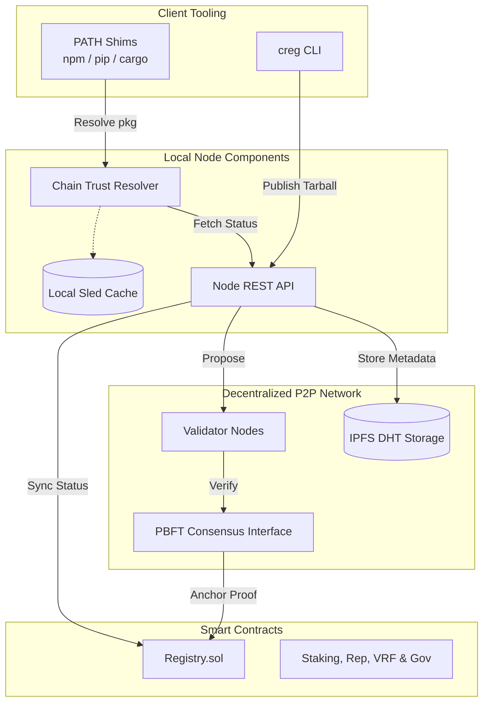

# ⛓️ Chain Registry


A **decentralized, consensus-driven AppChain** designed to secure global software supply chains. By replacing single-authority trust with a Byzantine Fault Tolerant P2P network, the Chain Registry ensures that every package you install is verified, sandboxed, and cryptographically anchored.

---

## 🌟 Key Pillars

| Feature | Description | Status |
| :--- | :--- | :--- |
| **PBFT Consensus** | Quorum-based validation (2/3 majority required for trust). | ✅ |
| **nsjail Sandboxing** | Multi-stage behavioral analysis (Static, Dynamic, ML). | ✅ |
| **ZK-SNARK Safety** | Groth16 proofs for instant, resource-efficient verification. | ✅ |
| **"Fail-Closed" Shims** | Transparent PATH shims for `npm`, `pip`, and `cargo`. | ✅ |
| **Ethereum L1 Bridge** | Permanent finality through the `Registry.sol` contract. | ✅ |

---

## 🏗️ System Architecture

The ecosystem consists of local developer shims, a P2P network of validation nodes, and on-chain Ethereum smart contracts.



---

## 🚀 Quick Start

### 1. Launch the Cloud Infrastructure
Deploy a complete 3-node PBFT cluster with Ethereum and IPFS nodes locally.

```powershell
# Windows
.\scripts\deploy-docker.ps1

# Linux/macOS
./scripts/deploy-docker.sh
```

### 2. Install the Developer Shims
Intercept your existing package managers transparently.

```bash
# Health check
GET  /v1/health

# Package operations
GET  /v1/packages/{canonical}              # Get verdict
POST /v1/packages                          # Submit for validation
POST /v1/packages/{canonical}/revoke       # Revoke a package
GET  /v1/packages/{canonical}/proof        # Get SPV Merkle proof

# Chain data
GET  /v1/chain/stats                       # Tip height, package count
GET  /v1/blocks/{height}                   # Block by height
GET  /v1/blocks/hash/{hash}                # Block by hash

# Network
GET  /v1/nodes                             # Active validator set
GET  /v1/p2p/status                        # P2P peer connections
GET  /v1/bridge/status                     # Ethereum bridge status

# Events (real-time)
GET  /v1/events                            # SSE event stream
GET  /v1/ws                               # WebSocket events

# Consensus (validator-only)
POST /v1/consensus/vote                    # Submit authenticated vote

# Observability
GET  /metrics                              # Prometheus metrics
```

### 8.6 Event Stream Integration

```javascript
// Browser / Node.js — subscribe to real-time events
const events = new EventSource('http://localhost:8080/v1/events');

events.addEventListener('package_verified', (e) => {
  const data = JSON.parse(e.data);
  console.log(`✓ ${data.canonical} verified in block ${data.block_hash}`);
});

events.addEventListener('package_revoked', (e) => {
  const data = JSON.parse(e.data);
  console.log(`✗ ${data.canonical} REVOKED: ${data.reason}`);
  triggerAlert(data);
});

events.addEventListener('block_produced', (e) => {
  const data = JSON.parse(e.data);
  updateDashboard(data.height, data.tx_count);
});
```

---

## 📊 Live Monitoring & Explorer

The CLI includes high-fidelity, real-time dashboards for full network transparency.

> [!TIP]
> Run the **Enhanced Explorer** to navigate block history and inspect console telemetry:
> ```bash
> creg dashboard-enhanced
> ```


---

## 🪙 Tokenomics & Security

The Chain Registry enforces security through tanglible economic deterrents:
- **Publishing Stake**: Publishers must lock 0.01 ETH to submit packages.
- **Slashing**: Malicious packages result in an **immediate 10% stake loss** recorded on Ethereum.
- **Validator Quorum**: 2/3 + 1 nodes must agree on a package's safety before finalization.

---

## 10. Comparison: Before vs After

### The Developer Experience

| Scenario | Without Chain Registry | With Chain Registry |
|----------|----------------------|---------------------|
| Install safe package | `npm install express` ✓ | `npm install express` ✓ (same) |
| Install malicious package | `npm install event-stream` 💀 | BLOCKED with reason |
| Install typosquatted package | `npm install lodahs` 💀 | BLOCKED (typosquat detected) |
| Install from compromised registry | `npm install axios` 💀 | BLOCKED (hash mismatch) |
| Check if package is safe | Manual audit, hope for the best | `creg status npm:axios@1.6.0` |
| Audit all dependencies | Run 5 different tools, incomplete | `creg audit` — complete chain scan |

### The Security Posture

```
WITHOUT Chain Registry:              WITH Chain Registry:
──────────────────────────           ──────────────────────────────────

Trust: npm says so                   Trust: 2/3+ independent validators
Verification: none (BYOK)            Verification: static + sandbox + AI
Response to threat: hours/days       Response to threat: minutes
Accountability: none                 Accountability: staked + slashed
Auditability: npm logs (private)     Auditability: public blockchain
Decentralization: one company        Decentralization: 10–1000 validators
Censorship resistance: zero          Censorship resistance: BFT
```

### The Trust Model

```
OLD MODEL:                           NEW MODEL:

  You → trust → npm                  You → verify → Chain Registry
                                         → verify → Ethereum L1
  (single point of failure)               → verify → Merkle proof
                                              │
                                         Chain Registry →
                                           trust (with proof) →
                                           10+ validators →
                                           each independently →
                                           analyzed the code
```

---

## Glossary

| Term | Definition |
|------|-----------|
| **BFT** | Byzantine Fault Tolerant — system that works correctly even if some nodes are malicious |
| **PBFT** | Practical BFT — the specific consensus protocol used (3-phase: PRE-PREPARE, PREPARE, COMMIT) |
| **Quorum** | Minimum votes needed: ⌊2n/3⌋ + 1 where n = validator count |
| **Groth16** | A type of ZK-SNARK proof system — small proofs, fast verification |
| **SNARK** | Succinct Non-interactive ARgument of Knowledge — a type of zero-knowledge proof |
| **SPV** | Simplified Payment Verification — verifying a single record using a Merkle proof without downloading the whole chain |
| **Merkle Root** | A single hash summarizing all transactions in a block — used for light-client verification |
| **Slashing** | Automatically removing a percentage of a validator's stake as punishment for bad behavior |
| **Unbonding** | The 7-day waiting period after a validator leaves before they can withdraw their stake |
| **Ed25519** | An elliptic curve signature scheme used for all signing operations |
| **IPFS CID** | Content Identifier — a hash of content used to locate it in IPFS |
| **Canonical** | The unique string identifier for a package: `ecosystem:name@version` (e.g., `npm:express@4.18.2`) |
| **nsjail** | A Linux kernel-level sandboxing tool that isolates processes using namespaces |
| **Gossipsub** | A pub/sub protocol in libp2p used to broadcast votes and blocks across the P2P network |
| **Kademlia DHT** | A distributed hash table for peer discovery in the P2P network |

---

*Chain Registry — Securing the global software supply chain, one block at a time.*

*Document version: 2026-03-31*
