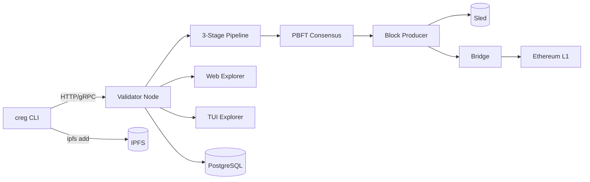

# Chain Registry

> A decentralized, Byzantine-Fault-Tolerant package distribution network that replaces single-authority trust in npm/PyPI/Cargo with cryptographic consensus from a staked validator set.

[](chain-registry/CURRENT_STATUS.md)
[%20%7C%2010%20(k8s)-green)](chain-registry/k8s/)
[](#license)
[](chain-registry/Cargo.toml)
[](chain-registry/contracts/)

---

## What Is Chain Registry?

**The problem.** Modern software supply chain attacks — `event-stream`, SolarWinds, XZ Utils, the 2024 `ua-parser-js` compromise — all exploit the same weakness: the single-authority trust model of package registries like npm, PyPI, Maven, and RubyGems. One compromised maintainer, one stolen API token, or one unreviewed merge is enough to ship malicious code to millions of downstream consumers.

**The solution.** Chain Registry replaces single-authority trust with a **decentralized Byzantine-Fault-Tolerant validator network** that independently analyzes every package before it is considered `Verified`. Each package passes through a three-stage validation pipeline — static analysis, behavioral sandbox, ML deep scan — and only becomes installable once a `⌊2n/3⌋+1` PBFT quorum of economically-staked validators has signed an `Approve` vote. Packages are content-addressed in IPFS, the chain is persisted in Sled, and final state roots are anchored to Ethereum L1 via a Groth16 rollup bridge.

**Current status.** The project is in **testnet v0.3.0**. The full publish → validate → consensus → block → L1 anchor pipeline is wired end-to-end in the single-validator Docker compose profile. A 10-validator Kustomize deployment is available under [`chain-registry/k8s/`](chain-registry/k8s/). A public testnet, a CLI with 27 commands, a React web explorer, a Ratatui terminal explorer, a faucet, a relayer paymaster, and a full Prometheus/Grafana observability stack are shipped. Production hardening is gated on the 8 Critical and 15 High findings documented in [`DEEP_DIVE_ANALYSIS.md`](chain-registry/DEEP_DIVE_ANALYSIS.md).

---

## Quick Start

**Prerequisites.**

- Docker Desktop (or docker-engine + compose v2)
- ~8 GB RAM available to Docker
- Ports `8080`, `4001`, `5001`, `8081`, `8545`, `9000`, `50051` free

**Bring up the dev cluster.**

```bash
cd chain-registry
cp .env.example .env          # set NODE1_VALIDATOR_KEY (creg keygen)
docker compose up -d          # starts IPFS + Anvil + contract deployer + validator node
```

**Check health.**

```bash
curl http://localhost:8080/v1/health
# → {"status":"ok","tip_height":42,"peers":0,"bridge":"synced"}
```

**Open the web explorer.**

- Embedded UI: <http://localhost:8080/ui/>
- Standalone nginx (optional): `docker compose --profile web-explorer up -d` → <http://localhost:3000>

**Launch the terminal explorer.**

```bash
docker compose --profile tui run --rm tui-explorer
```

**Publish your first package.**

```bash
docker compose --profile cli run --rm cli keygen --out /data/publisher.key
docker compose --profile cli run --rm cli stake --amount 1000
docker compose --profile cli run --rm cli publish ./my-pkg-1.0.0.tgz --key /data/publisher.key
```

---

## Architecture Overview



| Layer | Technology |
|---|---|
| **Validator runtime** | Rust 1.90 · Tokio · axum · tonic · libp2p · Sled |
| **Consensus** | Custom PBFT · Ed25519-based VRF · Gossipsub broadcast |
| **Validation Stage 1** | Static analysis (entropy, YARA-X, Levenshtein typosquat, diff) |
| **Validation Stage 2** | Sandbox waterfall: nsjail → gVisor → Docker → WASM |
| **Validation Stage 3** | ML deep scan: ONNX CodeBERT · OSV.dev · threat intel · optional LLM |
| **ZK layer** | arkworks Groth16 · BN254 · snarkJS verifier contract |
| **Smart contracts** | Solidity 0.8.24 · Foundry · 17 contracts |
| **Content addressing** | IPFS Kubo v0.27 |
| **Storage** | Sled (embedded) + PostgreSQL (indexer via db-sync) |
| **Bridge** | alloy 0.6 → Ethereum / Arbitrum / Optimism / Polygon |
| **Web UI** | React 18 · Vite · Viem · MetaMask / WalletConnect |
| **Terminal UI** | Ratatui |
| **Observability** | Prometheus · Alertmanager · Grafana |
| **Orchestration** | Docker Compose (dev) · Kustomize (prod) |

---

## CLI Usage

The `creg` CLI ships **27 commands**. The most-used subset:

| Command | Description |
|---|---|
| `creg keygen` | Generate an Ed25519 keypair with BIP-39 mnemonic |
| `creg stake --amount N` | Stake CREG tokens as publisher or validator |
| `creg publish <tarball>` | Sign, pin to IPFS, and submit a package to the pending pool |
| `creg install <pkg>` | Verify trust verdict and install (or delegate to real npm/pip/cargo) |
| `creg status <pkg>` | Look up the verdict for a package without installing |
| `creg audit` | Audit every installed package against the chain |
| `creg verify <pkg>` | Single-package verification with proof checkpoint |
| `creg multisig init` | Start an M-of-N co-signed publish session |
| `creg multisig sign` | Co-sign a pending multisig publish session |
| `creg multisig submit` | Submit once the threshold is met |
| `creg setup-shims` | Install PATH shims for npm/pip/cargo/gem/mvn |
| `creg remove-shims` | Restore original package manager binaries |
| `creg doctor` | Run health checks (basic or full E2E testnet mode) |
| `creg console` | Launch the Ratatui terminal explorer |
| `creg watch` | Real-time stream of publish/consensus events |
| `creg search <q>` | Search the chain-indexed package metadata |
| `creg info <pkg>` | Package detail with validator signatures |
| `creg diff` | Diff local lockfile against chain state |
| `creg testnet status` | Show testnet node health and chain stats |
| `creg testnet drip` | Request testnet tokens from the faucet (solves PoW) |
| `creg advanced zk-generate <pkg>` | Generate a Groth16 proof for a package |
| `creg advanced zk-verify <pkg>` | Verify a package's ZK proof |
| `creg advanced ml-verify <pkg>` | Run ML deep scan locally |
| `creg advanced wasm-validate <pkg>` | Run the WASM validator on a package |
| `creg recovery init` | Split a key via Shamir for social recovery |
| `creg cache --clear` | Clear the verification cache |
| `creg config init` | Initialize `~/.creg/config.toml` |

---

## Publishing a Package

### Step 1 — Generate keys and stake

```bash
creg keygen --out ~/.creg/publisher.key
creg stake --amount 1000 --role publisher
```

### Step 2 — Publish (single publisher)

```bash
creg publish ./my-pkg-1.0.0.tgz \
  --key ~/.creg/publisher.key \
  --ecosystem npm
```

The CLI hashes the tarball, pins it to IPFS, constructs a `PublishRequest`, signs it with Ed25519, attaches a Groth16 content-hash attestation, and POSTs to the node over gRPC (with REST fallback).

### Multisig variant (M-of-N publishers)

```bash
# Coordinator:
creg multisig init my-pkg-1.0.0.tgz --threshold 2 --pubkeys keyA,keyB,keyC

# Each co-signer runs:
creg multisig sign --session .creg-multisig.json --key ~/keyA.key

# Once threshold met, any co-signer runs:
creg multisig submit --session .creg-multisig.json
```

### Shielded variant (encrypted tarball)

```bash
creg publish ./my-pkg-1.0.0.tgz --shielded --key ~/.creg/publisher.key
```

The tarball is encrypted with a per-package AES-256-GCM key; the key is threshold-encrypted to the validator set. **Note:** shielded decryption is currently tracked as [ISSUE-010](chain-registry/DEEP_DIVE_ANALYSIS.md#42-high-severity) — use only for testing.

---

## Running a Validator Node

| Env var | Description | Example |
|---|---|---|
| `CREG_NODE_ID` | Node identifier | `node-1` |
| `CREG_IS_VALIDATOR` | Enable validator role | `true` |
| `CREG_VALIDATOR_KEY` | Hex-encoded Ed25519 secret key | `ed25519:...` |
| `CREG_LISTEN` | REST API listen address | `0.0.0.0:8080` |
| `CREG_DATA_DIR` | Sled data directory | `/data` |
| `CREG_P2P_LISTEN` | libp2p listen multiaddr | `/ip4/0.0.0.0/tcp/9000` |
| `CREG_P2P_SEEDS` | Seed peers | `/ip4/1.2.3.4/tcp/9000/p2p/<peer-id>` |
| `CREG_ETH_RPC` | Ethereum RPC endpoint | `https://mainnet.infura.io/...` |
| `CREG_IPFS_URL` | IPFS API endpoint | `http://ipfs:5001` |
| `CREG_BLOCK_INTERVAL` | Seconds between blocks | `2` |
| `CREG_SINGLE_VALIDATOR_MODE` | Collapse quorum to 1 (dev only) | `false` on mainnet |
| `CREG_DEV_SANDBOX` | Skip sandbox when no engine available | `false` on mainnet |
| `CREG_ZK_ENABLED` | Enable ZK proof path | `true` |
| `CREG_ML_ENABLED` | Enable ML deep scan | `true` |
| `CREG_WASM_ENABLED` | Enable WASM validator engine | `true` |
| `CREG_REGISTRY_ADDR` | Registry.sol contract address | `0x...` |
| `CREG_STAKING_ADDR` | Staking.sol contract address | `0x...` |
| `CREG_GOVERNANCE_ADDR` | Governance.sol contract address | `0x...` |
| `CREG_ZK_VERIFIER_ADDR` | ZKVerifier.sol address | `0x...` |
| `RUST_LOG` | Log filter | `info,chain_registry_node=debug` |

**Docker run example.**

```bash
docker run -d \
  --name creg-node \
  -p 8080:8080 -p 9000:9000 -p 50051:50051 \
  -v creg-data:/data \
  -e CREG_NODE_ID=node-1 \
  -e CREG_IS_VALIDATOR=true \
  -e CREG_VALIDATOR_KEY=$NODE1_VALIDATOR_KEY \
  -e CREG_DATA_DIR=/data \
  -e CREG_ETH_RPC=https://sepolia.infura.io/v3/$INFURA_KEY \
  -e CREG_IPFS_URL=http://ipfs:5001 \
  -e CREG_DEV_SANDBOX=false \
  ghcr.io/chain-registry/node:latest
```

**On-chain staking.** Before your node can vote, you must stake on `Staking.sol` and be approved by governance:

```bash
creg stake --amount 10000 --role validator --address 0xYourEthAddress
# Governance multisig then approves your validator via Governance.sol proposals
```

---

## Smart Contracts

| Contract | Purpose | Status |
|---|---|---|
| **Registry.sol** | Core package index; PBFT finalization + ZK verification | **Active** |
| **Staking.sol** | Publisher & validator stake management, slashing | **Active** |
| **Governance.sol** | M-of-N multisig + emergency pause | **Active** |
| **GovernanceV2.sol** | Upgrade target with timelock and delegation | **Active** |
| **Reputation.sol** | On-chain validator approval/rejection counters | **Active** |
| **VRF.sol** | Verifiable random beacon adaptor | **Active** |
| **CregToken.sol** | ERC20 + EIP-2612 permit for CREG | **Active** |
| **ZKVerifier.sol** | Groth16 verifier wrapper (⚠ ISSUE-002) | **Active** |
| **Groth16Verifier.sol** | snarkJS-generated Groth16 verifier | **Active** |
| **ZKSlashingVerifier.sol** | Double-signing evidence verifier | **Active** |
| **SlashingEvidence.sol** | Permissionless slashing evidence submission | **Active** |
| **Appeal.sol** | Publisher appeal process | **Active** |
| **BatchOperations.sol** | Batch submit / verify helpers | **Active** |
| **ValidatorRewards.sol** | Staking rewards distribution | **Active** |
| **PinningRewards.sol** | IPFS pinner rewards | **Active** |
| **PackageInsurance.sol** | Optional insurance coverage for verified packages | **Active** |
| **PrivateRegistry.sol** | Enterprise M-of-N decrypted registries (⚠ ISSUE-004) | **Active** |
| **CrossChainRegistry.sol** | Multi-chain verification receipts (⚠ ISSUE-005/006) | **Planned** |

See [`DEEP_DIVE_ANALYSIS.md`](chain-registry/DEEP_DIVE_ANALYSIS.md#33-smart-contract-system) for contract-level findings.

---

## Configuration Reference

### `node.toml` (alternative to env vars)

```toml
[node]
id            = "node-1"
is_validator  = true
listen_addr   = "0.0.0.0:8080"
data_dir      = "/data"
block_interval_secs = 2

[p2p]
listen  = "/ip4/0.0.0.0/tcp/9000"
seeds   = ["/ip4/1.2.3.4/tcp/9000/p2p/12D3KooW..."]

[ethereum]
rpc_url           = "https://mainnet.infura.io/v3/YOUR_KEY"
registry_addr     = "0x..."
staking_addr      = "0x..."
governance_addr   = "0x..."
zk_verifier_addr  = "0x..."

[ipfs]
url = "http://ipfs:5001"

[sandbox]
dev_bypass           = false
nsjail_config        = "/app/config/sandbox/nsjail-seccomp.cfg"
docker_seccomp       = "/app/config/sandbox/docker-seccomp.json"
rootfs_dir           = "/app/config/sandbox/rootfs"
timeout_secs         = 120
memory_mb            = 512

[features]
zk_enabled   = true
ml_enabled   = true
wasm_enabled = true
llm_enabled  = false

[logging]
filter = "info,chain_registry_node=debug,zk_validator=debug"
```

### Key env vars (deployment)

| Var | Purpose |
|---|---|
| `CREG_TESTNET_MODE` | Enable multi-node testnet allowances |
| `CREG_TLS_CERT` / `CREG_TLS_KEY` | Enable HTTPS on the REST API (feature `tls`) |
| `CREG_PG_URL` | Enable PostgreSQL indexer sync |
| `OPENROUTER_API_KEY` | Optional cloud LLM backend |
| `ANTHROPIC_API_KEY` | Optional cloud LLM backend |

---

## Contributing

### Build

```bash
cd chain-registry
cargo build --workspace --release
cd contracts && forge build
cd ../explorer && npm ci && npm run build
```

### Test

```bash
cargo test --workspace
cd contracts && forge test
cd ../explorer && npm test
```

### Full testnet smoke test

```bash
make testnet          # start 3-node cluster
make testnet-smoke    # full E2E diagnostic via `creg doctor --testnet`
```

### PR process

1. Fork the repository and create a feature branch.
2. Run `cargo fmt` and `cargo clippy --workspace --all-targets -- -D warnings` before committing.
3. Add tests — unit tests for `crates/*`, Foundry tests for `contracts/`.
4. Reference any issue IDs from [`DEEP_DIVE_ANALYSIS.md`](chain-registry/DEEP_DIVE_ANALYSIS.md) in your PR description.
5. CI runs `cargo test`, `forge test`, and explorer tests; all must pass.

### Documentation

- [`chain-registry/DEEP_DIVE_ANALYSIS.md`](chain-registry/DEEP_DIVE_ANALYSIS.md) — full technical and security audit
- [`chain-registry/docs/SYSTEM_DEEP_DIVE.md`](chain-registry/docs/SYSTEM_DEEP_DIVE.md) — architecture overview
- [`chain-registry/docs/VALIDATOR_DEEP_DIVE.md`](chain-registry/docs/VALIDATOR_DEEP_DIVE.md) — validator operations guide
- [`chain-registry/docs/TESTNET_DEEP_DIVE.md`](chain-registry/docs/TESTNET_DEEP_DIVE.md) — testnet setup and E2E testing
- [`chain-registry/docs/WALLET_DEEP_DIVE.md`](chain-registry/docs/WALLET_DEEP_DIVE.md) — wallet integration
- [`chain-registry/docs/RELAYER_PAYMASTER_DESIGN.md`](chain-registry/docs/RELAYER_PAYMASTER_DESIGN.md) — sponsored transaction design
- [`chain-registry/CURRENT_STATUS.md`](chain-registry/CURRENT_STATUS.md) — current development snapshot
- [`chain-registry/TODO.md`](chain-registry/TODO.md) — active backlog

---

## License

MIT License. See [`LICENSE`](LICENSE) for details.
