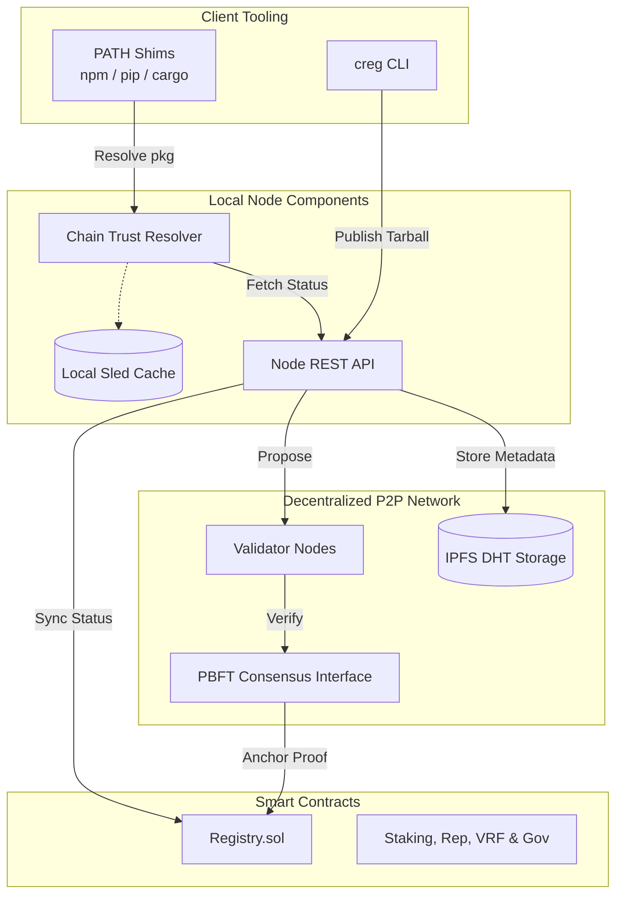

# ⛓️ Chain Registry


A **decentralized, consensus-driven AppChain** designed to secure global software supply chains. By replacing single-authority trust with a Byzantine Fault Tolerant P2P network, the Chain Registry ensures that every package you install is verified, sandboxed, and cryptographically anchored.

---

## 🌟 Key Pillars

| Feature | Description | Status |
| :--- | :--- | :--- |
| **PBFT Consensus** | Quorum-based validation (2/3 majority required for trust). | ✅ |
| **nsjail Sandboxing** | Multi-stage behavioral analysis (Static, Dynamic, ML). | ✅ |
| **ZK-SNARK Safety** | Groth16 proofs for instant, resource-efficient verification. | ✅ |
| **"Fail-Closed" Shims** | Transparent PATH shims for `npm`, `pip`, and `cargo`. | ✅ |
| **Ethereum L1 Bridge** | Permanent finality through the `Registry.sol` contract. | ✅ |

---

## 🏗️ System Architecture

The ecosystem consists of local developer shims, a P2P network of validation nodes, and on-chain Ethereum smart contracts.



---

## 🚀 Quick Start

### 1. Launch the Cloud Infrastructure
Deploy a complete 3-node PBFT cluster with Ethereum and IPFS nodes locally.

```powershell
# Windows
.\scripts\deploy-docker.ps1

# Linux/macOS
./scripts/deploy-docker.sh
```

### 2. Install the Developer Shims
Intercept your existing package managers transparently.

```bash
creg setup-shims
```

Now, any call to `npm install` or `pip install` will be automatically verified against the Chain Registry. 

---

## 📊 Live Monitoring & Explorer

The CLI includes high-fidelity, real-time dashboards for full network transparency.

> [!TIP]
> Run the **Enhanced Explorer** to navigate block history and inspect console telemetry:
> ```bash
> creg dashboard-enhanced
> ```


---

## 🪙 Tokenomics & Security

The Chain Registry enforces security through tanglible economic deterrents:
- **Publishing Stake**: Publishers must lock 0.01 ETH to submit packages.
- **Slashing**: Malicious packages result in an **immediate 10% stake loss** recorded on Ethereum.
- **Validator Quorum**: 2/3 + 1 nodes must agree on a package's safety before finalization.

---

## 🔎 Documentation

-   **[Chain_Registry_Technical_Report.md](file:///C:/Users/samue/.gemini/antigravity/brain/586bfe0a-70ef-4c8f-a7a7-233f2253b06c/Chain_Registry_Technical_Report.md)**: Exhaustive Technical Deep-Dive.
-   **[SYSTEM_ANALYSIS.md](file:///f:/project/chain-registry/chain-registry/SYSTEM_ANALYSIS.md)**: Architecture & Lifecycle Overview.
-   **[CONTRIBUTING.md](file:///f:/project/chain-registry/chain-registry/CONTRIBUTING.md)**: Join the decentralized defense network.

---

**Version**: v0.2.1-hardened  
**GitHub**: [samuel-1-avson/chain-registry-blockchain-CREG-](https://github.com/samuel-1-avson/chain-registry-blockchain-CREG-.git)
