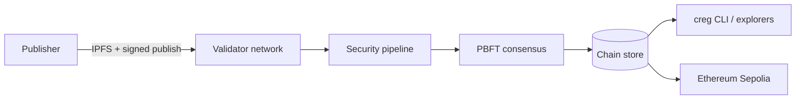

# Chain Registry

A decentralized package registry that replaces single-authority trust (npm, PyPI, Cargo, and similar) with **independent validator consensus**. Packages are content-addressed, analyzed through a multi-stage security pipeline, finalized by PBFT quorum, and anchored to Ethereum.

**Network:** `creg-testnet-1` on Sepolia testnet · **Phase:** public alpha

---

## What problem this solves

Supply-chain attacks exploit one compromised maintainer or stolen API token. Chain Registry treats every publish as a **consensus decision**: economically staked validators run static analysis, behavioral sandboxing, and ML-assisted review before a package can reach **verified** status. Consumers install against cryptographic verdicts, not publisher reputation alone.

---

## How it works

1. **Publish** — A staked publisher signs a package, pins it to IPFS, and submits to the network.
2. **Validate** — Validators run a three-stage pipeline (static → sandbox → deep scan).
3. **Finalize** — A `⌊2n/3⌋+1` PBFT quorum records the verdict on the chain (RocksDB).
4. **Install** — The `creg` CLI and explorers read **verified** status before delegating to npm/pip/cargo shims.
5. **Anchor** — State roots can be posted to Ethereum L1 via the Groth16 rollup bridge.



| Layer | Technology |
|-------|------------|
| Validator runtime | Rust · libp2p · axum |
| Consensus | PBFT · Ed25519 |
| Content addressing | IPFS |
| Smart contracts | Solidity on Sepolia (staking, registry, governance, ZK verifier) |
| CLI | `creg` — publish, install, stake, audit, multisig |
| Web | React explorer · public REST API |

---

## Live services

Public HTTPS endpoints (maintainer-operated):

| Service | URL |
|---------|-----|
| **API** | https://api.testnet.cregnet.dev |
| **Explorer** | https://explorer.testnet.cregnet.dev |
| **Faucet** | https://faucet.testnet.cregnet.dev |
| **Chain spec** | https://spec.testnet.cregnet.dev |
| **IPFS gateway** | https://ipfs.testnet.cregnet.dev |
| **Waitlist** | https://waitlist.cregnet.dev |

**Binaries:** [v0.1.0-testnet release](https://github.com/samuel-1-avson/chain-registry-blockchain-CREG-/releases/tag/v0.1.0-testnet) (`creg` + `creg-node` for Linux, Windows, macOS).

Chain parameters and contract addresses: [`chain-registry/testnet/chain-spec.sepolia.json`](chain-registry/testnet/chain-spec.sepolia.json).

---

## Who this is for

| Audience | Start here |
|----------|------------|
| **Publishers & developers** | [docs/PUBLIC_TESTNET_QUICKSTART.md](docs/PUBLIC_TESTNET_QUICKSTART.md) |
| **Validators & operators** | [chain-registry/testnet/OPERATOR.md](chain-registry/testnet/OPERATOR.md) |
| **Participants — scope & limits** | [docs/TESTNET_PHASE_SCOPE.md](docs/TESTNET_PHASE_SCOPE.md) |
| **Infrastructure & hosting** | [chain-registry/testnet/gcp-public-hosting.md](chain-registry/testnet/gcp-public-hosting.md) |

---

## Quick start (developers)

**Install CLI** (from release or source):

```bash
# From GitHub release
./chain-registry/scripts/install-creg.sh --version v0.1.0-testnet

# Or build from source
cd chain-registry && cargo build --release -p cli
```

**Point at the public API:**

```bash
export CREG_NODE_URL=https://api.testnet.cregnet.dev
creg doctor
```

Full publisher, validator, and staking flows: [PUBLIC_TESTNET_QUICKSTART.md](docs/PUBLIC_TESTNET_QUICKSTART.md).

---

## Repository layout

| Path | Contents |
|------|----------|
| [`chain-registry/`](chain-registry/) | Rust workspace, contracts, explorer, testnet compose, GCP scripts |
| [`Creg-waitlist/`](Creg-waitlist/) | Marketing waitlist SPA + Firebase `registerWaitlist` function |
| [`docs/`](docs/) | Documentation index, runbooks, security, budget model |
| [`circuits/`](circuits/) | ZK Groth16 circuits |

---

## Documentation

**[docs/README.md](docs/README.md)** — full index (operators, security, testnet, cost model).

| Document | Purpose |
|----------|---------|
| [DEEP_DIVE_ANALYSIS.md](chain-registry/DEEP_DIVE_ANALYSIS.md) | Technical architecture and issue registry |
| [TESTNET_READINESS_REPORT.md](chain-registry/TESTNET_READINESS_REPORT.md) | Readiness assessment and evidence |
| [NEXT_WORK.md](docs/NEXT_WORK.md) | Current open work (maintainers) |
| [GCP-BUDGET-ARCHITECTURE.md](docs/GCP-BUDGET-ARCHITECTURE.md) | Two-project cost model (VM + Firebase) |

---

## Status (June 2026)

| Milestone | Status |
|-----------|--------|
| Sepolia contracts + 3-node lab | Live |
| 2-validator PBFT quorum (NET-301) | Done |
| Real sandbox engine (SANDBOX-301) | Done |
| Public HTTPS hosting (HOSTING-301) | Done — `testnet.cregnet.dev` |
| Binary release `v0.1.0-testnet` (DIST-301) | Done |
| Waitlist (static + Firebase registration) | Live |
| External security audit (SEC-401) | Scheduled — scope ready |

This is a **public alpha testnet**, not mainnet. Economic guarantees, cross-chain features, and formal audit completion are still in progress. See [TESTNET_PHASE_SCOPE.md](docs/TESTNET_PHASE_SCOPE.md) for participant expectations.

---

## Contributing

Contributions welcome. Build and test from `chain-registry/`:

```bash
cargo test --workspace
cd contracts && forge test
```

See [DELIVERABLES_INDEX.md](chain-registry/DELIVERABLES_INDEX.md) for scripts and compose profiles. Reference issue IDs from [DEEP_DIVE_ANALYSIS.md](chain-registry/DEEP_DIVE_ANALYSIS.md) in pull requests.

---

## License

MIT — see [LICENSE](LICENSE).
