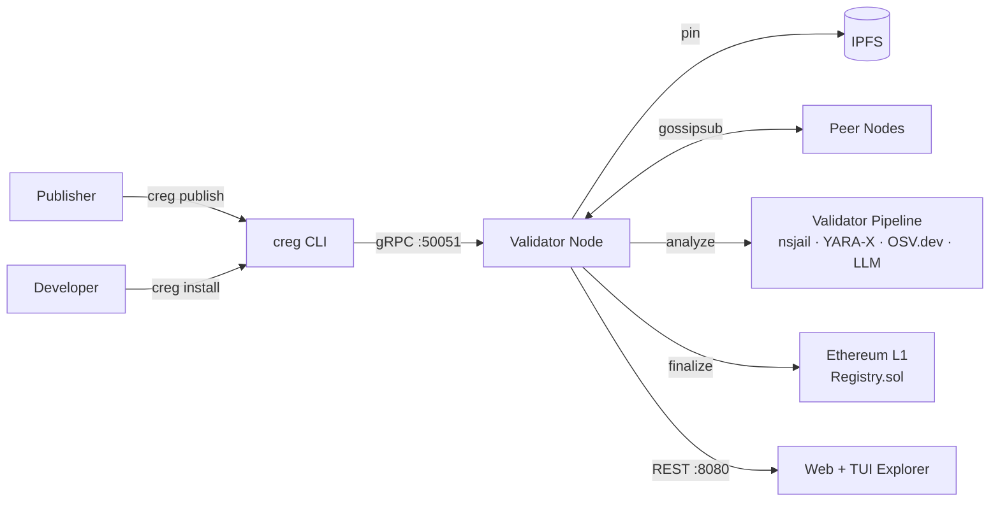

# Chain Registry

> A decentralized, Byzantine Fault Tolerant package distribution network that replaces single-authority trust in package managers with cryptographic consensus.

[](chain-registry/DEEP_DIVE_ANALYSIS.md)
[](chain-registry/docs/TESTNET_RUNBOOK.md)
[](LICENSE)

---

## Table of Contents

1. [What Is Chain Registry?](#1-what-is-chain-registry)
2. [Quick Start (Docker Compose)](#2-quick-start)
3. [Architecture Overview](#3-architecture-overview)
4. [CLI Usage](#4-cli-usage)
5. [Publishing a Package](#5-publishing-a-package)
6. [Running a Validator Node](#6-running-a-validator-node)
7. [Smart Contracts](#7-smart-contracts)
8. [Configuration Reference](#8-configuration-reference)
9. [Contributing](#9-contributing)
10. [License](#10-license)

---

## 1. What Is Chain Registry?

### The Problem

Modern software supply chains are under attack. The [event-stream incident](https://github.com/dominictarr/event-stream/issues/116), [SolarWinds breach](https://en.wikipedia.org/wiki/SolarWinds_cyberattack), and [XZ Utils backdoor](https://en.wikipedia.org/wiki/XZ_Utils_backdoor) all exploited the same fundamental weakness: package managers (npm, PyPI, crates.io, RubyGems, Maven) use a **single-authority trust model**. If the registry or a single maintainer account is compromised, malicious code reaches millions of developers with no cryptographic verification.

### The Solution

Chain Registry replaces single-authority trust with a **Byzantine Fault Tolerant validator network**. Before any package can be installed, it must be approved by a quorum of independent validator nodes — each running:

- **Static analysis** — pattern matching, entropy analysis, typosquatting detection
- **Behavioral sandboxing** — nsjail/gVisor/Docker execution recording syscalls
- **ML threat detection** — YARA-X community rules, OSV.dev CVE lookups, optional ONNX model
- **LLM semantic analysis** — obfuscated code intent prediction (optional, opt-in)
- **ZK proof verification** — cryptographic proof of validation without re-execution

Consensus requires `⌊2n/3⌋ + 1` validators to approve. Results are anchored to Ethereum L1 via a bridge. The trust verdict is cached locally and updated in real time.

### Current Status

**Testnet v0.3.0** — a working 3-validator testnet is running. The CLI (`creg`) is functional for publish/install/audit workflows. A web explorer and TUI explorer are available. The system is **not yet production-hardened** — see [`DEEP_DIVE_ANALYSIS.md`](chain-registry/DEEP_DIVE_ANALYSIS.md) for the full issue registry.

---

## 2. Quick Start

### Prerequisites

- Docker 24+ and Docker Compose v2
- 8 GB RAM (16 GB recommended for testnet with 3 validators)
- 20 GB disk space

### Single-Validator Dev Setup

```bash
git clone https://github.com/your-org/chain-registry.git
cd chain-registry/chain-registry

# Start IPFS, Anvil (local L1), deploy contracts, and one validator node
docker compose up -d --build

# Wait ~30 seconds for contracts to deploy and node to sync
docker compose logs -f node
```

Once you see `Node started — listening on :8080`, the registry is ready.

**Health check:**
```bash
curl http://localhost:8080/v1/health
# → {"status":"ok","tip_height":1}
```

**Web Explorer:** Open `http://localhost:8080/ui/` in your browser.

**TUI Explorer:**
```bash
docker compose run --rm tui-explorer
```

**CLI (in the container):**
```bash
docker compose run --rm cli creg status npm:lodash@4.17.21
```

### Three-Validator Testnet

```bash
docker compose -f docker-compose.testnet.yml up -d
```

This starts 3 validators, IPFS, Anvil, PostgreSQL (for indexing), a faucet, and the web explorer. Consensus requires 3/3 approvals (BFT threshold: 2 Byzantine faults tolerated with 7+ validators).

### Stopping

```bash
docker compose down          # stop containers
docker compose down -v       # stop + delete volumes (reset all chain state)
```

---

## 3. Architecture Overview



For the complete architecture with all subsystems, 5 Mermaid diagrams, and the 16-issue registry, see [`chain-registry/DEEP_DIVE_ANALYSIS.md`](chain-registry/DEEP_DIVE_ANALYSIS.md).

**Key layers:**

| Layer | Technology |
|-------|------------|
| CLI & shims | Rust · Clap · Ratatui |
| P2P network | libp2p (Gossipsub + Kademlia) |
| Validator pipeline | nsjail · YARA-X · OSV.dev · ONNX · LLM |
| Consensus | PBFT (⌊2n/3⌋+1 quorum) + VRF proposer selection |
| Chain storage | Sled (embedded KV) |
| L1 bridge | Alloy (Ethereum) |
| Smart contracts | Solidity 0.8.24 · Groth16/BN254 ZK proofs |
| Web explorer | Vue 3 + Vite |

---

## 4. CLI Usage

Install the CLI (`creg`) from source:
```bash
cd chain-registry
cargo build --release --bin creg
# Binary at: target/release/creg
```

Or use the Docker container:
```bash
docker compose run --rm cli creg <command>
```

### Most-Used Commands

| Command | Description |
|---------|-------------|
| `creg install express@4.18.2` | Install with chain verification (auto-detects ecosystem) |
| `creg install --ecosystem npm react` | Force ecosystem for latest version |
| `creg status lodash` | Check trust verdict without installing |
| `creg audit` | Scan all installed packages in cwd (npm/cargo/pip/rubygems) |
| `creg audit --strict` | Exit 1 if any package is unverified |
| `creg publish package.tgz --key publisher.key` | Publish a package |
| `creg keygen publisher` | Generate Ed25519 keypair (publisher role) |
| `creg keygen validator` | Generate Ed25519 keypair (validator role) |
| `creg stake 1.5 --role publisher` | Stake 1.5 CREG as publisher |
| `creg stake 100 --role validator` | Stake 100 CREG to apply as validator |
| `creg setup-shims` | Install npm/pip/cargo/gem/mvn path intercepts |
| `creg remove-shims` | Uninstall path intercepts |
| `creg dashboard-interactive` | Launch interactive TUI dashboard |
| `creg explorer` | Launch TUI blockchain explorer |
| `creg blocks --limit 20` | Show recent 20 blocks |
| `creg watch --filter packages` | Stream real-time package events |
| `creg doctor` | Check system prerequisites (nsjail, IPFS, node connectivity) |
| `creg verify express@4.18.2` | SPV-style Merkle proof verification |
| `creg config init` | Interactive setup wizard |

### Intercept mode (shims)

After `creg setup-shims`, normal package manager commands are transparently verified:

```bash
# This will now check Chain Registry before installing
npm install lodash

# If lodash is Revoked:
# ✗ BLOCKED  npm:lodash@4.17.20  REVOKED: contains exfiltration code
# Installation blocked. Run 'creg status lodash' for details.
```

---

## 5. Publishing a Package

### Step 1: Generate a keypair

```bash
creg keygen publisher --key-path ./publisher.key
# Saved private key to ./publisher.key (permissions: 600)
# Public key: ed25519:abc123...
```

### Step 2: Stake as publisher

```bash
creg stake 1.5 --role publisher \
    --staking-addr 0xSTAKING_CONTRACT \
    --rpc-url http://localhost:8545 \
    --key ./publisher.key
```

### Step 3: Publish

```bash
# Create a tarball of your package
npm pack  # → my-package-1.0.0.tgz

# Publish to Chain Registry
creg publish my-package-1.0.0.tgz \
    --key ./publisher.key \
    --manifest manifest.json

# With manifest (declare network/fs permissions):
# manifest.json:
# { "allowed_network_hosts": ["api.example.com"], "spawns_processes": false }
```

The CLI will:
1. SHA-256 hash the tarball
2. Pin it to IPFS (progress bar shown)
3. Sign with Ed25519
4. Submit to the validator network via gRPC
5. Return the IPFS CID and canonical name

### Multisig Publishing (M-of-N)

For team-owned packages requiring multiple approvals:

```bash
# Publisher A: initialize the session
creg multisig init my-package-1.0.0.tgz --threshold 2
# Creates .creg-multisig.json

# Publisher B: add their signature
creg multisig sign .creg-multisig.json --key ./pubkey-b.key

# Publisher A: submit when threshold met
creg multisig submit .creg-multisig.json --key ./publisher.key
```

### Shielded (Encrypted) Publishing

```bash
creg publish my-package-1.0.0.tgz \
    --key ./publisher.key \
    --shield
# Package content encrypted with AES-256-GCM
# Key bundle encrypted for assigned validators (M-of-N threshold decryption)
```

> Note: The shielded package feature is currently disabled pending threshold encryption re-enablement. See [ISSUE-H03](chain-registry/DEEP_DIVE_ANALYSIS.md#issue-h03-threshold-decryption-completely-disabled).

---

## 6. Running a Validator Node

### Environment Variables

| Variable | Default | Description |
|----------|---------|-------------|
| `CREG_NODE_ID` | auto (UUID v4) | Unique node identifier |
| `CREG_IS_VALIDATOR` | `false` | Set `true` to participate in consensus |
| `CREG_VALIDATOR_KEY` | — | **Required if IS_VALIDATOR=true.** Hex-encoded Ed25519 private key (32 bytes) |
| `CREG_LISTEN` | `0.0.0.0:8080` | HTTP API listen address |
| `CREG_P2P_LISTEN` | `/ip4/0.0.0.0/tcp/4001` | libp2p multiaddr |
| `CREG_P2P_SEEDS` | — | Comma-separated bootstrap peer multiaddrs |
| `CREG_DATA_DIR` | `./data` | Sled database directory |
| `CREG_ETH_RPC` | `http://127.0.0.1:8545` | Ethereum RPC endpoint |
| `CREG_REGISTRY_ADDR` | — | Registry.sol contract address |
| `CREG_STAKING_ADDR` | — | Staking.sol contract address |
| `CREG_IPFS_URL` | `http://127.0.0.1:5001` | IPFS API endpoint |
| `CREG_BLOCK_INTERVAL` | `5` | Block production interval (seconds) |
| `CREG_ML_ENABLED` | `false` | Enable ML threat detection |
| `CREG_ZK_ENABLED` | `false` | Enable ZK proof validation |

### Running a Validator

```bash
# Generate validator keypair
creg keygen validator --key-path ./validator.key

# Run as a validator node
CREG_IS_VALIDATOR=true \
CREG_VALIDATOR_KEY=$(cat ./validator.key) \
CREG_ETH_RPC=https://mainnet.infura.io/v3/YOUR_KEY \
CREG_REGISTRY_ADDR=0x... \
creg-node
```

### Docker

```bash
docker run -d \
  --name creg-validator \
  -e CREG_IS_VALIDATOR=true \
  -e CREG_VALIDATOR_KEY=<hex_privkey> \
  -e CREG_ETH_RPC=http://anvil:8545 \
  -e CREG_REGISTRY_ADDR=0x... \
  -p 8080:8080 -p 50051:50051 -p 4001:4001 \
  -v /data/creg:/app/data \
  ghcr.io/your-org/creg-node:0.3.0
```

### Apply as a Validator on-chain

```bash
# Stake 100 CREG to apply (requires governance approval)
creg stake 100 --role validator \
    --staking-addr 0xSTAKING_CONTRACT \
    --rpc-url https://... \
    --key ./validator.key
```

---

## 7. Smart Contracts

| Contract | Purpose | Status |
|----------|---------|--------|
| `Registry.sol` | Core package registry — submit, finalize, revoke | Active |
| `Staking.sol` | Publisher + validator stake management | Active |
| `CregToken.sol` | ERC20 native token (42M hard cap) | Active |
| `Governance.sol` | M-of-N multisig governance (4-of-7) | Active |
| `GovernanceV2.sol` | Token-based quadratic voting governance | Inactive (planned) |
| `Reputation.sol` | Per-validator correctness tracking | Active |
| `ValidatorRewards.sol` | Work-based rewards (0.5 CREG/package) | Active |
| `Appeal.sol` | Human panelist review with bond incentives | Active |
| `SlashingEvidence.sol` | Permissionless cryptographic slashing evidence | Active |
| `PackageInsurance.sol` | Risk-based coverage for verified packages | Active |
| `PrivateRegistry.sol` | Enterprise M-of-N private registries | Active (decryption stub) |
| `CrossChainRegistry.sol` | LayerZero/Axelar cross-chain bridge | Active |
| `ZKVerifier.sol` | On-chain Groth16/BN254 proof verification | Active |
| `ZKSlashingVerifier.sol` | ZK proofs for validator slashing | Active |
| `Groth16Verifier.sol` | Snarkjs-generated reference verifier | Active |
| `BatchOperations.sol` | Gas-optimized batch submission (≤50 items) | Active |
| `PinningRewards.sol` | IPFS availability incentives | Active |

**Deploy (Foundry):**
```bash
cd chain-registry
forge script scripts/Deploy.s.sol --rpc-url http://localhost:8545 --broadcast
```

---

## 8. Configuration Reference

### Node config (`config/node.toml`)

```toml
[node]
listen_addr      = "0.0.0.0:8080"
data_dir         = "./data"
block_interval   = 5           # seconds
is_validator     = true

[p2p]
listen = "/ip4/0.0.0.0/tcp/4001"
seeds  = []                    # bootstrap peer multiaddrs

[ethereum]
rpc_url        = "http://127.0.0.1:8545"
registry_addr  = "0x..."
staking_addr   = "0x..."

[ipfs]
url = "http://127.0.0.1:5001"

[validation]
ml_enabled  = false
zk_enabled  = false
llm_enabled = false            # opt-in; sends code to external API if cloud provider set
entropy_threshold = 5.5
patterns_file = ""             # path to custom SA patterns JSON
```

### Key environment variables (CLI)

| Variable | Default | Description |
|----------|---------|-------------|
| `CREG_NODE_URL` | `https://registry.chain-pkg.io` | Node to query for verdicts |
| `CREG_DEV_SANDBOX` | `false` | Skip sandbox in debug builds |
| `CREG_LLM_ENABLED` | `false` | Enable LLM-assisted analysis |
| `CREG_OLLAMA_URL` | `http://localhost:11434` | Local Ollama endpoint |
| `CREG_OLLAMA_MODEL` | `codellama:7b` | Ollama model |
| `OPENROUTER_API_KEY` | — | OpenRouter API key (cloud LLM, opt-in) |
| `CREG_YARA_RULES_DIR` | `./rules` | YARA rules directory |
| `CREG_OSV_DISABLED` | `false` | Disable OSV.dev vulnerability lookups |

---

## 9. Contributing

### Getting Started

```bash
# Rust (backend)
cargo build --workspace
cargo test --workspace
cargo clippy --workspace -- -W clippy::all

# Solidity (contracts)
cd chain-registry
forge build
forge test

# Frontend (explorer)
cd chain-registry/explorer
npm install
npm run dev
```

### Code Style

- Rust: `cargo fmt --all` before committing
- Solidity: `forge fmt`
- All: `cargo clippy` must pass with no warnings

### Testing

```bash
# Unit tests
cargo test --workspace

# Integration tests (requires Docker)
cargo test --workspace --test integration

# Contract tests
forge test -vvv

# End-to-end testnet smoke test
./chain-registry/scripts/smoke-test-testnet.ps1
```

### Resources

- [Implementation Backlog](chain-registry/docs/IMPLEMENTATION_BACKLOG.md) — prioritized feature list
- [Testnet Runbook](chain-registry/docs/TESTNET_RUNBOOK.md) — how to deploy and operate the testnet
- [Deep Dive Analysis](chain-registry/DEEP_DIVE_ANALYSIS.md) — full architecture documentation + issue registry
- [TUI & Web App Analysis](chain-registry/docs/TUI_WEBAPP_ANALYSIS_REPORT.md) — explorer feature status

### Pull Request Process

1. Fork → feature branch (`git checkout -b feat/my-feature`)
2. Write tests for new functionality
3. Ensure `cargo test --workspace` and `forge test` both pass
4. Open a PR with a clear description referencing the backlog item or issue
5. Link to any relevant ISSUE-XXX from `DEEP_DIVE_ANALYSIS.md` if fixing a known bug

---

## 10. License

MIT — see [LICENSE](LICENSE).

---

*Built to make software supply chains safer for everyone.*
