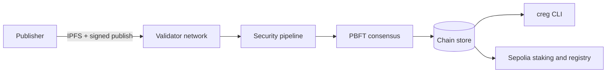

## GitHub

**Canonical repository:** [chain-registry-blockchain-CREG-](https://github.com/samuel-1-avson/chain-registry-blockchain-CREG-) — protocol, testnet, explorer, hub, and ops in one tree. Waitlist SPA: [Creg-waitlist](https://github.com/samuel-1-avson/Creg-waitlist).

---

# Chain Registry (CREG)

A decentralized package registry that replaces single-authority trust (npm, PyPI, Cargo, and similar) with **independent validator consensus**. Packages are content-addressed, analyzed through a multi-stage security pipeline, and finalized by PBFT quorum. Sepolia hosts staking, registry, and governance contracts. This is a **public alpha**, not mainnet, and not operational Byzantine fault tolerance.

**Network:** `creg-phase-c-testnet-2026-09-26-r7` on Sepolia · **Phase:** public alpha · **Live status (observed 2026-11-14):** the public API serves the R7 chain at finalized height 20 with four active validators, all run by the maintainer; no new block since 2026-09-29, L1 validator-set sync degraded, faucet claims paused — see [status](#status-november-2026) and the [2026-11-14 audit](docs/CREG-DEEP-DIVE-AUDIT-2026-11-14.md)

---

## What problem this solves

Supply-chain attacks exploit one compromised maintainer or stolen API token. Chain Registry treats every publish as a **consensus decision**. At scale, analysis is performed by a small mandatory committee (VRF-seeded, stake-weighted, operator-capped) selected at admission time; any validator may contribute voluntarily. Packages reach **verified** status only after quorum of consensus-grade evidence + PBFT block finality. Consumers install against cryptographic verdicts and on-chain committee records, not publisher reputation alone.

---

## How it works

1. **Publish** — A staked publisher signs a package, pins it to IPFS, and submits to the network.
2. **Validate** — Validators run a three-stage pipeline (static → sandbox → deep scan).
3. **Finalize** — A `⌊2n/3⌋+1` PBFT quorum records the verdict on the chain (RocksDB).
4. **Install** — The `creg` CLI reads **verified** status before delegating to npm/pip/cargo shims.
5. **L1** — Sepolia holds staking, registry, and governance. The legacy Groth16 rollup checkpoint is retired; `zk_validation` is off on the public-alpha spec.


```mermaid
flowchart LR
    Publisher[Publisher] -->|IPFS + signed publish| Node[Validator network]
    Node --> Pipeline[Security pipeline]
    Pipeline --> PBFT[PBFT consensus]
    PBFT --> Chain[(Chain store)]
    Chain --> CLI[creg CLI]
    Chain --> L1[Sepolia staking and registry]
```

| Layer | Technology |
|-------|------------|
| Validator runtime | Rust · libp2p · axum |
| Consensus | PBFT · Ed25519 |
| Content addressing | IPFS |
| Smart contracts | Solidity on Sepolia (staking, registry, governance, ZK verifier) |
| CLI | `creg` — publish, install, stake, audit, multisig |
| ZK | Groth16 circuits (Circom) |

---


## Public surfaces

| Surface | URL |
|---------|-----|
| **Waitlist** | https://waitlist.cregnet.dev |
| **Contribution Arena** | https://contribute.cregnet.dev | Separate educational/simulation product; not the protocol |

**Binaries:** [v0.4.8-testnet](https://github.com/samuel-1-avson/chain-registry-blockchain-CREG-/releases/tag/v0.4.8-testnet) provides signed `creg` and `creg-node` archives for Windows amd64, Linux amd64, and macOS amd64. [v0.4.9-testnet](https://github.com/samuel-1-avson/chain-registry-blockchain-CREG-/releases/tag/v0.4.9-testnet) is the corrected R7-aware CLI release ([release status](docs/RELEASE-STATUS-2026-10-01.md)). The public API (`api.testnet.cregnet.dev`) serves the R7 chain (observed 2026-11-14), but every package published so far has been revoked and the network has no independent operators.

Chain parameters (live R7 network): [`chain-registry/testnet/phase-c/r7/chain-spec.json`](chain-registry/testnet/phase-c/r7/chain-spec.json) and its detached signature. The older [`chain-spec.sepolia.json`](chain-registry/testnet/chain-spec.sepolia.json) describes the retired `creg-testnet-1` network and its earlier contract addresses.

---

## On GitHub

This repo is organized like other public blockchains — **protocol and consensus first**, not product web apps or hosting runbooks.

| What to explore | Where |
|-----------------|-------|
| **Repository** | [chain-registry-blockchain-CREG-](https://github.com/samuel-1-avson/chain-registry-blockchain-CREG-) |
| **Whitepaper** | [docs/WHITEPAPER.md](docs/WHITEPAPER.md) |
| **Public documentation** | [docs/README.md](docs/README.md) |
| **ZK circuits** | [circuits/](circuits/) |
| **Release binaries** | [Releases](https://github.com/samuel-1-avson/chain-registry-blockchain-CREG-/releases) |

The alpha waitlist is live at [waitlist.cregnet.dev](https://waitlist.cregnet.dev). Contribution Arena is a **separate** educational/simulation product and is not part of the protocol workstream.

---

## Who this is for

| Audience | Start here |
|----------|------------|
| **Publishers & developers** | [docs/PUBLIC_TESTNET_QUICKSTART.md](docs/PUBLIC_TESTNET_QUICKSTART.md) |
| **Validators & node operators** | [docs/VALIDATOR_ONBOARDING_CHECKLIST.md](docs/VALIDATOR_ONBOARDING_CHECKLIST.md) |
| **Maintainers (what's next)** | [docs/PROTOCOL_PROGRESS.md](docs/PROTOCOL_PROGRESS.md) (current briefing; [WHAT_TO_DO_NEXT.md](docs/archive/WHAT_TO_DO_NEXT.md) archived 2026-09-19) |
| **Auditors & researchers** | [chain-registry/DEEP_DIVE_ANALYSIS.md](chain-registry/DEEP_DIVE_ANALYSIS.md) |
| **Testnet expectations** | [docs/archive/TESTNET_PHASE_SCOPE.md](docs/archive/TESTNET_PHASE_SCOPE.md) (archived 2026-09-19) |

---

## Quick start (developers)

```powershell
# Windows
.\chain-registry\scripts\install-creg.ps1 -Version v0.4.8-testnet
```

```bash
# Linux/macOS
./chain-registry/scripts/install-creg.sh --version v0.4.8-testnet

# Or build from source
cd chain-registry && cargo build --release -p cli
```

```bash
# Public API serves the maintainer-run R7 chain (observed 2026-11-14).
# To run your own node, see chain-registry/testnet/QUICKSTART.md.
export CREG_NODE_URL=https://api.testnet.cregnet.dev
creg doctor
```

---

## Repository layout (blockchain core)

This repository follows the same pattern as other open blockchains: **protocol code and public docs are visible**; web apps, waitlist infrastructure, and cloud deploy runbooks are not promoted from the default README.

| Path | Contents |
|------|----------|
| [`chain-registry/`](chain-registry/) | Rust workspace, contracts, testnet compose, CLI — **[start here](chain-registry/README.md)** |
| [`circuits/`](circuits/) | ZK Groth16 circuits (Circom) |
| [`docs/README.md`](docs/README.md) | Documentation index |

---

## Documentation

| Document | Purpose |
|----------|---------|
| [docs/archive/TESTNET_SCALE_ARCHITECTURE.md](docs/archive/TESTNET_SCALE_ARCHITECTURE.md) | Future scale-topology design (archived 2026-09-19) — not a current deployment claim |
| [docs/CREG-DEEP-DIVE-AUDIT-2026-11-14.md](docs/CREG-DEEP-DIVE-AUDIT-2026-11-14.md) | **Current** — audit, live state, testnet readiness and the recommended implementation route |
| [docs/PROTOCOL_PROGRESS.md](docs/PROTOCOL_PROGRESS.md) | **Maintainers** — protocol briefing as of 2026-09-20 (live-network sections superseded by the 2026-11-14 audit) |
| [docs/README.md](docs/README.md) | Documentation index |
| [docs/README.md](docs/README.md) | Full maintainer doc index |
| [WHITEPAPER.md](docs/WHITEPAPER.md) | Public-alpha technical whitepaper |
| [DEEP_DIVE_ANALYSIS.md](chain-registry/DEEP_DIVE_ANALYSIS.md) | Technical architecture and issue registry |
| [contracts/README.md](chain-registry/contracts/README.md) | Solidity contract status |
| [circuits/README.md](circuits/README.md) | ZK circuit build and verification |
| [CREG-Contribution-Arena/README.md](CREG-Contribution-Arena/README.md) | Separate educational/simulation product — not protocol |

---

## Status (November 2026)

Live values below were read from the public API, explorer and faucet on 2026-11-14. The full assessment is in [docs/CREG-DEEP-DIVE-AUDIT-2026-11-14.md](docs/CREG-DEEP-DIVE-AUDIT-2026-11-14.md).

| Milestone | Status |
|-----------|--------|
| Sepolia contracts | Fresh Phase C deployment — addresses in [`phase-c/r7/chain-spec.json`](chain-registry/testnet/phase-c/r7/chain-spec.json) and [`deployment-manifest.json`](chain-registry/testnet/phase-c/deployment-manifest.json) |
| Validator set | Four voting validators (3-of-4 PBFT) and four non-voting observers on separate hosts, **all operated by the maintainer** (one validator runs on a laptop). Real finality, but not independent Byzantine fault tolerance |
| Real sandbox engine | Done (nsjail on validators, no development bypass) |
| Public API | Serves R7 at finalized h20; last block 2026-09-29; 8 packages published, all revoked; validator-set sync `degraded` because the configured Sepolia RPC returns `pruned history unavailable` for historical logs |
| Faucet | Online, but token claims are paused until its Sepolia transfer ledger reconciles |
| Binary release | [v0.4.8-testnet](https://github.com/samuel-1-avson/chain-registry-blockchain-CREG-/releases/tag/v0.4.8-testnet) (Windows, Linux, and macOS) |
| Public alpha waitlist | Live — [waitlist.cregnet.dev](https://waitlist.cregnet.dev) |
| Contribution Arena | Separate educational/simulation product — [contribute.cregnet.dev](https://contribute.cregnet.dev) (`0.4.0-public-testnet` deployed 2026-09-20) |
| Phase 1 remediation (gossip, batch, relays) | Done — Iteration 6 |
| Genesis | R7 `genesis_time` 2026-09-26; signed network identity `0x1852b9a8…`; block-zero hash `0f2a3b10…` (served by the live API) |
| External security audit | Open — freeze candidate `v0.4.3-testnet` |

This is a **public alpha**, not mainnet. Historical participant expectations: [TESTNET_PHASE_SCOPE.md](docs/archive/TESTNET_PHASE_SCOPE.md) (archived 2026-09-19).

---

## Contributing

Build and test from `chain-registry/`:

```bash
cargo test --workspace
cd contracts && forge test
```

Reference issue IDs from [DEEP_DIVE_ANALYSIS.md](chain-registry/DEEP_DIVE_ANALYSIS.md) in pull requests.

---

## License

MIT — see [LICENSE](LICENSE).
