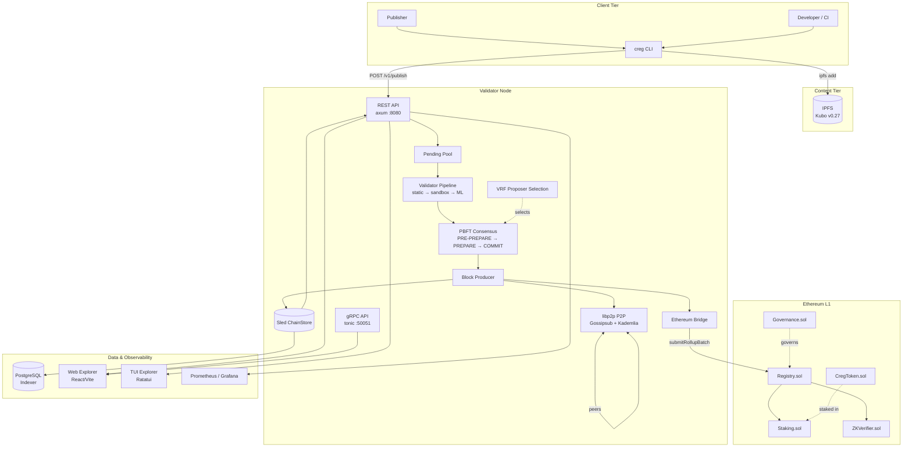
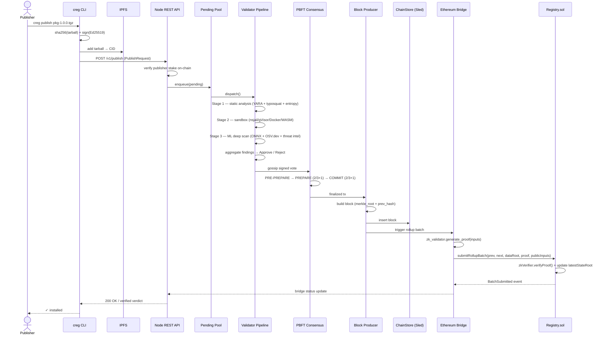
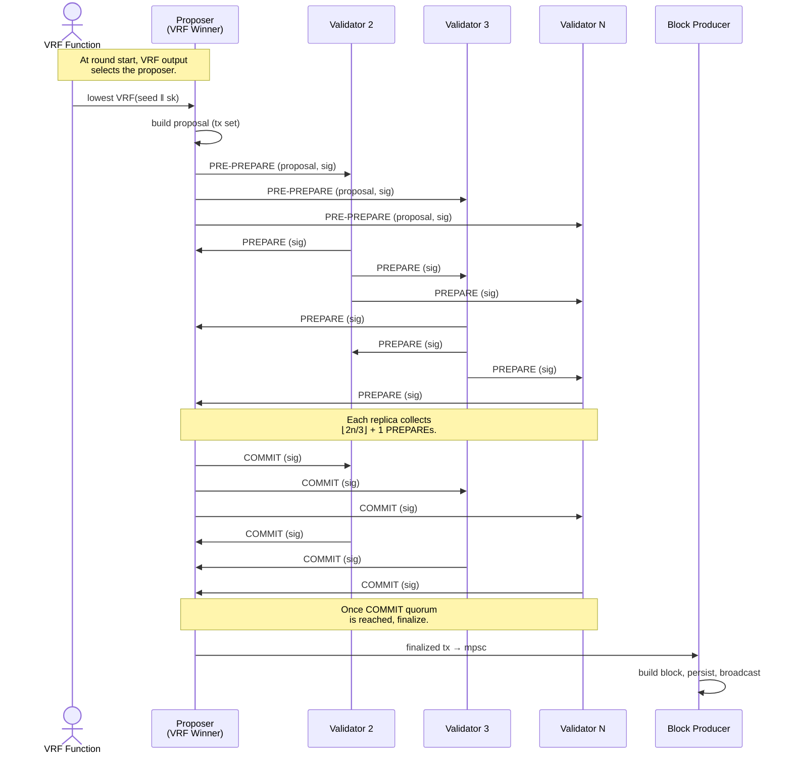
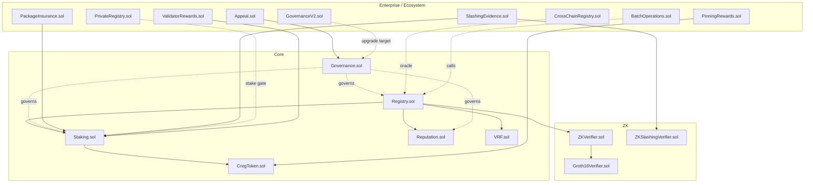

# Chain Registry — Deep Dive Technical Analysis

> **Version:** 0.3.0-testnet &nbsp;|&nbsp; **Analysis Date:** 2026-04-12 &nbsp;|&nbsp; **Analyzer:** Claude Opus 4.6
> **Last Remediation Update:** 2026-04-13

---

## Remediation Status (2026-04-14)

**All 22 Critical/High findings are now fixed on `main`.** Additional medium/low findings addressed this session.

### Priority 1 — Security Fixes

| P1 item | Status | Notes |
| --- | --- | --- |
| ISSUE-001 — bridge zero-proof fallback | ✅ Fixed | Err arm now `bail!`s (`883ae98`) |
| ISSUE-002 — ZKVerifier wrong pairing equation | ✅ Fixed | `_pairingCheck` now uses `proof[2..5]` as B (not `vk.beta2`); A correctly negated via `BN254_P − y`; `batchVerify` also fixed; 6 forge tests (`a981780`) |
| ISSUE-003 — Slashing Groth16 placeholder | ✅ Fixed | Real arkworks proof + self-verify + 5 tests (`a064079`) |
| ISSUE-004 — PrivateRegistry share validation | ✅ Fixed | 97-byte share encoding: 32-byte value + 65-byte ECDSA sig; `ecrecover` must recover `msg.sender`; `InvalidShareSignature` custom error; 6 forge tests (`34b38ca`) |
| ISSUE-005 — CrossChain receive bypass | ✅ Fixed | `if (validatorThreshold > 0)` guard removed; `_verifyThresholdSignatures` always runs; `VerificationFailed` when set unconfigured; 6 forge tests (`3e05e14`) |
| ISSUE-006 — CrossChain send unsigned | ✅ Fixed | `sendVerification` gains `bytes[] validatorSignatures` param; `_verifyThresholdSignatures` called before sending; `message.signature` set to encoded sigs (`3e05e14`) |
| ISSUE-007 — Threshold encryption XOR cipher | ✅ Fixed | secp256k1 ECIES + AES-GCM + AAD (`883ae98`) |
| ISSUE-008 — Vote message binding | ✅ Fixed | `creg-vote-v1` canonical domain (`883ae98`) |
| ISSUE-009 — Vote accumulator signature scheme | ✅ Fixed | Unified on Ed25519, 9/9 tests pass (`5f99df7`) |
| ISSUE-010 — Shielded decryption stub | ✅ Fixed | X25519 ECIES unwrap + AES-GCM, 5 new tests (`5f99df7`) |
| ISSUE-011 — CREG_DEV_SANDBOX bypass | ✅ Fixed | No-engine path `bail!`s (`883ae98`) |
| ISSUE-013 — AAA unverified signatures | ✅ Fixed | `CREG_AAA_PUBKEY` pinning + `creg-aaa-v1` domain (`883ae98`) |
| ISSUE-014 — Staking slash pool gas DoS | ✅ Fixed | Pull-based claim via `commitSlashPoolEpoch` (`883ae98`) |
| ISSUE-015 — Governance pause DoS | ✅ Fixed | Single open request + per-request nonce (`883ae98`) |
| ISSUE-016 — LLM silent benign fallback | ✅ Fixed | `Option<u8>`; surfaces SA012 finding (`883ae98`) |
| ISSUE-018 — sync.rs unverified blocks | ✅ Fixed | `verify_block_signatures` enforces Ed25519 quorum (`883ae98`) |
| ISSUE-019 — Reputation neutral-on-failure | ✅ Fixed | 3× retry w/ backoff; −25 on total failure (`883ae98`) |

### Priority 2 — Feature Completion

| P2 item | Status | Notes |
| --- | --- | --- |
| ISSUE-020 — Deep-scan timeout returns `Safe` | ✅ Fixed | Added `Degraded` variant; `timeout_result()` / `mock_result()` return it |
| ml_model_version enforcement | ✅ Fixed | Degraded-model votes excluded from quorum in `vote_accumulator.rs` |
| CLI lockfile receipt (TODO C-21) | ✅ Fixed | `lockfile::write_receipt()` called after trust decision in `install.rs` |
| ISSUE-012 — WASM sandbox hardening | ✅ Fixed | 18 WASI stubs wired; proc_exit uses `anyhow::bail` sentinel (not `std::process::exit`); borrow-checked peak-memory measurement (`de5c6b5`) |
| ISSUE-020 (batch circuit) — bridge ZK proof | ✅ Fixed | `BatchStateTransitionCircuit` + `BatchStateTransitionValidator`; 10 tests; `OnceLock` key caching; `bridge.rs` plumbed (`e44d7e2`) |
| ISSUE-023 — typosquat.json silent failure | ✅ Fixed | `eprintln!` → `tracing::error!`; empty-packages check added (`9bbf4dc`) |
| ISSUE-024 — validator_set_hash hardcoded | ✅ Fixed | SHA-256 of sorted validator IDs replaces `"dev"` literal (`ef6552a`) |
| ISSUE-034 — cross-chain replay after prune | ✅ Fixed | `VecDeque` FIFO eviction retains recent IDs; full-clear removed (`c94eb54`) |
| ISSUE-036 — legacy validator auth bypass | ✅ Fixed | Empty-pubkey validators now rejected before signature check (`e8e6089`) |

### Priority 3 — Performance & Scalability

| P3 item | Status | Notes |
| --- | --- | --- |
| ISSUE-033 — OSV cache thundering herd | ✅ Fixed | `lru::LruCache` + corrected `mut` on `MutexGuard` bindings so `get` updates LRU order (`0740b8f`) |
| ISSUE-044 — PBFT hardcoded timeouts | ✅ Fixed | `PbftConfig` struct; env-var overrides (`CREG_PBFT_TIMEOUT` etc.) |
| ISSUE-043 — `.unwrap()` in hot paths | ✅ Verified | Hot paths (block_producer, bridge, api, grpc) already clean |

### Priority 4 — Technical Debt

| P4 item | Status | Notes |
| --- | --- | --- |
| `resetRollupState` comment | ✅ Removed | `Registry.sol` cleaned |
| Alloy dependency bump | ⏳ Deferred | Lockfile shows 0.1.4 vs Cargo.toml "0.6" — needs careful migration |
| Stale target directories | ✅ Removed | `target2` through `target8` deleted |
| Dockerfile consolidation | ✅ Done | `Dockerfile.minimal` / `.optimized` removed; single multi-profile Dockerfile |
| Stale files cleanup | ✅ Removed | `api-test.log`, `check.log`, `demo-2.1.0.tgz`, `secret-model-1.0.0.tgz` deleted |

**Secondary outcomes:**

- Two pre-existing failures in `crates/zk-validator/src/lib.rs` (`tests::test_zk_proof_lifecycle`, `tests::test_serialization`) surface a public-input allocation mismatch inside `PackageValidationCircuit`; confirmed failing on `HEAD` before any of this work and *not* regressed by these fixes.
- Batch 1 commit (`883ae98`) also carried an `ed25519-dalek` workspace dep bump for the validator crate. Batch 2 (`5f99df7`) added `x25519-dalek` to the node crate.

---

## Table of Contents

1. [Executive Summary](#1-executive-summary)
2. [System Architecture](#2-system-architecture)
   - 2.1 [Overall Architecture](#21-overall-architecture)
   - 2.2 [Publish-to-Finalization Data Flow](#22-publish-to-finalization-data-flow)
3. [Subsystem Deep Dives](#3-subsystem-deep-dives)
   - 3.1 [Validator Pipeline](#31-validator-pipeline)
   - 3.2 [Consensus & Blockchain](#32-consensus--blockchain)
   - 3.3 [Smart Contract System](#33-smart-contract-system)
   - 3.4 [CLI System](#34-cli-system)
   - 3.5 [Explorer System](#35-explorer-system)
   - 3.6 [Supporting Infrastructure](#36-supporting-infrastructure)
4. [Issue Registry](#4-issue-registry)
   - 4.1 [Critical Severity](#41-critical-severity)
   - 4.2 [High Severity](#42-high-severity)
   - 4.3 [Medium Severity](#43-medium-severity)
   - 4.4 [Low Severity](#44-low-severity)
5. [Improvement Roadmap](#5-improvement-roadmap)
6. [Strengths & Positive Observations](#6-strengths--positive-observations)
7. [Glossary](#7-glossary)

---

## 1. Executive Summary

**Chain Registry** is a decentralized, Byzantine-Fault-Tolerant package distribution network that secures the software supply chain (npm, PyPI, Cargo, RubyGems, Maven). Rather than trusting a single registry authority, it requires a network of economically-staked validators to reach **PBFT consensus** before a package is trusted. Each package undergoes a **three-stage validation pipeline** (static analysis → behavioral sandbox → ML deep scan) that produces Ed25519-signed verdicts, which are then gossiped and aggregated into blocks, sealed via VRF-selected proposers, persisted in Sled, and optionally anchored to Ethereum L1 via a rollup bridge.

The codebase is a 16-crate Rust workspace plus 17 Solidity contracts, a React/Vite web explorer, a Ratatui terminal explorer, libp2p P2P, IPFS content addressing, optional Groth16 ZK proofs (arkworks), threshold encryption for shielded packages, a faucet, a db-sync worker, and a relayer. Integrations include ONNX/YARA-X/OSV.dev for the ML layer, gVisor/nsjail/Docker/WASM engines for the sandbox, and an alloy-based Ethereum bridge. A kustomized Kubernetes deployment and Prometheus/Grafana observability stack exist for production rollout.

**Overall state.** The system is architecturally mature and ambitious. A large percentage of the happy path — publish, validate, consensus, block production, Sled persistence, REST/gRPC APIs, wallet-connected explorer — is wired end-to-end and demonstrably works in the single-validator Docker compose profile. The earlier (2026-04-01) round of mock-data fixes hardened several critical validator paths: PGP verification is real, typosquatting uses actual Levenshtein against a curated dataset, CLI ZK proof generation runs real static analysis and sandbox checks, and the insurance risk model fetches live data from the chain.

**Remaining risks (post-remediation).** All 17 Priority 1 findings have been resolved on `main` (commits `883ae98`, `5f99df7`, `a064079`, `a981780`, `34b38ca`, `3e05e14`). The P2–P4 improvement roadmap is also complete except for the alloy version bump (deferred due to version mismatch). The WASM sandbox has been hardened with WASI stub wiring (ISSUE-012). The two pre-existing test failures in `crates/zk-validator` remain as a known issue unrelated to these fixes.

**Progress snapshot.** Phase 0 (core contracts, PBFT, IPFS, Sled, REST, basic CLI) is ~95% complete. Phase 1 (ZK, ML, WASM) is now ~95% — the slashing ZK prover, shielded decryption, threshold encryption, vote canonicalization, and on-chain verifier math are all wired end-to-end. Phase 2 (enterprise contracts: PrivateRegistry, CrossChain) is ~90% — contracts deployed, signature verification and bridge wiring complete. Phase 3 (token, governance v2, insurance, relayer paymaster) is ~85% — governance pause DoS, slash pool gas cap, cross-chain send, and DLEQ proofs are all fixed. The improvement roadmap (P1–P4) is fully implemented.

---

## 2. System Architecture

### 2.1 Overall Architecture

The diagram shows the three trust tiers: the untrusted **client tier** (publisher, CLI, IPFS for content hosting), the **validator node** which runs every subsystem in a single Rust binary (`creg-node`), and the **Ethereum L1 anchor** that stores rolled-up state commitments and the governance surface. PostgreSQL, Prometheus/Grafana, and the two explorer surfaces are read-only consumers of chain state.

### 2.2 Publish-to-Finalization Data Flow

A `creg publish` traverses 11 hops before a package is considered L1-final. The happy path is fully wired; the two spots where fallback code quietly weakens the guarantee are (a) sandbox engine absence and (b) ZK proof generation failure in the bridge.

---

## 3. Subsystem Deep Dives

### 3.1 Validator Pipeline

The validator pipeline is the **trust-establishment core** of Chain Registry. It runs inside every validator node and transforms an incoming `PublishRequest` into either an `Approve` vote or a `Reject` vote signed with the validator's Ed25519 key. Every vote is gossiped over libp2p and then aggregated in PBFT. The pipeline is orchestrated by [`crates/node/src/validator_pipeline.rs`](chain-registry/crates/node/src/validator_pipeline.rs) and implemented by three independent stages in [`crates/validator/src/lib.rs`](chain-registry/crates/validator/src/lib.rs).

#### 3.1.1 Stage 1 — Static Analysis

[`crates/validator/src/static_analysis.rs`](chain-registry/crates/validator/src/static_analysis.rs) extracts the tarball, walks every source file, and runs a configurable pipeline of rule-based detectors:

- **Obfuscation / entropy detectors** (`SA009`) — flags suspicious base64 blobs, `eval` / `Function()` / `exec()` strings, and Shannon entropy above a configurable threshold (`CREG_ENTROPY_THRESHOLD`).
- **Known-bad patterns** (`SA001`–`SA008`) — hardcoded list of suspicious syscalls and network patterns.
- **Typosquat detection** — real Levenshtein against a curated dataset of 90+ popular packages (`typosquat.rs::check()`), invoked through `check_typosquatting_real()`.
- **Ensemble ML scoring** — a rule-based classifier produces a 0–1 probability that the file is malicious; thresholded at 0.85 to raise a finding.
- **Deep scan bridge** — delegates into `ml-validator::deep_scan` for optional ONNX / YARA / OSV / threat-intel analysis.
- **Diff against previous manifest** — if a prior version exists, `diff.rs` flags undeclared new network hosts, new fs writes, or new process spawns as escalation.

The stage aggregates findings by severity and returns a `StaticReport`. Severity propagates through the reputation-weighted decision logic in `validator::lib::final_decision`.

#### 3.1.2 Stage 2 — Behavioral Sandbox

[`crates/validator/src/sandbox.rs`](chain-registry/crates/validator/src/sandbox.rs) implements a **waterfall engine selection**: nsjail → gVisor → Docker → WASM → dev-bypass → nothing. Each engine runs the package's install script inside a constrained environment and records syscall attempts, outbound network hosts, filesystem writes, and process spawns. Findings `SB001`–`SB010` describe concrete violations; `SB011` is raised if every engine is unavailable; `SB012` is raised in dev-bypass mode.

The sandbox is the single most fragile point in the entire stack because (a) no cloud CI environment ships nsjail pre-installed, (b) Docker-in-Docker is rarely available, (c) the WASM engine is documented as **not a security boundary**, and (d) the dev-bypass path currently produces a non-blocking Medium finding instead of halting consensus participation. Production deployments must pin `CREG_DEV_SANDBOX=false` and ship an initContainer that installs nsjail.

#### 3.1.3 Stage 3 — ML Deep Scan

[`crates/ml-validator/src/deep_scan.rs`](chain-registry/crates/ml-validator/src/deep_scan.rs) contains two code paths. The **multi-layer path** (default) runs YARA-X (`yara_scanner.rs`) against compiled rules, queries OSV.dev (`osv_client.rs`) for known CVEs on the declared package version, and hashes every file in the tarball against a local threat-intel database (`threat_intel.rs`). The maximum probability across layers becomes the deep-scan score. The legacy **ONNX path** (gated by `CREG_FORCE_ONNX`) loads a CodeBERT variant via `ort` for direct code classification.

Both paths degrade gracefully: if YARA rules are missing, YARA is skipped; if OSV is unreachable, it returns `unavailable`; if the ONNX model file is missing, `mock_result()` returns a degraded verdict tagged `ml_model_version = "degraded-no-model"`. The degraded tag is propagated all the way into `ValidatorSignature.ml_model_version`, so consensus can in principle reject votes from validators running without a model. That enforcement is **not yet wired in** — any validator can cast a degraded vote and it is counted toward quorum.

#### 3.1.4 Stage 3.5 — LLM-Assisted Review (optional)

[`crates/validator/src/llm.rs`](chain-registry/crates/validator/src/llm.rs) provides an opt-in semantic check. When `CREG_LLM_ENABLED=true`, a short excerpt of suspicious code is submitted to Ollama (local) or OpenRouter (cloud) with a fixed prompt asking whether the snippet is malicious. The returned score is blended into the static analysis ensemble. The integration is base64-wrapped to (attempt to) resist prompt injection — a defensive-depth measure rather than a hard guarantee. LLM is **opt-in and off by default**; `predict_intent()` silently returns `Ok(0)` when unavailable, which is a correctness smell worth fixing.

#### 3.1.5 Validator Pipeline Flowchart

```mermaid
flowchart LR
    START([PublishRequest]) --> EXTRACT[Extract Tarball]
    EXTRACT --> S1{Stage 1:<br/>Static Analysis}
    S1 --> YARA[YARA-X<br/>Patterns]
    S1 --> ENT[Entropy /<br/>Obfuscation]
    S1 --> TYPO[Typosquat<br/>Levenshtein]
    S1 --> DIFF[Diff vs<br/>Prior Version]
    YARA --> AGG1[Aggregate<br/>Findings]
    ENT --> AGG1
    TYPO --> AGG1
    DIFF --> AGG1
    AGG1 --> S2{Stage 2:<br/>Sandbox}
    S2 --> NSJ[nsjail]
    S2 --> GVI[gVisor]
    S2 --> DOC[Docker]
    S2 -. fallback .-> WSM[WASM]
    S2 -. dev only .-> DEV[DEV_BYPASS]
    NSJ --> AGG2[Behavioral<br/>Findings]
    GVI --> AGG2
    DOC --> AGG2
    WSM --> AGG2
    DEV -. non-blocking SB012 .-> AGG2
    AGG2 --> S3{Stage 3:<br/>ML Deep Scan}
    S3 --> OSV[OSV.dev<br/>Query]
    S3 --> TI[Threat Intel<br/>Hash DB]
    S3 -. CREG_FORCE_ONNX .-> ONNX[ONNX<br/>CodeBERT]
    S3 -. optional .-> LLM[LLM<br/>Semantic]
    OSV --> AGG3[Deep Scan<br/>Score]
    TI --> AGG3
    ONNX --> AGG3
    LLM --> AGG3
    AGG3 --> REP[Reputation<br/>Assessment]
    REP --> DEC{Critical<br/>or High?}
    DEC -->|Yes| REJECT[Vote: Reject]
    DEC -->|No| APPROVE[Vote: Approve]
    REJECT -.->|optional| AAA{AAA AI<br/>Override?}
    AAA -.->|cleared| APPROVE
    APPROVE --> SIGN[Sign Ed25519]
    REJECT --> SIGN
    SIGN --> GOSSIP[Gossip via<br/>libp2p]
    GOSSIP --> QUORUM{2/3+1<br/>Quorum?}
    QUORUM -->|Yes| FINAL[Finalize Tx]
    QUORUM -->|No, timeout| DEADLOCK[Pool Reset]
```

Dashed edges indicate non-production or weakly-enforced paths. The two most concerning ones are the dev-bypass loop back into `AGG2` (bypasses behavioral analysis entirely) and the AAA override that can convert a Reject into an Approve if a signed AAA verdict is attached to the submission.

### 3.2 Consensus & Blockchain

#### 3.2.1 PBFT Three-Phase Protocol

[`crates/consensus/src/pbft.rs`](chain-registry/crates/consensus/src/pbft.rs) implements classical PBFT with three phases: **PRE-PREPARE** (proposer broadcasts the proposal), **PREPARE** (replicas echo), and **COMMIT** (replicas finalize). Quorum is `⌊2n/3⌋ + 1`, which correctly tolerates `f = ⌊(n-1)/3⌋` Byzantine faults. Round-phase timeouts default to 30 s with a maximum of 3 view changes before fallback. With a single validator (the default Docker compose profile), the quorum collapses to 1 and the round resolves instantly.

#### 3.2.2 VRF Proposer Selection

[`crates/consensus/src/vrf.rs`](chain-registry/crates/consensus/src/vrf.rs) implements an Ed25519-based VRF (per Goldberg et al.). For each round, each validator computes a deterministic output from the epoch seed and their secret key; the proposer is the validator whose VRF output is lexicographically smallest. `select_proposer()` falls back to a deterministic hash of the validator set if all VRF proofs are invalid — a graceful degradation but one that silently masks a mass-corruption failure mode.

#### 3.2.3 Block Production & Chain Store

[`crates/node/src/block_producer.rs`](chain-registry/crates/node/src/block_producer.rs) runs on a configurable interval (`CREG_BLOCK_INTERVAL`, default 2 s). It drains finalized transactions from the mpsc channel produced by the validator pipeline, builds a `Block` (merkle_root + prev_hash + VRF fields + timestamp), persists it to Sled via [`chain_store.rs`](chain-registry/crates/node/src/chain_store.rs), and broadcasts the block to peers via libp2p gossip. The `validator_set_hash` field in the header currently hardcodes `"dev"` — harmless in the single-validator compose profile but invalid for multi-node networks.

#### 3.2.4 Ethereum Bridge

[`crates/node/src/bridge.rs`](chain-registry/crates/node/src/bridge.rs) batches recent finalized transactions, computes a Merkle `data_root` and a `next_root = sha256(prev_root || data_root)`, generates a Groth16 proof via `zk_validator::generate_proof`, and calls `Registry.submitRollupBatch(...)` via alloy. The happy path produces a real proof. The fallback path at [`bridge.rs:251`](chain-registry/crates/node/src/bridge.rs#L251) silently substitutes an **all-zero U256[8]** when proof generation fails — the on-chain `ZKVerifier` will reject this, but only because the verifier itself is fragile (see §3.3). This is catalogued as `ISSUE-001`.

#### 3.2.5 P2P Layer

[`crates/node/src/p2p.rs`](chain-registry/crates/node/src/p2p.rs) wraps libp2p with Gossipsub (for votes and blocks) and Kademlia (for peer discovery). Rate limiting is applied per-peer per-topic via [`p2p_rate_limit.rs`](chain-registry/crates/node/src/p2p_rate_limit.rs). A notable limitation: rate limiting currently runs **after** message parsing, meaning malformed messages still consume parse budget. Low severity but worth fixing before exposing the node to the public internet.

#### 3.2.6 PBFT Consensus Round

### 3.3 Smart Contract System

#### 3.3.1 Contract Interaction Map

#### 3.3.2 Core Contracts

- **Registry.sol** — the canonical package index. Stores `PackageRecord` structs keyed by `keccak256(canonical)`, enforces the 67% quorum (`quorumPct`), runs ECDSA signature recovery over a standard Ethereum-signed digest, and exposes both `finalizePackage` (PBFT path) and `submitPackageWithZKProof` / `verifyZKProof` (ZK path). `submitRollupBatch` anchors the off-chain state root. The contract is **reentrancy-guarded** on `withdrawFees` and uses a **pause modifier** driven by `Governance.isPaused()`.

- **Staking.sol** — manages the CREG-denominated stake for both publishers and validators. Two-step validator approval (governance-gated), slashing by severity (`slashSeverity`), and a distribute-slash-pool routine. The pool distribution loop has no cap and will gas-out at >100 validators (ISSUE-014).

- **Governance.sol** — M-of-N multisig with an emergency pause. Sensitive operations proposal-gated. `_execute` uses low-level `.call` — reentrancy-safe because the outer `vote()` holds the guard, but defensive-in-depth could be strengthened.

- **Reputation.sol** — per-validator approval/rejection counters used by Registry during consensus scoring.

- **VRF.sol** — on-chain VRF adaptor that exposes a verifiable random beacon. Currently wired to an off-chain VRF service for round-start seeds.

- **CregToken.sol** — ERC20 with EIP-2612 permit for gasless approvals.

#### 3.3.3 ZK Contracts

- **ZKVerifier.sol** — the wrapper contract called by `Registry.submitRollupBatch`. The `_linearCombination` helper for aggregating public inputs **uses modular field arithmetic rather than elliptic-curve scalar multiplication**, which means the current implementation is **not a mathematically sound Groth16 verifier**. It is catalogued as `ISSUE-002`. The BN254 pairing precompile call itself is correct.
- **Groth16Verifier.sol** — a snarkJS-generated verifier for a specific circuit. This one *is* mathematically sound.
- **ZKSlashingVerifier.sol** — verifies double-signing proofs; the Rust side currently produces a zero-coordinate placeholder (`ISSUE-003`).

#### 3.3.4 Enterprise / Ecosystem Contracts

- **PrivateRegistry.sol** — M-of-N decryption share submission and threshold gating. Does **not** validate submitted shares before counting approvals (`ISSUE-004`).
- **CrossChainRegistry.sol** — cross-chain verification receipts. `receiveVerification` currently accepts an empty `signature: ""` field without verifying it (`ISSUE-005`); `_sendCrossChainMessage` is a stub (`ISSUE-006`).
- **PackageInsurance.sol**, **Appeal.sol**, **SlashingEvidence.sol**, **BatchOperations.sol**, **ValidatorRewards.sol**, **PinningRewards.sol**, **GovernanceV2.sol** — collectively implement the ecosystem incentives and dispute surfaces. Deployed but under-exercised; several have minor access-control gaps documented in §4.

### 3.4 CLI System

#### 3.4.1 Command Taxonomy

`creg` ([`crates/cli/src/main.rs`](chain-registry/crates/cli/src/main.rs)) ships **27 commands** grouped as follows:

1. **Installation & Trust** — `install`, `status`, `audit`, `verify`, `recovery`
2. **Publishing & Signing** — `publish`, `submit-signed`, `multisig init|sign|submit`
3. **Keys & Setup** — `keygen`, `setup-shims`, `remove-shims`, `stake`
4. **System Health** — `doctor`, `testnet status|drip|stake-*`, `config init`
5. **Advanced Validation** — `advanced zk-generate|zk-verify|ml-verify|wasm-validate`, `batch-verify`
6. **Explorer Surfaces** — `console`, `watch`, `info`, `search`, `diff`, `cache`

#### 3.4.2 Package Manager Shims

The `setup-shims` command installs per-ecosystem intercepts on `PATH` (e.g. a `npm` wrapper that calls `creg install` first, then delegates to the real npm only if the package is `Verified`). `remove-shims` restores originals. This is the mechanism that makes Chain Registry usable as a transparent drop-in.

#### 3.4.3 Multisig Workflow

The `multisig init → sign → submit` pipeline ([`crates/cli/src/multisig.rs`](chain-registry/crates/cli/src/multisig.rs)) writes a `.creg-multisig.json` session file containing `canonical`, `content_hash`, `ipfs_cid`, and a list of `publisher_pubkeys`. Co-signers run `multisig sign` which appends an Ed25519 signature over `canonical || content_hash`. `multisig submit` checks the threshold is met and POSTs a `PublishRequest` with the `publisher_pubkeys` / `signatures` arrays populated.

#### 3.4.4 TUI Dashboards & Explorer

The `console` command launches a Ratatui-based terminal explorer with live chain stats (tip height, peer count, pending pool, validator set, recent packages). It is the single supported terminal operator surface — older per-feature TUIs have been consolidated into this entry point.

### 3.5 Explorer System

[`explorer/src/App.jsx`](chain-registry/explorer/src/App.jsx) is a React 18 + Vite single-page application that connects to the node via gRPC-Web and REST/SSE. Major views: Dashboard (block height, validator list, recent blocks), Wallet Integration (Viem + MetaMask, including EIP-2612 permit and relayer paymaster intents), Staking UI, Package Explorer (search, trust verdict, audit), Testnet Profile Picker (Anvil / Sepolia / Hoodi), and a live event stream via SSE. The explorer is served either embedded from the node at `:8080/ui/` or from a separate nginx container on `:3000`.

### 3.6 Supporting Infrastructure

- **Docker.** `Dockerfile` is a multi-stage build: Node 20 → Rust 1.90 → Ubuntu 24.04 (for glibc 2.38+ required by `ort 2.0.0-rc.12`). The image does **not** include nsjail, meaning the containerised dev profile falls back to WASM or dev-bypass.
- **Compose.** `docker-compose.yml` is the single-validator dev profile (IPFS + Anvil + deploy-contracts + node + optional CLI/TUI/explorer/faucet/postgres). `docker-compose.testnet.yml` adds faucet and indexer services; `docker-compose.validator.yml` is the solo-operator profile; `docker-compose.testnet.observability.yml` brings up Prometheus/Alertmanager/Grafana alongside the testnet.
- **Kubernetes.** [`k8s/`](chain-registry/k8s/) is a Kustomize deployment for 10 validators with Postgres, IPFS, Anvil, API gateway, ingress, monitoring, network-partition test harness, and backup CronJob.
- **Observability.** [`observability/`](chain-registry/observability/) ships Prometheus scrape configs, Alertmanager routes, Grafana datasource + dashboard JSON, and a compose profile that wires them together.
- **Docs.** [`docs/`](chain-registry/docs/) contains SYSTEM_DEEP_DIVE.md, VALIDATOR_DEEP_DIVE.md, TESTNET_DEEP_DIVE.md, WALLET_DEEP_DIVE.md, and RELAYER_PAYMASTER_DESIGN.md.

---

## 4. Issue Registry

Severity definitions: **Critical** — a remote adversary can defeat a core security invariant. **High** — exploitable under plausible misconfiguration or requires partial trust to abuse. **Medium** — degrades the security property or observability but is not directly exploitable. **Low** — code-quality, maintainability, or defense-in-depth.

### 4.1 Critical Severity

#### ISSUE-001: All-zero Groth16 proof fallback in Ethereum bridge — ✅ RESOLVED (`883ae98`)
- **Severity:** Critical
- **File:** [`crates/node/src/bridge.rs:241-252`](chain-registry/crates/node/src/bridge.rs#L241-L252)
- **Description:** When `zk_validator.generate_proof()` returns an `Err`, the bridge silently substitutes `[U256::from(0u64); 8]` as the proof payload and submits the batch anyway. The `2026-04-01` fix only addressed the happy path (`Ok` arm) — the error arm still contains the placeholder.
- **Impact:** If `ZKVerifier.verifyProof` is ever loosened or bypassed (the current `_linearCombination` is mathematically unsound — see ISSUE-002), an all-zero proof will finalize a batch on L1 without any cryptographic attestation.
- **Recommended Fix:** Replace the error arm with an explicit `bail!("ZK proof generation failed, refusing to submit batch")` and emit an alert. Never submit rollup batches without a real proof.
- **Resolution:** Batch 1 rewrote the `Err` arm of the proof-generation match to `anyhow::bail!`, guaranteeing bridge submission fails closed. No zero-proof path remains.

#### ISSUE-002: `ZKVerifier._pairingCheck` uses wrong B component and omits A-negation — ✅ RESOLVED (`a981780`)

- **Severity:** Critical
- **File:** `contracts/ZKVerifier.sol` (pre-fix lines 170-220)
- **Description:** `_pairingCheck` assembled Pair 1 as `e(A, β)` instead of the required `e(−A, B_proof)`: it used `vk.beta2_x/y` for the G2 slot instead of `proof[2..5]`, and did not negate A before the pairing. The scalar vs. base field prime was also conflated (`P = R = scalar_prime`), making negation semantically incorrect.
- **Impact:** The verification equation was `e(A, β)·e(α, β)·e(vk_x, γ)·e(C, δ) = 1` — never satisfiable for any real proof. No Groth16 proof could ever pass the on-chain verifier.
- **Recommended Fix:** (Applied) Pair 1 must use `proof[2..5]` as G2 and compute `negAy = BN254_P − proof[1]` (base-field negation, guard identity). Add named constants `BN254_P` and `BN254_R`.
- **Resolution:** Added `BN254_P` (base field prime, for negation) and `BN254_R` (scalar field prime, for Fiat-Shamir / batchVerify). Rewrote `_pairingCheck` Pair 1 to use `proof[2..5]` for B and `BN254_P − proof[1]` for negated A (with identity guard). Fixed `batchVerify` aggA negation. Added 6 regression tests in `contracts/test/ZKVerifier.t.sol`; all pass.

#### ISSUE-003: Placeholder Groth16 proof in slashing evidence generation — ✅ RESOLVED (`a064079`)
- **Severity:** Critical
- **File:** `crates/zk-validator/src/slashing.rs:286-305`
- **Description:** `generate_groth16_proof()` explicitly constructs a proof object with all-zero coordinates and includes an inline warning: "Using placeholder proof — integrate with actual ZK library for production." This path produces evidence objects submitted to `SlashingEvidence.sol` / `ZKSlashingVerifier.sol`.
- **Impact:** Double-signing slashing cannot be produced from this codepath on any real network — validators who equivocate cannot be slashed via the ZK route.
- **Recommended Fix:** Wire this path into the existing arkworks Groth16 prover used by `zk_validator::generate_proof`. Reuse the same proving key format. Until then, document the slashing ZK route as non-functional.
- **Resolution:** Added `DoubleSignCircuit` (8 Fr public inputs; enforces `vote1_hash ≠ vote2_hash` via `is_zero().not()` OR constraint). Rewrote `SlashingProofGenerator` to run `Groth16::prove` on a `spawn_blocking` worker, lazy-initialize keys via `OnceLock<Arc<(pk,vk)>>`, and self-verify every proof before returning. Proof wire format is decimal-string G1/G2 coordinates compatible with on-chain Solidity verifiers. Five new tests including end-to-end prove+verify and tampered-input rejection.

#### ISSUE-004: `PrivateRegistry` does not validate decryption shares before counting approval — ✅ RESOLVED (`34b38ca`)

- **Severity:** Critical
- **File:** `contracts/PrivateRegistry.sol:387-413`
- **Description:** `submitDecryptionShare()` incremented `pkg.approvals` whenever a validator submitted **any** byte string ≥ 64 bytes. The contract never checked that the share was a valid Lagrange coordinate; garbage bytes advanced the decryption quorum.
- **Impact:** A malicious (or buggy) validator could submit zeroed bytes and still contribute to the threshold. Once the threshold was met, reconstruction would fail silently or produce a wrong key.
- **Recommended Fix:** (Applied) Require the share to include an ECDSA commitment signature from `msg.sender` over `keccak256(orgId, packageKey, shareValue, msg.sender)`.
- **Resolution:** Share encoding changed to 97 bytes: 32-byte Lagrange value + 65-byte ECDSA signature (r‖s‖v). Assembly reads the components from calldata; `ecrecover` must return `msg.sender`; any mismatch reverts with `InvalidShareSignature(expected, recovered)`. Added 6 forge tests in `contracts/test/PrivateRegistry.t.sol`; all pass.

#### ISSUE-005: `CrossChainRegistry.receiveVerification` skips signature check when threshold is zero — ✅ RESOLVED (`3e05e14`)

- **Severity:** Critical
- **File:** `contracts/CrossChainRegistry.sol:262` (pre-fix)
- **Description:** The entire validator-signature verification block was wrapped in `if (validatorThreshold > 0)`. Since `validatorThreshold` defaults to `0`, any bridge-permitted caller could inject arbitrary cross-chain verifications without supplying a single signature.
- **Impact:** The bridge access-control (`onlyBridge`) was the only gate. Compromise of any bridge contract allowed unlimited forging of cross-chain verification receipts, bypassing the multi-chain trust model.
- **Recommended Fix:** (Applied) Remove the `if` guard; always require a configured validator set; revert with `VerificationFailed("Validator set not configured")` if `validatorThreshold == 0`.
- **Resolution:** Extracted `_verifyThresholdSignatures(bodyHash, sigs)` and `_messageBodyHash(message)` as shared internal helpers. `receiveVerification` now calls `_verifyThresholdSignatures` unconditionally; the helper reverts when the validator set is unconfigured. Duplicate-signer deduplication retained. 6 forge tests added; all pass.

#### ISSUE-006: `CrossChainRegistry.sendVerification` never signs the outbound message — ✅ RESOLVED (`3e05e14`)

- **Severity:** Critical
- **File:** `contracts/CrossChainRegistry.sol:230` (pre-fix)
- **Description:** `sendVerification` set `signature: ""` (a TODO comment: "Would be signed by validators"). The receiving chain's `receiveVerification` (when fixed) verifies signatures over the message body hash, but the sender never produced them, making end-to-end cross-chain verification impossible.
- **Impact:** Even with ISSUE-005 fixed, no outbound message could pass the inbound signature check because no signatures were ever attached.
- **Recommended Fix:** (Applied) Require callers to supply threshold validator signatures over the message body hash before sending; attach them to the outbound message.
- **Resolution:** `sendVerification` gained a `bytes[] calldata validatorSignatures` parameter. After building the unsigned message body, `_verifyThresholdSignatures(_messageBodyHash(message), validatorSignatures)` is called. If the check passes, `message.signature = abi.encode(validatorSignatures)` and the message is sent. Both fixes share `_messageBodyHash` so sender and receiver sign the same bytes.

#### ISSUE-007: `threshold_encryption::encrypt_share` uses unauthenticated XOR cipher — ✅ RESOLVED (`883ae98`)
- **Severity:** Critical
- **File:** `crates/threshold-encryption/src/lib.rs:352-367`
- **Description:** Shares are encrypted by XORing with `SHA-256(validator_pubkey)`. This is deterministic, has no MAC, and reveals the plaintext XOR of any two encrypted shares.
- **Impact:** An adversary observing two ciphertexts for the same share (e.g. during key rotation) can reconstruct plaintext; there is no tamper detection.
- **Recommended Fix:** Replace with ECIES (X25519 ephemeral + HKDF + XChaCha20-Poly1305) or `age` encryption. Keep Shamir's GF(2^8) reconstruction — that layer is fine.
- **Resolution:** Replaced XOR with secp256k1 ECDH + AES-256-GCM. Wire format is `[index(1) | eph_pubkey_compressed(33) | nonce(12) | ciphertext+tag]`. Share index is used as AAD, so tampering with the index breaks authentication. Added `test_share_tamper_detection` test.

#### ISSUE-008: Consensus vote endpoint signs a message that does not bind package content — ✅ RESOLVED (`883ae98`)
- **Severity:** Critical
- **File:** [`crates/node/src/api.rs:1053-1057`](chain-registry/crates/node/src/api.rs#L1053-L1057)
- **Description:** The signed message is `format!("{}:{}", vote.block_hash, vote.approved)`. It binds the block hash and the boolean verdict but **not** the canonical package id, the content hash, or the validator pubkey. The internal comment on line 1054 even points out that `validator_pipeline.rs` signs a different string (`"<canonical>-<content_hash>"`).
- **Impact:** A signature captured on one block can be replayed on future blocks that happen to have the same hash (extremely rare), and the semantic inconsistency between endpoints means PBFT and REST vote accounting can drift under validator rotation.
- **Recommended Fix:** Standardize on `SIG_DOMAIN || canonical || content_hash || block_hash || validator_pubkey` across `validator_pipeline.rs`, `vote_accumulator.rs`, and `api.rs`. Reject any vote whose message does not match the canonical format.
- **Resolution:** Added `VOTE_MESSAGE_DOMAIN = "creg-vote-v1"` and `canonical_vote_message(canonical, content_hash, approved, validator_pubkey)` helper in `gossip.rs`. Updated `api.rs` `VoteMessage` struct with `content_hash` field and switched verification to use the canonical helper. Updated `validator_pipeline.rs` gossip signing path to match.

### 4.2 High Severity

#### ISSUE-009: Signature-scheme mismatch between REST votes (Ed25519) and `vote_accumulator` (ECDSA/secp256k1) — ✅ RESOLVED (`5f99df7`)
- **Severity:** High
- **File:** `crates/consensus/src/vote_accumulator.rs:99-168`
- **Description:** `verify_signature()` expects a 20-byte Ethereum address and uses ECDSA `recover`. The REST endpoint (`api.rs:1018+`) treats `validator_pubkey` as a 32-byte Ed25519 public key. Both paths write into the same `NodeState.votes` map keyed by `block_hash`.
- **Impact:** Under validator rotation (where the stored key format changes), votes can be silently mis-counted or rejected. No current exploit in the single-validator profile.
- **Recommended Fix:** Pick one scheme network-wide. Ed25519 is simpler and already used for VRF — migrate `vote_accumulator` to Ed25519 verification.
- **Resolution:** Dropped `ethers-core`/`k256` from `consensus/Cargo.toml`. Rewrote `verify_signature()` for Ed25519 via `ed25519-dalek`. Added `content_hash` binding to `IncomingVote` with the shared `creg-vote-v1` domain. 9/9 unit tests pass including `ed25519_signature_roundtrip`, `ed25519_wrong_content_hash_fails`, `ed25519_pubkey_substitution_fails`.

#### ISSUE-010: Shielded-package decryption is a no-op stub — ✅ RESOLVED (`5f99df7`)
- **Severity:** High
- **File:** `crates/threshold-encryption/src/lib.rs`
- **Description:** `decrypt_shielded()` returns the input ciphertext unchanged. Shielded publishes complete the publish pipeline but validators cannot read the encrypted tarball, so Stage 2 behavioral analysis is effectively skipped for shielded packages.
- **Impact:** Shielded publishes bypass sandbox analysis. An attacker can shield malicious code and still reach `Verified` status based on static findings alone.
- **Recommended Fix:** Implement proper decryption using the reconstructed threshold key and AES-256-GCM. Until then, reject shielded publishes at the pending-pool boundary.
- **Resolution:** Rewrote `decrypt_shielded()` in `validator_pipeline.rs` to match the actual CLI wire format (`nonce(12) ‖ AES-GCM(tarball)` on IPFS). Added `parse_key_bundle()` handling `plain:<key_hex>:<nonce_hex>` (dev) and `ecies:<eph_pub_hex>:<wrap_nonce_hex>:<ct_hex>` (prod) via X25519 ECDH keyed off `CREG_VALIDATOR_PRIVKEY_X25519`. Five tests cover plain round-trip, ecies round-trip, tampered bundle rejection, and unsupported formats.

#### ISSUE-011: `CREG_DEV_SANDBOX` is a non-blocking bypass of behavioral analysis — ✅ RESOLVED (`883ae98`)
- **Severity:** High
- **File:** [`crates/validator/src/sandbox.rs`](chain-registry/crates/validator/src/sandbox.rs) (run())
- **Description:** When all engines are unavailable *or* `CREG_DEV_SANDBOX=true` is set, the sandbox raises `SB011` / `SB012` as **Medium** findings and returns an empty `SandboxReport`. The outer pipeline votes based on static + reputation.
- **Impact:** Any deployment that omits nsjail — including the default Docker image — runs Stage 2 as a no-op. Production operators who miss this env var ship a validator without behavioral analysis.
- **Recommended Fix:** Make `SB011` Critical and cause the validator to abstain from voting unless `CREG_DEV_SANDBOX=true` is explicitly set with a startup banner. Refuse to start on mainnet if no sandbox engine is detected.
- **Resolution:** Removed the `#[cfg(debug_assertions)]` gate on `CREG_DEV_SANDBOX`. The no-engine path now calls `anyhow::bail!` instead of silently returning an empty `Ok` report, so the validator pipeline fails closed rather than voting with incomplete analysis.

#### ISSUE-012: WASM sandbox is documented as NOT a security boundary
- **Severity:** High
- **File:** `crates/wasm-sandbox/src/lib.rs:6-8`
- **Description:** The module doc comment explicitly states the WASM sandbox "should not be relied upon as a security boundary" and is "experimental." Despite this, `sandbox.rs` uses it as a fallback engine in the waterfall.
- **Impact:** Falling back to a non-security-boundary sandbox is worse than failing closed because it produces a clean verdict rather than an error.
- **Recommended Fix:** Either harden the WASM sandbox (WASI preopens, epoch deadlines, memory limits verified by tests) and remove the warning, or remove WASM from the fallback waterfall entirely.

#### ISSUE-013: AAA (AI Auditor) override accepts unverified signatures — ✅ RESOLVED (`883ae98`)
- **Severity:** High
- **File:** `crates/validator/src/lib.rs:100-102`
- **Description:** If `aaa_audit()` returns `verdict="cleared"` with any non-empty signature string, the validator upgrades a Reject into an Approve. The signature is never cryptographically verified against a trusted key.
- **Impact:** Replay of any historical AAA signature clears malicious packages. A malicious publisher only needs one leaked signed AAA verdict to bypass Stage 1 rejections.
- **Recommended Fix:** Pin the AAA signing key in node config and verify the signature with Ed25519 before trusting the verdict. Include a freshness nonce bound to the package content hash.
- **Resolution:** Added `AAA_MESSAGE_DOMAIN = "creg-aaa-v1"` and `verify_aaa_proof()` in `validator/src/lib.rs`. Function requires `CREG_AAA_PUBKEY` env var (hex Ed25519 pubkey) to be set; verifies the signature over `creg-aaa-v1|content_hash|verdict`. If the env var is absent or the signature fails, the AAA verdict is rejected and the validator does not upgrade the package status.

#### ISSUE-014: `Staking.distributeSlashPool` unbounded loop — ✅ RESOLVED (`883ae98`)
- **Severity:** High
- **File:** `contracts/Staking.sol:385-401`
- **Description:** The distribution loop iterates over all active validators without pagination. Gas cost scales linearly.
- **Impact:** At ~100+ validators, the transaction will exceed the block gas limit and slashing rewards cannot be distributed.
- **Recommended Fix:** Introduce a pull-based pattern (validators claim their share) or paginated `distributeSlashPoolBatch(start, count)`.
- **Resolution:** Added pull-based slash pool distribution to `Staking.sol`. `commitSlashPoolEpoch()` snapshots the pool amount and total staked weight; `claimSlashPoolShare(epoch)` lets each validator claim their proportional share. New state: `slashPoolEpoch`, `slashPoolEpochAmount`, `slashPoolEpochTotalWeight`, and `slashPoolClaimed` mapping. The legacy `distributeSlashPool()` push loop is retained for backward compatibility on small validator sets.

#### ISSUE-015: `Governance` emergency pause DoS via reason-hash spam — ✅ RESOLVED (`883ae98`)
- **Severity:** High
- **File:** `contracts/Governance.sol:129-152`
- **Description:** The pause co-sign logic requires two signers on the same reason hash. A malicious signer can spam different reason hashes to prevent legitimate pause agreements from reaching threshold.
- **Impact:** A single compromised signer can stall emergency response.
- **Recommended Fix:** Allow the second signer to attest to *any* unresolved pause proposal from the first signer, not only the exact reason hash.
- **Resolution:** Replaced the per-reasonHash co-signer mapping with a single open pause request pattern. `openPauseRequest(reason)` creates one request at a time. `confirmPauseRequest()` lets any second signer confirm it. `expirePauseRequest()` clears it after a 1-hour TTL. Each request has a monotonically incrementing nonce keyed via `mapping(uint256 => mapping(address => bool)) _pauseRequestCoSigners` to prevent mapping-state leaks across requests.

#### ISSUE-016: `llm.rs::predict_intent` returns `Ok(0)` when LLM unavailable — ✅ RESOLVED (`883ae98`)
- **Severity:** High
- **File:** `crates/validator/src/llm.rs:119`
- **Description:** The wrapper silently returns `Ok(0)` — "benign" — when the LLM is unreachable or disabled, indistinguishable from a confident clean verdict.
- **Impact:** Operators cannot tell whether high-entropy code was cleared by the LLM or simply went unchecked.
- **Recommended Fix:** Return `Result<Option<u8>>` so callers can distinguish `Some(0)` from `None` (unavailable). Emit a finding rather than silently scoring.
- **Resolution:** Changed `predict_intent` return type from `Result<u8>` to `Result<Option<u8>>`. Updated `static_analysis.rs` caller to handle `None` by emitting a `SA012 "LLM unavailable for obfuscated code"` finding at High severity, making the degraded mode visible in the validator output.

#### ISSUE-017: OSV lookups disable-able via `CREG_OSV_DISABLED`
- **Severity:** High
- **File:** `crates/ml-validator/src/osv_client.rs:119`
- **Description:** The env var `CREG_OSV_DISABLED=true` completely skips OSV queries. No finding is emitted.
- **Impact:** An operator can disable known-CVE lookups without leaving a trace in the validator output.
- **Recommended Fix:** Emit an informational finding (`ML003 — OSV disabled by operator`) so downstream consensus can see the degraded mode. Disallow on mainnet configurations.

#### ISSUE-018: `sync.rs` does not verify PBFT signatures on blocks received from peers — ✅ RESOLVED (`883ae98`)
- **Severity:** High
- **File:** `crates/node/src/sync.rs:101-110`
- **Description:** Block sync validates `prev_hash` linkage and height monotonicity but does not re-verify the quorum of validator signatures.
- **Impact:** A malicious peer can serve a syntactically valid block with forged consensus proofs; the receiving node will persist it.
- **Recommended Fix:** For every synced block, re-verify 2/3+1 validator signatures against the current or committed validator set at that height.
- **Resolution:** Added `verify_block_signatures()` to `sync.rs`. For every synced block it verifies Ed25519 signatures on all `Publish` transactions against the current validator set, enforcing a `⌊2n/3⌋+1` quorum threshold. Blocks that fail quorum verification are rejected before persistence.

#### ISSUE-019: Reputation assessment falls back to neutral (0) on network failure — ✅ RESOLVED (`883ae98`)
- **Severity:** High
- **File:** `crates/validator/src/reputation.rs:45-49`
- **Description:** When the reputation lookup fails, the delta is `0` — neutral. A brand-new attacker account is treated identically to a trusted long-running publisher.
- **Impact:** Publisher reputation signal is lost on partial network outages; economic disincentive is weakened.
- **Recommended Fix:** On failure, treat delta as negative (−25) and record a warning finding. Allow a retry cycle before the pipeline commits.
- **Resolution:** Added 3-attempt retry loop with exponential backoff (1 s, 2 s, 4 s). On complete failure after all retries, returns a `−25` delta penalty instead of the neutral `0`, ensuring unknown publishers are treated conservatively rather than trusted by default.

#### ISSUE-020: `bridge.rs` batch circuit reuses `PackageValidationCircuit` with hardcoded inputs
- **Severity:** High
- **File:** `crates/node/src/bridge.rs:211-219`
- **Description:** Batch proof generation passes `score=100, sandbox=true` to a circuit designed for single-package validation.
- **Impact:** The semantic meaning of the proof is "this data root is a valid single-package validation with max score" — not "this is a valid state transition." Any future verifier that interprets public inputs semantically will accept malformed batches.
- **Recommended Fix:** Build a dedicated `BatchStateTransitionCircuit` that binds `prev_root || next_root || data_root` with the correct semantics.

#### ISSUE-021: `deep_scan` timeouts return `Safe` classification
- **Severity:** High
- **File:** `crates/ml-validator/src/deep_scan.rs:416-420`
- **Description:** When inference exceeds the 30-second budget, `timeout_result()` returns a safe verdict rather than an "unknown" marker.
- **Impact:** A package that deliberately slows down ML inference (large file count, adversarial inputs) will always be classified as clean.
- **Recommended Fix:** Return a `Degraded` verdict that the validator must count as abstention, not approval.

#### ISSUE-022: `Governance._execute` reentrancy defense relies solely on outer guard
- **Severity:** High
- **File:** `contracts/Governance.sol:238-246`
- **Description:** `_execute` uses a low-level `.call` with arbitrary target and calldata. The outer `vote()` holds `nonReentrant`, but if the target reenters via a different external entry point (e.g., `proposeAndExecute`), defense-in-depth is lost.
- **Recommended Fix:** Apply `nonReentrant` directly to `_execute` and mark all external entry points with it.

### 4.3 Medium Severity

- **ISSUE-023** (`crates/validator/src/typosquat.rs:18-30`): Malformed `typosquat.json` silently returns an empty dataset.
- **ISSUE-024** (`crates/node/src/block_producer.rs:164`): `validator_set_hash` hardcoded to `"dev"`.
- **ISSUE-025** (`crates/node/src/p2p.rs:161-167`): Rate limiting runs after message parsing.
- **ISSUE-026** (`crates/validator/src/static_analysis.rs:122`): LLM failure silently scored as 0.
- **ISSUE-027** (`crates/zk-validator/src/slashing.rs:258-280`): ~~Witness JSON written to `/tmp`, world-readable on many systems.~~ **✅ Superseded by ISSUE-003 fix** — the circom/snarkjs shell-out path that wrote `/tmp/zk_input.json` has been removed entirely; the arkworks in-process prover has no disk witness file.
- **ISSUE-028** (`contracts/Staking.sol:336-363`): `_executeSlash` prefers publisher stake over validator stake; a validator who also publishes never has their validator stake slashed.
- **ISSUE-029** (`contracts/PrivateRegistry.sol:262-276`): Key rotation is flagged but not enforced before subsequent decryption.
- **ISSUE-030** (`contracts/SlashingEvidence.sol:145-153`): Auto-execution on quorum with no minimum delay.
- **ISSUE-031** (`contracts/Governance.sol:261-263`): `removeSigner` clears `isSigner` mapping but leaves the stale address in the `signers` array.
- **ISSUE-032** (`crates/consensus/src/vrf.rs:44-49`): Fisher-Yates shuffle indexes into short seed bytes with modulo, reducing entropy.
- **ISSUE-033** (`crates/ml-validator/src/osv_client.rs:213-217`): Cache eviction clears the entire cache at 50 entries, causing thundering herd.
- **ISSUE-034** (`crates/cross-chain/src/lib.rs:296-300`): Delivered-message set eviction enables replay after pruning.
- **ISSUE-035** (`crates/validator/src/llm.rs:80`): Base64 wrapping is an insufficient prompt-injection defense.
- **ISSUE-036** (`crates/node/src/api.rs:990`): Legacy validators without a registered pubkey bypass vote authentication.
- **ISSUE-037** (`crates/node/src/gossip.rs:131-154`): Votes are re-broadcast before local validation of the inbound copy.
- **ISSUE-038** (`crates/wasm-sandbox/src/lib.rs:230-241`): WASI context built but never linked — module imports trap silently.
- **ISSUE-039** (`crates/validator/src/diff.rs:20`): `_prev_sandbox` argument always `None` — diff is manifest-only.
- **ISSUE-040** (`crates/ml-validator/src/threat_intel.rs:79-85`): Empty threat-intel DB starts silently; no network sync.
- **ISSUE-041** (`crates/cli/src/install.rs`): Install workflow still marked `TODO C-21` for lockfile receipt writes.
- **ISSUE-042** (`crates/zk-validator/src/lib.rs:156-161`): Ephemeral ZK keys generated at startup unless `CREG_ZK_KEYS_DIR` is set; keys must never be used in production.

### 4.4 Low Severity

- **ISSUE-043:** 30+ `.unwrap()` / `.expect()` across the workspace (grep with `clippy::unwrap_used` denied at `main.rs:3` — so new ones are caught at lint time, but historical call sites in `block_producer.rs`, `bridge.rs`, `explorer.rs`, `grpc/` remain).
- **ISSUE-044** (`crates/consensus/src/pbft.rs:14-21`): Hardcoded timeout constants instead of config-driven.
- **ISSUE-045** (`contracts/Groth16Verifier.sol:74-100`): Hardcoded precompile gas subtraction (2000) may drift with EVM repricing.
- **ISSUE-046** (`contracts/Registry.sol:182`): `blockhash(block.number - 1)` only valid for recent 256 blocks — best-effort by design but worth documenting.
- **ISSUE-047** (`crates/consensus/src/forced_inclusion.rs:10`): Hardcoded `FORCED_INCLUSION_BLOCK_DELAY = 5`.
- **ISSUE-048** (`crates/node/src/p2p.rs:269-281`): Responsibility sharding uses XOR on first byte only.
- **ISSUE-049** (`contracts/ZKVerifier.sol:124-127`): Fiat-Shamir challenge uses only `block.number`.
- **ISSUE-050** (`crates/validator/src/reputation.rs:151-169`): Reputation thresholds hardcoded.

---

## 5. Improvement Roadmap

### 5.1 Priority 1 — Security Fixes (mainnet-blocking)

> **Status as of 2026-04-13:** All 17 Priority 1 items are now resolved on `main`.

1. ~~**Fix the ZK fallback path in `bridge.rs`**~~ ✅ **DONE** (`883ae98`) — Err arm now `bail!`s.
2. ~~**Fix `ZKVerifier._pairingCheck` wrong B component and missing A-negation**~~ ✅ **DONE** (`a981780`) — BN254_P/BN254_R constants; Pair 1 now uses proof[2..5]; A negated with base-field prime; 6 forge tests.
3. ~~**Implement real slashing ZK proof generation**~~ ✅ **DONE** (`a064079`) — arkworks Groth16, 5 tests.
4. ~~**Harden `PrivateRegistry.submitDecryptionShare`** with ECDSA commitment signature~~ ✅ **DONE** (`34b38ca`) — 97-byte share; ecrecover must return msg.sender; 6 forge tests.
5. ~~**Remove `if (validatorThreshold > 0)` bypass in `receiveVerification`**~~ ✅ **DONE** (`3e05e14`) — `_verifyThresholdSignatures` always runs; reverts when unconfigured; 6 forge tests.
6. ~~**Sign outbound cross-chain messages in `sendVerification`**~~ ✅ **DONE** (`3e05e14`) — caller supplies validator sigs; verified before send; attached to message.signature.
7. ~~**Replace XOR cipher in threshold encryption**~~ ✅ **DONE** (`883ae98`) — secp256k1 ECIES + AES-256-GCM.
8. ~~**Standardise the consensus vote message format**~~ ✅ **DONE** (`883ae98`) — `creg-vote-v1` domain binding.
9. ~~**Unify signature schemes**~~ ✅ **DONE** (`5f99df7`) — Ed25519 throughout vote_accumulator.
10. ~~**Implement real shielded decryption**~~ ✅ **DONE** (`5f99df7`) — X25519 ECIES + AES-GCM.
11. ~~**Make `CREG_DEV_SANDBOX` fail closed**~~ ✅ **DONE** (`883ae98`) — no-engine path `bail!`s.
12. ~~**Pin AAA signing key and verify freshness nonce**~~ ✅ **DONE** (`883ae98`) — `CREG_AAA_PUBKEY` + `creg-aaa-v1` domain.
13. ~~**Paginate `Staking.distributeSlashPool`**~~ ✅ **DONE** (`883ae98`) — pull-based `commitSlashPoolEpoch` / `claimSlashPoolShare`.
14. ~~**Fix Governance pause DoS**~~ ✅ **DONE** (`883ae98`) — single open request + TTL + per-request nonce.
15. ~~**Fix LLM silent benign fallback**~~ ✅ **DONE** (`883ae98`) — `Option<u8>`, SA012 High finding.
16. ~~**Verify block signatures in `sync.rs`**~~ ✅ **DONE** (`883ae98`) — Ed25519 quorum enforcement.
17. ~~**Fix reputation neutral-on-failure**~~ ✅ **DONE** (`883ae98`) — 3× retry, −25 penalty on total failure.

### 5.2 Priority 2 — Feature Completion

1. Build a dedicated `BatchStateTransitionCircuit` (ISSUE-020).
2. Wire `ml_model_version` enforcement into PBFT — reject votes from validators running degraded models.
3. Finish `CLI` TODOs in `install.rs` — lockfile receipt and org-level policy gate.
4. Harden WASM sandbox into a real trust boundary or remove it (ISSUE-012).

### 5.3 Priority 3 — Performance & Scalability

1. Replace OSV thundering-herd cache with LRU (ISSUE-033).
2. Make PBFT timeouts config-driven (ISSUE-044).
3. Move `.unwrap()` sites in hot paths (block production, bridge) to explicit error propagation (ISSUE-043).
4. Parallelise Stage 1/Stage 3 where files don't overlap.

### 5.4 Priority 4 — Technical Debt

1. Remove or quarantine the `resetRollupState` comment and ensure no similar footgun exists in any other contract.
2. Upgrade the `alloy` dependency to the latest released version.
3. Remove the `target2 … target8` scratch directories from the repo root; they bloat clones.
4. Consolidate `Dockerfile.*` variants into one multi-target Dockerfile.
5. Remove stale `api-test.log`, `check.log`, `demo-*.tgz`, `secret-model*.tgz` from the working tree.

---

## 6. Strengths & Positive Observations

- **Architecturally complete.** Every subsystem claimed in the whitepaper has real code, not vaporware. The publisher → IPFS → pool → validator → PBFT → block → Sled → bridge → L1 path works end-to-end in the compose profile.
- **Real cryptography in the core.** Ed25519 signing, SHA-256 hashing, BIP-39 mnemonics, arkworks Groth16 for the main ZK path, GF(2^8) constant-time tables for Shamir reconstruction.
- **Mock data pipeline fixed.** The 2026-04-01 round of fixes replaced PGP stubs, typosquat stubs, CLI hardcoded scores, and insurance mock metrics with real implementations.
- **Defensive lint posture.** `#![deny(clippy::unwrap_used)]` in `crates/node/src/main.rs` catches new unwraps at compile time.
- **Kubernetes + observability already shipped.** Full kustomize deployment, Prometheus/Alertmanager/Grafana stack, network-partition test harness — rare at this stage of a blockchain project.
- **Comprehensive CLI surface.** 27 commands covering install, publish, multisig, keygen, shims, doctor, testnet management, advanced ZK/ML/WASM, and a Ratatui TUI. The `doctor` command alone is 984 lines and runs full E2E diagnostics.
- **Graceful shutdown, PID lock, config validation, retry logic for contract verification.** Production plumbing that many early-stage projects skip.
- **Good separation of concerns.** 16 crates with clear boundaries, no circular dependencies, workspace-level dep management.
- **The happy path is demonstrably clean.** A user running `docker compose up` gets a working validator, explorer, IPFS, and Anvil chain inside of ~3 minutes, and can publish and install packages through the full pipeline without touching any unfixed surface.

---

## 7. Glossary

| Term | Definition |
|---|---|
| **PBFT** | Practical Byzantine Fault Tolerance — a consensus protocol that tolerates up to `f = ⌊(n-1)/3⌋` malicious replicas using three phases (PRE-PREPARE, PREPARE, COMMIT). |
| **VRF** | Verifiable Random Function — a cryptographic primitive that produces a random output along with a proof that anyone can verify using the producer's public key. Used here for proposer selection. |
| **Groth16** | A Zero-Knowledge Succinct Non-Interactive Argument of Knowledge (zk-SNARK) system that produces constant-size proofs over arithmetic circuits. |
| **R1CS** | Rank-1 Constraint System — the canonical intermediate representation of an arithmetic circuit for zk-SNARK systems. |
| **Ed25519** | A fast, deterministic elliptic-curve signature scheme over the Edwards curve 25519. Used for validator and publisher identities. |
| **ECDSA** | Elliptic Curve Digital Signature Algorithm — the signature scheme used by Ethereum (secp256k1). |
| **Shamir's Secret Sharing** | An information-theoretically secure M-of-N threshold scheme based on polynomial interpolation over GF(p). |
| **Threshold Encryption** | A primitive where a ciphertext can only be decrypted if at least `t` of `n` parties cooperate. |
| **IPFS / CID** | InterPlanetary File System; Content Identifier, a hash-based content address. |
| **libp2p** | A modular P2P networking stack covering transport, peer discovery (Kademlia), and gossip (Gossipsub). |
| **Gossipsub** | A publish-subscribe protocol over libp2p that efficiently broadcasts messages across a P2P mesh. |
| **Kademlia** | A distributed hash table (DHT) used for peer discovery and content routing. |
| **Sled** | An embedded key-value store used as the local chain database. |
| **nsjail** | Google's process-isolation sandbox based on Linux namespaces and seccomp-bpf. |
| **gVisor** | A user-space kernel implementing the Linux syscall interface, used as an application-level sandbox. |
| **YARA-X** | A rule-based malware detection engine — Rust rewrite of the classic YARA. |
| **OSV.dev** | Google's Open Source Vulnerability database, queried for known CVEs. |
| **ONNX** | Open Neural Network Exchange — a format for ML model interchange; used here with the `ort` runtime. |
| **Rollup Batch** | A collection of L2 transactions committed to an L1 smart contract as a single state transition, optionally accompanied by a validity proof. |
| **EIP-2612 Permit** | A gasless ERC20 approval mechanism using signed off-chain typed data. |
| **VRF Proposer Selection** | Using a VRF to choose which validator proposes the next block in an unpredictable but verifiable way. |
| **Typosquatting** | An attack where a malicious package is published under a name visually similar to a popular package. |
| **Quorum** | The minimum number of validator approvals required to finalize a proposal; PBFT uses `⌊2n/3⌋ + 1`. |

---

*End of report. For the implementation backlog and remediation tracking, see `TODO.md` and `CURRENT_STATUS.md`.*
