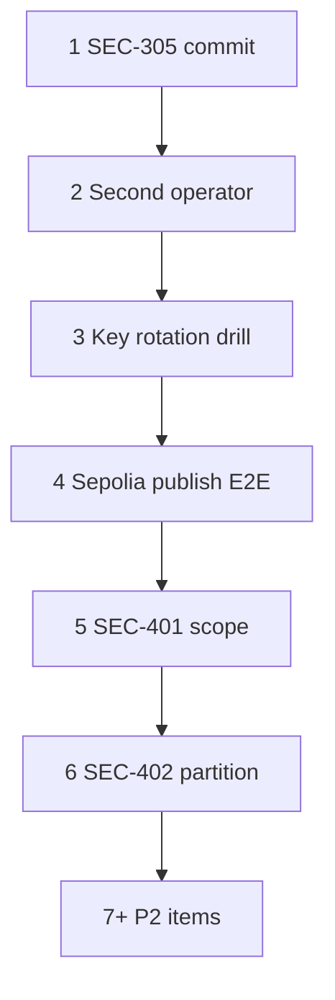

# Next work — testnet readiness checklist

**Updated:** 2026-05-30  
**Context:** [PHASE2_CLOSEOUT.md](./PHASE2_CLOSEOUT.md), [PHASE3_KICKOFF.md](./PHASE3_KICKOFF.md), [REMEDIATION_BACKLOG.md](./REMEDIATION_BACKLOG.md), [TESTNET_SEPOLIA_RUNBOOK.md](./TESTNET_SEPOLIA_RUNBOOK.md)

Sepolia Option A and Phase 3 epics 3.1–3.4 are largely complete in code. Remaining work is **prove, harden, and document** the existing publish → validate → PBFT → RocksDB → L1 workflow—not rebuild core architecture.

| Owner | Use for assignment; default **TBD** until filled in. |

---

## P0 — This week (testnet credibility)

| # | ID / theme | Owner | Task | Acceptance criteria |
|---|------------|-------|------|---------------------|
| 1 | **SEC-305** | done | Land shielded wire format + admission skip + tests | **Done** — commit `f6b0c05`; `cargo test -p common shielded_wire::` + 4 node `shielded` tests pass |
| 2 | **OPS-201** | pass (auto) | Second-operator Sepolia run | Automated verify 2026-05-29 (20.4s / 11.8s sync); human sign-off still open on checklist |
| 3 | **SEC-101-ops** | done | Hot-key rotation drill (testnet) | `CREG_BRIDGE_KEY` rotated; fingerprints before `(placeholder)` → after `0x2b456b84...332dc478` |
| 4 | **E2E-301** | done | Sepolia publish smoke | Documented in [TESTNET_SEPOLIA_RUNBOOK.md](./TESTNET_SEPOLIA_RUNBOOK.md#publish-smoke-e2e-301); observer pending-pool fix in `validator_pipeline.rs`; verify with **rebuilt** `creg-node` + encoded REST URL + `--node-url` |

---

## P1 — Next 2–4 weeks (Phase 3 exit)

| # | ID | Owner | Task | Acceptance criteria |
|---|-----|-------|------|---------------------|
| 5 | **SEC-401** | draft | Audit scope document | [SEC-401-AUDIT-SCOPE.md](./SEC-401-AUDIT-SCOPE.md) — schedule vendor / red-team |
| 6 | **SEC-402** | TBD | Network partition chaos test | `k8s/55-network-partition-test.yaml` executed; postmortem written; P1 findings tracked or fixed |
| 7 | **SEC-307** | TBD | Cluster rate-limit ADR | `docs/adr/ADR-RATE-LIMIT-SCALE.md` (or equivalent) drafted if multi-replica deploy planned |

---

## P2 — Soon (quality; not blocking first shared testnet)

| # | ID | Owner | Task | Acceptance criteria |
|---|-----|-------|------|---------------------|
| 8 | **REM-212** | TBD | Soak CI (optional) | `testnet/soak-test/runner.py` in nightly workflow; artifact or job summary published |
| 9 | **REM-211+** | TBD | Sepolia observability | Grafana dashboards/alerts for Sepolia profile per [OBSERVABILITY_SEPOLIA.md](./OBSERVABILITY_SEPOLIA.md) (if present) or runbook |
| 10 | **REM-204** | TBD | Split `api.rs` ACL | No behavior change; tests green; security-sensitive routes isolated |
| 11 | **NET-301** | TBD | Multi-validator Sepolia | ≥2 `creg-node` instances with P2P + PBFT quorum on Sepolia **or** documented decision to stay single-node until NET-301 |

---

## Deferred (do not pull forward without product change)

| ID | Reason |
|----|--------|
| SEC-302 | Cross-chain disabled (D4); `cross_chain: false` in spec |
| SEC-306b | PrivateRegistry Planned only (D5) |
| REM-202 | Governance intentionally disabled (REM-201) |
| REM-205 | Explorer refactor; maintainability only |
| Phase 4 (PROD-*) | Mainnet / release assurance after testnet sign-off |

---

## Suggested order



---

## Quick commands (operators)

```powershell
cd chain-registry
cargo test -p common shielded_wire::
cargo test -p chain-registry-node --lib shielded
.\testnet\run-sepolia-reuse.ps1 -StartNode
.\testnet\run-ops-201-verify.ps1
.\testnet\run-ops-201-verify.ps1 -SkipPublish
.\testnet\run-sec-101-drill.ps1
.\testnet\prepare-sepolia-publish.ps1 -PublisherKey 0x...
Invoke-RestMethod http://localhost:8090/v1/health
cargo run --bin creg -p chain-registry-cli -- chain-spec validate testnet/chain-spec.sepolia.json
```

## E2E-301 (Sepolia publish) — operator notes

See [TESTNET_SEPOLIA_RUNBOOK.md § Publish smoke](./TESTNET_SEPOLIA_RUNBOOK.md#publish-smoke-e2e-301) for the full procedure.

| Requirement | Notes |
|-------------|--------|
| Foundry `cast` | `.\testnet\install-foundry.ps1` then `$env:PATH = "$PWD\testnet\.tools\foundry;$env:PATH"` |
| Stake EOA key | **secp256k1** `0x` + 64 hex — **not** the literal `0x<staked_publisher_key>` from docs |
| `CREG_PUBLISHER_ADDRESS` | Staked publisher **EVM** address from that key (`prepare-sepolia-publish.ps1` writes `testnet/.env.publish.local`) |
| `publisher.key` | **Ed25519** from `creg keygen publisher` at repo root (publish signatures; different from stake EOA) |
| IPFS | `.\testnet\start-ipfs.ps1` (Docker Kubo) or `winget install IPFS.Kubo` then `ipfs daemon` — API `http://127.0.0.1:5001` |
| `CREG_YARA_RULES_DIR` | Defaults to `chain-registry/rules/` (contains `supply_chain.yar`) |
| Node | Observer on `:8090` with `validator_set_sync` synced; **rebuild** after `validator_pipeline` observer fix |
| REST lookup | `[uri]::EscapeDataString($canonical)` in path; always `--node-url http://127.0.0.1:8090` on publish/status |

---

_Update this file when an item ships; mirror status in [REMEDIATION_BACKLOG.md](./REMEDIATION_BACKLOG.md)._
