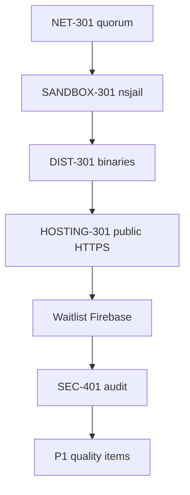

# Next work — testnet readiness checklist

**Updated:** 2026-06-12  
**Context:** [REMEDIATION_BACKLOG.md](./REMEDIATION_BACKLOG.md), [TESTNET_SEPOLIA_RUNBOOK.md](./TESTNET_SEPOLIA_RUNBOOK.md), [../chain-registry/TESTNET_READINESS_REPORT.md](../chain-registry/TESTNET_READINESS_REPORT.md)

The coordinated Sepolia 3-node lab is **proven** including **NET-301** (2-validator quorum, publish → `verified`, tip advance on 2026-06-09). **DIST-301** shipped `v0.1.0-testnet` binaries on 2026-06-10. **SANDBOX-301** passed on 2026-06-10. **HOSTING-301** passed on 2026-06-10 (`hosting-301-verify.ps1` on `testnet.cregnet.dev`). Remaining P0: **SEC-401** audit booking.

| Owner | Use for assignment; default **TBD** until filled in. |

---

## P0 — Current focus (pre–public-testnet hardening)

These five items are the gating work before inviting external participants with stake. Order reflects dependency: consensus and sandbox credibility first, then distribution and audit.

| # | ID | Owner | Task | Acceptance criteria |
|---|-----|-------|------|---------------------|
| 1 | **NET-301** | done | Multi-validator PBFT quorum on Sepolia | **Done** 2026-06-09 — `net-301-quorum-verify.ps1` pass; validator-2 Active; `validator_count=2`; tip 2→3; Windows lab uses `CREG_DEV_SANDBOX=true`. Topology: [../chain-registry/testnet/OPERATOR.md](../chain-registry/testnet/OPERATOR.md). |
| 2 | **SANDBOX-301** | done | Real behavioral sandbox (disable dev bypass) | **Done** 2026-06-10 — `sandbox-301-verify.ps1` pass; validators on `chain-registry-node-secure:latest` with `CREG_DEV_SANDBOX=false`; nsjail detected via `--help` probe; publish smoke shows real engine (not `dev-bypass`). Windows dev may keep `CREG_DEV_SANDBOX=true` only in documented local profiles (`start-3node-test.ps1`). |
| 3 | **DIST-301** | done | Ship `creg` + `creg-node` binaries | **Done** 2026-06-10 — [v0.1.0-testnet release](https://github.com/samuel-1-avson/chain-registry-blockchain-CREG-/releases/tag/v0.1.0-testnet) (linux/windows/macos); workflow [27245595554](https://github.com/samuel-1-avson/chain-registry-blockchain-CREG-/actions/runs/27245595554); `verify-dist-301.ps1` API asset checks pass. |
| 4 | **SEC-401** | outreach ready | Schedule external security audit | Scope: [SEC-401-AUDIT-SCOPE.md](./SEC-401-AUDIT-SCOPE.md). Send-ready email: [SEC-401-outreach-ready.md](./SEC-401-outreach-ready.md) (`v0.1.1-testnet` @ `203962ff`). **Vendor / start date:** TBD — send RFP to Trail of Bits + OpenZeppelin. |
| 5 | **HOSTING-301** | done | Public HTTPS URLs (GCP + Caddy) | **Done** 2026-06-10 — `testnet.cregnet.dev` → `35.225.225.20`; `hosting-301-verify.ps1` pass (api, explorer, spec, faucet, ipfs). Runbook: [gcp-public-hosting.md](../chain-registry/testnet/gcp-public-hosting.md). Budget: [GCP-BUDGET-ARCHITECTURE.md](./GCP-BUDGET-ARCHITECTURE.md). Optional: fund faucet wallet for native Sepolia gas drips. |
| 6 | **DOC-301** | done | Doc rationalization | **Done** 2026-06-08 — single index at [README.md](./README.md); removed duplicate analyses, phase closeouts, and archive snapshots. |

---

## P1 — Next 2–4 weeks (quality & ops)

| # | ID | Owner | Task | Acceptance criteria |
|---|-----|-------|------|---------------------|
| 6 | **SEC-402** | TBD | Network partition chaos test | `k8s/55-network-partition-test.yaml` executed; postmortem written; P1 findings tracked or fixed |
| 7 | **ISSUE-008** | TBD | Finalize relay enforcement by default | Fresh Sepolia deploy enables relay allowlist; documented in runbook |
| 8 | **ISSUE-013** | TBD | Close sandbox bypass in prod paths | No `CREG_DEV_SANDBOX=true` in prod compose profiles; `docker-compose.prod.yml` validated |
| 9 | **REM-211+** | TBD | Sepolia observability | Grafana dashboards/alerts per [../chain-registry/observability/README.md](../chain-registry/observability/README.md) |
| 10 | **BRIDGE-301** | TBD | Exercise L1 bridge in soak | `CREG_BRIDGE_KEY` set on validator-1; bridge batch observed on Sepolia or documented skip with health alert |

---

## P2 — Soon (not blocking coordinated testnet)

| # | ID | Owner | Task | Acceptance criteria |
|---|-----|-------|------|---------------------|
| 11 | **REM-212** | TBD | Soak CI (optional) | `testnet/soak-test/runner.py` in nightly workflow; artifact or job summary published |
| 12 | **REM-204** | TBD | Split `api.rs` ACL | No behavior change; tests green; security-sensitive routes isolated |
| 13 | **SEC-307** | TBD | Cluster rate-limit ADR | `docs/adr/ADR-RATE-LIMIT-SCALE.md` drafted if multi-replica deploy planned |
| 14 | **SHIM-301** | TBD | Align shim security with `creg install` | Documented or fixed per ISSUE registry in [DEEP_DIVE_ANALYSIS.md](../chain-registry/DEEP_DIVE_ANALYSIS.md) |

---

## Completed (2026-05 → 2026-06)

| ID | Done | Notes |
|----|------|-------|
| SEC-305 | 2026-05 | Shielded wire format + admission skip + tests |
| OPS-201 | 2026-05-30 | Second-operator Sepolia run |
| SEC-101-ops | 2026-05 | Hot-key rotation drill |
| E2E-301 | 2026-05 | Sepolia publish smoke documented |
| 3-node soak | 2026-06-08 | `soak-3node-consensus.ps1` — PBFT commit + parity |
| NET-301 | 2026-06-09 | `net-301-quorum-verify.ps1` — 2-validator quorum + publish verified (dev sandbox on Windows) |
| DIST-301 | 2026-06-10 | `v0.1.0-testnet` GitHub release — `creg` + `creg-node` for linux/windows/macos |
| HOSTING-301 | 2026-06-10 | Public HTTPS on GCP (`35.225.225.20`); Caddy TLS; all five vhosts verified |
| Pending pool persistence | 2026-06-08 | `pending_pool.json` under `CREG_DATA_DIR` |
| Public lab compose | 2026-06-08 | Explorer + faucet overlay, local service URLs in chain spec |
| DOC quickstart | 2026-06-08 | [PUBLIC_TESTNET_QUICKSTART.md](./PUBLIC_TESTNET_QUICKSTART.md) |

---

## Deferred (do not pull forward without product change)

| ID | Reason |
|----|--------|
| SEC-302 | Cross-chain disabled (SEC-303c); `cross_chain: false` in spec |
| SEC-306b | PrivateRegistry Planned only |
| REM-202 | Governance intentionally disabled (REM-201) |
| REM-205 | Explorer refactor; maintainability only |
| HOSTING-301 without domain | Superseded — live at `testnet.cregnet.dev` (2026-06-10) |
| Phase 4 (PROD-*) | Mainnet / release assurance after testnet sign-off |

---

## Suggested order



### Execution scripts (P0)

| Step | Script / doc | Notes |
|------|----------------|-------|
| **NET-301** | `.\testnet\register-validator-2-sepolia.ps1` then `.\testnet\net-301-quorum-verify.ps1` | Requires validator-2 Active on L1; topology in [OPERATOR.md](../chain-registry/testnet/OPERATOR.md) |
| **SANDBOX-301** | `.\testnet\build-3node-secure-image.ps1` then `.\testnet\start-3node-sandbox.ps1` then `.\testnet\sandbox-301-verify.ps1` | Linux container backend (Docker Desktop WSL2 OK); `CREG_DEV_SANDBOX=false` on validators |
| **DIST-301** | `git tag v0.1.0-testnet && git push origin v0.1.0-testnet` then `.\testnet\verify-dist-301.ps1` | Install: `CREG_GITHUB_REPO=owner/repo ./scripts/install-creg.sh --version v0.1.0-testnet` |
| **SEC-401** | `.\testnet\prepare-sec-401-outreach.ps1` then email vendors from [SEC-401-VENDOR-OUTREACH.md](./SEC-401-VENDOR-OUTREACH.md) | Attach or link [SEC-401-AUDIT-SCOPE.md](./SEC-401-AUDIT-SCOPE.md); record vendor + **start date** below |
| **HOSTING-301** | `.\testnet\gcp\run-hosting-301.ps1 -Step all -Confirm` (or step-by-step in [gcp-public-hosting.md](../chain-registry/testnet/gcp-public-hosting.md)) | `.\testnet\hosting-301-verify.ps1 -BaseDomain testnet.cregnet.dev` |

**SEC-401 outreach (send today):**

| Vendor | Contact | Status | Sent |
|--------|---------|--------|------|
| Trail of Bits | security@trailofbits.com | **Ready** — [SEC-401-VENDOR-OUTREACH.md](./SEC-401-VENDOR-OUTREACH.md) | ☐ |
| OpenZeppelin | audits@openzeppelin.com | **Ready** — [SEC-401-VENDOR-OUTREACH.md](./SEC-401-VENDOR-OUTREACH.md) | ☐ |

Copy email bodies from [SEC-401-VENDOR-OUTREACH.md](./SEC-401-VENDOR-OUTREACH.md). Attach or link [SEC-401-AUDIT-SCOPE.md](./SEC-401-AUDIT-SCOPE.md). Archived copy: [archive/SEC-401-outreach-ready.md](./archive/SEC-401-outreach-ready.md).

**SEC-401 booking (fill when vendor confirms):**

| Field | Value |
|-------|--------|
| Vendor | _TBD_ |
| Start date | _TBD_ |
| Commit / tag | `v0.1.1-testnet` @ `203962ff97f2ae103ff44e8bbf9873b6c8e00647` (GitHub remote) |

**Public hosting (after domain registered):**

```powershell
cd chain-registry
.\testnet\prepare-public-hosting.ps1 -BaseDomain "testnet.YOUR_DOMAIN" -AcmeEmail "you@example.com" -StaticIp "VM_IP"
# GCP VM: testnet/gcp-public-hosting.md then ./testnet/start-3node-gcp.sh
.\testnet\hosting-301-verify.ps1 -BaseDomain "testnet.YOUR_DOMAIN"
```

---

## Quick commands (operators)

```powershell
cd chain-registry

# 3-node fleet
.\testnet\start-3node-test.ps1
.\testnet\soak-3node-consensus.ps1

# NET-301 quorum proof
.\testnet\register-validator-2-sepolia.ps1
.\testnet\net-301-quorum-verify.ps1

# SANDBOX-301 (Linux container backend — Docker Desktop WSL2 on Windows OK)
.\testnet\build-3node-secure-image.ps1
.\testnet\start-3node-sandbox.ps1
.\testnet\sandbox-301-verify.ps1

# Single-node Sepolia reuse
.\testnet\run-sepolia-reuse.ps1 -StartNode
.\testnet\run-ops-201-verify.ps1

# Health & spec
Invoke-RestMethod http://localhost:28180/v1/health
cargo run --bin creg -p chain-registry-cli -- chain-spec validate testnet/chain-spec.sepolia.json

# DIST-301 (maintainers — after tag push)
.\testnet\verify-dist-301.ps1 -Version v0.1.0-testnet
```

```bash
# Release tag (maintainers)
git tag v0.1.0-testnet && git push origin v0.1.0-testnet

# Install from release (set repo if not chain-registry/chain-registry)
export CREG_GITHUB_REPO=samuel-1-avson/chain-registry-blockchain-CREG-
./scripts/install-creg.sh --version v0.1.0-testnet
```

### E2E publish smoke

Full procedure: [TESTNET_SEPOLIA_RUNBOOK.md § Publish smoke](./TESTNET_SEPOLIA_RUNBOOK.md#publish-smoke-e2e-301).

| Requirement | Notes |
|-------------|--------|
| Foundry `cast` | `.\testnet\install-foundry.ps1` |
| Stake EOA | secp256k1 `0x` + 64 hex — not Ed25519 `publisher.key` |
| `publisher.key` | Ed25519 from `creg keygen publisher` (publish signatures) |
| IPFS | `.\testnet\start-ipfs.ps1` or Kubo on `127.0.0.1:5001` |
| Node | Rebuilt `creg-node`; `validator_set_sync` synced; `--node-url` on all CLI calls |

---

_Update this file when an item ships; mirror status in [REMEDIATION_BACKLOG.md](./REMEDIATION_BACKLOG.md)._
