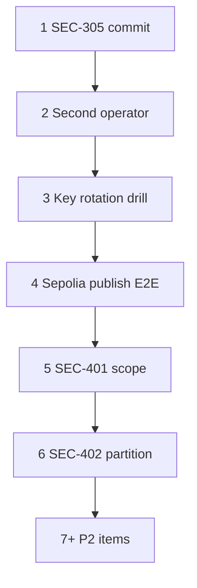

# Next work — testnet readiness checklist

**Updated:** 2026-05-28  
**Context:** [PHASE2_CLOSEOUT.md](./PHASE2_CLOSEOUT.md), [PHASE3_KICKOFF.md](./PHASE3_KICKOFF.md), [REMEDIATION_BACKLOG.md](./REMEDIATION_BACKLOG.md), [TESTNET_SEPOLIA_RUNBOOK.md](./TESTNET_SEPOLIA_RUNBOOK.md)

Sepolia Option A and Phase 3 epics 3.1–3.4 are largely complete in code. Remaining work is **prove, harden, and document** the existing publish → validate → PBFT → RocksDB → L1 workflow—not rebuild core architecture.

| Owner | Use for assignment; default **TBD** until filled in. |

---

## P0 — This week (testnet credibility)

| # | ID / theme | Owner | Task | Acceptance criteria |
|---|------------|-------|------|---------------------|
| 1 | **SEC-305** | TBD | Land shielded wire format + admission skip + tests | `cargo test -p common shielded_wire::` passes; `cargo test -p chain-registry-node --lib shielded` passes (4 tests); changes on `main`; not committed: `target/`, `sepolia-node-data/` |
| 2 | **OPS-201** | TBD | Second-operator Sepolia run | [SEPOLIA_SECOND_OPERATOR_CHECKLIST.md](./SEPOLIA_SECOND_OPERATOR_CHECKLIST.md) completed on clean machine; health `validator_set_sync.state=synced`; restart resync ≪ cold walk; sign-off row filled |
| 3 | **SEC-101-ops** | TBD | Hot-key rotation drill (testnet) | One rotation per [SECURITY_OPS_RUNBOOK.md](./SECURITY_OPS_RUNBOOK.md); startup fingerprint WARN visible (SEC-101b); bridge/faucet/relayer still operational |
| 4 | **E2E-301** | TBD | Sepolia publish smoke | `creg publish` benign tarball against live Sepolia node → admitted to pending → pipeline progresses to **Verified** or documented failure with logs |

---

## P1 — Next 2–4 weeks (Phase 3 exit)

| # | ID | Owner | Task | Acceptance criteria |
|---|-----|-------|------|---------------------|
| 5 | **SEC-401** | TBD | Audit scope document | RFP or internal scope covers `package_admission`, `validator_pipeline`, `Staking.sol`, `Registry.sol`; vendor or red-team date scheduled |
| 6 | **SEC-402** | TBD | Network partition chaos test | `k8s/55-network-partition-test.yaml` executed; postmortem written; P1 findings tracked or fixed |
| 7 | **SEC-307** | TBD | Cluster rate-limit ADR | `docs/adr/ADR-RATE-LIMIT-SCALE.md` (or equivalent) drafted if multi-replica deploy planned |

---

## P2 — Soon (quality; not blocking first shared testnet)

| # | ID | Owner | Task | Acceptance criteria |
|---|-----|-------|------|---------------------|
| 8 | **REM-212** | TBD | Soak CI (optional) | `testnet/soak-test/runner.py` in nightly workflow; artifact or job summary published |
| 9 | **REM-211+** | TBD | Sepolia observability | Grafana dashboards/alerts for Sepolia profile per [OBSERVABILITY_SEPOLIA.md](./OBSERVABILITY_SEPOLIA.md) (if present) or runbook |
| 10 | **REM-204** | TBD | Split `api.rs` ACL | No behavior change; tests green; security-sensitive routes isolated |
| 11 | **NET-301** | TBD | Multi-validator Sepolia | ≥2 `creg-node` instances with P2P + PBFT quorum on Sepolia **or** documented decision to stay single-node until NET-301 |

---

## Deferred (do not pull forward without product change)

| ID | Reason |
|----|--------|
| SEC-302 | Cross-chain disabled (D4); `cross_chain: false` in spec |
| SEC-306b | PrivateRegistry Planned only (D5) |
| REM-202 | Governance intentionally disabled (REM-201) |
| REM-205 | Explorer refactor; maintainability only |
| Phase 4 (PROD-*) | Mainnet / release assurance after testnet sign-off |

---

## Suggested order



---

## Quick commands (operators)

```powershell
cd chain-registry
cargo test -p common shielded_wire::
cargo test -p chain-registry-node --lib shielded
.\testnet\run-sepolia-reuse.ps1 -StartNode
Invoke-RestMethod http://localhost:8090/v1/health
cargo run --bin creg -p chain-registry-cli -- chain-spec validate testnet/chain-spec.sepolia.json
```

_Update this file when an item ships; mirror status in [REMEDIATION_BACKLOG.md](./REMEDIATION_BACKLOG.md)._
