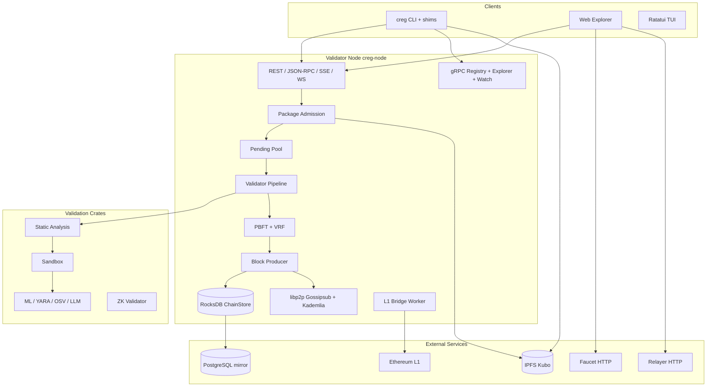
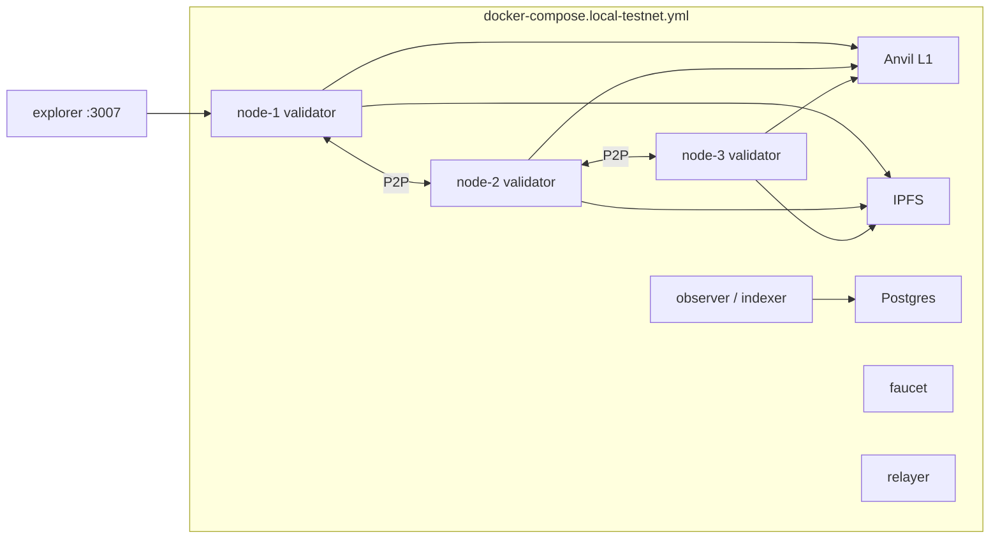
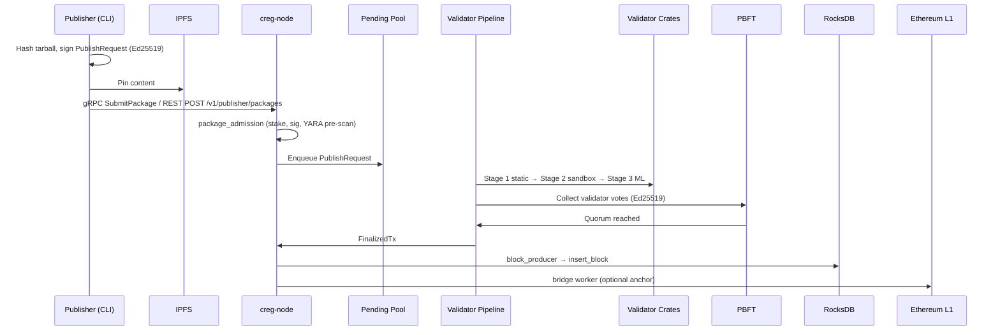
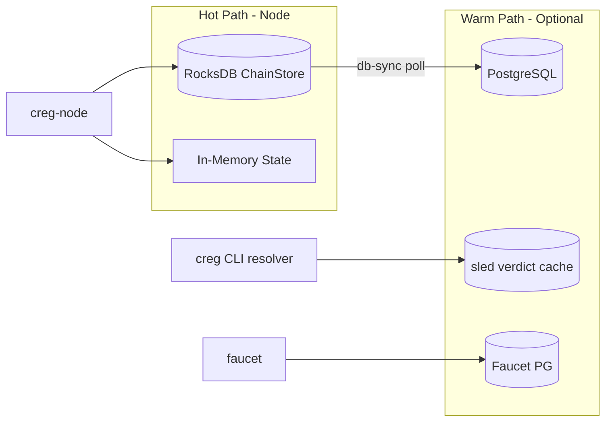

# Chain Registry — Full System Analysis Report

**Generated:** 2026-05-27  
**Repository:** `f:\project\chain-registry`  
**Primary codebase:** `chain-registry/` (Rust monorepo + Solidity + React explorer)  
**Purpose:** Architecture reference, workflow documentation, gap analysis, and readiness assessment for planning next work.

---

## Table of Contents

1. [Executive Summary](#1-executive-summary)
2. [System Overview](#2-system-overview)
3. [System Architecture](#3-system-architecture)
4. [Repository Structure](#4-repository-structure)
5. [System Workflows](#5-system-workflows)
6. [API System](#6-api-system)
7. [Database System](#7-database-system)
8. [Blockchain System](#8-blockchain-system)
9. [Wallet System](#9-wallet-system)
10. [Supporting Subsystems](#10-supporting-subsystems)
11. [Frontend & Explorer](#11-frontend--explorer)
12. [Smart Contracts](#12-smart-contracts)
13. [Security Posture & Weaknesses](#13-security-posture--weaknesses)
14. [Known Issues & Required Fixes](#14-known-issues--required-fixes)
15. [System Readiness Scores](#15-system-readiness-scores)
16. [Recommended Progression Roadmap](#16-recommended-progression-roadmap)
17. [Appendix: Key Paths & Ports](#17-appendix-key-paths--ports)

---

## 1. Executive Summary

**Chain Registry (CREG)** is a decentralized, Byzantine-fault-tolerant **software package registry** designed to replace single-authority trust in ecosystems like npm, PyPI, and Cargo. Instead of trusting one maintainer or registry operator, packages become **Verified** only after:

- A **three-stage validation pipeline** (static analysis → sandbox → ML/deep scan)
- A **PBFT quorum** (`⌊2n/3⌋ + 1`) of economically staked validators signs approval
- Content is stored on **IPFS**, chain state in **RocksDB**, with optional **PostgreSQL** mirroring
- Final state roots can be **anchored to Ethereum L1** via an alloy-based bridge and Groth16 ZK path

### What is production-ready today (per repo evidence)

| Area | Status |
|------|--------|
| Local 3-validator Docker bootstrap | **Validated** (`local-testnet.ps1`, smoke scripts) |
| Single-validator dev stack | **Stable** for inner-loop development |
| Core publish → validate → consensus → block path | **Implemented** in Rust |
| REST + gRPC + JSON-RPC APIs | **Implemented** with scoped route groups |
| EVM staking / registry contracts | **Implemented** (Foundry tests exist) |
| Web explorer (React 19 + Viem) | **Implemented** (~24 pages) |
| CI (Rust + contracts + explorer) | **Configured** (Ubuntu + macOS) |
| Kubernetes manifests | **Present** (not fully validated in this checkout) |
| Public testnet / mainnet | **In progress** (Sepolia configs exist; full ops runbook docs **missing from tree**) |

### Critical documentation gap in this checkout

The README references extensive documentation under `chain-registry/docs/` (master readiness audit, API cookbook, remediation backlog, deep-dive analysis). **Those files are not present in the current workspace.** This report is therefore synthesized from **source code, README, CI config, and subagent exploration** — not from the missing audit artifacts. Re-sync or restore `docs/` before treating historical issue IDs as authoritative.

---

## 2. System Overview

### 2.1 Problem statement

Centralized package registries are a single point of failure for supply-chain security. Compromised credentials or unreviewed publishes can affect millions of downstream installs (e.g. event-stream, XZ Utils, ua-parser-js).

### 2.2 Solution model

| Concept | Implementation |
|---------|----------------|
| Trust model | Staked validator set + cryptographic votes |
| Consensus | Custom PBFT + Ed25519 VRF leader selection |
| Package storage | IPFS (content-addressed) |
| Chain storage | RocksDB column families (blocks, packages) |
| L1 settlement | Ethereum (Sepolia/Hoodi/Anvil in dev) via `bridge.rs` |
| Client surfaces | `creg` CLI, PATH shims, React explorer, Ratatui TUI |
| Optional services | Faucet, relayer (EIP-712 gas sponsorship), `creg-indexer` |

### 2.3 Technology stack summary

| Layer | Technologies |
|-------|----------------|
| Validator runtime | Rust 1.90, Tokio, axum 0.7, tonic/gRPC, libp2p |
| Validation | YARA-X, sandbox waterfall (nsjail/gVisor/Docker/WASM), optional LLM |
| ZK | arkworks Groth16, Circom circuits (`circuits/`), on-chain verifiers |
| Contracts | Solidity 0.8.24, Foundry |
| Indexing | sqlx → PostgreSQL (`db-sync` crate) |
| Explorer | React 19, Vite 8, viem, WalletConnect |
| Observability | Prometheus, Grafana, Loki, Tempo, Alertmanager |
| Orchestration | Docker Compose (many profiles), Kustomize |

---

## 3. System Architecture

### 3.1 Logical architecture



### 3.2 Deployment architecture (typical local testnet)



### 3.3 Architectural principles

1. **RocksDB is the node’s source of truth** for API reads and writes on the hot path.
2. **PostgreSQL is a derived read model** — synced by `db-sync` / `creg-indexer`, not queried by core REST handlers.
3. **Cryptographic admission** for publishers and validators; **API keys** only for operator/internal routes.
4. **Fail-closed** patterns in several areas (operator ACL returns 503 if unset; YARA admission can block packages).
5. **Dual protocol access**: REST (explorer/CLI) + gRPC (resolver, high-throughput submit).

---

## 4. Repository Structure

### 4.1 Top-level layout

| Path | Role |
|------|------|
| `README.md` | Product overview, quick start, architecture diagram |
| `docs/` | **This report**; upstream docs referenced by README are absent here |
| `chain-registry/` | **Main monorepo** — all runtime code |
| `circuits/` | Circom ZK circuits (`DoubleSignProof`, `PackageValidator`) |
| `.github/workflows/` | Root CI (consensus evidence, release-assurance smoke) |

### 4.2 Rust workspace (`chain-registry/Cargo.toml`)

**15 workspace crates**, **6+ binaries**:

| Crate | Role |
|-------|------|
| `common` | Shared types, chain spec, protobuf (`node.proto`) |
| `node` | `creg-node`, `creg-indexer`, `dump-openapi` |
| `cli` | `creg` + npm/pip/cargo/gem/mvn shims |
| `consensus` | PBFT, VRF, evidence votes, validator set |
| `validator` | 3-stage validation pipeline |
| `resolver` | Install path: gRPC/REST + sled verdict cache |
| `zk-validator` | Groth16 proving/verification integration |
| `ml-validator` | Deep scan, YARA, OSV, threat intel |
| `wasm-sandbox` | WASM execution limits |
| `threshold-encryption` | Shielded publish / private registry crypto |
| `cross-chain` | L2 config + message ordering (limited RPC orchestration) |
| `insurance` | Package insurance logic |
| `db-sync` | RocksDB → PostgreSQL ETL |
| `ipfs-pinner` | Pinning rewards |
| `faucet` | Testnet token drip service |
| `relayer` | EIP-712 sponsored staking |

### 4.3 Other major directories

| Directory | Contents |
|-----------|----------|
| `contracts/` | 17+ Solidity contracts + Foundry tests |
| `explorer/` | React SPA, API clients, Playwright e2e |
| `config/` | L2 JSON, sandbox seccomp/rootfs, consensus evidence schemas |
| `testnet/` | Chain specs, genesis, deploy scripts, alternate PG schema |
| `k8s/` | Kustomize: validators, Postgres, IPFS, Anvil, ingress, monitoring |
| `observability/` | Prometheus/Grafana/Loki/Tempo compose |
| `scripts/` | Smoke/soak PowerShell helpers |
| `tests/` | Workspace integration tests (ZK, ML, WASM, advanced E2E) |
| `ide-plugins/vscode/` | Dependency scan extension |

---

## 5. System Workflows

### 5.1 Package publish workflow (happy path)



**Key files:**

- Admission: `crates/node/src/package_admission.rs`
- Pending pool: `crates/node/src/pending_pool.rs`
- Pipeline: `crates/node/src/validator_pipeline.rs`
- Block production: `crates/node/src/block_producer.rs`
- Storage: `crates/node/src/chain_store.rs`
- CLI publish: `crates/cli/src/publish.rs`

### 5.2 Install / verify workflow (consumer)

1. User runs `creg install <pkg>` or shim intercepts `npm install`.
2. **Resolver** queries node via gRPC (`GetLatestVersion`) with REST fallback.
3. Verdict checked against chain + pending state; sled cache TTLs apply (`resolver/src/cache.rs`).
4. If verified, downloader fetches from IPFS; otherwise warn or block per policy.

### 5.3 Validator onboarding workflow

1. Generate Ed25519 key: `creg keygen`.
2. Stake on L1: `creg stake --role validator` → `Staking.sol`.
3. Register identity on node: `POST /v1/validator/register` with **dual signatures** (EVM `personal_sign` + Ed25519).
4. Governance approves validator on-chain (manual/multisig flow).
5. Node syncs validator set from staking events (`validator_set_sync.rs`).

### 5.4 Chain boot workflow

On startup, `creg-node` performs chain-spec validation (`chain_spec_boot.rs`, `main.rs`):

1. Load/fetch signed chain spec (JCS canonical JSON).
2. Verify Ed25519 signature (if `CREG_SPEC_SIGNING_PUBKEY` pinned).
3. Match `CREG_CHAIN_ID`, `CREG_GENESIS_HASH` env pins.
4. Probe L1 RPC chain ID vs spec.
5. Verify deployed contract bytecode at configured addresses.

### 5.5 Indexer sync workflow (optional)

1. `creg-indexer` or in-process worker polls RocksDB height.
2. `db-sync` UPSERTs into PostgreSQL tables: `packages`, `blocks`, `validator_votes`, `publisher_stats`, `sync_state`.
3. Explorer **does not** read PG directly today — still uses node REST.

---

## 6. API System

### 6.1 API surfaces overview

| Surface | Port (default) | Protocol | Primary consumers |
|---------|----------------|----------|-------------------|
| REST API | 8080 | HTTP/JSON | Explorer, CLI, operators |
| gRPC | 50051 | protobuf/tonic | CLI resolver, programmatic submit |
| JSON-RPC | 8080 (`/rpc`) | JSON-RPC 2.0 | Tooling (custom `creg_*` methods) |
| SSE / WebSocket | 8080 | events | Explorer live updates |
| Embedded UI | 8080 (`/ui/`) | static SPA | Browser |
| Faucet | 8082 | HTTP | Testnet funding |
| Relayer | 8083 | HTTP | Sponsored staking |
| Indexer health | 8084 | HTTP | Ops (`creg-indexer`) |

### 6.2 REST route boundaries

Implemented in `crates/node/src/api.rs` with **scoped prefixes** and **legacy aliases**:

| Scope | Prefix | Auth |
|-------|--------|------|
| Public | `/v1/public/*` | Rate limit only |
| Publisher | `/v1/publisher/*` | Ed25519 publish auth + on-chain stake |
| Validator | `/v1/validator/*` | Validator set + signed votes |
| Operator | `/v1/operator/*` | `X-Operator-Key` / Bearer (`CREG_OPERATOR_API_KEY`) |
| Internal | `/v1/internal/*` | Same as operator |

**Documentation endpoints:**

- OpenAPI JSON: `/v1/openapi.json`
- Swagger UI: `/api-docs`

### 6.3 Representative public endpoints

| Method | Path | Purpose |
|--------|------|---------|
| GET | `/v1/public/health` | Health + validator sync metadata |
| GET | `/v1/public/chain/stats` | Chain statistics |
| GET | `/v1/public/packages` | List packages |
| GET | `/v1/public/packages/:canonical` | Package detail |
| GET | `/v1/public/packages/:canonical/proof` | Proof data |
| GET | `/v1/public/blocks`, `/blocks/:height` | Block queries |
| GET | `/v1/public/transactions/:canonical` | Transaction detail |
| GET | `/v1/public/validators/:address` | Validator info |
| GET | `/v1/public/bridge/status`, `/bridge/anchors` | L1 bridge status |
| GET | `/v1/public/events` | SSE event stream |
| GET | `/v1/public/ws` | WebSocket |
| GET | `/v1/public/search` | Search |

### 6.4 Publisher & validator write endpoints

| Method | Path | Purpose |
|--------|------|---------|
| POST | `/v1/publisher/packages` | Submit package |
| POST | `/v1/publisher/packages/:canonical/revoke` | Revoke (signed) |
| POST | `/v1/publisher/rotate-key` | Key rotation |
| POST | `/v1/validator/register` | Bind EVM + Ed25519 identity |
| POST | `/v1/validator/consensus/vote` | Submit consensus vote |
| GET | `/v1/validator/consensus/state` | Consensus snapshot |

### 6.5 JSON-RPC methods

File: `crates/node/src/json_rpc.rs`

| Method | Description |
|--------|-------------|
| `creg_chainId` | Chain ID string |
| `creg_blockNumber` | Tip height (hex) |
| `creg_getBlockByNumber` | Block by height or `latest` |
| `creg_health` | Node health metadata |

No session/JWT on JSON-RPC.

### 6.6 gRPC services

Proto: `crates/common/proto/node.proto`

| Service | RPCs |
|---------|------|
| `RegistryService` | `GetLatestVersion`, `SubmitPackage` |
| `WatchService` | `StreamEvents` |
| `ExplorerService` | `GetChainStats`, `GetBlockByHeight` |

### 6.7 Middleware & limits

| Control | Implementation |
|---------|----------------|
| CORS | `CREG_CORS_*` env |
| Rate limit | 3000 req/min/IP general; 10 publish/min; 60 votes/min (`rate_limit.rs`) |
| Body size | 50 MB max |
| Operator ACL | Fail-closed: **503** if key not configured |

**Known API gap:** Rate limiter keys off legacy paths (`POST /v1/packages`) — grouped routes `/v1/publisher/packages` may only get the general limit.

### 6.8 Faucet API

`crates/faucet/src/main.rs`

| Route | Notes |
|-------|-------|
| `GET /api/challenge`, `POST /api/drip` | PoW + cooldown flow |
| `GET /api/stats`, `/api/balance/:address` | Public |
| `POST /admin/pause`, `/admin/resume` | `FAUCET_ADMIN_TOKEN` |

### 6.9 Relayer API

`crates/relayer/src/main.rs`

| Route | Notes |
|-------|-------|
| `POST /v1/relayer/quote` | Quote sponsored intent |
| `POST /v1/relayer/sponsor` | Submit EIP-712 + permit |
| `GET /v1/relayer/status/:request_id` | Track request |

**Explorer mismatch:** `explorer/src/api/relayer.js` calls `/v1/relayer/stake` and `/quota/:owner` — **not implemented** on relayer server (calls `/sponsor` instead).

---

## 7. Database System

### 7.1 Storage topology



### 7.2 RocksDB (primary)

**File:** `crates/node/src/chain_store.rs`  
**Path:** `{CREG_DATA_DIR}/chain.rocksdb`

| Column family | Contents |
|---------------|----------|
| `blocks_by_hash` | Serialized blocks |
| `blocks_by_height` | Height → hash index |
| `packages` | `ChainRecord` by canonical package ID |

Legacy **sled** migration supported for older deployments.

### 7.3 In-memory node state

| Structure | Purpose |
|-----------|---------|
| `PendingPool` | Packages awaiting validation/consensus |
| `PublisherIndex` | Publisher metadata |
| Validator registrations | Identity bindings |
| PBFT state | Votes, rounds |
| Bridge status | L1 sync metadata |

### 7.4 PostgreSQL mirror (`db-sync`)

**ORM:** sqlx (raw SQL), no Prisma/TypeORM.

**Tables** (bootstrapped by sync worker):

| Table | Purpose |
|-------|---------|
| `sync_state` | `last_height` cursor |
| `packages` | Mirrored package records |
| `validator_votes` | Per-package votes |
| `blocks` | Block headers |
| `publisher_stats` | Aggregated metrics |

**Env:** `CREG_PG_URL`  
**Process:** `creg-indexer` binary or `CREG_PG_SYNC_IN_PROCESS=true` (legacy)

### 7.5 Testnet SQL schema (separate lineage)

**File:** `testnet/init-testnet-db.sql`

Uses **different table names** than `db-sync`:

- `validator_signatures` vs `validator_votes`
- `chain_blocks` vs `blocks`
- Additional: `pending_tx`, `faucet_drips`, `testnet_metrics`

**Risk:** Running both schemas against one database without coordination causes confusion.

### 7.6 Caching (no Redis)

| Cache | Technology | Location |
|-------|------------|----------|
| Verdict cache | sled | `~/.cache/chain-registry/verdict-cache` |
| Rate limits | in-memory | per-IP buckets |
| LLM responses | in-memory HashMap | `validator/src/llm/cache.rs` |
| Faucet cooldowns | DashMap + optional PG | faucet service |
| Relayer quotas | DashMap | relayer service |

---

## 8. Blockchain System

### 8.1 CREG application chain (non-EVM)

| Component | Technology |
|-----------|------------|
| Consensus | Custom PBFT (`crates/consensus/src/pbft.rs`) |
| Leader selection | Ed25519 VRF (`vrf.rs`) |
| Networking | libp2p (TCP, noise, yamux, gossipsub, kad) |
| Blocks & packages | Rust types in `crates/common/` |
| Evidence | Double-sign proofs, forced inclusion (`evidence_votes.rs`) |

**Not Cosmos/Bitcoin/Solana** — this is a purpose-built registry chain.

### 8.2 Chain specification

**Schema:** `crates/common/src/chain_spec.rs`

- JCS (RFC 8785) canonical JSON
- Ed25519 signature over `creg-chain-spec-v1|<canonical>`
- Genesis hash from pinned fields
- Examples: `testnet/chain-spec.example.json`, `chain-spec.sepolia.json`

**CLI `creg chain-spec validate`** parses JSON but does **not** fully verify signatures/genesis hash (weaker than node boot).

### 8.3 Ethereum L1 / EVM layer

| Network | Chain ID | Usage |
|---------|----------|-------|
| Anvil (local) | 31337 | Docker dev/testnet |
| Sepolia | 11155111 | Testnet deployments |
| Hoodi | 560048 | Relayer policy + explorer profiles |

**Integration library:** alloy (`ProviderBuilder`, contract bindings)  
**Config:** `CREG_ETH_RPC`, contract addresses in env/chain spec

**Bridge worker:** `crates/node/src/bridge.rs` — finalization, anchoring  
**Validator set sync:** `validator_set_sync.rs` — reads staking contract events

### 8.4 L2 / cross-chain (partial)

| Chain | Config |
|-------|--------|
| Arbitrum (42161) | `config/l2/arbitrum.json`, `cross-chain/src/lib.rs` |
| Optimism (10) | `config/l2/optimism.json` |
| Polygon (137) | defaults in Rust |

**Contract:** `CrossChainRegistry.sol` — **Planned / flagged ISSUE-005/006**  
**Rust `MultiChainClient`:** config and replay protection — **no full RPC sync loop**

### 8.5 ZK layer

| Piece | Location |
|-------|----------|
| Circom circuits | `circuits/DoubleSignProof.circom`, `PackageValidator.circom` |
| Rust prover | `zk-validator` crate (arkworks Groth16) |
| On-chain | `ZKVerifier.sol`, `Groth16Verifier.sol`, `ZKSlashingVerifier.sol` |

### 8.6 IPFS

- Kubo v0.27 in compose stacks
- CLI pins on publish; node verifies CIDs
- `ipfs-pinner` crate for pinning rewards contract integration

---

## 9. Wallet System

Chain Registry is **not a general multi-chain wallet**. Wallet functionality splits across **CLI key management**, **browser EVM wallets**, and **server hot keys**.

### 9.1 CLI keys (Ed25519 — publishers & validators)

**File:** `crates/cli/src/keygen.rs`

| Feature | Detail |
|---------|--------|
| Algorithm | Ed25519 (`ed25519-dalek`) |
| Storage | `~/.creg/{role}.key`, mode 0600 |
| Encryption | AES-256-GCM + scrypt (`CREG-ENC-V1`) |
| Mnemonic | BIP39 24-word → SLIP-0010-style derivation to Ed25519 |
| Recovery | Shamir splits (`recovery.rs`) |
| Multisig publish | M-of-N sessions with HMAC integrity (`multisig.rs`) |

**Important:** Display “ETH address” derived from Ed25519 material is **non-standard** (k256 + Keccak) — not BIP44 Ethereum HD.

### 9.2 Explorer wallets (EVM — end users)

**Files:** `explorer/src/LegacyApp.jsx`, `pages/WalletPage.jsx`

| Mode | Library |
|------|---------|
| MetaMask / EIP-6963 | viem wallet client |
| WalletConnect v2 | `@walletconnect/ethereum-provider` |
| Raw private key | viem — **dev only** (`PRIVATE_KEY_WALLET_ENABLED`) |

**Flows:** native balance, tCREG ERC20, faucet, stake, validator registration, sponsored relayer intents.

### 9.3 Validator identity binding (dual crypto)

Registration requires:

1. **EVM:** `personal_sign` on structured message  
2. **Ed25519:** signature on same message  

Message format (`api.rs`):

```
creg-validator-identity-v1
chain_id:...
evm_address:...
node_id:...
ed25519_pubkey:...
nonce:...
```

### 9.4 Server-side hot EVM keys

| Service | Env variable | Risk level |
|---------|--------------|------------|
| Bridge | `CREG_BRIDGE_KEY` | **High** — funds L1 txs |
| Faucet | `FAUCET_PRIVATE_KEY` | **High** |
| Relayer | `RELAYER_PRIVATE_KEY` | **High** |
| IPFS pinner | operator key | Medium |

**No HSM/KMS/MPC** integration in codebase.

### 9.5 Threshold encryption (shielded publish)

**Crate:** `threshold-encryption/`  
Shamir + AES-GCM; ECIES for share distribution.  
README notes **shielded decryption is experimental** — treat as open work.

---

## 10. Supporting Subsystems

### 10.1 Validation pipeline (3 stages)

| Stage | Crate/module | Techniques |
|-------|--------------|------------|
| 1 | `validator/static_analysis.rs` | Entropy, typosquat, diff, bundle checks |
| 2 | `validator/sandbox.rs` | nsjail → gVisor → Docker → WASM waterfall |
| 3 | `ml-validator` | YARA-X, OSV, threat intel, optional LLM |

`CREG_DEV_SANDBOX=true` can skip sandbox in dev — **must be false in production**.

### 10.2 Observability

- Metrics endpoint on node (`/metrics` legacy alias)
- Full stack in `observability/` — Prometheus scrape configs, Grafana dashboards, Loki, Tempo
- Alertmanager rules for testnet profiles

### 10.3 CI / release assurance

**`.github/workflows/ci.yml`:**

- `cargo fmt`, `clippy -D warnings`, `cargo test --workspace` on Ubuntu + macOS
- Foundry tests, explorer unit tests, Playwright e2e (degraded endpoints)
- Release assurance: reproducible binary verification when Rust/contracts change

**Policy:** `config/release-assurance/toolchain-inventory.json` — fail-closed DDC scope for compiler-adjacent tools.

### 10.4 Test coverage (approximate)

| Area | Evidence |
|------|----------|
| Rust unit/integration | 60+ `#[test]` across crates; `node/tests/e2e.rs`, `integration.rs` |
| Contracts | 8 Foundry test files (`Registry`, `Staking`, `ZKVerifier`, `CrossChainRegistry`, etc.) |
| Explorer | Playwright `e2e/degraded-endpoints.spec.js` |
| Workspace integration | `tests/zk_validation_tests.rs`, `ml_validation_tests.rs`, `wasm_sandbox_tests.rs`, `advanced_validation_e2e.rs` |

Full coverage metrics were **not** run in this analysis session.

---

## 11. Frontend & Explorer

**Path:** `chain-registry/explorer/`

| Aspect | Detail |
|--------|--------|
| Stack | React 19, Vite 8, react-router-dom |
| Web3 | viem, WalletConnect |
| API client | `src/api/node.js` — prefers `/v1/public/*`, falls back to legacy `/v1/*` |
| Pages | ~24 routes: dashboard, blocks, packages, validators, bridge, governance, metrics, search, publisher flows |
| Build | Embedded in node image at `/ui/` or standalone port 3007 |
| Env | `VITE_*` for API base, RPC, contract addresses, operator key |

**Tech debt:** `LegacyApp.jsx` is very large (~3k lines); governance UI may call stub APIs.

---

## 12. Smart Contracts

**Tooling:** Foundry, solc 0.8.24, OpenZeppelin submodules

| Contract | Purpose | Notes |
|----------|---------|-------|
| `Registry.sol` | Package index + finalization | Core |
| `Staking.sol` | Stake/slash publishers & validators | Core |
| `Governance.sol` / `GovernanceV2.sol` | Multisig, timelock upgrades | Active |
| `CregToken.sol` | ERC20 + permit | Relayer/faucet integration |
| `Reputation.sol` | Validator reputation counters | Active |
| `ZKVerifier.sol` | Groth16 wrapper | ⚠ ISSUE-002 regression tests exist |
| `Groth16Verifier.sol` | snarkJS verifier | Generated artifact |
| `ZKSlashingVerifier.sol` | Double-sign evidence | Active |
| `SlashingEvidence.sol`, `Appeal.sol` | Slashing pipeline | Active |
| `CrossChainRegistry.sol` | Cross-chain receipts | ⚠ ISSUE-005/006; status **Planned** |
| `PackageInsurance.sol` | Insurance | Active |
| `PinningRewards.sol`, `ValidatorRewards.sol` | Incentives | Active |
| `PrivateRegistry.sol` | Enterprise private registries | ⚠ ISSUE-004; **file not found in tree** |

REST `GET /v1/public/governance/proposals` returns **empty stub** — not wired to on-chain governance yet.

---

## 13. Security Posture & Weaknesses

### 13.1 Strengths

| Area | Mechanism |
|------|-----------|
| Publish integrity | Ed25519 signatures + stake checks on L1 |
| Validator identity | Dual EVM + Ed25519 binding |
| Operator APIs | Fail-closed without `CREG_OPERATOR_API_KEY` |
| Key files | Encrypted at rest (scrypt + AES-GCM) |
| Chain boot | Signed chain spec + genesis hash pinning |
| Supply chain | Multi-stage validation before quorum |
| Admission scanning | YARA fail-closed path for public testnet |
| Relayer | EIP-712 intents, allowlists, quotas |

### 13.2 Weaknesses (systemic)

| # | Weakness | Impact | Severity |
|---|----------|--------|----------|
| W1 | **Hot private keys** in env for bridge/faucet/relayer | Key leak → fund loss | **Critical** (ops) |
| W2 | **Missing `docs/` and runbooks** in checkout | Operational mistakes, unclear readiness | **High** |
| W3 | **Dual PostgreSQL schemas** (`db-sync` vs `init-testnet-db.sql`) | Data model drift, broken analytics | **High** |
| W4 | **Explorer ↔ relayer API mismatch** | Broken sponsored stake UX | **Medium** |
| W5 | **Rate limits on legacy paths only** | Publisher route abuse potential | **Medium** |
| W6 | **Governance API stub** | Misleading explorer/integrations | **Medium** |
| W7 | **Cross-chain incomplete** (ISSUE-005/006, zero default L2 addresses) | False sense of multi-chain support | **High** |
| W8 | **Shielded publish / threshold decryption** experimental | Privacy feature not production-safe | **High** |
| W9 | **Validator set sync cursor** in-memory only (sled TODO) | Restart may re-process or miss events | **Medium** |
| W10 | **Non-standard ETH address from Ed25519 key** | User confusion, wrong fund sends | **Medium** |
| W11 | **alloy version split** (workspace 0.6 vs node 0.1) | Dependency drift bugs | **Low–Medium** |
| W12 | **`CREG_SINGLE_VALIDATOR_MODE` / `CREG_DEV_SANDBOX`** misuse | Consensus/security bypass in prod | **Critical** if misconfigured |
| W13 | **PrivateRegistry.sol missing** despite README “Active” | Doc/code inconsistency | **Medium** |
| W14 | **Large monolithic `api.rs`** (~4k lines) | Hard to audit, regression risk | **Medium** (maintainability) |
| W15 | **No Redis/cluster rate limiting** | Per-node limits only in multi-instance deploy | **Medium** at scale |

### 13.3 Threat model notes

- **Byzantine validators:** PBFT assumes `< n/3` faulty; economic staking + slashing intended but full slashing path needs operational validation.
- **Malicious packages:** Defense in depth via pipeline + quorum; `CREG_DEV_SANDBOX` disables key control.
- **Registry operator:** Decentralized model reduces single-operator risk vs npm; L1 governance still a trust anchor.
- **LLM stage:** Optional cloud keys (`OPENROUTER_API_KEY`) — data exfiltration policy needed.

---

## 14. Known Issues & Required Fixes

Issues referenced in README/contracts/tests (full write-ups were in missing `docs/DEEP_DIVE_ANALYSIS.md`):

| ID | Area | Summary | Evidence in repo |
|----|------|---------|----------------|
| ISSUE-002 | `ZKVerifier.sol` | Pairing check correctness | `contracts/test/ZKVerifier.t.sol` |
| ISSUE-004 | `PrivateRegistry.sol` | Enterprise private registry gaps | README flags; **contract file absent** |
| ISSUE-005 | `CrossChainRegistry.sol` | `receiveVerification` signature bypass | `contracts/test/CrossChainRegistry.t.sol` |
| ISSUE-006 | `CrossChainRegistry.sol` | Outbound messages missing validator sigs | Same test file |
| ISSUE-009 | Consensus votes | Prior ECDSA/secp256k1 confusion (fixed toward Ed25519) | `vote_accumulator.rs` comment |

### Additional fixes identified in this analysis

| Priority | Fix |
|----------|-----|
| P0 | Restore/commit `chain-registry/docs/` (readiness audit, API cookbook, remediation backlog) |
| P0 | Align explorer `relayer.js` with `/v1/relayer/sponsor` API or implement missing routes |
| P0 | Unify PostgreSQL schema — single source of truth for indexer + testnet |
| P1 | Apply publish/vote rate limits to `/v1/publisher/*` and `/v1/validator/*` paths |
| P1 | Persist validator set sync cursor (complete sled TODO) |
| P1 | Resolve `PrivateRegistry.sol` — add contract or update README status |
| P1 | Complete CrossChainRegistry (ISSUE-005/006) before marking multi-chain active |
| P2 | Wire governance REST to `Governance.sol` / events |
| P2 | Strengthen `creg chain-spec validate` (signature + genesis hash) |
| P2 | Split/refactor `api.rs` for maintainability |
| P2 | Consolidate alloy versions across workspace |
| P3 | Refactor `LegacyApp.jsx` into modular wallet/stake components |
| P3 | Add HSM/KMS guidance or integration for hot keys |
| P3 | Document and test shielded publish E2E before production |

---

## 15. System Readiness Scores

Scores are **qualitative estimates** (0–100%) based on code completeness, test presence, README claims, and identified gaps. They are **not** a substitute for the missing `MASTER_PROJECT_READINESS_AND_CLIENT_AUDIT_2026-05-18.md`.

### 15.1 Component readiness

| Component | Score | Rationale |
|-----------|-------|-----------|
| **Core node runtime** | **78%** | Full publish/consensus/block path; large API surface; some stubs |
| **Consensus (PBFT)** | **72%** | Implemented + tests; multi-validator validated locally; production hardening ongoing |
| **Validation pipeline** | **75%** | 3 stages + optional ZK/ML/WASM; dev sandbox bypass risk |
| **API system (REST/gRPC/RPC)** | **80%** | Comprehensive; minor path/limit mismatches |
| **Database (RocksDB)** | **85%** | Stable hot path; migration from sled supported |
| **Database (PostgreSQL sync)** | **55%** | Works but dual schema + not used by node reads |
| **Blockchain (CREG chain)** | **70%** | Functional locally; public testnet ops incomplete |
| **Blockchain (L1 Ethereum)** | **68%** | Bridge + staking wired; depends on correct deployment |
| **Blockchain (L2/cross-chain)** | **35%** | Config + contracts partial; known ISSUE-005/006 |
| **Wallet (CLI)** | **75%** | Strong key mgmt; non-standard ETH derivation warning |
| **Wallet (Explorer EVM)** | **70%** | MetaMask/WC works; relayer route bug; dev key mode |
| **Smart contracts** | **72%** | Broad coverage; ZK/cross-chain/private registry gaps |
| **Explorer UI** | **73%** | Feature-rich; legacy code, some stub backends |
| **CLI (`creg`)** | **78%** | 27 commands; shims; depends on node availability |
| **Observability** | **65%** | Stack present; production dashboards/alerts need validation |
| **Kubernetes / prod deploy** | **50%** | Manifests exist; limited evidence of full prod validation |
| **Documentation** | **40%** | Good README; referenced `docs/` tree missing |
| **Security / ops readiness** | **58%** | Good patterns; hot keys, config footguns, incomplete cross-chain |

### 15.2 Overall system readiness

| Metric | Value |
|--------|-------|
| **Overall weighted readiness** | **~68%** |
| **Local dev / 3-validator testnet** | **~82%** — recommended daily driver |
| **Public Sepolia testnet** | **~55%** — configs exist; ops docs missing |
| **Production mainnet** | **~35%** — not recommended without remediation |

### 15.3 Progress dimensions (for tracking)

Use these KPIs in future sprints:

| KPI | Current signal | Target |
|-----|----------------|--------|
| Smoke test pass rate (`local-testnet.ps1`) | Validated per README | 100% on CI |
| `cargo test --workspace` green | CI configured | 100% on PR |
| `forge test` green | CI configured | 100% on PR |
| Open ISSUE-00x count | ≥4 tracked | 0 before mainnet |
| API route parity (explorer vs backend) | Relayer mismatch | 100% match |
| PG schema unity | 2 lineages | 1 schema |
| Docs completeness | ~40% | 90%+ with runbooks |
| Reproducible release binaries | Script exists | Verified each release |

---

## 16. Recommended Progression Roadmap

### Phase 1 — Stabilize foundation (2–4 weeks)

1. Restore version-controlled `docs/` (readiness audit, API cookbook, validator runbook).
2. Fix explorer/relayer API contract mismatch.
3. Unify PostgreSQL schema; document single migration path.
4. Close ISSUE-002 (ZKVerifier) and add regression to CI.
5. Enforce rate limits on grouped API paths.

### Phase 2 — Testnet hardening (4–8 weeks)

1. Run and document Sepolia deployment (`chain-spec.sepolia.json`, `sepolia-deploy.yml`).
2. Complete validator set sync persistence.
3. Wire governance endpoints to contracts or remove stub from UI.
4. Operational runbook: hot key rotation, `CREG_OPERATOR_API_KEY`, TLS (`CREG_TLS_*`).
5. Soak tests (`testnet/soak-test/`) integrated into nightly CI.

### Phase 3 — Security & multi-chain (8–12 weeks)

1. Resolve CrossChainRegistry ISSUE-005/006 or mark feature disabled in UI.
2. Private registry: implement `PrivateRegistry.sol` + E2E shielded flow.
3. KMS/HSM pattern for bridge/faucet/relayer keys.
4. External security audit on `package_admission`, `validator_pipeline`, contracts.
5. K8s staging environment with chaos tests (`k8s/55-network-partition-test.yaml`).

### Phase 4 — Production readiness (12+ weeks)

1. Mainnet chain spec + genesis ceremony.
2. Reproducible releases gated by `release-assurance.sh` on every tag.
3. SLA monitoring + on-call playbooks.
4. SDK/client libraries beyond CLI (optional).

---

## 17. Appendix: Key Paths & Ports

### 17.1 Important file paths

| Topic | Path |
|-------|------|
| Node entry | `chain-registry/crates/node/src/main.rs` |
| REST API | `chain-registry/crates/node/src/api.rs` |
| JSON-RPC | `chain-registry/crates/node/src/json_rpc.rs` |
| gRPC | `chain-registry/crates/node/src/grpc/server.rs` |
| Chain store | `chain-registry/crates/node/src/chain_store.rs` |
| Admission | `chain-registry/crates/node/src/package_admission.rs` |
| Pipeline | `chain-registry/crates/node/src/validator_pipeline.rs` |
| Bridge | `chain-registry/crates/node/src/bridge.rs` |
| Chain spec | `chain-registry/crates/common/src/chain_spec.rs` |
| DB sync | `chain-registry/crates/db-sync/` |
| CLI | `chain-registry/crates/cli/src/main.rs` |
| Explorer API | `chain-registry/explorer/src/api/node.js` |
| Contracts | `chain-registry/contracts/` |
| Local testnet | `chain-registry/local-testnet.ps1` |
| Compose (3-val) | `chain-registry/docker-compose.local-testnet.yml` |

### 17.2 Default ports

| Service | Port |
|---------|------|
| Node REST | 8080 |
| gRPC | 50051 |
| P2P | 9000 |
| Faucet | 8082 |
| Relayer | 8083 |
| Indexer health | 8084 |
| Explorer (standalone) | 3007 |
| IPFS API | 5001 |
| IPFS gateway | 8081 |
| Anvil | 8545 |

### 17.3 Environment variables (essential)

| Variable | Purpose |
|----------|---------|
| `CREG_NODE_ID` | Node identity |
| `CREG_IS_VALIDATOR` | Enable validator mode |
| `CREG_VALIDATOR_KEY` | Ed25519 validator secret |
| `CREG_DATA_DIR` | RocksDB directory |
| `CREG_ETH_RPC` | L1 JSON-RPC URL |
| `CREG_REGISTRY_ADDR` / `CREG_STAKING_ADDR` | Contract addresses |
| `CREG_OPERATOR_API_KEY` | Operator/internal API auth |
| `CREG_PG_URL` | PostgreSQL sync |
| `CREG_CHAIN_ID` / `CREG_GENESIS_HASH` | Boot pins |
| `VITE_API_BASE` | Explorer → node URL |

---

## Document control

| Field | Value |
|-------|-------|
| Author | Automated codebase analysis (Cursor agent) |
| Sources | Source tree, README, CI config, grep/explore agents |
| Missing inputs | `chain-registry/docs/*` audit files referenced by README |
| Next review | After restoring docs/ and closing P0 fixes |

---

*End of report.*
