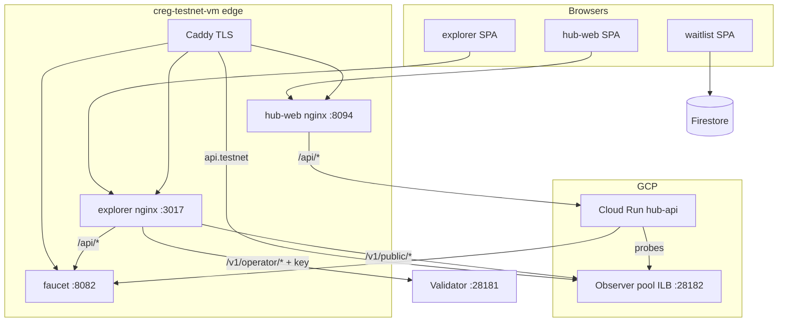

# Web Apps — Database & API System Audit

**Date:** 2026-06-12  
**Scope:** Testnet public web surfaces (`hub-web`, `hub-api`, `explorer`, faucet, waitlist) and their backing APIs (`creg-node`, edge/nginx/Caddy).  
**Environment reviewed:** `testnet.cregnet.dev` (post edge redeploy; explorer nginx → observer ILB `10.128.0.5:28182`).  
**Status:** For review — no code changes in this document.

---

## Executive summary

| Area | Verdict | Notes |
|------|---------|--------|
| **Hub database** | **Not implemented** | SQLite path/volume exist; no driver, schema, or migrations. Cloud Run uses ephemeral `/tmp/hub.db`. |
| **Hub API** | **Phase 1 scaffold** | Two public GET routes; no auth, rate limits, or CORS. Fan-out risk on `/api/status/public`. |
| **CREG node API** | **Production-grade read path** | `/v1/public/*` rate-limited; operator/validator routes ACL-protected server-side. |
| **Explorer integration** | **Functional after redeploy** | Same-origin proxy to observer pool; operator key must not ship in client bundle. |
| **Faucet** | **Operational with testnet tradeoffs** | Hot key in env on edge; PoW disabled on cloud-edge; open CORS. |
| **Waitlist** | **Firebase (client-side)** | No server DB in this repo; Firestore rules are out of scope here. |

**Top risks before wider public alpha:** (1) operator API key in explorer build args, (2) faucet hot wallet + PoW off on edge, (3) hub-api abuse amplifier, (4) hub DB/session work not started before SIWE/quests.

---

## 1. System context

| Host | Primary backend | Database |
|------|-----------------|----------|
| `api.testnet.cregnet.dev` | Observer `creg-node` | Node local state (RocksDB/sled per deploy) |
| `explorer.testnet.cregnet.dev` | nginx → observer + faucet | None (static SPA + proxies) |
| `testnet.cregnet.dev` (join hub) | hub-web + Cloud Run hub-api | hub-api: **no DB I/O** |
| `faucet.testnet.cregnet.dev` | Rust faucet service | None (chain + in-memory cooldowns) |
| `waitlist.cregnet.dev` | Firebase Hosting + Firestore | Google Firestore (external) |

---

## 2. Database audit

### 2.1 hub-api (planned SQLite)

| Item | Finding |
|------|---------|
| **Technology** | SQLite planned (`HUB_DB_PATH`, default `/data/hub.db`) |
| **Implementation** | **None** — `mkdirSync` only; no `better-sqlite3`/ORM in `hub-api/package.json` |
| **Schema** | **None** — comment defers to Phase 2 (`hub-api/src/index.ts`) |
| **Migrations** | **None** |
| **Persistence (edge)** | Docker volume `cloud-hub-db-data` in `docker-compose.cloud-edge.yml` |
| **Persistence (Cloud Run)** | `HUB_DB_PATH=/tmp/hub.db` in `deploy-hub-api-cloudrun.ps1` — **ephemeral** |
| **Health signal** | `dbPathConfigured: true` in `/api/health` implies DB readiness that does not exist yet |

**Planned tables** (from `docs/TESTNET-HUB-DESIGN.md`, not in code): sessions, nonces (TTL), quest progress (`address`, `quest_id`, `state`, `updated_at`).

**Recommendations**

1. Do not expose quest/session APIs until parameterized SQLite (or Cloud SQL) + migrations exist.
2. Align health: report `db: "not_configured"` until first migration runs.
3. For production hub-api on Cloud Run, use Cloud SQL or attach persistent disk — not `/tmp`.

### 2.2 creg-node (chain API backend)

| Item | Finding |
|------|---------|
| **Role** | Authoritative chain read/write API for explorer and public clients |
| **Storage** | Node data dir (`CREG_DATA_DIR`); pending pool persistence documented in testnet |
| **Web app coupling** | Explorer/hub-api only call HTTP; no direct DB access from frontends |

**Note:** Node DB integrity and backup are operator concerns; see `OPERATOR.md` and incident runbooks.

### 2.3 Faucet

| Item | Finding |
|------|---------|
| **Database** | **None** — cooldown state in memory; balances on Sepolia |
| **Secrets** | `FAUCET_PRIVATE_KEY` via `chain_registry_secrets` (`crates/secrets`) |
| **Edge config** | `CREG_SECRETS_BACKEND: env` in `docker-compose.cloud-edge.yml` |

### 2.4 Waitlist

| Item | Finding |
|------|---------|
| **Database** | **Firebase Firestore** (client SDK in built SPA under `testnet/waitlist/` or `Creg-waitlist/`) |
| **Repo audit** | Server-side rules and collection design not in `chain-registry/` Rust/TS API layer |
| **Action** | Separate audit of Firebase security rules and PII retention required |

### 2.5 Explorer & hub-web

No application database. Static assets + runtime fetches only.

---

## 3. API inventory

### 3.1 hub-api (`hub-api/src/index.ts`)

| Method | Path | Auth | Upstream / behavior |
|--------|------|------|---------------------|
| GET | `/api/health` | Public | Service metadata, `phase: "2"`, `dbPathConfigured` |
| GET | `/api/status/public` | Public | 6 parallel HTTP probes (node health, chain stats, faucet health/stats, spec JSON, explorer root) |

**Missing vs design** (`docs/TESTNET-HUB-DESIGN.md`): `/api/auth/nonce`, `/api/auth/verify`, `/api/auth/logout`, `/api/quests`, `PATCH /api/quests/:id`, `/api/status` (session-bound).

**Deployment exposure**

- Cloud Run: `--allow-unauthenticated` (`deploy-hub-api-cloudrun.ps1`)
- Edge compose: port `8095` published on host when hub profile enabled
- Browser path: `hub-web` nginx proxies `/api/*` → hub-api (same-origin)

### 3.2 hub-web (client)

| Call | Path | Backend |
|------|------|---------|
| Status | `GET /api/status/public` | hub-api (via nginx proxy) |
| Links | External URLs only | explorer, faucet, spec, docs (`src/config/links.ts`) |
| Wallet | — | `window.ethereum` / WalletConnect → `rpc.sepolia.org` (not CREG API) |

No SIWE session yet (`DashboardPage.tsx` / design doc Phase 2).

### 3.3 Explorer (`explorer/src/api/`)

| Client | Base | Routes |
|--------|------|--------|
| `node.js` | `VITE_API_BASE` (empty = same-origin) | `/v1/public/*` (reads), `/v1/operator/*` (ops), legacy `/v1/*` fallbacks |
| `faucet.js` | `/api/*` or `VITE_FAUCET_URL` | drip, challenge, stats |
| `relayer.js` | `/v1/relayer/*` | sponsored txs |
| `useSse.js` | `/v1/public/events` | SSE |

**Build-time flags:** `VITE_OPERATOR_API_KEY`, `VITE_NODE_ROUTE_MODE`, Sepolia contract addresses (`docker-compose.cloud-edge.yml`).

**Nginx proxy** (`testnet/nginx/explorer-fleet.conf.template`): public reads → `CREG_OBSERVER_API_UPSTREAM`; operator routes → validator `:28181` with injected `X-Operator-Key`.

### 3.4 Faucet (`crates/faucet/src/main.rs`)

| Method | Path | Auth |
|--------|------|------|
| GET | `/`, `/health` | Public |
| GET | `/api/challenge` | Public (PoW) |
| POST | `/api/drip` | PoW + cooldown (PoW **disabled** on cloud-edge) |
| GET | `/api/stats`, `/api/balance/:address`, `/api/network` | Public |
| GET | `/metrics` | Public (Prometheus) |
| POST | `/admin/pause`, `/admin/resume` | Bearer `FAUCET_ADMIN_TOKEN` |

### 3.5 creg-node (`crates/node/src/api.rs`)

| Prefix | Middleware | Purpose |
|--------|------------|---------|
| `/v1/public/*` | Rate limit, CORS | Explorer/public reads, SSE |
| `/v1/publisher/*` | Publisher auth on writes | Package submit/revoke |
| `/v1/validator/*` | Validator auth | Registration, consensus |
| `/v1/operator/*` | `private_api_acl_middleware` | Runtime, pending, metrics, P2P |
| `/v1/internal/*` | Same ACL | Block announce, admission |
| Legacy `/v1/*` | Aliases | Backward compatibility |

Operator ACL: fails closed if `CREG_OPERATOR_API_KEY` unset; `X-Operator-Key` or `Authorization: Bearer` with constant-time compare.

---

## 4. Security findings

### Critical / high

| ID | Finding | Location | Recommendation |
|----|---------|----------|----------------|
| **WAA-001** | `VITE_OPERATOR_API_KEY` baked into explorer JS | `docker-compose.cloud-edge.yml`, `explorer/Dockerfile` | Remove from build args; rely on nginx-injected key only for operator paths; never use production key in client |
| **WAA-002** | Hardcoded `docker-dev-operator-key` in nginx | `explorer-fleet.conf.template`, `explorer-hybrid.conf`, `explorer-3node.conf` | Ensure production `CREG_OPERATOR_API_KEY` is unique; rotate if ever exposed; consider removing operator routes from public explorer host |
| **WAA-003** | Faucet hot key in environment on edge VM | `docker-compose.cloud-edge.yml` (`FAUCET_PRIVATE_KEY`) | Vault backend for fleet; minimal balance; monitor `/metrics` |
| **WAA-004** | PoW disabled on cloud-edge faucet | `FAUCET_POW_DISABLED: "true"` | Re-enable PoW or add Cloud Armor / IP allowlist; tighten cooldown |
| **WAA-005** | hub-api fan-out amplifier | `GET /api/status/public` — 6 upstream fetches per request | Per-IP rate limit; cache aggregated status 30–60s; reduce probe count |

### Medium

| ID | Finding | Location | Recommendation |
|----|---------|----------|----------------|
| **WAA-006** | Faucet CORS `Any` | `crates/faucet/src/main.rs` | Restrict to known origins when PoW off |
| **WAA-007** | `X-Forwarded-For` trust for drip cooldown | Faucet IP extraction | Ensure only Caddy sets XFF; strip client-supplied hops |
| **WAA-008** | Public `/api/stats` exposes faucet address & reserves | Faucet | Accept for testnet transparency or redact in production |
| **WAA-009** | hub-api returns upstream URLs in probe JSON | `hub-api/src/index.ts` | Omit internal URLs from public responses |
| **WAA-010** | hub-api `phase` inconsistent (`health` = 2, `status` = 1) | `hub-api/src/index.ts` | Align labels with implementation phase |
| **WAA-011** | Explorer `/rpc` proxies to third-party Sepolia RPC | nginx configs | Document dependency; rate-limit at edge |
| **WAA-012** | Cloud Run hub-api publicly invokable | GCP IAM | OK for read-only status; lock down before mutating routes |

### Low / informational

| ID | Finding | Recommendation |
|----|---------|----------------|
| **WAA-013** | PWA workbox may cache legacy `/v1/chain/*` paths | Update workbox patterns for `/v1/public/*` |
| **WAA-014** | Hub wallet uses `rpc.sepolia.org`; faucet may advertise different RPC | Unify RPC in env/docs |
| **WAA-015** | No hub-api automated tests | Add smoke tests before Phase 2 auth |
| **WAA-016** | `npm ci --no-audit` in hub-api Dockerfile | Run audit in CI |

---

## 5. Data flows (user actions)

| Action | App | HTTP | Ultimate store |
|--------|-----|------|----------------|
| View blocks / packages | Explorer | `/v1/public/...` | Node observer state |
| Live SSE | Explorer | `/v1/public/events` | Node |
| Network / pending (ops UI) | Explorer | `/v1/operator/...` | Validator node |
| Request tCREG | Explorer / Faucet | `POST /api/drip` | Sepolia + faucet key |
| Hub dashboard status | Hub-web | `/api/status/public` | hub-api aggregation only |
| Connect wallet (hub) | Hub-web | — | Wallet vendor RPC |
| Waitlist signup | Waitlist | Firestore SDK | Firebase |

---

## 6. Live verification (2026-06-12)

Post-redeploy checks:

| Check | Result |
|-------|--------|
| `GET https://explorer.testnet.cregnet.dev/v1/public/health` | OK — synced, `nsjail` |
| `GET https://testnet.cregnet.dev/api/health` | OK — hub-api phase 2 |
| `publisher-quickstart-verify.ps1` | PASS |
| `GET https://waitlist.cregnet.dev/` | HTTP 200 |

---

## 7. Recommended remediation order

### Before SIWE / quests (Phase 2 hub)

1. Implement SQLite schema + migrations with **parameterized queries only**.
2. Add session middleware (HttpOnly, Secure, SameSite=Lax) per `TESTNET-HUB-DESIGN.md`.
3. Rate-limit `/api/status/public` and all `/api/auth/*` routes.
4. Remove `VITE_OPERATOR_API_KEY` from production explorer builds.
5. Fix hub health metadata (`db` state, consistent `phase`).

### Testnet hardening (parallel)

6. Re-enable faucet PoW or add edge rate limits (Cloud Armor after quota).
7. Move faucet key to Vault; fund with minimal testnet balances.
8. Audit Firebase waitlist rules (out of repo).
9. Add hub-api + explorer proxy smoke tests to `public-alpha-rehearsal.ps1`.

### Before mainnet (out of scope for testnet audit)

10. Cloud SQL or managed DB for hub; no hot keys on edge VMs.
11. Separate operator tooling from public explorer host.

---

## 8. Key file index

| Component | Path |
|-----------|------|
| Hub API | `chain-registry/hub-api/src/index.ts` |
| Hub design (target DB/API) | `docs/TESTNET-HUB-DESIGN.md` |
| Hub web status client | `chain-registry/hub-web/src/api/status.ts` |
| Hub web proxy | `chain-registry/hub-web/nginx.conf` |
| Explorer API client | `chain-registry/explorer/src/api/node.js` |
| Explorer nginx (fleet) | `chain-registry/testnet/nginx/explorer-fleet.conf.template` |
| Node routes + ACL | `chain-registry/crates/node/src/api.rs` |
| Faucet service | `chain-registry/crates/faucet/src/main.rs` |
| Secrets abstraction | `chain-registry/crates/secrets/src/lib.rs` |
| Cloud edge compose | `chain-registry/testnet/docker-compose.cloud-edge.yml` |
| Caddy fleet | `chain-registry/testnet/caddy/Caddyfile.fleet` |
| Hub edge Caddy | `chain-registry/testnet/caddy/hub-edge.caddy.example` |
| Cloud Run deploy | `chain-registry/testnet/gcp/deploy-hub-api-cloudrun.ps1` |

---

## 9. Review sign-off

| Role | Name | Date | Notes |
|------|------|------|-------|
| Author | Automated audit | 2026-06-12 | Initial report |
| Engineering | | | |
| Security | | | |

---

*Next review trigger: hub-api Phase 2 (SIWE + SQLite), Cloud Armor enabled, or Firebase rules change.*
