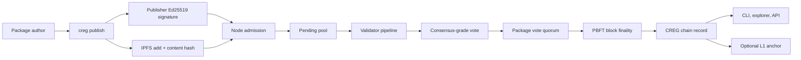
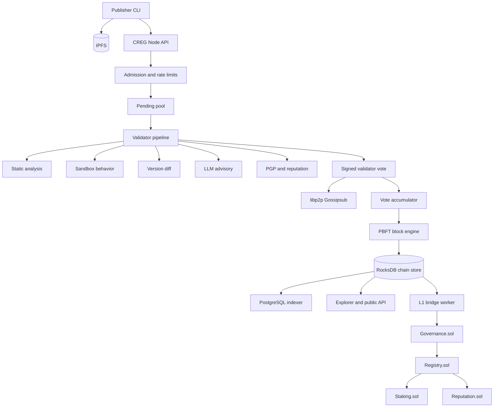

# Chain Registry (CREG) Technical Whitepaper

> Version: 0.2.0-public-alpha  
> Date: 2026-06-15  
> Network: `creg-testnet-1` on Ethereum Sepolia  
> Status: Public alpha testnet, not mainnet  
> Repository: [chain-registry-blockchain-CREG-](https://github.com/samuel-1-avson/chain-registry-blockchain-CREG-)  
> Related docs: [Public testnet quickstart](./PUBLIC_TESTNET_QUICKSTART.md), [phase scope](./TESTNET_PHASE_SCOPE.md), [readiness gates](./L2_PUBLIC_ALPHA_GATE_STATUS.md)

This whitepaper is technical documentation for the Chain Registry public alpha. It is not an offer to sell tokens, investment advice, or a claim of mainnet economic security. The external security audit track, SEC-401, remains open; production and mainnet claims require audit closure, operational hardening, and legal/compliance review.

## Abstract

Modern software depends on package registries whose trust model is often centered on publisher accounts, centralized registry infrastructure, and local package-manager policy. Chain Registry (CREG) introduces an evidence-backed, validator-consensus package registry for open software ecosystems. Publishers submit signed, content-addressed packages; validators reproduce security analysis in isolated environments; consensus-grade votes bind the package identifier, content hash, scanner profile, and evidence digest; finalized records are written to a PBFT-backed chain and can be anchored to Ethereum L1.

CREG is not a promise that malicious code can never pass a registry. It is a protocol for reducing single-party trust, making package risk evidence transparent, and turning package approval into an auditable, economically accountable network decision.

## 1. Executive Summary

Chain Registry is a decentralized package-integrity network for software supply chains. Its first public alpha targets package publishers, developers, validators, and security researchers who want a verifiable package status layer across ecosystems such as npm, PyPI, Cargo, and similar registries.

CREG combines six ideas:

1. Content-addressed package submission using IPFS CIDs and cryptographic content hashes.
2. Publisher and validator staking on Ethereum Sepolia through CREG testnet contracts.
3. Multi-stage validator analysis, including static rules, sandbox behavior, diff analysis, pinned vulnerability data, PGP checks, reputation, and optional LLM-assisted review.
4. PBFT-style validator consensus with Ed25519 domain-separated signatures and explicit evidence metadata.
5. A local CREG chain for fast package finality, with optional Ethereum L1 anchoring through governance-controlled contracts and Groth16 proof infrastructure.
6. Public alpha operations with signed chain specs, documented limitations, security runbooks, malicious fixture testing, and readiness gates.

The design goal is practical: a developer should be able to ask, "Was this exact package artifact verified by a quorum of accountable validators, under which rules, with which evidence, and is the content still available?"

## 2. Problem Definition

Software supply-chain attacks frequently exploit gaps between identity, artifact integrity, package-manager behavior, and end-user trust. A compromised maintainer account, stolen API token, malicious dependency update, obfuscated install script, or typosquat can reach downstream developers quickly. Traditional registry trust models often make one organization or one publisher credential the effective root of trust for package availability and install decisions.

The core problems CREG addresses are:

| Problem | Why it matters | CREG response |
| --- | --- | --- |
| Publisher account compromise | A legitimate account can publish hostile artifacts | Require package signatures, on-chain publisher stake, and validator verification before "verified" status |
| Registry centralization | One registry policy or outage can control package trust | Store independent package verdicts on a validator chain with public proofs |
| Weak artifact reproducibility | Users may not know which exact bytes were reviewed | Bind verdicts to canonical package id, content hash, manifest hash, and IPFS CID |
| Non-transparent security review | Scanners may produce opaque or non-reproducible decisions | Attach scanner profile digests, evidence digests, and findings to validator votes |
| Validator or reviewer capture | A single reviewer can be wrong or malicious | Require quorum from staked validators and expose vote metadata |
| Content disappearance | Content-addressed hashes do not guarantee bytes remain retrievable | Use operator pinning, availability checks, and future pinning incentives |

CREG is a package verdict layer, not a replacement for source review, reproducible builds, dependency minimization, or secure runtime controls. It complements those practices by making package approval accountable and machine-verifiable.

## 3. Design Principles

### 3.1 Evidence Before Reputation

Publisher reputation matters, but package approval should be grounded in evidence about a specific artifact. CREG votes bind to the package canonical id, content hash, scanner profile digest, and evidence digest. A package with the same name and version but different bytes is a different trust object.

### 3.2 Determinism For Consensus

Consensus decisions must not depend on live, inconsistent external calls. CREG separates consensus-grade evidence from advisory evidence. Pinned local snapshots, deterministic scanners, and reproducible sandbox profiles can contribute to quorum; live lookups and LLM analysis are advisory unless converted into a pinned, reproducible evidence source.

### 3.3 Defense In Depth

No scanner catches all malware. CREG combines static analysis, sandbox behavior, diffing, ecosystem-specific rules, vulnerability signals, reputation, optional human/auditor workflows, revocation, and appeal mechanisms.

### 3.4 Transparent Trust Assumptions

The whitepaper and public docs must state where CREG is strong, where it is alpha, and where it depends on external controls such as validator diversity, IPFS pinning, Ethereum L1 availability, key management, and external audits.

### 3.5 Progressive Decentralization

The public alpha starts as a coordinated testnet with visible readiness gates. Mainnet-class decentralization requires a larger independent validator set, closed audit findings, governance operations, monitoring, and legal/compliance review.

## 4. Network Roles

| Role | Responsibility | Trust boundary |
| --- | --- | --- |
| Publisher | Signs and submits package artifacts; stakes tCREG before publishing | Must protect Ed25519 publish key and Ethereum EOA |
| Validator | Runs the analysis pipeline, signs votes, participates in PBFT finality | Must run the agreed scanner profile and sandbox configuration |
| Observer | Syncs state and serves read APIs without voting | Useful for public reads and indexers; not a trust root for package approval |
| Developer / consumer | Queries package status, installs with `creg`, verifies proofs | Chooses which CREG endpoint and policy to trust |
| Governance signer | Controls emergency and protocol parameters through contracts | Must protect multisig keys and avoid unilateral control |
| Auditor / researcher | Reviews contracts, circuits, protocol, and evidence | Not part of runtime consensus, but critical for confidence |
| Pinning operator | Keeps content-addressed package bytes retrievable | Availability depends on replication and pinning |

## 5. Protocol Overview

### 5.1 Lifecycle



The protocol moves package records through a small state machine:

| State | Meaning |
| --- | --- |
| `UNKNOWN` | The node has no package record and no pending submission |
| `pending` | The node admitted the package and it awaits validator finality |
| `verified` | A validator quorum accepted the package and the local CREG chain stored it |
| `revoked` | Governance or the publisher revoked the package, or consensus rejected it |

On the public alpha, "verified" means the queried CREG node's chain store has accepted the package after validator workflow. Users should set `CREG_NODE_URL` to a public or operator endpoint they trust and should read [TESTNET_PHASE_SCOPE.md](./TESTNET_PHASE_SCOPE.md) for current semantics.

### 5.2 Publish Path

1. The publisher prepares a package artifact and manifest.
2. The CLI computes a content hash and pins or uploads the artifact to IPFS.
3. The publisher signs the canonical payload with an Ed25519 key generated by `creg keygen`.
4. The publisher's Ethereum EOA must have publisher stake in `Staking.sol`.
5. The node verifies admission requirements, stores the package as pending, and exposes pending status.

### 5.3 Validation Path

Validators fetch the exact artifact bytes by CID, verify hashes, execute the security pipeline, produce a deterministic risk summary, sign a vote, and gossip it to the validator set. A vote is consensus-grade only when it includes complete bundle refs, a non-degraded scanner profile, and a non-empty evidence digest.

### 5.4 Finality Path

CREG uses two related consensus layers:

| Layer | Purpose | Signature domain |
| --- | --- | --- |
| Package vote accumulator | Decides whether a package can become verified | `creg-vote-v2` |
| Block PBFT engine | Finalizes CREG chain blocks containing package records | `creg-pbft-v1` |

For production-sized validator sets, quorum follows the usual PBFT threshold of `floor(2n/3) + 1`. Small coordinated testnet clusters use explicit configuration where documented; these testnet shortcuts are not mainnet assumptions.

### 5.5 Install And Verify Path

Developers use the `creg` CLI to query package status before installation. The CLI and resolver can use light-client proof paths where available, including package records, Merkle proofs, and PBFT signatures. Package-manager shims are available, but the public docs recommend direct `creg install` for stricter policy.

## 6. System Architecture



### 6.1 Implementation Stack

| Layer | Current implementation |
| --- | --- |
| Node runtime | Rust, Tokio, axum, tonic |
| Networking | libp2p Gossipsub and peer discovery |
| Chain storage | RocksDB with package indexes |
| Indexing | PostgreSQL via `db-sync` |
| Consensus | PBFT block finality and package vote accumulator |
| Signatures | Ed25519 for package/vote/PBFT paths; secp256k1 EOA for Ethereum contracts |
| Content addressing | IPFS CIDs and SHA-256 content hashes |
| Contracts | Solidity on Sepolia: Registry, Staking, Governance, Reputation, CREG token, ZK verifier |
| ZK | Groth16/Circom experiments for package attestations and double-sign evidence |
| Observability | Prometheus, Grafana, alerts, health endpoints |
| User tools | `creg` CLI, explorer, hub docs, testnet runbooks |

## 7. Package Record And Evidence Model

A CREG package record centers on a canonical package id:

```text
<ecosystem>:<name>@<version>
```

Examples:

```text
npm:example@1.2.3
pypi:example@1.2.3
cargo:example@1.2.3
```

The current implementation uses package ids, content hashes, IPFS CIDs, publisher metadata, validator signatures, scanner profile digests, evidence digests, and chain metadata. The key invariant is that validator decisions are bound to exact artifact bytes and the evidence profile used to evaluate them.

| Field | Purpose |
| --- | --- |
| Canonical id | Stable package key across API, contracts, CLI, and explorer |
| Content hash | Binds the verdict to exact artifact bytes |
| IPFS CID | Content-addressed retrieval path |
| Manifest hash | Binds declared package metadata where available |
| Publisher signature | Proves package submission authority under the publisher Ed25519 key |
| Publisher EOA | Binds submission to on-chain stake |
| Scanner profile digest | Commits to rule/model/profile versions used by the validator |
| Evidence digest | Commits to deterministic findings used in the vote |
| Validator signature | Commits a validator's approval or rejection vote |
| PBFT signatures | Commit finalized blocks to validator consensus |
| L1 references | Optional transaction hashes, contract addresses, and state roots |

## 8. Validator Security Pipeline

CREG's validator pipeline is designed to make package approval hard to fake and easy to audit.

### 8.1 Admission

Before a package enters consensus, admission checks include:

- Publisher signature verification.
- On-chain publisher stake check.
- Canonical id and content-hash validation.
- IPFS fetchability checks.
- Rate limits and operator API controls.
- Pre-mempool rule gates for high-risk patterns.

### 8.2 Static Analysis

Static analysis examines package contents for dangerous APIs, install hooks, obfuscation, credential exfiltration patterns, typosquatting signals, ecosystem-specific files, high-entropy blobs, pinned vulnerability advisories, and scanner rule matches. Consensus-relevant analysis uses pinned or local data where possible so different validators can reproduce results.

### 8.3 Behavioral Sandbox

The sandbox stage executes package behavior under controlled isolation. The preferred public profile uses `nsjail`; fallback engines include gVisor, Docker, and WASM where configured. The public alpha gate requires `CREG_DEV_SANDBOX=false` for public validators and health reporting of the active sandbox engine.

Sandbox evidence can include observed network hosts, filesystem writes, process spawns, timeouts, and manifest violations.

### 8.4 Differential Analysis

Validators compare a new version against prior verified behavior. A package update that adds a new network beacon, install script, filesystem write, or obfuscated code path can receive elevated risk even if each behavior is not independently conclusive.

### 8.5 Vulnerability And Malware Signals

The validator stack supports YARA-style rules, threat-intel hashes, and OSV advisory data. Live external lookups are kept out of the deterministic consensus path unless they are pinned or otherwise made reproducible. This aligns with the principle that consensus should not depend on inconsistent third-party responses.

### 8.6 PGP, Reputation, And Publisher Context

CREG can verify detached PGP signatures and track publisher/validator reputation. Reputation influences review context, but it does not replace package-specific evidence.

### 8.7 LLM-Assisted Review

LLM analysis can summarize semantic risk, explain suspicious files, and help human reviewers triage packages. It is advisory. LLM output is not the trust root for package approval, and public surfaces must label it separately from deterministic consensus findings.

## 9. Consensus And Finality

### 9.1 Validator Vote Message

Package votes are signed over a domain-separated message that includes:

```text
creg-vote-v2|<canonical>|<content_hash>|<approved>|<validator_pubkey>|<scanner_profile_digest>|<evidence_digest>
```

This design prevents a validator signature from being reused across a different package, content hash, evidence profile, or approval decision.

### 9.2 Consensus-Grade Votes

A vote must be complete and non-degraded to count toward quorum. Votes missing evidence metadata may remain visible for transparency, but they should not satisfy package finality.

Consensus-grade requirements include:

- Known active validator.
- Valid Ed25519 signature.
- Non-empty evidence digest.
- Complete analysis bundle references.
- Scanner profile that is not in degraded/mock mode.
- Agreement among quorum votes on the evidence/profile bundle.

### 9.3 PBFT Block Finality

Finalized package decisions become CREG chain transactions. The block-level PBFT engine runs PRE-PREPARE, PREPARE, and COMMIT phases with Ed25519 signatures under the `creg-pbft-v1` domain. Blocks include transaction roots, validator-set hashes, and PBFT signatures for light-client verification.

The security assumption is standard for PBFT-style systems: safety depends on fewer than one third of validator voting power being Byzantine, plus network assumptions appropriate for timely view changes. CREG's alpha uses coordinated operators while the validator set expands.

### 9.4 Validator Set

The signed chain spec contains bootstrap validator information, while validator admission and validator-set sync connect to L1 staking state. Validator admission can be approved by governance in emergency paths or by validator consensus under the staking contract's consensus admission rules.

## 10. Ethereum L1 Contracts

CREG uses Ethereum Sepolia for the public alpha contract layer. The contract system is intended to provide staking, registry status, governance, reputation, and optional proof verification.

| Contract | Role |
| --- | --- |
| `CregToken.sol` | ERC-20-like CREG token with hard cap and permit support |
| `Staking.sol` | Publisher/validator stake, validator lifecycle, unbonding, slashing |
| `Registry.sol` | L1 package lifecycle, finalize/revoke paths, ZK proof entry points |
| `Governance.sol` | M-of-N governance, emergency pause, controlled administrative execution |
| `Reputation.sol` | Validator/publisher scoring signals |
| `Appeal.sol` | On-chain appeal mechanics for contested rejections |
| `ZKVerifier.sol` / `Groth16Verifier.sol` | Groth16 verification path |

The active Sepolia addresses are published in [`chain-spec.sepolia.json`](../chain-registry/testnet/chain-spec.sepolia.json) and summarized in the [public quickstart](./PUBLIC_TESTNET_QUICKSTART.md). Contract and ZK systems must complete external security review before they are used for mainnet economic claims.

## 11. Token And Incentive Design

The CREG token is used in the current testnet contract system for publisher staking, validator staking, slashing, and governance-controlled ecosystem growth.

### 11.1 Current Contract Parameters

| Parameter | Current value |
| --- | --- |
| Token symbol | `CREG` |
| Token decimals | 18 |
| Maximum supply | 42,000,000 CREG |
| Initial minted supply | 20,000,000 CREG |
| Contract reserve capacity | 22,000,000 CREG, mintable only up to the cap by owner/governance |
| Public alpha publisher minimum | 1 tCREG |
| Public alpha validator minimum | 100 tCREG |
| Testnet max validators | 50 |
| Validator unbonding period | 14 days |
| Restake cooldown after ejection | 7 days |
| Slash tiers | 2%, 10%, 30% for low, medium, critical severity |

### 11.2 Initial Allocation In Current Token Contract

The current contract constructor mints:

| Bucket | Amount |
| --- | --- |
| Team | 4,000,000 CREG |
| Investors | 3,000,000 CREG |
| Community | 5,000,000 CREG |
| Treasury | 8,000,000 CREG |
| Future capped mint capacity | Up to 22,000,000 CREG |

These are implementation parameters in the current contract tree, not a public-sale term sheet. Any mainnet token distribution, sale, or incentive program requires separate legal, governance, and disclosure work.

### 11.3 Economic Logic

CREG incentives are designed around accountability:

- Publishers stake to submit packages; malicious or revoked packages can expose stake to penalties.
- Validators stake to participate in verification; bad votes, false approvals, or double-signing evidence can expose validator stake.
- Slashed funds are not simply burned in the current staking design; they can be distributed to honest validators through reputation-weighted mechanisms.
- Pinning rewards are planned as a path to improve long-term content availability.

The economic model is still alpha. Mainnet economics must be validated with independent modeling, adversarial review, and jurisdiction-specific legal advice.

## 12. Governance

CREG governance exists across off-chain protocol operations and on-chain administrative authority.

Current governance responsibilities include:

- Contract parameter updates.
- Emergency pause and unpause flows.
- Relay allowlists where enforcement is enabled.
- Validator admission emergency paths.
- ZK verifier key rotation.
- Security incident response.
- Audit scope, remediation, and release gating.

The governance system uses M-of-N signer patterns and pause co-signing. Progressive decentralization should reduce maintainer concentration by expanding independent validators, formalizing public governance procedures, and publishing audit/remediation artifacts.

## 13. Availability And Data Retention

CREG separates verdict integrity from content availability. The chain can prove that a package record was accepted, but developers still need the package bytes.

IPFS provides content addressing, not automatic permanence. Package bytes remain available only if they are pinned or otherwise replicated. The public alpha readiness plan therefore includes:

- Operator pinning of accepted package CIDs.
- Scheduled CID availability checks.
- Public API/explorer availability fields.
- Publisher pinning guidance.
- Future redundant pinning and pinning-reward design.

This distinction is essential: a verified package can still become unavailable if nobody stores it.

## 14. Privacy And Shielded Publish

CREG includes experimental shielded publish and threshold-encryption scaffolding. In the current public alpha chain spec, cross-chain features and threshold encryption are disabled, and shielded publish is not a production privacy claim.

The intended future model is:

- Publishers can submit encrypted packages for validator-only review.
- Validators decrypt through threshold-controlled shares.
- Public records reveal the final package verdict and required commitments, not unnecessary private content.

This path requires additional implementation, audit, key-management design, and operational review before it can be represented as a production privacy feature.

## 15. ZK System

CREG uses Groth16 proof infrastructure for two categories:

| Circuit / proof area | Intended role |
| --- | --- |
| Package validation attestations | Prove selected package-safety constraints without revealing all package contents |
| Double-sign evidence | Prove conflicting validator votes for slashing workflows |
| Rollup batch proofing | Support L1 anchoring of CREG chain state transitions |

ZK is powerful but security-sensitive. The current public alpha treats ZK as active infrastructure and experimental proof support, not a substitute for external audit. Trusted setup, verification-key management, circuit constraints, and contract bindings must be reviewed before ZK proofs become a primary production trust root.

## 16. Security Model

### 16.1 Threats In Scope

| Threat | Mitigation |
| --- | --- |
| Unstaked publisher submits a package | On-chain publisher stake check |
| Package bytes differ from reviewed bytes | Content hash and CID binding |
| Fake validator vote | Active validator set plus Ed25519 signature verification |
| Degraded scanner participates in quorum | Consensus-grade vote filter |
| LLM false positive or false negative | LLM output stays advisory |
| Malicious package update | Static, sandbox, diff, and revocation workflows |
| Validator double-signing | Evidence and slashing design |
| Public API abuse | Rate limits, operator ACLs, monitoring |
| Chain-spec substitution | Signed chain spec with pinned public key |
| IPFS content loss | Pinning service, availability checks, future incentives |

### 16.2 Threats Not Fully Solved

| Threat | Current status |
| --- | --- |
| Validator cartel above quorum threshold | Reduced by staking, transparency, and diversity; not eliminated |
| Novel malware missed by scanners | Reduced by defense in depth; not eliminated |
| L1 contract bug before audit | SEC-401 external audit is open |
| ZK circuit or trusted setup flaw | Requires dedicated ZK audit and key-management review |
| Long-range sync attacks | Historical validator-set verification remains a hardening item |
| IPFS unavailability | Requires redundant pinning and monitoring |
| Legal/regulatory uncertainty | Requires jurisdiction-specific review before token or mainnet programs |

## 17. Standards And Research Alignment

CREG draws from blockchain, distributed systems, and software supply-chain security research.

| Source area | How CREG applies it |
| --- | --- |
| Bitcoin-style append-only ledgers | Hash-linked records and public verification of history |
| Ethereum-style smart contracts | Stake, governance, registry, and verifier contracts |
| PBFT and Tendermint-family consensus | Quorum finality among known validators |
| NIST SSDF | Secure development, vulnerability handling, and release discipline |
| SLSA | Provenance-minded thinking for artifact integrity and reproducibility |
| The Update Framework | Threshold trust, metadata, and rollback/freeze awareness |
| IPFS | Content addressing with explicit pinning requirements |
| OSV and OpenSSF ecosystem work | Vulnerability intelligence and security-score signals |
| Groth16 and Circom | Succinct proof experiments for package attestations and slashing evidence |
| MiCA-style disclosure awareness | Clear risk disclosure for crypto-asset public communication where applicable |

CREG does not claim conformance certification to these frameworks. They are design references and evaluation lenses.

## 18. Public Alpha Status

As of 2026-06-15, CREG is in public alpha testnet scope.

| Area | Current public-alpha status |
| --- | --- |
| Public API | Live at `https://api.testnet.cregnet.dev` |
| Network | `creg-testnet-1` on Sepolia |
| Release binaries | `v0.1.1-testnet` referenced by public docs |
| Real sandbox | Public readiness gate passed with `nsjail` profile |
| Malicious fixture suite | Public readiness gate passed |
| IPFS availability checks | Public readiness gate passed |
| Incident response runbook | Drafted and linked in docs |
| External audit | SEC-401 scope ready; vendor/start date TBD |
| Mainnet | Not launched |

The immediate public-alpha operating principle is simple: invite participation while keeping all public claims bounded by testnet status, known limitations, and audit state.

## 19. Roadmap

### Phase A: Public Alpha Hardening

- Complete SEC-401 external audit booking.
- Maintain real sandbox enforcement on public validators.
- Keep malicious fixture regression tests current.
- Keep public endpoints, IPFS checks, and readiness gates green.
- Publish clear whitepaper, docs, and external copy with alpha framing.

### Phase B: Public Beta Candidate

- Complete external audit and remediate critical/high findings.
- Expand independent validator operators.
- Improve validator reputation and vote transparency.
- Exercise L1 bridge anchoring in soak conditions.
- Strengthen governance API/indexing and monitoring.
- Add redundant pinning and availability incentives.

### Phase C: Mainnet Candidate

- Finalize token economics and governance model.
- Publish audit report summary and residual risk register.
- Harden key management through KMS/Vault/HSM-backed operations.
- Complete ZK and contract deployment checklist.
- Establish incident response, revocation, and communication processes.
- Complete legal/compliance review for any token distribution or public offering.

## 20. Risk Disclosure

CREG is security infrastructure. It should be evaluated with a conservative mindset.

Key risks:

- A package marked verified can still contain malicious behavior missed by validators.
- A validator quorum can collude or make correlated mistakes.
- Public alpha infrastructure can degrade, restart, or expose inconsistent pending state.
- IPFS content must be pinned to remain retrievable.
- L1 contract and ZK systems are not externally audited yet.
- Token parameters are alpha implementation details, not finalized mainnet economics.
- Regulatory requirements may apply to any future token sale, public distribution, or mainnet launch.

Users should not treat alpha verification as a guarantee of package safety. Validators, auditors, and developers should treat the current network as a live testbed for improving the protocol.

## 21. Conclusion

Chain Registry reframes package trust as a consensus and evidence problem. Instead of asking developers to trust only a publisher account or a centralized registry, CREG asks a network of staked validators to review exact package bytes, sign reproducible evidence, finalize the result, and expose the record for verification.

The public alpha is already more than a concept: it includes a Rust node, CLI, contracts, validator pipeline, PBFT finality, public testnet endpoints, IPFS integration, readiness gates, and security runbooks. The next step is not louder marketing; it is deeper assurance: external audit, independent validators, stronger operations, and continued discipline around honest public claims.

## Appendix A: Current Public Alpha Parameters

| Parameter | Value |
| --- | --- |
| CREG chain id | `creg-testnet-1` |
| L1 network | Ethereum Sepolia |
| Sepolia chain id | `11155111` |
| Block time target | 5 seconds |
| Vote timeout | 10 seconds |
| Quorum percentage | 67 |
| Publisher minimum stake | 1 tCREG |
| Validator minimum stake | 100 tCREG |
| Max validators | 50 |
| Validator unbonding | 14 days |
| Slash low | 2% |
| Slash medium | 10% |
| Slash critical | 30% |
| ZK validation flag | Enabled in current spec |
| ML validation flag | Enabled in current spec |
| WASM sandbox flag | Enabled in current spec |
| Cross-chain flag | Disabled |
| Insurance flag | Disabled |
| Threshold encryption flag | Disabled |

Source: [`chain-spec.sepolia.json`](../chain-registry/testnet/chain-spec.sepolia.json)

## Appendix B: Glossary

| Term | Meaning |
| --- | --- |
| CREG | Chain Registry protocol and token symbol |
| Canonical id | Stable package id such as `npm:name@1.0.0` |
| CID | IPFS content identifier |
| Consensus-grade vote | Vote with valid validator identity, signature, scanner profile, and evidence digest |
| Evidence digest | Hash commitment to deterministic findings used by validators |
| PBFT | Practical Byzantine Fault Tolerance; quorum-based finality protocol |
| Publisher | Account that submits packages and stakes CREG/tCREG |
| Validator | Staked operator that analyzes packages and signs votes |
| Observer | Read-only node serving API/indexer use cases |
| tCREG | Testnet CREG token used on Sepolia |
| L1 | Ethereum Sepolia in the current alpha |
| ZK | Zero-knowledge proof infrastructure, currently Groth16/Circom-based |

## References

### Project References

- [Public testnet quickstart](./PUBLIC_TESTNET_QUICKSTART.md)
- [Testnet phase scope](./TESTNET_PHASE_SCOPE.md)
- [L2 public alpha gate status](./L2_PUBLIC_ALPHA_GATE_STATUS.md)
- [CREG limitations public readiness plan](./CREG_LIMITATIONS_PUBLIC_READINESS_PLAN.md)
- [Testnet readiness report](../chain-registry/TESTNET_READINESS_REPORT.md)
- [Deep dive technical analysis](../chain-registry/DEEP_DIVE_ANALYSIS.md)
- [External audit scope](./SEC-401-AUDIT-SCOPE.md)
- [Wallet key derivation](./WALLET_KEY_DERIVATION.md)
- [ZK circuits README](../circuits/README.md)
- [Current Sepolia chain spec](../chain-registry/testnet/chain-spec.sepolia.json)

### External Research And Standards

- Satoshi Nakamoto, "Bitcoin: A Peer-to-Peer Electronic Cash System": https://bitcoin.org/bitcoin.pdf
- Gavin Wood, "Ethereum: A Secure Decentralised Generalised Transaction Ledger": https://ethereum.github.io/yellowpaper/paper.pdf
- Tendermint consensus documentation: https://docs.tendermint.com/master/spec/consensus/consensus.html
- NIST SP 800-218, Secure Software Development Framework: https://nvlpubs.nist.gov/nistpubs/SpecialPublications/NIST.SP.800-218.pdf
- SLSA specification v1.2: https://slsa.dev/spec/v1.2/
- The Update Framework specification: https://theupdateframework.github.io/specification/latest/
- IPFS pinning documentation: https://docs.ipfs.tech/how-to/pin-files/
- OSV vulnerability database documentation: https://google.github.io/osv.dev/
- Groth16 paper: https://eprint.iacr.org/2016/260
- Circom documentation: https://docs.circom.io/
- Regulation (EU) 2023/1114 on markets in crypto-assets: https://data.europa.eu/eli/reg/2023/1114/oj
