# Chain Registry — The Full Details of the Project

> **Audience:** Software engineers, operators, and contributors joining the Chain Registry codebase.  
> **Version:** 0.1.0 (`creg-testnet-1`, phase `alpha`)  
> **Last updated:** 2026-06-08  
> **Repository layout:** Application code lives under `chain-registry/`; cross-cutting docs under `docs/`.

---

## Table of Contents

1. [What This Project Is](#1-what-this-project-is)
2. [Repository Map](#2-repository-map)
3. [Technology Stack](#3-technology-stack)
4. [System Architecture (High Level)](#4-system-architecture-high-level)
5. [End-to-End Workflows](#5-end-to-end-workflows)
6. [Layer 1 — Ethereum Settlement](#6-layer-1--ethereum-settlement)
7. [Layer 2 — Cross-Chain Scaffolding](#7-layer-2--cross-chain-scaffolding)
8. [Blockchain / Consensus Layer (Off-Chain Chain)](#8-blockchain--consensus-layer-off-chain-chain)
9. [Validator Pipeline (Security Core)](#9-validator-pipeline-security-core)
10. [Serialization & Canonicalization](#10-serialization--canonicalization)
11. [API Layer (REST, gRPC, JSON-RPC)](#11-api-layer-rest-grpc-json-rpc)
12. [Frontend & Explorer System](#12-frontend--explorer-system)
13. [Wallet & Key Management](#13-wallet--key-management)
14. [CLI & Package Manager Integration](#14-cli--package-manager-integration)
15. [Storage & Indexing](#15-storage--indexing)
16. [IPFS & Content Addressing](#16-ipfs--content-addressing)
17. [ZK, ML, and WASM Subsystems](#17-zk-ml-and-wasm-subsystems)
18. [Supporting Services (Faucet, Relayer, Secrets)](#18-supporting-services-faucet-relayer-secrets)
19. [Infrastructure & Deployment](#19-infrastructure--deployment)
20. [Observability](#20-observability)
21. [Configuration Reference](#21-configuration-reference)
22. [How to Contribute](#22-how-to-contribute)
23. [Known Limitations & Alpha Posture](#23-known-limitations--alpha-posture)
24. [Glossary](#24-glossary)
25. [Further Reading](#25-further-reading)

---

## 1. What This Project Is

### 1.1 Problem

Traditional package registries (npm, PyPI, Cargo, RubyGems, Maven) rely on **single-authority trust**: one compromised maintainer, stolen token, or unreviewed merge can ship malicious code to millions of consumers. Historical incidents (`event-stream`, SolarWinds, XZ Utils, `ua-parser-js`) all exploit this model.

### 1.2 Solution

**Chain Registry** replaces single-authority trust with a **decentralized Byzantine-Fault-Tolerant (BFT) validator network**. Every package must pass independent analysis and earn a `⌊2n/3⌋+1` PBFT quorum of economically staked validators before it is marked **Verified**. Packages are content-addressed on **IPFS**, chain state is stored in **RocksDB**, and periodic state roots are anchored to **Ethereum L1** (Sepolia testnet today) via a Groth16 rollup bridge.

### 1.3 Current Operational Status

| Item | Value |
|------|-------|
| Network ID | `creg-testnet-1` |
| Phase | `alpha` |
| L1 | Ethereum Sepolia (chain id `11155111`) |
| Primary deploy path | `chain-registry/docker-compose.yml` |
| Chain spec | `chain-registry/testnet/chain-spec.sepolia.json` (Ed25519-signed, served over HTTPS) |
| Default ports | Node API `8090`, Explorer `3007`, Faucet `8082`, Relayer `8083`, Indexer `8084` |

Treat testnet deployments as **alpha**: core publish→validate→consensus→index flows work end-to-end, but ZK soundness, some contract edge cases, and cross-chain features remain incomplete.

---

## 2. Repository Map

```
chain-registry/                          ← Git repository root
├── README.md                            ← Top-level entrypoint
├── the full details of the project.md   ← This document
├── docs/                                ← Cross-cutting documentation
│   ├── README.md                        ← Doc index
│   ├── PUBLIC_TESTNET_QUICKSTART.md
│   ├── TESTNET_SEPOLIA_RUNBOOK.md
│   ├── WALLET_KEY_DERIVATION.md
│   └── adr/                             ← Architecture decision records
├── circuits/                            ← Root-level Circom ZK circuits
└── chain-registry/                      ← **Main application monorepo**
    ├── Cargo.toml                       ← Rust workspace (17 crates)
    ├── crates/                          ← All Rust libraries & binaries
    ├── contracts/                       ← Solidity 0.8.24 (Foundry)
    ├── explorer/                        ← React 19 web UI
    ├── testnet/                         ← Chain specs, compose stacks, deploy scripts
    ├── config/                          ← Sandbox, L2, relayer policy, release assurance
    ├── k8s/                             ← Kubernetes manifests
    ├── observability/                   ← Prometheus, Grafana, Loki, Tempo
    ├── migrations/                      ← PostgreSQL schema for indexer
    ├── scripts/                         ← Install, smoke, soak helpers
    ├── circuits/                        ← ZK circuits (copied into Docker image)
    ├── models/                          ← ONNX ML artifacts
    ├── ml/                              ← ML training scripts
    ├── validators/                      ← WASM validator modules
    ├── docker-compose*.yml              ← Deployment profiles
    ├── Dockerfile                       ← Multi-stage: Node frontend + Rust runtime
    └── DEEP_DIVE_ANALYSIS.md            ← Prior technical analysis + issue registry
```

### 2.1 Rust Workspace Crates

| Crate | Path | Responsibility |
|-------|------|----------------|
| `common` | `crates/common` | Shared types, chain-spec (JCS), package IDs, protobuf codegen |
| `chain-registry-node` | `crates/node` | Validator node: REST, gRPC, P2P, bridge, block producer |
| `chain-registry-cli` | `crates/cli` | `creg` CLI + npm/pip/cargo/gem/mvn shims |
| `consensus` | `crates/consensus` | PBFT engine, vote accumulator, VRF, evidence votes |
| `validator` | `crates/validator` | 3-stage validation pipeline orchestration |
| `zk-validator` | `crates/zk-validator` | Groth16 proof generation/verification (arkworks) |
| `ml-validator` | `crates/ml-validator` | YARA-X deep scan, threat intel, ONNX (degraded mode) |
| `wasm-sandbox` | `crates/wasm-sandbox` | WASM validator engine |
| `resolver` | `crates/resolver` | Install-time trust resolution, sled cache, light client |
| `threshold-encryption` | `crates/threshold-encryption` | Shielded publish (disabled on testnet) |
| `cross-chain` | `crates/cross-chain` | Multi-chain client scaffolding (disabled on testnet) |
| `insurance` | `crates/insurance` | Package insurance risk/claims (disabled on testnet) |
| `db-sync` | `crates/db-sync` | RocksDB → PostgreSQL indexer |
| `ipfs-pinner` | `crates/ipfs-pinner` | IPFS pinning + on-chain rewards |
| `faucet` | `crates/faucet` | Sepolia testnet token faucet |
| `relayer` | `crates/relayer` | Sponsored stake / paymaster |
| `secrets` | `crates/secrets` | Hot key loading for bridge, faucet, relayer |

### 2.2 Node Binaries

| Binary | Source | Purpose |
|--------|--------|---------|
| `creg-node` | `crates/node` | Main validator / observer node |
| `creg-indexer` | `crates/node` (feature) | PostgreSQL indexer sync |
| `dump-openapi` | `crates/node` | Export OpenAPI spec |

### 2.3 CLI Binaries

| Binary | Purpose |
|--------|---------|
| `creg` | Primary CLI (27+ commands) |
| `npm`, `pip`, `cargo-shim`, `gem`, `mvn` | Ecosystem install shims |

---

## 3. Technology Stack

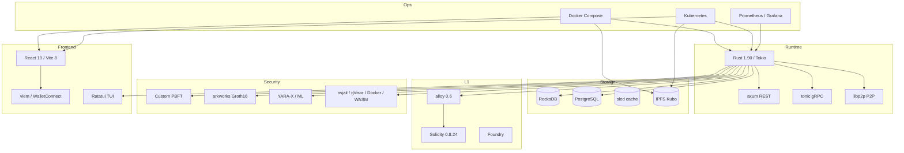

---

## 4. System Architecture (High Level)

### 4.1 Logical Architecture

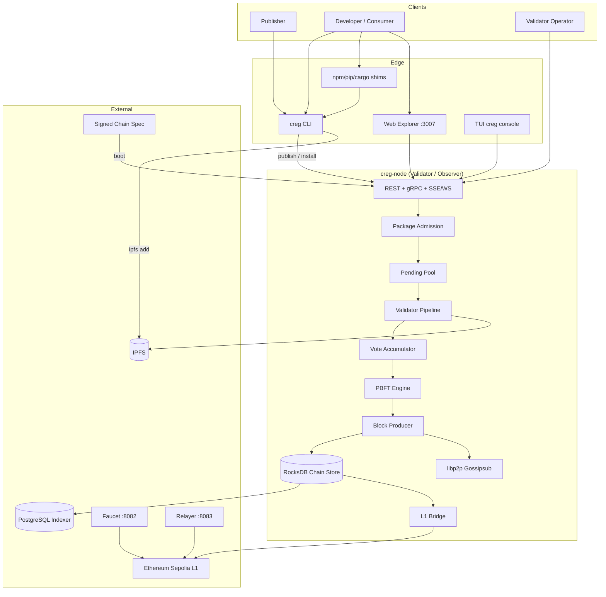

### 4.2 Docker Compose Service Graph (Sepolia)

The default stack in `chain-registry/docker-compose.yml` wires these services:

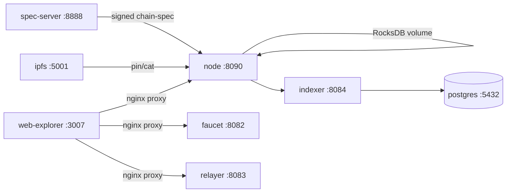

**Health gating:** `node` waits for healthy `ipfs` and `spec-server` before starting.

---

## 5. End-to-End Workflows

### 5.1 Publish → Verify → Install

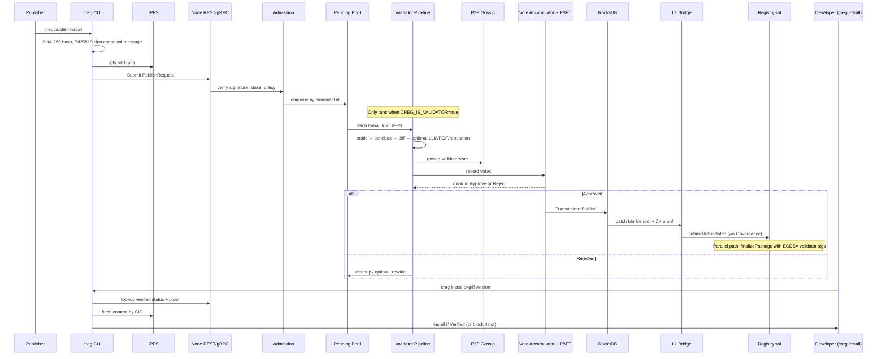

### 5.2 Node Boot Sequence

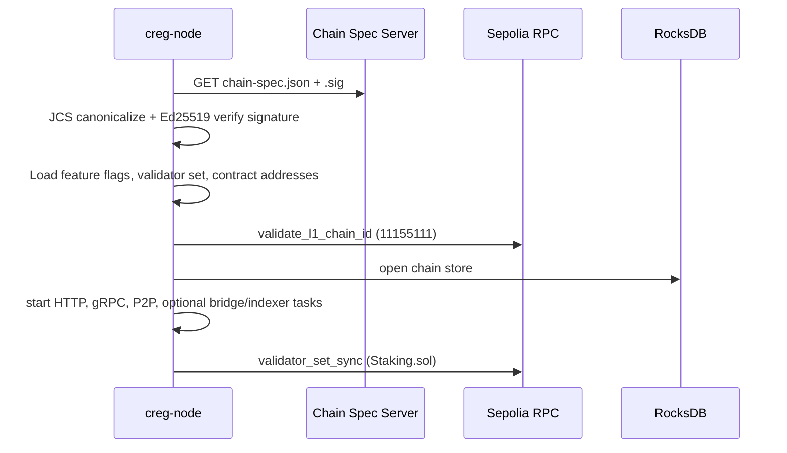

### 5.3 Install Trust Decision (Resolver)

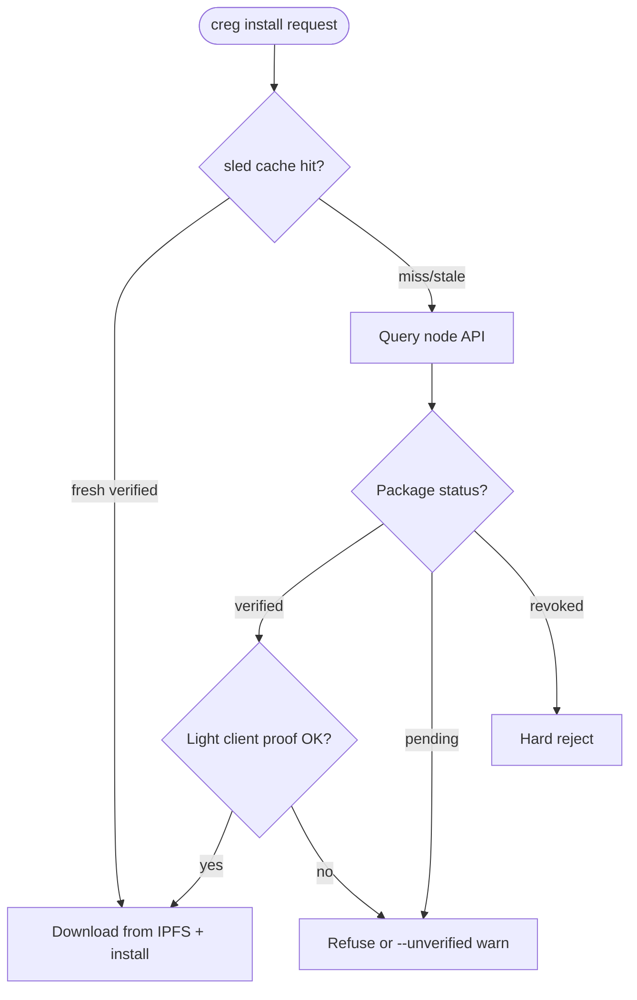

Resolver logic lives in `crates/resolver/` with optional Merkle + PBFT signature verification via `light_client.rs`.

---

## 6. Layer 1 — Ethereum Settlement

### 6.1 Role of L1

Ethereum Sepolia is the **settlement and economic security layer**:

- **Staking** — publishers and validators lock CREG tokens (`Staking.sol`)
- **Governance** — multisig proposals, pause, rollup batch submission (`Governance.sol`)
- **Canonical package ledger** — verified package records (`Registry.sol`)
- **Reputation** — on-chain approval/rejection counters (`Reputation.sol`)
- **ZK verification** — Groth16 proof checks (`ZKVerifier.sol`, `Groth16Verifier.sol`)
- **Token** — `CregToken.sol` (ERC20 + EIP-2612 permit)

Off-chain validators run the heavy analysis; L1 records **final outcomes** and **economic penalties**.

### 6.2 Contract Inventory

| Contract | File | Status | Purpose |
|----------|------|--------|---------|
| Registry | `contracts/Registry.sol` | Active | Package index, finalize, ZK path, rollup batches |
| Staking | `contracts/Staking.sol` | Active | Stake, slash, unbond |
| Governance | `contracts/Governance.sol` | Active | M-of-N multisig, pause, arbitrary calls |
| Reputation | `contracts/Reputation.sol` | Active | Validator approval counters |
| CregToken | `contracts/CregToken.sol` | Active | ERC20 utility token |
| ZKVerifier | `contracts/ZKVerifier.sol` | Active | On-chain Groth16 wrapper |
| Groth16Verifier | `contracts/Groth16Verifier.sol` | Active | snarkJS-generated verifier |
| ZKSlashingVerifier | `contracts/ZKSlashingVerifier.sol` | Active | Double-sign evidence |
| SlashingEvidence | `contracts/SlashingEvidence.sol` | Active | Permissionless evidence submission |
| Appeal | `contracts/Appeal.sol` | Active | Publisher appeals |
| ValidatorRewards | `contracts/ValidatorRewards.sol` | Active | Staking rewards |
| PinningRewards | `contracts/PinningRewards.sol` | Optional | IPFS pinner incentives |
| PackageInsurance | `contracts/PackageInsurance.sol` | Planned | Insurance coverage |
| VRF | `contracts/VRF.sol` | Partial | Chainlink VRF selection |
| CrossChainRegistry | `contracts/CrossChainRegistry.sol` | Scaffold | Multi-chain receipts |
| BatchOperations | `contracts/BatchOperations.sol` | Broken | Batch submit (stake identity bug) |
| GovernanceV2 | `contracts/GovernanceV2.sol` | Planned | Token-weighted governance |

### 6.3 Sepolia Contract Addresses (from chain spec)

From `testnet/chain-spec.sepolia.json`:

| Contract | Address |
|----------|---------|
| governance | `0x9a14F359E2bdBb43F1526743C4A91955F29Ba59A` |
| registry | `0x3aCfF05d00AC199412a94326eD8aA874aaA3596c` |
| staking | `0xf28C63C4Aafd27025E535Ab9ab7B4daC18C96Bc2` |
| reputation | `0x87CB853Ac4F423A295609c285e84b4DfDC9fD5D8` |
| creg_token | `0x97c21d46B3eac604e92E907D54aA92eEc0Af550b` |
| zk_verifier | `0x0922AE98AF1D809360BDd5D5AAd84f0D823A5cF3` |
| appeal | `0x4cfF6FaD7131Ef51e29f112517a8E5839912E63F` |
| validator_rewards | `0x7289d31a689a5647E420Fb358CEb7854dc477847` |
| vrf | `0xD36d38A766C84E9f032c62A38D34576C2B2A7df1` |

### 6.4 L1 Interaction Map

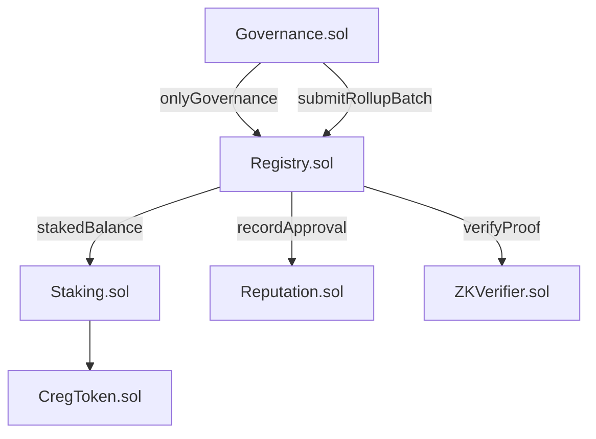

### 6.5 Bridge (`crates/node/src/bridge.rs`)

The bridge subsystem:

1. Polls new finalized blocks from RocksDB
2. Builds Merkle batches of state transitions
3. Generates Groth16 proofs via `zk-validator`
4. Submits `submitRollupBatch` through **Governance** using `CREG_BRIDGE_KEY` (secp256k1 hot key)

Disabled when governance address or bridge key is unset. L1 chain id validated at startup.

### 6.6 On-Chain Package Lifecycle

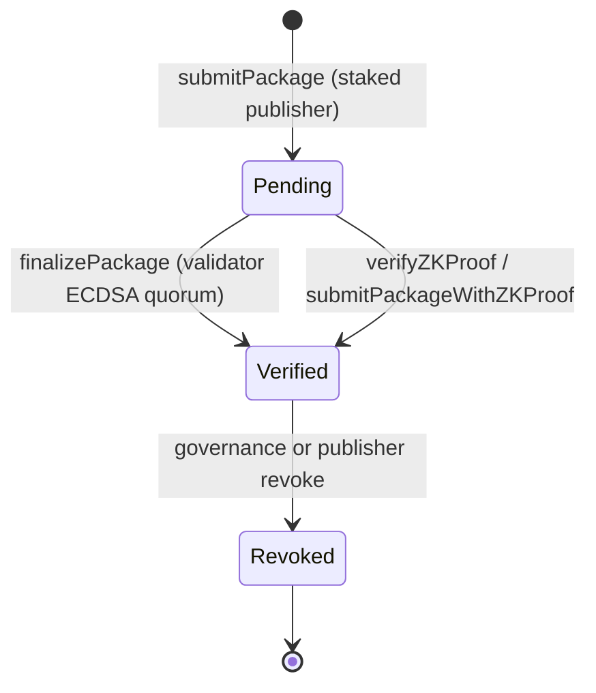

---

## 7. Layer 2 — Cross-Chain Scaffolding

### 7.1 Current Status

**Layer 2 and cross-chain verification are not enabled on the live testnet.** The chain spec sets:

```json
"feature_flags": {
  "cross_chain": false
}
```

The `cross-chain` Rust crate and `CrossChainRegistry.sol` contract are **scaffolding only** — do not enable in production without explicit product sign-off and completed security work (SEC-302).

### 7.2 L2 Configuration Files

| File | Chain |
|------|-------|
| `config/l2/arbitrum.json` | Arbitrum One (chain id 42161) |
| `config/l2/optimism.json` | Optimism |
| `config/l2/polygon.json` | Polygon |

Each file defines:

- RPC URLs and explorer links
- LayerZero / Axelar bridge adapter addresses
- Placeholder `registry` and `crossChainRegistry` deployment slots
- Gas settings and cost estimates

### 7.3 Intended L2 Architecture (Future)

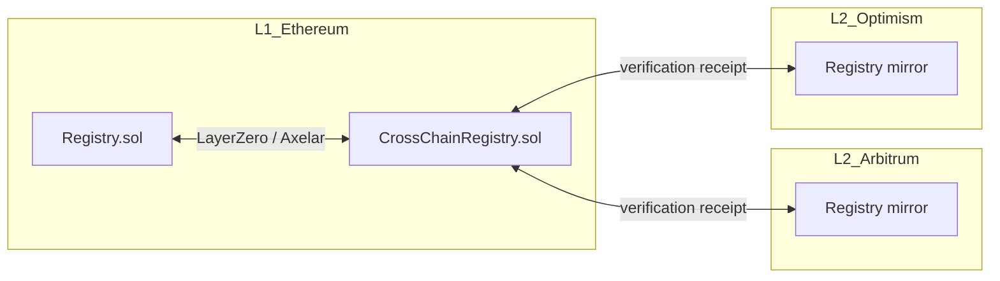

The Rust `MultiChainClient` in `crates/cross-chain/` is designed to sync verification status across chains once contracts are deployed and feature flags are enabled.

---

## 8. Blockchain / Consensus Layer (Off-Chain Chain)

Chain Registry maintains its **own append-only chain** in RocksDB, distinct from Ethereum blocks but anchored to L1 via the bridge.

### 8.1 Block Structure

Blocks contain:

- Height, hash, previous hash
- Merkle root of transactions
- Proposer ID
- PBFT signatures (`pbft_signatures: Vec<BlockSignature>`)
- Timestamp

Transactions include `Publish`, `Revoke`, key rotations, and governance-related records. Types are defined in `crates/common`.

### 8.2 PBFT Consensus

Implementation: `crates/consensus/src/pbft.rs`

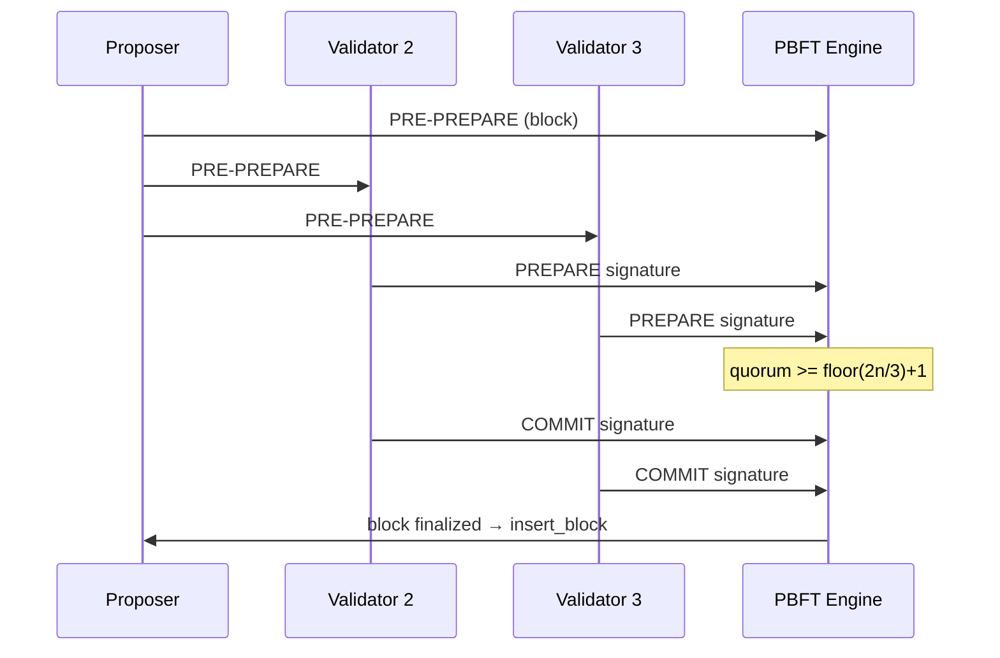

**Signature domain:** `creg-pbft-v1:{phase}:{block_hash}` (Ed25519)

**Quorum:** Default `⌊2n/3⌋+1` from chain spec (`quorum_percentage: 67`). Dev clusters may use `CREG_PBFT_ALLOW_SMALL_CLUSTER_QUORUM` for 2-of-3.

### 8.3 Package-Level Voting (Separate from Block PBFT)

Before a publish transaction enters a block, validators vote on the **package** via `VoteAccumulator` (`crates/consensus/src/vote_accumulator.rs`):

- **Domain:** `creg-vote-v2`
- **Binds:** canonical id, content hash, validator pubkey, scanner profile digest, evidence digest
- **Degraded votes:** Votes with incomplete bundle refs or `ml_model_version` prefixed `degraded` may be excluded from quorum

### 8.4 VRF Proposer Selection

`crates/consensus/src/vrf.rs` uses Ed25519-sign(seed) hashed as VRF output. Full RFC 9381 VRF is not implemented. If not all validators supply valid proofs, `select_proposer_deterministic` picks the lowest `SHA256(pubkey:epoch_seed)`.

### 8.5 Block Production

`crates/node/src/block_producer.rs`:

- Ticks every `CREG_BLOCK_INTERVAL` seconds (default 5, from chain spec)
- Drains finalized transactions
- Builds blocks, starts PBFT rounds, self-casts votes
- Inserts blocks when local quorum is met

### 8.6 P2P Layer

`crates/node/src/p2p.rs` — libp2p with:

| Component | Purpose |
|-----------|---------|
| Gossipsub | Votes, blocks, submissions, VRF proofs |
| Kademlia | Peer discovery |
| Identify | Storage shard hints |
| Rate limiting | `p2p_rate_limit.rs` — temporary bans |

Default P2P port: `9000` (host-mapped e.g. `9011` in compose).

### 8.7 Chain Store

`crates/node/src/chain_store.rs` — RocksDB column families for blocks, package index, revocations. Atomic write batches for consistency.

---

## 9. Validator Pipeline (Security Core)

**Location:** `crates/node/src/validator_pipeline.rs` orchestrates; `crates/validator/src/lib.rs` implements `validate_package`.

Only nodes with `CREG_IS_VALIDATOR=true` drain the pending pool.

### 9.1 Pipeline Flowchart

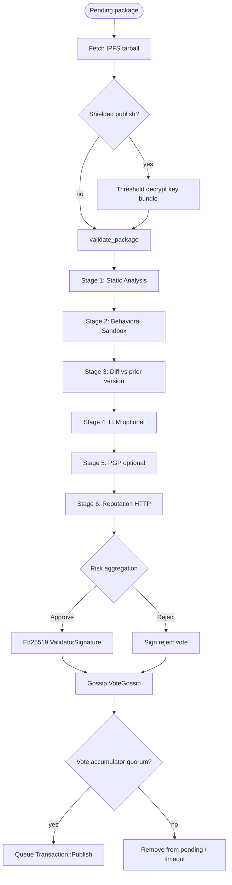

### 9.2 Stage Details

| Stage | Module | What it checks |
|-------|--------|----------------|
| **Static** | `validator/src/static_analysis.rs` | Entropy, regex patterns, typosquat (Levenshtein), YARA-X via ml-validator |
| **Sandbox** | `validator/src/sandbox.rs` | nsjail → gVisor → Docker → WASM waterfall; manifest-gated network/FS/process |
| **ML deep scan** | `ml-validator/src/deep_scan.rs` | YARA rules, optional OSV (env-gated), threat intel; degraded/mock mode when ONNX unavailable |
| **Diff** | `validator/src/diff.rs` | Compare manifest and sandbox metrics vs prior verified version |
| **LLM** | `validator/src/llm.rs` | Advisory-only (Anthropic, OpenAI, OpenRouter, Ollama); never sole rejection source |
| **PGP** | `validator/src/pgp.rs` | Optional maintainer signature verification |
| **Reputation** | HTTP API | Publisher history scoring |

**Sandbox engines** use profiles under `config/sandbox/` (nsjail seccomp, Docker seccomp JSON, per-ecosystem rootfs Dockerfiles).

**Dev bypass:** `CREG_DEV_SANDBOX=true` adds finding SB012 but must never be used on mainnet.

### 9.3 Admission (Before Pipeline)

`crates/node/src/package_admission.rs` enforces:

- Ed25519 publish signature over canonical message
- On-chain publisher stake check
- YARA gate, rate limits, policy rules
- Multisig threshold signatures when applicable

---

## 10. Serialization & Canonicalization

There is no single "serializer crate." Canonical formats are **security-critical** and distributed across modules:

### 10.1 Chain Spec — JCS (RFC 8785)

**File:** `crates/common/src/chain_spec.rs`

| Concept | Detail |
|---------|--------|
| Format | JSON canonicalized via JCS (`to_jcs_canonical_json`) |
| Signature domain | `creg-chain-spec-v1` |
| Algorithm | Ed25519 detached signature |
| Boot | Node fetches spec + `.sig` from `CREG_CHAIN_SPEC_URL` |

Chain spec is the **single source of truth** for network identity, contract addresses, validator set, feature flags, and service URLs.

### 10.2 Package Identity

**File:** `crates/common/src/package.rs`

| Concept | Format |
|---------|--------|
| Canonical package id | `{ecosystem}:{name}@{version}` e.g. `npm:lodash@4.17.21` |
| Publish signature message | `canonical + content_hash + canonical_publisher_address` (concatenated string, not JCS) |
| Publisher address | Lowercase `0x` + 40 hex chars |
| Content hash | SHA-256 of tarball bytes |

### 10.3 Other Serialization Surfaces

| Surface | Technology | Location |
|---------|------------|----------|
| REST API | `serde` + `serde_json` | `crates/node/src/api.rs` |
| gRPC | `prost` protobuf | `crates/common/proto/node.proto` |
| PostgreSQL indexer | JSONB for findings | `migrations/001_db_sync_bootstrap.sql` |
| P2P gossip | JSON bytes | `validator_pipeline.rs`, `p2p.rs` |
| PBFT / vote signatures | Domain-separated byte strings | `crates/consensus/` |
| Intelligence reports | JSON Schema | `schemas/package-intelligence-report.v1.json` |
| ZK public inputs | arkworks field elements | `crates/zk-validator/` |

### 10.4 Protobuf Services

**File:** `crates/common/proto/node.proto`

| Service | RPCs |
|---------|------|
| `RegistryService` | `GetLatestVersion`, `SubmitPackage` |
| `WatchService` | `StreamEvents` (server streaming) |
| `ExplorerService` | `GetChainStats`, `GetBlockByHeight` |

---

## 11. API Layer (REST, gRPC, JSON-RPC)

### 11.1 REST API Structure

**Implementation:** `crates/node/src/api.rs` (axum 0.7)  
**OpenAPI:** `crates/node/src/openapi.rs` — Swagger UI at `/api-docs`, JSON at `/v1/openapi.json`

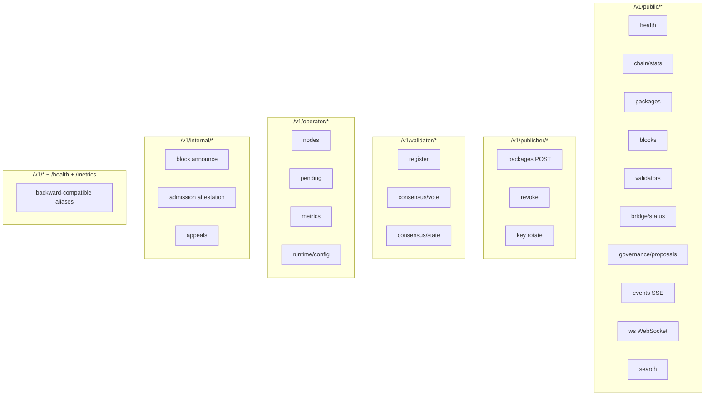

**Authentication:**

| Route group | Auth mechanism |
|-------------|----------------|
| Public | None |
| Publisher | Ed25519 signature on publish body |
| Validator | Validator key + registration |
| Operator | `X-Operator-Key` header (`CREG_OPERATOR_API_KEY`) |
| Internal | Peer attestation / operator |

**Rate limiting:** Per-IP and per-publisher on hot paths (`rate_limit.rs`).

**Real-time:** Server-Sent Events at `/v1/public/events`; WebSocket at `/v1/public/ws`.

### 11.2 Auxiliary HTTP Services

| Service | Port | Key endpoints |
|---------|------|---------------|
| Faucet | 8082 | `/api/challenge`, `/api/drip`, `/api/stats`, `/health` |
| Relayer | 8083 | `/v1/relayer/policy`, `/quote`, `/sponsor`, `/status/:id` |
| Indexer | 8084 | Health + sync status (mirrors chain to Postgres) |

### 11.3 gRPC

- **Port:** 50051
- **Server:** `crates/node/src/grpc/server.rs`
- CLI prefers gRPC for `publish` with REST fallback (`CREG_GRPC_URL`)

### 11.4 JSON-RPC Legacy

`crates/node/src/json_rpc.rs` — `/rpc` and `/jsonrpc` for backward compatibility.

### 11.5 API Documentation for Developers

- **Cookbook:** `chain-registry/docs/API_COOKBOOK.md` — curl examples
- **Admission contract:** `chain-registry/docs/API_ADMISSION_BOUNDARY_CONTRACT.md`
- **Explorer client:** `explorer/src/api/node.js` — auto-detects grouped vs legacy routes

---

## 12. Frontend & Explorer System

Chain Registry ships **three explorer surfaces**:

### 12.1 Web Explorer (Primary UI)

**Path:** `chain-registry/explorer/`  
**Stack:** React 19, Vite 8, react-router-dom 6, recharts, PWA support  
**Served:** nginx on port `3007` (Docker `web-explorer` service)

#### Route Map

| Route | Page component | Purpose |
|-------|----------------|---------|
| `/` | `Dashboard.jsx` | Chain overview + recent SSE events |
| `/blocks`, `/block/:id` | `BlockList`, `BlockDetail` | Block explorer |
| `/tx/:id` | `TxDetail` | Transaction detail |
| `/packages`, `/package/:id` | `PackageList`, `PackageDetail` | Package registry browser |
| `/validators`, `/validator/:addr` | `ValidatorList`, `ValidatorDetail` | Validator set |
| `/pending` | `Pending.jsx` | Packages awaiting consensus |
| `/consensus` | `Consensus.jsx` | Live consensus state |
| `/events` | `EventsFeed.jsx` | SSE event stream |
| `/network` | `Network.jsx` | P2P / node topology |
| `/bridge` | `Bridge.jsx` | L1 anchor status |
| `/governance` | `Governance.jsx` | On-chain proposals |
| `/metrics` | `Metrics.jsx` | Prometheus-derived charts |
| `/wallet` | `WalletPage.jsx` | Wallet + staking UI |
| `/publisher` | `PublisherDashboard.jsx` | Publisher tools |
| `/search` | `Search.jsx` | Full-text search (indexer-backed) |
| `/proof` | `ProofVerifier.jsx` | ZK / light client proof checker |

#### Architecture

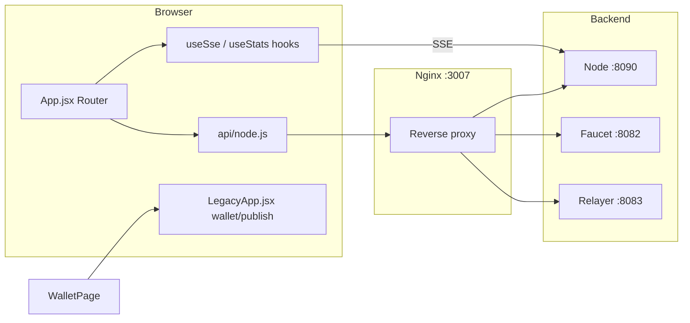

**Config:** `explorer/vite.config.js` — dev proxy; production uses `config/docker/explorer-nginx.sepolia.conf`.

**E2E tests:** `explorer/e2e/` (Playwright).

### 12.2 Legacy Monolith (`LegacyApp.jsx`)

Still powers wallet, publish, and stake flows embedded behind `WalletPage` and publisher routes. Uses **viem** for Ethereum, MetaMask, WalletConnect (EIP-6963), and optional dev private-key mode.

### 12.3 Terminal Explorer (TUI)

`creg console` → `crates/cli/src/explorer_tui.rs` (Ratatui) — queries node HTTP APIs from the terminal.

### 12.4 Embedded Node UI

`crates/node/src/explorer.rs` — optional `/ui/` served directly from the node when enabled.

### 12.5 Indexer-Backed Search

PostgreSQL mirror (`db-sync`) enables fast search, rich lists, and analytics that would be expensive against RocksDB alone.

---

## 13. Wallet & Key Management

### 13.1 Two Identity Types (Critical)

| Purpose | Key type | Used for |
|---------|----------|----------|
| CREG consensus / publish | **Ed25519** (32-byte secret) | `CREG_VALIDATOR_KEY`, `creg publish --key`, PBFT votes |
| On-chain ETH / staking | **secp256k1 EOA** | Gas, `stakeAsPublisher`, `joinAsValidator` |

**These are not interchangeable.** See `docs/WALLET_KEY_DERIVATION.md`.

### 13.2 Key Generation (`creg keygen`)

**File:** `crates/cli/src/keygen.rs`

- Generates Ed25519 keypairs with optional BIP-39 mnemonic
- Encrypts key files with AES-256-GCM (`CREG-ENC-V1` format)
- May print a **derived** `0x` address (Ed25519 bytes interpreted as secp256k1) — **convenience only**, not a standard HD wallet path

### 13.3 Web Wallet (Explorer)

**File:** `explorer/src/LegacyApp.jsx`

- MetaMask / WalletConnect for Sepolia transactions
- Staking UI against `Staking.sol`
- Publish flow with Ed25519 key file upload
- Contract addresses injected via Vite env (`VITE_*`)

### 13.4 Hot Keys (Operators)

**File:** `crates/secrets/src/lib.rs`

Loads secp256k1 private keys from env for:

| Service | Env var |
|---------|---------|
| Bridge | `CREG_BRIDGE_KEY` |
| Faucet | `FAUCET_PRIVATE_KEY` |
| Relayer | `RELAYER_PRIVATE_KEY` |

**File:** `crates/common/src/hot_key.rs` — warnings when hot keys are loaded from plaintext env.

### 13.5 Social Recovery

`creg recovery` — Shamir secret sharing (`crates/cli/src/recovery.rs`, `threshold-encryption/src/shamir.rs`).

### 13.6 Staking Flow

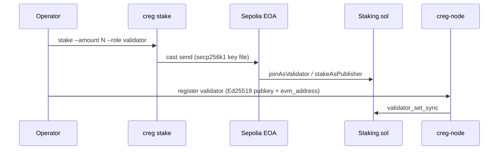

---

## 14. CLI & Package Manager Integration

### 14.1 Command Overview

The `creg` binary (`crates/cli/src/main.rs`) exposes 27+ commands:

| Category | Commands |
|----------|----------|
| **Package lifecycle** | `publish`, `install`, `status`, `verify`, `audit`, `search`, `info` |
| **Keys & stake** | `keygen`, `stake`, `recovery`, `multisig` |
| **Network** | `testnet`, `watch`, `blocks`, `doctor`, `console` |
| **Advanced** | `advanced zk-generate`, `zk-verify`, `ml-verify`, `wasm-validate` |
| **Shims** | `setup-shims`, `remove-shims` |
| **Config** | `config init`, `cache --clear`, `completions` |

Global env: `CREG_NODE_URL`, `CREG_GRPC_URL`, `--output json`, `--unverified`.

### 14.2 Shim Architecture

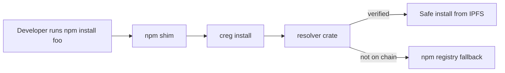

Shims installed via `creg setup-shims` into `~/.creg/shims` with PATH precedence.

---

## 15. Storage & Indexing

### 15.1 RocksDB (Source of Truth)

- **Path:** `CREG_DATA_DIR` (default `/data` in Docker)
- **Module:** `crates/node/src/chain_store.rs`
- **Contents:** Blocks, package index, PBFT metadata, pending state

### 15.2 PostgreSQL (Query Index)

- **Migrations:** `migrations/001_db_sync_bootstrap.sql`, `002_testnet_extras.sql`
- **Sync:** `crates/db-sync` polls RocksDB and upserts mirror tables
- **Tables:** `packages`, `blocks`, `validator_votes`, `publisher_stats`, `sync_state`

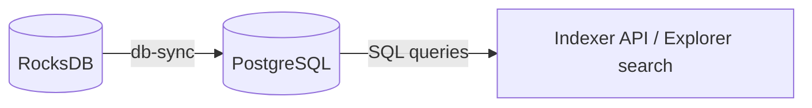

### 15.3 Resolver Cache

- **Engine:** sled embedded DB
- **Path:** `~/.creg/cache` (configurable)
- **Purpose:** Fast install-time verdict lookups

---

## 16. IPFS & Content Addressing

- **Node:** Kubo v0.27 (`ipfs/kubo` Docker image)
- **Ports:** API `5001`, swarm `4001`, gateway `8081`
- **Publish flow:** CLI runs `ipfs add`; node validators `ipfs cat` by CID
- **Pinning rewards:** `crates/ipfs-pinner` + `PinningRewards.sol` (optional)

Content integrity is enforced via **SHA-256 content hash** bound into publish signatures and consensus votes, independent of CID string format.

---

## 17. ZK, ML, and WASM Subsystems

### 17.1 Zero-Knowledge (ZK)

| Component | Location |
|-----------|----------|
| Circom circuits | `circuits/DoubleSignProof.circom`, `PackageValidator.circom` |
| Rust prover | `crates/zk-validator/` (arkworks Groth16, BN254) |
| On-chain verifier | `ZKVerifier.sol`, `Groth16Verifier.sol` |
| Bridge batches | Merkle root + proof submitted via Governance |

**Feature flag:** `zk_validation: true` on testnet.

**Known gap:** Package validation circuit does not yet constrain content hashes in R1CS (ISSUE-001 in `DEEP_DIVE_ANALYSIS.md`).

### 17.2 Machine Learning

| Component | Location |
|-----------|----------|
| Deep scan | `crates/ml-validator/src/deep_scan.rs` |
| YARA-X rules | Bundled with ml-validator |
| ONNX models | `models/malware_classifier.onnx` (placeholder) |
| Training | `ml/training/` |

When ONNX is unavailable, validators enter **degraded mode** (`is_mock: true`, finding ML001).

### 17.3 WASM Validators

| Component | Location |
|-----------|----------|
| Engine | `crates/wasm-sandbox/` (wasmtime 18) |
| Modules | `validators/` directory mounted read-only in Docker |
| Sandbox fallback | Fourth tier in sandbox waterfall |

---

## 18. Supporting Services (Faucet, Relayer, Secrets)

### 18.1 Faucet (`crates/faucet`)

- Distributes Sepolia tCREG (+ optional ETH) to testnet participants
- PoW challenge optional (`/api/challenge` → `/api/drip`)
- Requires `FAUCET_ADDRESS` and `FAUCET_PRIVATE_KEY` in compose env

### 18.2 Relayer (`crates/relayer`)

- Sponsored staking transactions for publishers without Sepolia ETH
- Policy-driven via `config/relayer-policy.example.json`
- Endpoints under `/v1/relayer/*`

### 18.3 Insurance (`crates/insurance`)

- Risk model and claims logic for `PackageInsurance.sol`
- **Disabled** on testnet (`insurance: false`)

### 18.4 Threshold Encryption (`crates/threshold-encryption`)

- Shielded publish: encrypt tarball, threshold-encrypt AES key to validator set
- **Disabled** on testnet (`threshold_encryption: false`)

---

## 19. Infrastructure & Deployment

### 19.1 Deployment Profiles

| File | Use case |
|------|----------|
| `docker-compose.yml` | **Primary** — Sepolia single-node + services |
| `docker-compose.local-testnet.yml` | 3-validator local bootstrap (Anvil) |
| `docker-compose.testnet.yml` | Multi-host bootstrap |
| `docker-compose.validator.yml` | Additional validator per host |
| `docker-compose.3node*.yml` | 3-node Sepolia lab (`testnet/`) |
| `docker-compose.prod.yml` | Production-oriented |
| `docker-compose.ingress.yml` | TLS ingress overlay |
| `k8s/` | Kubernetes (validators 1–10, Postgres, IPFS, ingress) |

### 19.2 Dockerfile

Multi-stage build (`Dockerfile`):

1. **Stage 1:** Node.js — build React explorer
2. **Stage 2:** Rust 1.90 on Ubuntu 24.04 — compile workspace, bundle circuits/models/validators

### 19.3 Chain Spec Server

`testnet/spec-server/` — nginx serves:

- `chain-spec.sepolia.json`
- `chain-spec.sepolia.json.sig` (detached Ed25519 signature)

Nodes refuse boot if signature verification fails.

### 19.4 Local Testnet (No Sepolia)

```powershell
cd chain-registry
./local-testnet.ps1 -RunSmokeTests
```

Uses `docker-compose.local-testnet.yml` with embedded Anvil L1.

### 19.5 Kubernetes Overview

```
k8s/
├── 00-namespace.yaml
├── 01-configmap.yaml
├── 10-postgres.yaml
├── 11-ipfs.yaml
├── 12-anvil.yaml          # in-cluster dev L1
├── 20-validator.yaml      # validator StatefulSet
├── 21-validators-2-5.yaml
├── 22-validators-6-10.yaml
├── 30-api-gateway.yaml
├── 40-ingress.yaml
├── 50-monitoring.yaml
└── 60-backup.yaml
```

---

## 20. Observability

| Component | Path |
|-----------|------|
| Prometheus config | `observability/prometheus.yml` |
| Grafana dashboards | `observability/grafana/` |
| Alertmanager | `observability/alertmanager.yml` |
| Loki / Tempo | `observability/loki.yml`, `tempo.yml` |
| OTEL collector | `observability/otel-collector-config.yml` |

**Node metrics:** `GET /metrics` (Prometheus format)

Key gauges: sync state, validator pipeline counters, admission rejection labels.

**Overlay:** `docker compose -f docker-compose.yml -f observability/docker-compose.observability.yml up -d`

---

## 21. Configuration Reference

### 21.1 Chain Spec Fields

| Field | Meaning |
|-------|---------|
| `chain_id` | Logical network name (`creg-testnet-1`) |
| `consensus_params` | Block time, quorum %, stake minimums, slash penalties |
| `feature_flags` | Toggle ZK, ML, WASM, cross-chain, insurance, threshold encryption |
| `l1` | Ethereum network name, chain id, explorer URL, finality blocks |
| `contracts` | Map of contract name → address |
| `validator_set` | Active validators (pubkey, eth_address, stake, reputation) |
| `services` | IPFS, faucet, explorer, metrics URLs |
| `signing` | Spec authority pubkey + detached signature URL |

### 21.2 Essential Node Environment Variables

| Variable | Description |
|----------|-------------|
| `CREG_NODE_ID` | Node identifier |
| `CREG_IS_VALIDATOR` | `true` to run validator pipeline |
| `CREG_VALIDATOR_KEY` | Ed25519 secret (hex) |
| `CREG_DATA_DIR` | RocksDB path |
| `CREG_ETH_RPC` | Sepolia JSON-RPC URL |
| `CREG_CHAIN_SPEC_URL` | HTTPS chain spec |
| `CREG_REGISTRY_ADDR` | Registry.sol address |
| `CREG_STAKING_ADDR` | Staking.sol address |
| `CREG_BRIDGE_KEY` | secp256k1 hot key for bridge txs |
| `CREG_OPERATOR_API_KEY` | Operator API auth |
| `CREG_ZK_ENABLED` / `CREG_ML_ENABLED` / `CREG_WASM_ENABLED` | Feature toggles |
| `CREG_PG_URL` | Enable PostgreSQL indexer sync |

Full list: root `README.md` and `.env.example`.

---

## 22. How to Contribute

### 22.1 Build from Source

```bash
cd chain-registry
cargo build --workspace --release
cd contracts && forge build
cd ../explorer && npm ci && npm run build
```

### 22.2 Run Tests

```bash
cargo test --workspace
cd contracts && forge test
cd ../explorer && npm test
make testnet-smoke   # full E2E via creg doctor --testnet
```

### 22.3 Code Quality

```bash
cargo fmt
cargo clippy --workspace --all-targets -- -D warnings
```

The node crate denies `clippy::unwrap_used` in production paths.

### 22.4 Where to Start by Interest

| Interest area | Start here |
|---------------|------------|
| Consensus / PBFT | `crates/consensus/src/pbft.rs` |
| Validation / security | `crates/validator/src/lib.rs` |
| REST API | `crates/node/src/api.rs` |
| Smart contracts | `contracts/Registry.sol`, `contracts/test/` |
| Web UI | `explorer/src/App.jsx` |
| CLI UX | `crates/cli/src/main.rs` |
| Testnet ops | `testnet/OPERATOR.md`, `docker-compose.yml` |
| Cross-chain (future) | `crates/cross-chain/`, `config/l2/` |

### 22.5 Issue Tracking

Reference issue IDs from `chain-registry/DEEP_DIVE_ANALYSIS.md` (ISSUE-001+) and `docs/REMEDIATION_BACKLOG.md` in PR descriptions.

---

## 23. Known Limitations & Alpha Posture

| Area | Status |
|------|--------|
| ZK package circuit hash binding | Incomplete (ISSUE-001) |
| Cross-chain / L2 | Scaffolding only, feature flag off |
| Threshold encryption / shielded publish | Feature flag off |
| Insurance | Feature flag off |
| BatchOperations.sol | Broken stake identity |
| ML ONNX | Often runs degraded/mock mode |
| Testnet phase | `alpha` — not production-ready |

**Operational rule:** Never enable `CREG_DEV_SANDBOX`, `CREG_SINGLE_VALIDATOR_MODE`, or shielded publish on public networks without explicit governance approval.

---

## 24. Glossary

| Term | Definition |
|------|------------|
| **Canonical id** | `ecosystem:name@version` string uniquely identifying a package |
| **PBFT** | Practical Byzantine Fault Tolerance — `⌊2n/3⌋+1` quorum consensus |
| **JCS** | JSON Canonicalization Scheme (RFC 8785) — deterministic JSON bytes for signing |
| **CID** | IPFS Content Identifier — location of tarball on IPFS |
| **Content hash** | SHA-256 of tarball bytes — integrity anchor |
| **Degraded vote** | Validator vote using mock ML or incomplete evidence bundles |
| **Chain spec** | Signed network configuration fetched at node boot |
| **Bridge** | Subsystem anchoring RocksDB state roots to L1 via Groth16 batches |
| **Admission** | Gate before pending pool — signatures, stake, policy |
| **Vote accumulator** | Package-level quorum counter before block inclusion |

---

## 25. Further Reading

| Document | Path |
|----------|------|
| Top-level README | `README.md` |
| Deep dive + issue registry | `chain-registry/DEEP_DIVE_ANALYSIS.md` |
| Deliverables index | `chain-registry/DELIVERABLES_INDEX.md` |
| API cookbook | `chain-registry/docs/API_COOKBOOK.md` |
| Public testnet quickstart | `docs/PUBLIC_TESTNET_QUICKSTART.md` |
| Sepolia runbook | `docs/TESTNET_SEPOLIA_RUNBOOK.md` |
| Wallet keys | `docs/WALLET_KEY_DERIVATION.md` |
| Docker guide | `chain-registry/DOCKER.md` |
| Testnet operator | `chain-registry/testnet/OPERATOR.md` |
| Remediation backlog | `docs/REMEDIATION_BACKLOG.md` |
| ADR: KMS hot keys | `docs/adr/ADR-KMS-HOT-KEYS.md` |

---

*This document synthesizes the repository as of 2026-06-08. For line-level issue tracking and security findings, always cross-check `chain-registry/DEEP_DIVE_ANALYSIS.md` and `docs/REMEDIATION_BACKLOG.md` before deploying or extending critical paths.*
