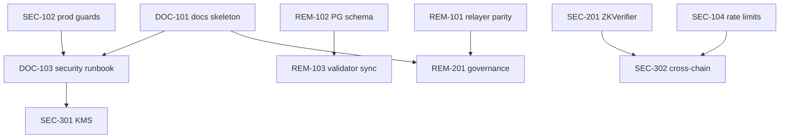

# Security & Remediation — Implementation Plan

**Status:** Approved baseline (defaults locked — pending owner assignment)  
**Created:** 2026-05-27  
**Parent document:** [../chain-registry/DEEP_DIVE_ANALYSIS.md](../chain-registry/DEEP_DIVE_ANALYSIS.md)  
**Audience:** Engineering, security, DevOps  
**Purpose:** Turn security weaknesses (W1–W15), tracked issues (ISSUE-002/004/005/006), P0–P3 fixes, and the four-phase roadmap into an actionable backlog you can review, prioritize, and execute.

---

## How to use this plan

1. **Review** the traceability matrix and phase scope — confirm priorities and out-of-scope items.
2. **Assign** owners and target dates in the sprint table (Section 8).
3. **Execute** work items in dependency order within each phase; do not skip acceptance criteria.
4. **Track** progress in your issue tracker using the suggested IDs (`SEC-xxx`, `REM-xxx`).
5. **Update** this document when scope changes; link PRs to work item IDs.

---

## Approved baseline defaults

These are the **execution defaults** for this plan unless you explicitly override them. They match the recommendations in Section 13.

| ID | Decision | Approved choice | What we will do |
|----|----------|-----------------|-----------------|
| **D1** | Relayer API mismatch | **A — Fix explorer** | Update `explorer/src/api/relayer.js` (and callers) to use `POST /v1/relayer/sponsor`, `GET /v1/relayer/status/:id`, `GET /v1/relayer/policy`. No new relayer alias routes unless a blocker appears. **Work:** REM-101b only. |
| **D2** | PostgreSQL schema | **Extend `db-sync`** | Canonical tables live in `crates/db-sync`; versioned migrations under `chain-registry/migrations/`; deprecate or shim duplicate tables in `testnet/init-testnet-db.sql`. **Work:** REM-102a–e. |
| **D3** | Governance (Phase 2) | **Disable UI first** | Return honest HTTP status from node (e.g. `501` or empty with `X-Feature-Status: disabled`); hide or gate explorer governance nav via `VITE_GOVERNANCE_ENABLED=false` until Sepolia wiring (REM-201/202) is done. **Work:** REM-201 + REM-202-alt first. |
| **D4** | Cross-chain (Phase 3) | **Fix if on Sepolia roadmap; else disable** | Default path: **SEC-303c** (disable UI + README “Planned”) until product confirms Sepolia needs L2 receipts; if yes, execute **SEC-302a/b** and ISSUE-005/006 fixes. Decision checkpoint at start of Phase 3. |
| **D5** | PrivateRegistry | **Mark Planned** | Update README and contract table; do not implement `PrivateRegistry.sol` in Phase 3 unless an enterprise commitment exists. **Work:** SEC-306a + DOC-104; defer SEC-306b. |
| **D6** | First sprint | **2-week Phase 1 slice** | Week 1: DOC-101, DOC-103, REM-101, SEC-104. Week 2: REM-102, SEC-201, SEC-102, SEC-106. Adjust if only one engineer (stretch to 3 weeks). |

**Phase 1 start order (with defaults):** DOC-101 → DOC-103 → REM-101 → SEC-104 → REM-102 → SEC-201 → SEC-102 → SEC-106.

---

## 1. Goals and non-goals

### Goals

- Raise **security / ops readiness** from ~58% toward **≥80%** before public testnet promotion.
- Close all **P0** and **P1** items from the system analysis.
- Eliminate **production footguns** (`CREG_DEV_SANDBOX`, single-validator mode, unset operator keys).
- Establish **documented** operational procedures for keys, TLS, and deployments.
- Make **contract and API behavior** match documentation and UI (no silent stubs on critical paths).

### Non-goals (this plan)

- Mainnet launch and genesis ceremony (Phase 4 — separate sign-off).
- Full `api.rs` modularization beyond security-critical extractions (deferred partial refactor).
- Redis/cluster rate limiting (W15) — design only in Phase 3 unless scale demands earlier.
- Optional SDK beyond CLI (Phase 4 optional).
- Replacing the entire explorer UI architecture (only security-relevant wallet/relayer fixes in Phase 1–2).

---

## 2. Traceability matrix

Maps every weakness and fix to a work item ID.

| Source | ID | Work item(s) | Phase |
|--------|-----|--------------|-------|
| W1 | Hot private keys | SEC-101, SEC-301, DOC-103 | 2, 3 |
| W2 | Missing docs | DOC-101, DOC-102, DOC-103 | 1, 2 |
| W3 | Dual PG schema | REM-102 | 1 |
| W4 | Explorer/relayer mismatch | REM-101 | 1 |
| W5 | Rate limits legacy paths | SEC-104 | 1 |
| W6 | Governance API stub | REM-201, REM-202 | 2 |
| W7 | Cross-chain incomplete | SEC-302, SEC-303 | 3 |
| W8 | Shielded publish experimental | SEC-304, SEC-305 | 3 |
| W9 | Validator set sync cursor | REM-103 | 2 |
| W10 | Non-standard ETH from Ed25519 | SEC-105 | 2 |
| W11 | alloy version split | REM-203 | 2 |
| W12 | Dev flags in prod | SEC-102, SEC-106 | 1, 2 |
| W13 | PrivateRegistry missing | SEC-306, DOC-104 | 3 |
| W14 | Monolithic api.rs | REM-204 | 2 (partial) |
| W15 | No cluster rate limits | SEC-307 | 3 (design) |
| ISSUE-002 | ZKVerifier pairing | SEC-201 | 1 |
| ISSUE-004 | PrivateRegistry | SEC-306 | 3 |
| ISSUE-005/006 | CrossChainRegistry | SEC-302, SEC-303 | 3 |
| P0 | Docs restore | DOC-101–103 | 1 |
| P0 | Relayer alignment | REM-101 | 1 |
| P0 | PG unify | REM-102 | 1 |
| P1 | Rate limits grouped paths | SEC-104 | 1 |
| P1 | Validator sync persist | REM-103 | 2 |
| P1 | PrivateRegistry resolve | SEC-306, DOC-104 | 3 |
| P1 | CrossChain complete | SEC-302–303 | 3 |
| P2 | Governance wire | REM-201–202 | 2 |
| P2 | chain-spec validate | SEC-203 | 2 |
| P2 | api.rs split | REM-204 | 2 |
| P2 | alloy consolidate | REM-203 | 2 |
| P3 | LegacyApp refactor | REM-205 | 3+ |
| P3 | HSM/KMS | SEC-301 | 3 |
| P3 | Shielded E2E | SEC-304–305 | 3 |

---

## 3. Phase 1 — Stabilize foundation (target: 2–4 weeks)

**Exit criteria:** P0 closed; ISSUE-002 fixed in contracts; smoke + CI green; no known API contract mismatches on staking path; single PG migration path documented; production compose fails fast on unsafe env.

### Epic 1.1 — Documentation & operational baseline

| ID | Task | Primary files | Acceptance criteria |
|----|------|---------------|---------------------|
| **DOC-101** | Create `chain-registry/docs/` skeleton: index, links from root README | `README.md`, `docs/README.md` | All README doc links resolve; index lists runbooks |
| **DOC-102** | Port or author **API cookbook** (curl examples per route group) | `chain-registry/docs/API_COOKBOOK.md`, `crates/node/src/api.rs` | Covers public, publisher, validator, operator; matches OpenAPI |
| **DOC-103** | Author **security ops runbook** (keys, TLS, env danger list) | `docs/SECURITY_OPS_RUNBOOK.md` | Documents W1, W12, operator key, `CREG_DEV_SANDBOX`, rotation procedure |
| **DOC-104** | **Remediation backlog** living doc synced to this plan | `docs/REMEDIATION_BACKLOG.md` | Each SEC/REM item has status column |

**Dependencies:** None (can start immediately).

---

### Epic 1.2 — API contract parity (relayer)

| ID | Task | Primary files | Acceptance criteria |
|----|------|---------------|---------------------|
| **REM-101a** | Audit explorer relayer client vs server routes | `explorer/src/api/relayer.js`, `crates/relayer/src/main.rs` | Written route matrix in PR description |
| **REM-101b** | **Option A (preferred):** Update explorer to use `POST /v1/relayer/sponsor`, `GET .../status/:id`, `GET /v1/relayer/policy` | `relayer.js`, stake/wallet UI callers | Sponsored stake E2E passes on local testnet |
| **REM-101c** | **Option B:** Add compatibility aliases on relayer for `/stake`, `/quota/:owner` if UI change is too large | `relayer/src/main.rs` | Deprecated aliases documented; OpenAPI updated |

**Dependencies:** Local testnet running (`local-testnet.ps1`).

**Tests:** Extend Playwright or manual checklist in `chain-registry/docs/API_COOKBOOK.md`.

---

### Epic 1.3 — PostgreSQL schema unity

| ID | Task | Primary files | Acceptance criteria |
|----|------|---------------|---------------------|
| **REM-102a** | Document diff: `db-sync` tables vs `testnet/init-testnet-db.sql` | `crates/db-sync/src/schema.rs`, `testnet/init-testnet-db.sql` | Markdown table in `docs/DATABASE_SCHEMA.md` |
| **REM-102b** | Choose **canonical schema** (recommend: extend `db-sync` as source of truth) | `db-sync/`, migrations folder | ADR or section in DATABASE_SCHEMA.md |
| **REM-102c** | Add versioned SQL migrations (e.g. `migrations/001_unified.sql`) | new `chain-registry/migrations/` | Fresh PG boot creates one consistent schema |
| **REM-102d** | Update testnet init script to delegate or deprecate duplicate tables | `init-testnet-db.sql`, compose env | `creg-indexer` + testnet compose use same migration path |
| **REM-102e** | Integration test: indexer sync writes rows readable by documented views | `crates/db-sync/`, `tests/` | Test passes in CI |

**Dependencies:** REM-102b decision (review gate).

---

### Epic 1.4 — Rate limiting (W5)

| ID | Task | Primary files | Acceptance criteria |
|----|------|---------------|---------------------|
| **SEC-104a** | Map rate-limit buckets to **path prefixes** not only legacy paths | `crates/node/src/rate_limit.rs`, `api.rs` | `/v1/publisher/packages` uses publish bucket (10/min/IP) |
| **SEC-104b** | Apply vote bucket to `/v1/validator/consensus/vote` | same | 60/min/IP enforced |
| **SEC-104c** | Unit tests for grouped + legacy paths | `rate_limit.rs` tests | Tests fail if regression to general bucket only |

**Dependencies:** None.

---

### Epic 1.5 — Production config guardrails (W12)

| ID | Task | Primary files | Acceptance criteria |
|----|------|---------------|---------------------|
| **SEC-102a** | At node startup: **refuse** `CREG_DEV_SANDBOX=true` when `CREG_NETWORK=mainnet` or `phase=mainnet` in chain spec | `main.rs`, `config.rs` | Startup error with clear message |
| **SEC-102b** | Refuse `CREG_SINGLE_VALIDATOR_MODE=true` outside `network=testnet` / explicit `CREG_ALLOW_UNSAFE=true` | same | Documented in SECURITY_OPS_RUNBOOK |
| **SEC-102c** | Compose/k8s: remove unsafe defaults from prod profiles; add comments | `docker-compose.prod.yml`, `k8s/01-configmap.yaml` | Prod manifests never set dev flags |
| **SEC-106** | `creg doctor` checks for unsafe env combinations | `crates/cli/src/doctor.rs` | Doctor reports FAIL on unsafe prod config |

**Dependencies:** DOC-103 for operator messaging.

---

### Epic 1.6 — ZKVerifier contract (ISSUE-002)

| ID | Task | Primary files | Acceptance criteria |
|----|------|---------------|---------------------|
| **SEC-201a** | Reproduce failing case from `ZKVerifier.t.sol` if any test red | `contracts/test/ZKVerifier.t.sol`, `ZKVerifier.sol` | Root cause documented in PR |
| **SEC-201b** | Fix `_pairingCheck` or verifier wiring per test expectations | `ZKVerifier.sol` | `forge test --match-contract ZKVerifier` green |
| **SEC-201c** | Ensure CI always runs contract tests on PR touching `contracts/` | `.github/workflows/ci.yml` | Already present — verify not skipped |

**Dependencies:** Foundry in dev environment.

---

### Phase 1 — Review checklist

- [ ] All P0 items (REM-101, REM-102, DOC-101–103) marked Done
- [ ] ISSUE-002 closed with green Foundry tests
- [ ] SEC-104 + SEC-102 merged and documented
- [ ] `local-testnet.ps1 -RunSmokeTests` passes
- [ ] Security ops runbook reviewed by at least one non-author

---

## 4. Phase 2 — Testnet hardening (target: 4–8 weeks, after Phase 1)

**Exit criteria:** Sepolia deployment documented and repeatable; validator set survives node restart without duplicate/missed events; governance API honest (live or disabled in UI); hot-key rotation procedure exercised once on testnet.

### Epic 2.1 — Sepolia deployment & observability

| ID | Task | Primary files | Acceptance criteria |
|----|------|---------------|---------------------|
| **REM-210** | Document Sepolia deploy from `sepolia-deploy.yml` + `chain-spec.sepolia.json` | `docs/TESTNET_SEPOLIA_RUNBOOK.md`, `.github/workflows/sepolia-deploy.yml` | Step-by-step with rollback |
| **REM-211** | Validate observability stack against Sepolia testnet profile | `observability/` | Dashboards show node + bridge metrics |
| **REM-212** | Integrate `testnet/soak-test/runner.py` into nightly CI (optional job) | `.github/workflows/nightly-build.yml` | Nightly publishes soak summary artifact |

---

### Epic 2.2 — Validator set sync persistence (W9)

| ID | Task | Primary files | Acceptance criteria |
|----|------|---------------|---------------------|
| **REM-103a** | Implement sled (or RocksDB sub-DB) cursor for L1 staking event sync | `validator_set_sync.rs` | Cursor survives process restart |
| **REM-103b** | Tests: restart node mid-sync → no duplicate registrations | `validator_set_sync.rs` tests | Integration test green |
| **REM-103c** | Remove or resolve TODO comment in source | same | No stale TODO for persistence |

---

### Epic 2.3 — Governance API honesty (W6)

| ID | Task | Primary files | Acceptance criteria |
|----|------|---------------|---------------------|
| **REM-201** | **Decision:** wire `GET /v1/public/governance/proposals` to `Governance.sol` events **or** return `501` + remove explorer governance pages from nav | `api.rs`, `Governance.sol`, explorer pages | No empty stub pretending to be live |
| **REM-202** | If wired: index proposals from L1 logs; pagination + types | `api.rs`, new `governance_index.rs` optional | Explorer shows real proposals on Sepolia |
| **REM-202-alt** | If not wired: feature flag `VITE_GOVERNANCE_ENABLED=false` + UI banner “Not available on this network” | explorer config | No user confusion |

**Dependencies:** REM-210 for Sepolia contract addresses.

---

### Epic 2.4 — CLI & dependency hygiene

| ID | Task | Primary files | Acceptance criteria |
|----|------|---------------|---------------------|
| **SEC-203** | Extend `creg chain-spec validate`: verify Ed25519 signature when pubkey provided; compare genesis hash | `cli/src/chain_spec.rs`, `common/src/chain_spec.rs` | Invalid spec exits non-zero |
| **SEC-105** | CLI: warn prominently when displaying ETH address derived from Ed25519 key; doc BIP44 limitation | `keygen.rs`, `docs/WALLET_KEY_DERIVATION.md` | Warning on `keygen` and `stake` output |
| **REM-203** | Consolidate **alloy** to workspace version (0.6.x) in `node` crate | `crates/node/Cargo.toml`, fix breakages | Single alloy version in `cargo tree` |
| **REM-204** | Extract **private API ACL + rate limit** modules from `api.rs` (security audit surface reduction) | `api.rs` → `api/acl.rs`, `api/mod.rs` | No behavior change; tests pass |

---

### Epic 2.5 — Hot key operations (W1 — procedural)

| ID | Task | Primary files | Acceptance criteria |
|----|------|---------------|---------------------|
| **SEC-101** | Document required secrets: bridge, faucet, relayer — no keys in git | `docs/SECURITY_OPS_RUNBOOK.md`, `.env.example` | Placeholders only; rotation steps |
| **SEC-101b** | Add startup warning if hot keys loaded from env in non-testnet | `bridge.rs`, `faucet`, `relayer` | Log WARN with key fingerprint (not secret) |

**Note:** Full KMS (SEC-301) is Phase 3; Phase 2 is documentation + warnings.

---

### Phase 2 — Review checklist

- [ ] Sepolia runbook executed successfully by second engineer
- [ ] REM-103 persistence verified with restart test
- [ ] Governance: wire **or** disable — no stub
- [ ] SEC-203 + SEC-105 merged
- [ ] alloy unified; `cargo clippy` clean

---

## 5. Phase 3 — Security & multi-chain (target: 8–12 weeks)

**Cross-chain decision (D4):** recorded as **SEC-303c** in [REMEDIATION_BACKLOG.md](./REMEDIATION_BACKLOG.md) (2026-05-28).

**Exit criteria:** Cross-chain either fixed and tested or explicitly disabled in product; PrivateRegistry status accurate; shielded publish behind feature flag with E2E or removed from marketing; external audit scheduled or completed for critical paths.

### Epic 3.1 — CrossChainRegistry (ISSUE-005, ISSUE-006, W7)

| ID | Task | Primary files | Acceptance criteria |
|----|------|---------------|---------------------|
| **SEC-302a** | Fix `receiveVerification` — enforce validator signatures (tests in `CrossChainRegistry.t.sol` green) | `CrossChainRegistry.sol` | ISSUE-005 closed |
| **SEC-302b** | Fix `sendVerification` — include validator sigs in outbound payload | same | ISSUE-006 closed |
| **SEC-303** | Rust `cross-chain` client: document “config only” vs implement minimal sync hook | `cross-chain/src/lib.rs` | README + code comment accuracy |
| **SEC-303b** | Set non-zero L2 addresses via env in testnet chain spec or disable UI cross-chain widgets | `config/l2/*.json`, explorer | No zero-address mainnet confusion |

**Alternative path:** If product defers multi-chain, **SEC-303c** disable CrossChain in UI/README and mark contract `Planned` only.

---

### Epic 3.2 — Private registry (ISSUE-004, W13)

| ID | Task | Primary files | Acceptance criteria |
|----|------|---------------|---------------------|
| **SEC-306a** | **Decision gate:** implement `PrivateRegistry.sol` **or** update README/contracts table to “Planned” | README, contracts/ | No “Active” for missing contract |
| **SEC-306b** | If implement: contract + Foundry tests + node admission hook | new `PrivateRegistry.sol`, `threshold-encryption/` | M-of-N decrypt flow documented |

---

### Epic 3.3 — Shielded publish (W8)

| ID | Task | Primary files | Acceptance criteria |
|----|------|---------------|---------------------|
| **SEC-304** | Feature flag `CREG_SHIELDED_PUBLISH_ENABLED` default **false** | `package_admission.rs`, CLI `publish.rs` | Disabled unless explicit opt-in |
| **SEC-305** | E2E test for shielded round-trip **or** remove `--shield` from public CLI help until pass | `tests/`, `publish.rs` | No “experimental” without guard |

---

### Epic 3.4 — KMS / HSM (W1, P3)

| ID | Task | Primary files | Acceptance criteria |
|----|------|---------------|---------------------|
| **SEC-301a** | ADR: KMS options (AWS KMS, GCP, HashiCorp Vault) for bridge/faucet/relayer | `docs/adr/ADR-KMS-HOT-KEYS.md` | Tradeoffs + recommended testnet approach |
| **SEC-301b** | Implement **one** provider interface (e.g. env fallback + Vault optional) | new `crates/secrets/` or per-service module | No plaintext key required in prod compose |

**Scope control:** Testnet can use Vault; mainnet requires SEC-301b before launch sign-off.

---

### Epic 3.5 — External audit & chaos

| ID | Task | Primary files | Acceptance criteria |
|----|------|---------------|---------------------|
| **SEC-401** | Scope audit: `package_admission`, `validator_pipeline`, `Staking.sol`, `Registry.sol` | audit RFP doc | Vendor selected or internal red-team schedule |
| **SEC-402** | Run k8s network partition test manifest; document results | `k8s/55-network-partition-test.yaml` | Postmortem + fixes for P1 findings |
| **SEC-307** | Design doc: cluster-wide rate limiting (Redis/envoy) for multi-replica deploy | `docs/adr/ADR-RATE-LIMIT-SCALE.md` | W15 addressed for Phase 4 if needed |

---

### Epic 3.6 — Explorer maintainability (P3, partial W14)

| ID | Task | Primary files | Acceptance criteria |
|----|------|---------------|---------------------|
| **REM-205** | Extract wallet + stake + relayer flows from `LegacyApp.jsx` into hooks/components | `explorer/src/` | Reduce `LegacyApp.jsx` by ≥40%; no security regression |

---

### Phase 3 — Review checklist

- [ ] ISSUE-005/006 resolved **or** cross-chain disabled in product
- [ ] ISSUE-004 / PrivateRegistry decision recorded
- [ ] Shielded publish gated + tested or demoted
- [ ] SEC-301 ADR approved; implementation started for testnet
- [ ] Audit scheduled with defined scope

---

## 6. Phase 4 — Production readiness (target: 12+ weeks)

**Exit criteria:** Mainnet chain spec signed; release assurance on every tag; on-call playbooks; security readiness ≥80%.

| ID | Task | Summary | Acceptance criteria |
|----|------|---------|---------------------|
| **PROD-401** | Mainnet chain spec + genesis ceremony | `testnet/chain-spec.*`, multisig process | Signed spec in repo; genesis hash pinned |
| **PROD-402** | Gate releases on `scripts/release-assurance.sh` | CI on tags | No release without reproducibility evidence |
| **PROD-403** | SLA monitoring + Alertmanager routes | `observability/` | Pager integration documented |
| **PROD-404** | Close all open ISSUE-00x and SEC items | backlog | Zero P0/P1 open |
| **PROD-405** | Optional SDK / client libraries | separate epic | Out of security plan unless required |

---

## 7. Work item summary (backlog)

### By priority

| Priority | IDs | Count |
|----------|-----|-------|
| **P0** | DOC-101–103, REM-101, REM-102, SEC-201 | 8 epics (multiple subtasks) |
| **P1** | SEC-104, SEC-102, REM-103, SEC-302–303 (or defer path) | 6+ |
| **P2** | REM-201–202, SEC-203, SEC-105, REM-203, REM-204, SEC-101 | 7+ |
| **P3** | SEC-301, SEC-304–305, SEC-306, REM-205, SEC-307 | 6+ |

### Suggested GitHub labels

- `security`, `remediation`, `phase-1`, `phase-2`, `phase-3`, `phase-4`
- `contracts`, `node`, `explorer`, `docs`, `breaking-change`

---

## 8. Suggested first sprint (2 weeks) — for review

Assume 1–2 engineers. Adjust capacity as needed.

| Week | Focus | Work items | Deliverable |
|------|-------|------------|-------------|
| **W1** | Docs + relayer + rate limits | DOC-101, DOC-103, REM-101, SEC-104 | Docs skeleton; sponsored stake works; rate limits on grouped paths |
| **W2** | PG schema + ZK + prod guards | REM-102, SEC-201, SEC-102, SEC-106 | Unified migration v1; ZKVerifier green; doctor unsafe checks |

**Sprint goal:** Complete **Phase 1 exit criteria** except full DOC-102 (can spill to W3).

---

## 9. Dependencies graph (simplified)



---

## 10. Risks and mitigations

| Risk | Likelihood | Impact | Mitigation |
|------|------------|--------|------------|
| PG migration breaks existing testnet DBs | Medium | High | Versioned migrations + backup step in runbook |
| Relayer fix breaks existing integrators | Low | Medium | Compatibility aliases (REM-101c) |
| Cross-chain scope creep | High | High | Decision gate SEC-303c disable path |
| Audit findings block testnet | Medium | High | Schedule audit early Phase 3; buffer time |
| alloy upgrade breaks bridge | Medium | High | REM-203 dedicated PR + full smoke test |

---

## 11. Definition of done (per work item)

A work item is **Done** when:

1. Code/docs merged to `main` (or agreed release branch).
2. **Acceptance criteria** in this plan met.
3. Tests added or updated (unit, integration, or Foundry as appropriate).
4. `SECURITY_OPS_RUNBOOK` or linked doc updated if behavior/operators change.
5. `REMEDIATION_BACKLOG.md` status updated.
6. No new `clippy` warnings; CI green for touched areas.

---

## 12. Metrics to track weekly

| Metric | Baseline | Phase 1 target | Phase 2 target |
|--------|----------|----------------|----------------|
| Open P0 count | 3 | 0 | 0 |
| Open ISSUE-00x | ≥4 | 1 (004 only) | 0–1 |
| Security readiness % | ~58% | ~70% | ~80% |
| Smoke test pass | per README | 100% CI | 100% + soak |
| API route parity | relayer broken | 100% | 100% |
| Unsafe prod boot | possible | blocked | blocked + audited |

---

## 13. Decision log

| # | Question | **Approved default** | Override? |
|---|----------|----------------------|-----------|
| D1 | Relayer fix strategy | **A — Fix explorer** (`REM-101b`) | Record here if you choose server aliases instead |
| D2 | Canonical PG schema | **Extend `db-sync`** (`REM-102`) | — |
| D3 | Governance in Phase 2 | **Disable UI first**, wire later (`REM-201` + `REM-202-alt`) | — |
| D4 | Cross-chain in Phase 3 | **Disable unless Sepolia needs it**; else fix ISSUE-005/006 | Confirm at Phase 3 kickoff |
| D5 | PrivateRegistry | **Mark Planned** (`SEC-306a`) | Implement only with enterprise commitment |
| D6 | First sprint | **2-week Phase 1 table** (Section 8) | Extend to 3 weeks if single engineer |

---

## 14. Document control

| Field | Value |
|-------|-------|
| Version | 0.2-baseline |
| Next step | Assign owners → create GitHub issues (Appendix A) → begin Phase 1 in order above |
| Owner | _TBD_ |
| Baseline approved | 2026-05-27 |

---

## Appendix A — Quick copy: GitHub issue titles

```
[SEC-104] Rate-limit /v1/publisher and /v1/validator paths
[SEC-102] Fail-fast on unsafe prod env (DEV_SANDBOX, SINGLE_VALIDATOR)
[SEC-201] Fix ZKVerifier pairing check (ISSUE-002)
[REM-101] Align explorer relayer client with /v1/relayer/sponsor API
[REM-102] Unify PostgreSQL schema (db-sync vs testnet init)
[DOC-101] Restore chain-registry/docs index and README links
[DOC-103] Security operations runbook (keys, TLS, env)
[REM-103] Persist validator set sync cursor across restarts
[REM-201] Governance API: wire contracts or disable explorer stub
[SEC-302] CrossChainRegistry ISSUE-005/006 fixes
[SEC-301] KMS ADR and hot-key abstraction for services
```

---

*Defaults are locked in Section “Approved baseline defaults”. Override any D1–D6 in the decision log before starting affected work.*
